# Fast-WAM 深度解读笔记

> **资料来源**：本地论文 [`FastWAM.pdf`](./FastWAM.pdf)（arXiv: [2603.16666](https://arxiv.org/abs/2603.16666)）、[项目主页](https://yuantianyuan01.github.io/FastWAM/)、[官方 GitHub](https://github.com/yuantianyuan01/FastWAM)，以及本仓库 `src/fastwam/` 实现。  
> **阅读目标**：弄清「世界动作模型（WAM）到底需不需要在测试时想象未来」，以及论文设计如何在代码里落地。

---

## 目录

1. [导读：论文在问什么](#1-导读论文在问什么)
2. [背景：从 VLA 到 WAM](#2-背景从-vla-到-wam)
3. [Fast-WAM 方法](#3-fast-wam-方法)
4. [对照变体与消融](#4-对照变体与消融)
5. [工程复现：数据、训练、评估](#5-工程复现数据训练评估)
6. [实验结果解读](#6-实验结果解读)
7. [代码导航速查](#7-代码导航速查)
8. [讨论与局限](#8-讨论与局限)
9. [参考文献](#9-参考文献)
10. [训练数据格式与处理流水线](#10-训练数据格式与处理流水线)
11. [论文内容与本地实现对照](#11-论文内容与本地实现对照)
12. [训练 Pipeline 全链路解析](#12-训练-pipeline-全链路解析)
13. [多相机拼接：数据溯源、处理与实现](#13-多相机拼接数据溯源处理与实现)

---

## 1. 导读：论文在问什么

### 1.1 核心问题

**World Action Model（WAM，世界动作模型）** 在训练时往往同时学习「未来视频会怎样变」和「机器人该怎么动」。主流做法在**推理**时先迭代去噪生成未来画面，再据此出动作——即 **imagine-then-execute（先想象、再执行）**。这带来两个问题：

1. **延迟**：视频扩散每步都要跑完整 DiT，难以实时闭环；
2. **必要性不明**：性能提升究竟来自**训练期的视频联合建模**，还是**测试期真的需要看见未来像素**？

Fast-WAM 的立场很直接（[项目页 TL;DR](https://yuantianyuan01.github.io/FastWAM/)）：

| 因素 | 结论 |
|------|------|
| 训练期 video co-training | **关键**——去掉后仿真与真机都明显掉点 |
| 测试期显式 future imagination | **非必需**——Fast-WAM 不做未来视频去噪，仍与 Joint/IDM 变体接近 |
| 速度 | 单卡 RTX 5090D 上约 **190 ms**，约为 imagine-then-execute 路线的 **4×+** |

### 1.2 三条贡献（论文 Sec.1）

1. **问题化**：把 WAM 收益拆成「训练目标」与「推理结构」两个可独立调节的因素。
2. **架构**：保留训练期视频 co-training，推理时改为 **direct policy**——单次编码当前观测 latent，直接对动作 chunk 做 flow matching 去噪。
3. **对照实验**：在 LIBERO、RoboTwin 2.0、真机折毛巾上，用 Joint / IDM / 无 video co-train 等变体隔离因素。

下文按「直觉 → 公式 → 代码 → 实验」展开，并在关键处对照本仓库实现。

---

## 2. 背景：从 VLA 到 WAM

### 2.1 Vision-Language-Action（VLA）

VLA 学习条件分布：

\[
p_\theta(a_{1:H} \mid o, \ell)
\]

其中 \(o\) 为当前（或多帧）观测，\(\ell\) 为语言指令，\(a_{1:H}\) 为长度 \(H\) 的动作块（action chunk）。代表工作包括 OpenVLA、Physical Intelligence 的 \(\pi_0\) / \(\pi_{0.5}\) 等：依托大规模图文预训练获得语义泛化，但**预训练数据以静态图文为主**，对「动作如何改变世界」的显式建模较弱。

Fast-WAM 推理接口与 VLA 类似——**不采样未来视频**——但训练时额外施加视频 flow matching，使视觉骨干的 latent \(z(o,\ell)\) 带有物理动态先验。

### 2.2 Imagine-then-execute WAM

论文将许多 WAM 写为（Eq.2）：

\[
p(a_{1:H} \mid o, \ell) = \int p(v_{1:T} \mid o, \ell)\, p(a_{1:H} \mid o, \ell, v_{1:T})\, \mathrm{d}v_{1:T}
\]

\(v_{1:T}\) 为未来视觉观测。实现上常见两类（论文 Figure 1）：

- **(A) Joint**：未来视频 token 与动作 token **同步**多步去噪（如 Motus、部分 LingBot-VA 路线）；
- **(B) Video-then-action**：先 denoise 出未来视频表示，再条件于其上预测动作（逆动力学 / IDM 类，如部分 LingBot-VA、Genie 系工作）。

二者在测试时都要为 \(v_{1:T}\) 付出迭代扩散成本。

### 2.3 Fast-WAM 的解耦

训练仍预测未来 latent \(z_{1:T}\)（VAE 空间）；推理则**不实例化、不去噪**未来视频 token，而是：

\[
p_\theta(a_{1:H} \mid o, \ell) = p_\theta(a_{1:H} \mid z(o, \ell)), \qquad z \text{ 由视频骨干对当前观测的单次前向得到}
\]

这与 Eq.(2) 的本质区别：**\(z\) 不是对 \(v_{1:T}\) 的随机采样结果**，而是确定性（给定观测）的编码。

### 2.4 三种范式对比（Mermaid）


**旁征博引**：

| 方法 | 范式 | 与 Fast-WAM 关系 |
|------|------|------------------|
| [Motus](https://arxiv.org/abs/2508.04690) | Joint WAM，Wan 骨干 | 论文 Table 1/2 强基线；Fast-WAM-Joint 对齐其推理结构 |
| LingBot-VA | Video-then-action + Wan | Fast-WAM-IDM 对齐；论文比较了有无 embodied PT |
| \(\pi_0\) / \(\pi_{0.5}\) | VLA，无显式未来视频 | 数据效率对照；Fast-WAM 无 embodied PT 仍可比 |
| [Wan2.2](https://github.com/Wan-Video/Wan2.2) | 视频 DiT 预训练 | Fast-WAM 的 5B 世界骨干与 VAE/T5 来源 |

---

## 3. Fast-WAM 方法

### 3.1 模型总览

**参数量**（论文 Sec.4.1）：Wan2.2 视频 DiT **5B** + Action DiT **1B**（hidden 1024）≈ **6B** 总参数。

**组件**：

| 模块 | 作用 | 本地类/配置 |
|------|------|-------------|
| Wan2.2-TI2V-5B DiT | 视频 latent 去噪 / 编码 | `WanVideoDiT`，`configs/model/fastwam.yaml` |
| Action DiT | 动作 chunk flow matching | `ActionDiT`，由 Wan DiT **线性插值**初始化 |
| MoT | 视频/动作专家 **共享混合自注意力** | `MoT` in `mot.py` |
| Wan VAE | 图像 ↔ latent | `fuse_vae_embedding_in_latents: true` |
| T5 | 语言条件 | 训练用**预计算** embedding；仿真评测可在线编码 |

工厂入口：`fastwam.runtime.create_fastwam` → `FastWAM.from_wan22_pretrained()`（`fastwam.py`）。

#### 训练时数据流（Mermaid）

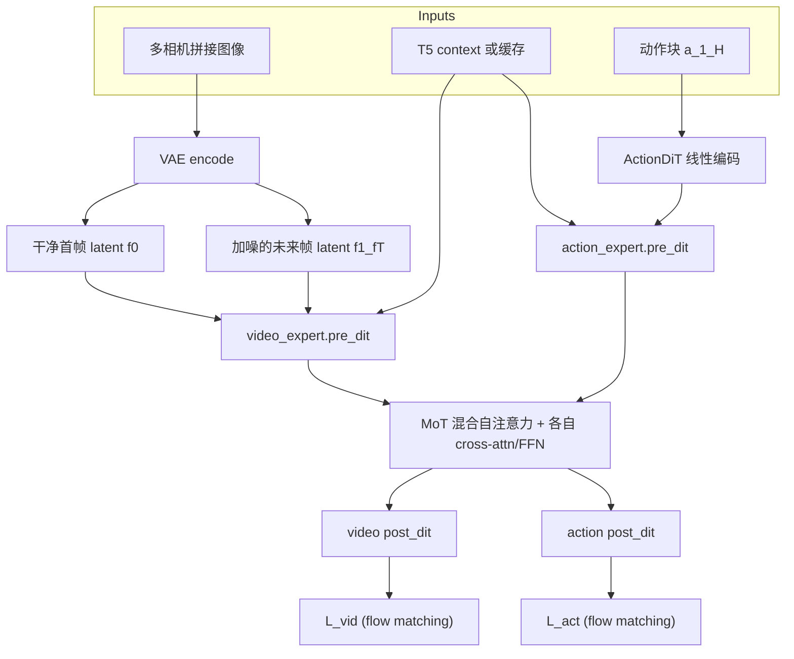

**数据形状**（LIBERO 配置 `configs/data/libero_2cam.yaml`）：

- `num_frames: 33`，`action_video_freq_ratio: 4` → **32 步动作**、约 **9 帧视频**（与论文一致）；
- 双相机水平拼接为 `224×448`，再进 VAE。

### 3.2 Mixture-of-Transformer（MoT）

MoT 不是「两个完全独立的模型」，而是在**每一层**把 video / action 专家的 Q、K、V 在序列维拼接，做一次带 mask 的 Flash Attention，再拆回各自分支做 cross-attention（接 T5 context）和 FFN。

核心约束（`mot.py` 初始化）：两专家 **层数、头数、head_dim 必须一致**，以便混合注意力维度对齐。

**训练**：每步 `mot.forward()` 对完整 `[video_tokens | action_tokens]` 联合计算。

**推理（Fast-WAM 默认）**：分两段——

1. `prefill_video_cache`：仅用**首帧** video tokens 跑完 30 层，缓存每层 K/V；
2. `forward_action_with_video_cache`：动作去噪每步只更新 action 支路，但 attention 中 **复用** 缓存的 video K/V，避免重复编码。

这对应论文 Figure 1(C) 的「Single Forward Pass + Denoise Action」。

### 3.3 结构化注意力掩码

论文将 token 分为三组：**干净首帧** \(f_0\)、**加噪未来帧** \(f_1,\ldots,f_T\)、**动作** \(a_1,\ldots,a_H\)。规则（Sec.3.2）：

- 未来视频：视频支路内双向；可看 \(f_0\)；
- 动作：动作支路内双向；**仅可看 \(f_0\)**，**不可看** \(f_1,\ldots,f_T\)；
- 干净首帧：**不 attend 任何其他 token**（防止信息泄漏）。

记 \(M_{ij}=1\) 表示 query 位置 \(i\) 可 attend key 位置 \(j\)。

#### 代码：`FastWAM._build_mot_attention_mask`

```396:407:src/fastwam/models/wan22/fastwam.py
        mask[:video_seq_len, :video_seq_len] = self.video_expert.build_video_to_video_mask(...)
        mask[video_seq_len:, video_seq_len:] = True
        first_frame_tokens = min(video_tokens_per_frame, video_seq_len)
        mask[video_seq_len:, :first_frame_tokens] = True
```

- 左上子块：视频-视频，由 `video_attention_mask_mode` 控制；
- 右下：动作-动作 全 True；
- 右上「动作→视频」：只有**首帧**对应列 True。

默认 `first_frame_causal`（`wan_video_dit.py`）：首帧 token 互相全连接；首帧可看全序列；**后续帧不能看首帧之后的 token**——既服务视频建模因果结构，又与「动作不能偷看未来」一致。

#### 掩码逻辑示意（Mermaid）

```mermaid
flowchart LR
  subgraph seq [序列: f0 | f_future | action]
    f0[f0 干净首帧]
    ff[f1..fT 加噪未来]
    act[a1..aH 动作]
  end

  f0 -->|"f0 不看别人"| block0[自块受限]
  ff -->|"ff 可看 f0 + ff 内部"| block1[视频块]
  act -->|"act 只看 f0 + act 内部"| block2[动作块]
```

**推理时**：不再创建 \(f_1,\ldots,f_T\) 的 noisy token；仅 \(f_0\) 经 `pre_dit` + `prefill_video_cache`，动作在去噪循环中通过 mask 与缓存 K/V 访问「世界表示」。

### 3.4 Flow Matching 训练目标

论文 Eq.(5)–(9)。对变量 \(y\)（动作或视频 latent）采样 \(\epsilon \sim \mathcal{N}(0,I)\)、\(t \in (0,1)\)：

\[
y_t = (1-t)\, y + t\, \epsilon
\]

\[
\mathcal{L}_{\mathrm{FM}}(y) = \mathbb{E}_{y,\epsilon,t}\left[ \left\| f_\theta(y_t, t, o, \ell) - (\epsilon - y) \right\|_2^2 \right]
\]

\[
\mathcal{L} = \mathcal{L}_{\mathrm{act}} + \lambda\, \mathcal{L}_{\mathrm{vid}}
\]

**代码对应**（`WanContinuousFlowMatchScheduler`）：

- `add_noise`: \(\; y_t = (1-\sigma) y + \sigma \epsilon\)，\(\sigma = t/T_{\mathrm{train}}\)；
- `training_target`: \(\; \epsilon - y\)（与 velocity field 约定一致）；
- `training_weight(t)`: 中间 timestep 加权（高斯型，见 `scheduler_continuous.py`）。

`training_loss`（`fastwam.py` L448–568）对视频、动作**分别**采样 \(t\)，经 MoT 联合前向，再加权 MSE。若 `fuse_vae_embedding_in_latents`，训练时**强制**首帧 latent 保持干净，与推理一致。

配置中 `loss.lambda_action: 1.0`；`lambda_video` 默认 1.0（`FastWAM` 构造函数）。消融「w.o. video co-train」即令 \(\lambda \to 0\) 或等价地不优化 \(\mathcal{L}_{\mathrm{vid}}\)。

### 3.5 训练 vs 推理

| 阶段 | 论文描述 | 本地 API | 是否生成未来视频 |
|------|----------|----------|------------------|
| 训练 | 联合 flow matching on \(z_{1:T}\) 与 \(a_{1:H}\) | `training_loss` | 作为 **监督目标** |
| 训练监控 | 可选重建视频算 PSNR/SSIM | `infer` / `infer_joint` | 是 |
| **部署默认** | 首帧编码 + 动作去噪 | `infer_action` | **否** |
| 对照 Joint/IDM | 与 (A)(B) 范式一致 | `FastWAMJoint.infer_joint` 等 | 是 |

#### `infer_action` 逐步（与代码对齐）

1. **编码观测**：`input_image` → VAE → `first_frame_latents`，`timestep_video = 0`（`fastwam.py` L993–1005）。
2. **构建 mask**：仅首帧 video + action 的 `_build_mot_attention_mask`（L1007–1012）。
3. **Prefill**：`mot.prefill_video_cache(...)`（L1013–1022），`mot.py` L257–341 逐层缓存 video K/V。
4. **动作去噪循环**：`build_inference_schedule` → 每步 `forward_action_with_video_cache` → `infer_action_scheduler.step`（L1024+）。
5. **约束**：必须 `video_attention_mask_mode == "first_frame_causal"`（L923–926），否则 raise。

仿真部署调用链：

- LIBERO：`experiments/libero/eval_libero_single.py` 检测 `model.infer_action`；
- RoboTwin：`experiments/robotwin/fastwam_policy/deploy_policy.py` 的 `_infer_action_chunk`。

#### 推理路径对比（Mermaid）

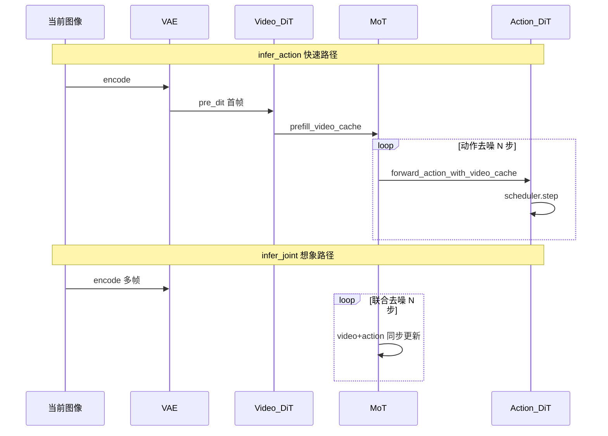

论文报告推理 **10 步** denoising、CFG scale **1.0**；仓库 sim 配置里 `num_inference_steps` 可覆盖（默认常与 10/20 对齐，以 `configs/sim_*.yaml` 为准）。

### 3.6 Action DiT 初始化

训练前需运行（[README_zh.md](../../README_zh.md)）：

```bash
python scripts/preprocess_action_dit_backbone.py \
  --model-config configs/model/fastwam.yaml \
  --output checkpoints/ActionDiT_linear_interp_Wan22_alphascale_1024hdim.pt \
  --device cuda --dtype bfloat16
```

脚本将 Wan2.2 DiT 权重在 hidden 维上**线性插值**到 1024 维，使动作专家与视频专家结构同构、便于 MoT 共享注意力。这是工程上复现的重要一步，论文中概括为「action expert shares architecture with reduced \(d_a=1024\)」。

---

## 4. 对照变体与消融

论文 Sec.3.3 在**同一 Wan 骨干、同一数据配方**下切换掩码与推理路径，以隔离因素。

| 变体 | 论文意图 | Hydra model | Python 类 | 关键差异 |
|------|----------|-------------|-----------|----------|
| **Fast-WAM** | 训练 co-train；推理不想象 | `fastwam` | `FastWAM` | action→仅首帧 video；`infer_action` |
| **Fast-WAM-Joint** | 范式 (A) | `fastwam_joint` | `FastWAMJoint` | action→**全部** video token（L47–48 `fastwam_joint.py`） |
| **Fast-WAM-IDM** | 范式 (B) | `fastwam_idm` | `FastWAMIDM` | 训练序列 `[noisy_video \| cond_video \| action]`；`video_cond_noise_prob=0.5` |
| **w.o. video co-train** | 消融 | 同架构 | 同 `FastWAM` | 仅去掉 \(\mathcal{L}_{\mathrm{vid}}\) |

#### Fast-WAM-Joint

继承 `FastWAM`，重写掩码：`mask[video_seq_len:, :video_seq_len] = True`，动作可见**所有**视频 latent——推理需 `infer_joint` 同步 rollout 未来视频与动作，延迟接近传统 WAM。

#### Fast-WAM-IDM

继承 `FastWAMJoint`，`training_loss` 三分支（`fastwam_idm.py` L58+）：

1. **noisy_video**：标准视频去噪目标；
2. **cond_video**：teacher forcing 的「未来」支路，以概率 0.5 加噪（论文 \(p=0.5\)）；
3. **action**：**仅 attend cond_video**，不 attend noisy_video（L54–55）。

推理时 IDM 仍走联合去噪管线；项目页报告 IDM 延迟约 **810 ms**，而 Fast-WAM 约 **190 ms**。

#### 掩码对比（Mermaid）

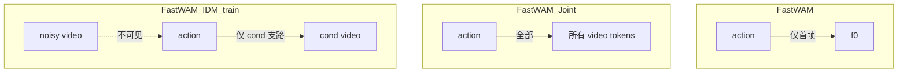

---

## 5. 工程复现：数据、训练、评估

### 5.1 配置组合（Hydra）

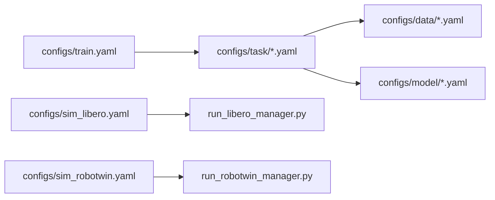

- **Task 名**即实验 ID，例如 `libero_uncond_2cam224_1e-4`：`uncond` → `fastwam`；`joint` / `idm` 后缀 → 对应 model yaml。
- `model.proprio_dim`、`action_dim` 等通过 `${data.train.processor.*}` 与数据配置绑定。

### 5.2 环境与依赖

```bash
conda create -n fastwam python=3.10 -y
conda activate fastwam
pip install torch==2.7.1+cu128 torchvision==0.22.1+cu128 \
  --extra-index-url https://download.pytorch.org/whl/cu128
pip install -e .
```

### 5.3 数据

| 基准 | Hugging Face 数据集 | 本地路径 |
|------|---------------------|----------|
| LIBERO | [yuanty/LIBERO-fastwam](https://huggingface.co/datasets/yuanty/LIBERO-fastwam) | `data/libero_mujoco3.3.2/*_lerobot` |
| RoboTwin 2.0 | [yuanty/robotwin2.0-fastwam](https://huggingface.co/datasets/yuanty/robotwin2.0-fastwam) | `data/robotwin2.0/robotwin2.0` |

**发布权重**：[yuanty/fastwam](https://huggingface.co/yuanty/fastwam)（含 `dataset_stats.json`）。

### 5.4 训练流水线

```bash
# 1. 预计算 T5 embedding（可按 task）
python scripts/precompute_text_embeds.py task=libero_uncond_2cam224_1e-4

# 2. DeepSpeed ZeRO-1，8 卡示例
bash scripts/train_zero1.sh 8 task=libero_uncond_2cam224_1e-4
```

`scripts/train.py` → `runtime.run_training`：实例化模型、`build_datasets`、 `Wan22Trainer.train()`。首次训练可将 `pretrained_norm_stats` 设为 `null`，跑完后用 `runs/<task>/<run_id>/dataset_stats.json` 继续训练。

**超参**（论文）：AdamW，\(10^{-4}\) 学习率，weight decay 0.01，cosine schedule，bf16，grad clip 1.0；LIBERO **20k steps**，RoboTwin **30k steps**。

### 5.5 评估流水线

**LIBERO**（需先装官方 LIBERO + `mujoco==3.3.2`）：

```bash
python experiments/libero/run_libero_manager.py \
  task=libero_uncond_2cam224_1e-4 \
  ckpt=./checkpoints/fastwam_release/libero_uncond_2cam224.pt \
  EVALUATION.dataset_stats_path=./checkpoints/fastwam_release/libero_uncond_2cam224_dataset_stats.json \
  MULTIRUN.num_gpus=8
```

Manager 生成 `tasks.txt` → `run_libero_parallel_test.sh`（tmux 并行）→ `eval_libero_single.py` → `summarize_results.py`。

**RoboTwin**：需按 `third_party/RoboTwin` 官方说明装环境、下资产，并：

```bash
ln -sfn "$(pwd)/experiments/robotwin/fastwam_policy" \
  "$(pwd)/third_party/RoboTwin/policy/fastwam_policy"
```

```bash
python experiments/robotwin/run_robotwin_manager.py \
  task=robotwin_uncond_3cam_384_1e-4 \
  ckpt=./checkpoints/fastwam_release/robotwin_uncond_3cam_384.pt \
  EVALUATION.dataset_stats_path=./checkpoints/fastwam_release/robotwin_uncond_3cam_384_dataset_stats.json \
  MULTIRUN.num_gpus=8
```

Python manager 对每个任务先 **clean** 再 **random** 两阶段。`sim_robotwin.yaml` 中 `EVALUATION.skip_get_obs_within_replan=true` 可加速但降低录像帧率。

**指令设定**：默认 **unseen** instruction（对齐 Motus）；可试 `EVALUATION.instruction_type=seen`（README 注明或略涨 1–2 点）。

### 5.6 评估数据流（Mermaid）

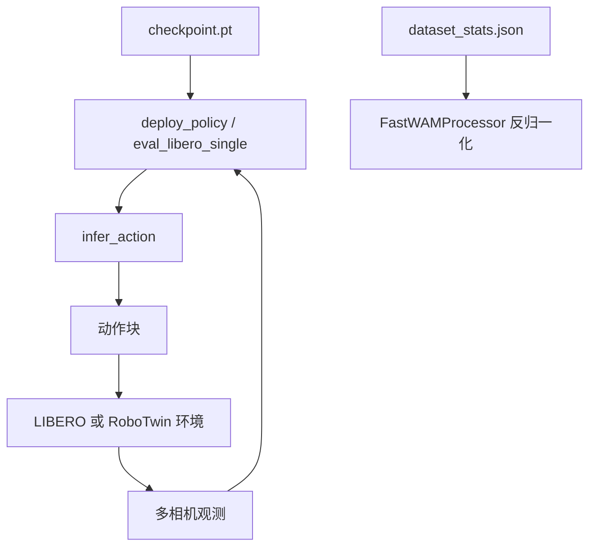

---

## 6. 实验结果解读

### 6.1 LIBERO（Table 2）

| 方法 | Embodied PT | Spatial | Object | Goal | Long | **Avg** |
|------|-------------|---------|--------|------|------|---------|
| \(\pi_{0.5}\) | ✓ | 98.8 | 98.2 | 98.0 | 92.4 | 96.9 |
| LingBot-VA | ✓ | 98.5 | 99.6 | 97.2 | 98.5 | **98.5** |
| Motus | ✓ | 96.8 | 99.8 | 96.6 | 97.6 | 97.7 |
| **Fast-WAM** | ✗ | 98.2 | 100.0 | 97.0 | 95.2 | **97.6** |
| Fast-WAM-Joint | ✗ | 99.6 | 99.4 | 98.2 | 96.8 | 98.5 |
| Fast-WAM-IDM | ✗ | 98.8 | 97.8 | 97.8 | 97.6 | 98.0 |
| w.o. video co-train | ✗ | 89.2 | 99.2 | 95.4 | 90.0 | **93.5** |

**读表要点**：

- 无 embodied PT 的 Fast-WAM **97.6%**，超过 \(\pi_{0.5}\)，接近最强 WAM（LingBot-VA 98.5%）。
- Joint / IDM 与 Fast-WAM **差距 < 1–2 点**，支持「测试时想象非关键」。
- 去掉 video co-training **掉 4+ 点**（尤其 Spatial / Long），支持「训练期世界建模是关键」。

### 6.2 RoboTwin 2.0（Table 1）

| 方法 | Clean | Rand. | **Avg** |
|------|-------|-------|---------|
| Motus (PT) | 88.66 | 87.02 | 87.8 |
| LingBot-VA (PT) | 92.90 | 91.50 | 92.2 |
| **Fast-WAM** | 91.88 | 91.78 | **91.8** |
| Fast-WAM-Joint | 90.84 | 90.32 | 90.6 |
| Fast-WAM-IDM | 91.16 | 91.34 | 91.3 |
| w.o. video co-train | 82.76 | 84.80 | 83.8 |

双臂、强随机化场景下 Fast-WAM 仍 **>SOTA 无 PT 基线**，与 Joint/IDM 同档；co-train 消融掉 **~8 点**。

### 6.3 真机折毛巾

Galaxea R1 Lite，60 小时遥操作数据，30k steps。项目页强调：

- **成功率**与 **完成时间** 同等重要（可折叠 ≠ 折叠得快）；
- Fast-WAM **190 ms** vs Fast-WAM-IDM **810 ms**；
- 去掉 video co-training：成功率与耗时双降。

### 6.4 实验 → 设计 对照表

| 现象 | 可能机制 | 代码/设计锚点 |
|------|----------|----------------|
| 去 test-time video 几乎不掉点 | \(z(o,\ell)\) 已在 co-train 中学好 | `infer_action` + 首帧 mask |
| 去 co-train 大掉点 | 视觉表征缺乏动态监督 | `L_vid`，`training_loss` 双路 |
| Joint 略高但慢 | 动作可见未来 latent，推理需联合 denoise | `FastWAMJoint` 全 video mask |
| IDM 精度尚可但更慢 | 两阶段 video→action 去噪 | `FastWAMIDM.infer_joint` |

---

## 7. 代码导航速查

| 想理解… | 阅读文件 |
|---------|----------|
| 训练入口 | `scripts/train.py` → `src/fastwam/runtime.py` `run_training` |
| 总损失与掩码 | `src/fastwam/models/wan22/fastwam.py` |
| MoT / KV cache | `src/fastwam/models/wan22/mot.py` |
| 视频 DiT 与 `first_frame_causal` | `src/fastwam/models/wan22/wan_video_dit.py` |
| Flow scheduler | `src/fastwam/models/wan22/schedulers/scheduler_continuous.py` |
| Joint / IDM 变体 | `fastwam_joint.py`, `fastwam_idm.py` |
| LeRobot 数据 | `src/fastwam/datasets/lerobot/robot_video_dataset.py` |
| 归一化与 delta action | `processors/fastwam_processor.py` |
| LIBERO 评测 | `experiments/libero/eval_libero_single.py`, `run_libero_manager.py` |
| RoboTwin 策略 | `experiments/robotwin/fastwam_policy/deploy_policy.py` |
| 默认超参 | `configs/model/fastwam.yaml`, `configs/task/*.yaml` |

---

## 8. 讨论与局限

### 8.1 核心结论（一句话）

> **WAM 里「预测未来视频」的主要价值，更像是训练时的表征正则；测试时反复想象未来，对 SOTA 控制性能并非必要，却是延迟的主要来源。**

Fast-WAM 用 **结构化 mask + 首帧 KV cache** 把这一结论写进架构，而不是仅靠调参。

### 8.2 与相邻工作的关系

- **相对 VLA**：推理同样是 direct policy，但训练多了 \(\mathcal{L}_{\mathrm{vid}}\)，换数据效率与物理 grounding。
- **相对 Motus / LingBot-VA**：共享「Wan + 联合建模」思想；Fast-WAM 证明可在**不削弱**仿真指标的前提下去掉 test-time video rollout。
- **相对纯世界模型**：不在部署时预测 \(v_{1:T}\)，世界模型退居**训练时辅助任务**。

### 8.3 局限与复现注意

1. **算力**：6B 模型 + 8×GPU 训练是论文默认；RoboTwin 论文用 64 卡加速，仓库 README 建议可减卡/减 epoch。
2. **依赖 Wan 权重**：需 `DIFFSYNTH_MODEL_BASE_PATH` 与 Hugging Face 上的 Wan2.2 组件。
3. **真机数据未开源**：毛巾折叠只能参考论文设置，无法完全复现真机数字。
4. **外层自回归**：论文聚焦**单个 action chunk**；长程任务靠环境闭环 + replan（`replan_steps`，见下节）；**不是** test-time 上自回归生成更长视频。
5. **评测细节**：unseen vs seen 指令、RoboTwin 跳帧渲染等会改变分数与视频观感，对比基线时需对齐协议。

#### `replan_steps` 含义与调参

`replan_steps` 是 **仿真评测 / 部署时的闭环控制参数**（写在 [`configs/sim_libero.yaml`](../../configs/sim_libero.yaml)、[`configs/sim_robotwin.yaml`](../../configs/sim_robotwin.yaml) 的 `EVALUATION` 下，或 RoboTwin 的 [`deploy_policy.yml`](../../experiments/robotwin/fastwam_policy/deploy_policy.yml)），**不参与训练**。

**含义**：模型每次 `infer_action` 预测一整段 action chunk（默认 `action_horizon = 32`）。`replan_steps` 表示 **在重新观测并再次调用策略之前，环境里实际执行该 chunk 的前多少步**；chunk 中剩余步被丢弃，用新图像重规划（receding horizon）。


实现上会被限制在 \([1,\ \texttt{action\_horizon}]\)（[`deploy_policy.py`](../../experiments/robotwin/fastwam_policy/deploy_policy.py) L171）。LIBERO 评测在 `pending_actions` 为空时取 `action_chunk[:replan_steps]`（[`eval_libero_single.py`](../../experiments/libero/eval_libero_single.py) L490–516）。

**在管线中的作用**

| 环节 | 作用 |
|------|------|
| 长程任务 | 把「单 chunk 模型」接到整段 episode：周期性闭环，对应论文 Sec.3.3「只研究 single chunk，长程靠环境 replan」 |
| 开环/闭环 | 一次推理 32 步「计划」，只执行前 `replan_steps` 步；越小越闭环，越大越开环 |
| 算力/延迟 | 约每 `replan_steps` 个环境步调用 **1 次** `infer_action`；越小推理次数越多、评测越慢 |
| 与训练 | 训练仍按 32 步 chunk + 9 帧视频联合学习；改 `replan_steps` **不改权重**，只改评测/部署控制律 |

**仓库默认（复现表格宜对齐）**

| 场景 | 典型 `replan_steps` | 配置 |
|------|---------------------|------|
| LIBERO 评测 | 10 | `configs/sim_libero.yaml` |
| RoboTwin 评测 | 24 | `configs/sim_robotwin.yaml` |
| RoboTwin `deploy_policy` | 8 | `experiments/robotwin/fastwam_policy/deploy_policy.yml` |

**调大 / 调小对效果的影响**

| 方向 | 行为 | 对成功率 / 控制 | 对速度 / 资源 |
|------|------|-----------------|----------------|
| **调小**（如 24→10→1） | 更频繁用新观测重规划 | 对模型误差、接触变化、扰动更敏感，往往更稳；`replan_steps=1` 为逐步闭环 | 单 episode 推理次数 ↑，评测/真机 **更慢** |
| **调大**（如 10→24→32） | 更长时间开环执行同一 chunk 前段 | chunk 与真实状态偏离时 **误差累积**；接近 32 时几乎一次推理用满 horizon | 推理次数 ↓，**更快** |
| **> action_horizon** | 被 clamp 到 32 | 与 `replan_steps=32` 等价 | — |

工程直觉（无官方 ablation）：与 Motus / 其它 chunk 策略基线比数时，**必须对齐各 benchmark 的 `replan_steps` 协议**；随意改动后再和论文 Table 对比会失真。真机侧则在「平均控制频率 / 190ms 推理预算」与「开环段长度」之间权衡。

**与 `action_video_freq_ratio` 的区别**

- **`action_video_freq_ratio`**（§10.2）：**训练数据**里动作步与视频帧的时间比例（33 观测 → 9 帧视频 + 32 步动作）。
- **`replan_steps`**：**评测/部署**里多久重新 `infer_action` 一次；二者独立，勿混用。

**可选相关项**：`EVALUATION.visualize_future_video=true` 时用 `replan_steps // action_video_freq_ratio` 决定保留多少「未来视频帧」用于调试可视化，**不是**默认部署路径。RoboTwin 另有 `skip_get_obs_within_replan`：队列未排空时可跳过重复取 obs，不改变「每 `replan_steps` 才重新推理」的语义。

### 8.4 可延伸方向

- 将 `infer_action` 蒸馏到更小骨干，进一步压延迟；
- 探索 \(\lambda\) 调度、仅后期启用 \(\mathcal{L}_{\mathrm{vid}}\) 的课程学习；
- 在 co-train 下分析 \(z(o,\ell)\) 的探针（碰撞、接触预测），验证「表征更好」而不仅是「任务 loss 合流」。

---

## 9. 参考文献

### 9.1 本项目

- 论文 PDF：[b/d/FastWAM.pdf](./FastWAM.pdf)
- 项目页：<https://yuantianyuan01.github.io/FastWAM/>
- 代码：<https://github.com/yuantianyuan01/FastWAM>
- 模型：<https://huggingface.co/yuanty/fastwam>
- 数据： [LIBERO-fastwam](https://huggingface.co/datasets/yuanty/LIBERO-fastwam) · [robotwin2.0-fastwam](https://huggingface.co/datasets/yuanty/robotwin2.0-fastwam)

### 9.2 BibTeX

```bibtex
@article{yuan2026fastwam,
  title={Fast-WAM: Do World Action Models Need Test-time Future Imagination?},
  author={Tianyuan Yuan and Zibin Dong and Yicheng Liu and Hang Zhao},
  journal={arXiv preprint arXiv:2603.16666},
  year={2026},
  url={https://arxiv.org/abs/2603.16666}
}
```

---

## 10. 训练数据格式与处理流水线

本章结合本地代码，说明 Fast-WAM **训练时样本从磁盘到 `training_loss` 的完整路径**：原始 LeRobot 格式、Hydra 配置、`FastWAMProcessor` 与 `RobotVideoDataset` 两层处理、是否做数据增广，以及进入 `FastWAM.build_inputs` 后的张量形状。

### 10.1 原始数据：LeRobot 格式

#### 10.1.1 数据来源与目录

官方发布的预处理数据为 **LeRobot v2 风格** 目录，通过 Hugging Face 下载后解压：

| 基准 | 数据集 | 本地路径（默认） |
|------|--------|------------------|
| LIBERO | [yuanty/LIBERO-fastwam](https://huggingface.co/datasets/yuanty/LIBERO-fastwam) | `data/libero_mujoco3.3.2/*_lerobot`（4 个子集） |
| RoboTwin 2.0 | [yuanty/robotwin2.0-fastwam](https://huggingface.co/datasets/yuanty/robotwin2.0-fastwam) | `data/robotwin2.0/robotwin2.0` |

每个子目录内含 `meta/`、`data/`、`videos/` 等 LeRobot 标准结构；`BaseLerobotDataset` 用 `LeRobotDatasetMetadata` 读 fps、episode 数，再用 `MultiLeRobotDataset` 按**帧索引**统一采样。

#### 10.1.2 时间窗口与 delta_timestamps

对配置中的 `num_frames = 33`，底层约定（`base_lerobot_dataset.py`）：

- `obs_size = num_frames`：一次取 **33 帧观测**（图像 + state）；
- `action_size = num_frames - 1`：动作长度为 **32**（与「从 \(t_0\) 到 \(t_{31}\) 的执行」对齐，不含最后一帧的 action）；
- `global_sample_stride`：在时间轴上的步长倍率（默认 1）。

对每个 `shape_meta` 里的 key，按数据集 fps 构造相对时间戳列表。以图像为例，观测时间戳为：

\[
$$\tau_t = \frac{t \cdot \text{global\_sample\_stride}}{\text{fps}}, \quad t = 0, 1, \ldots, \text{obs\_size} - 1$$
\]

动作时间戳同理，长度为 `action_size`。LeRobot 据此从 episode 中**对齐抽取**多模态序列；若 episode 边界不足，会产生 `*_is_pad` 标记。

#### 10.1.3 BaseLerobotDataset 单次 `__getitem__` 输出

在挂载 `FastWAMProcessor` 之前，逻辑上的「原始样本」为（`base_lerobot_dataset.py`）：

| 字段 | 结构 | 说明 |
|------|------|------|
| `images[key]` | `[T, C, H, W]`，`uint8` | `_get_image` 将 LeRobot 浮点图 ×255 转 uint8 |
| `action[key]` | `[T-1, D_a]` | 与 32 步动作 horizon 对齐 |
| `state[key]` | `[T, D_s]` | 本体状态，与观测帧数对齐 |
| `action_is_pad` / `state_is_pad` / `image_is_pad` | `[T]` 或 `[T-1]` | padding 掩码 |
| `task` | `str` | 任务语言（低层指令） |
| `idx` | `int` | 帧级索引 |

随后若 `processor is not None`，立即调用 `processor.preprocess(sample)`，再返回给外层 `RobotVideoDataset`。

### 10.2 配置驱动：LIBERO 与 RoboTwin 对比

训练数据行为由 [`configs/data/libero_2cam.yaml`](../../configs/data/libero_2cam.yaml) 与 [`configs/data/robotwin.yaml`](../../configs/data/robotwin.yaml) 完全指定。核心参数对比如下：

| 配置项 | LIBERO（2 相机） | RoboTwin（3 相机） |
|--------|------------------|---------------------|
| `num_frames` | 33 | 33 |
| `action_video_freq_ratio` | 4 | 4 |
| 有效视频帧数 \(T_v\) | \((33-1)/4 + 1 = 9\) | 9 |
| 动作步数 \(T_a\) | 32 | 32 |
| `concat_multi_camera` | `horizontal` → 宽 448 | `robotwin` 专用布局 → **384×320** |
| `video_size`（最终裁剪） | `[224, 448]` | `[384, 320]` |
| `action_output_dim` / `proprio_output_dim` | 7 / 8 | 14 / 14 |
| `norm_default_mode` | `min/max` | `z-score` |
| `delta_action_dim_mask` | 前 6 维 delta，夹爪维绝对 | 未配置（无 mask） |
| `val_set_proportion` | 0（全量训练） | 0.01 |
| `text_embedding_cache_dir` | `./data/text_embeds_cache/libero` | `./data/text_embeds_cache/robotwin` |

#### `action_video_freq_ratio` 含义与调参

记 r = `action_video_freq_ratio`。在 [`robot_video_dataset.py`](../../src/fastwam/datasets/lerobot/robot_video_dataset.py) 中：

- **底层仍从 LeRobot 拉满 `num_frames` 个观测**（默认 33），对应 **`num_frames - 1 = 32` 步动作**（[`base_lerobot_dataset.py`](../../src/fastwam/datasets/lerobot/base_lerobot_dataset.py) 的 `obs_size` / `action_size`）。
- **仅对像素序列做时间下采样**：`video_sample_indices = [0, r, 2r, …, num_frames-1]`。
- **`action` 不做下采样**，仍为 32 步。

数量关系：

\[
$$T_a = \text{num\_frames} - 1 = 32,\qquad
T_v = \frac{\text{num\_frames}-1}{r} + 1$$
\]

\($r=4,\ \text{num\_frames}=33$\) → \($T_v=9$\)，索引 `0,4,8,…,32`。可理解为：**在同一训练窗口内，动作时间分辨率是保留视频帧的 r 倍**（每 1 帧图像对应 r 个连续控制步动作）。

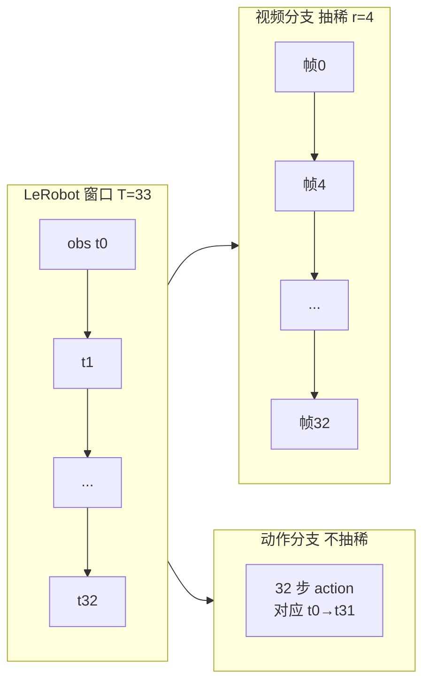

**在管线中的作用**

| 环节 | 作用 |
|------|------|
| 数据 | 降低送入 VAE / video DiT 的帧数，节省显存与算力；动作仍保持细粒度 32 步 |
| 对齐 | `build_inputs` 要求 `action.shape[1] % (T_v - 1) == 0`（[`fastwam.py`](../../src/fastwam/models/wan22/fastwam.py) L308–310），即相邻视频帧之间恰好 \(r\) 个动作步 |
| Wan 约束 | 抽稀后 $T_v \equiv 1 \pmod{4}$；数据集初始化另要求 \($(\text{num\_frames}-1)/r \equiv 0 \pmod{4}$\) |
| 论文/复现 | 与 Fast-WAM 设定一致：**32 步动作 + 9 帧视频** |
| 推理/可视化 | 仅当 `visualize_future_video=true` 时，用 `replan_steps // action_video_freq_ratio` 决定保留多少未来视频帧（[`eval_libero_single.py`](../../experiments/libero/eval_libero_single.py)；`replan_steps` 见 §8.3） |

**注意**：`RobotVideoDataset` 里 `proprio = sample["proprio"][:-1, :]` 与 32 步 action 对齐；**被下采样的是 `pixel_values`（视频）**，不是 action 张量。

**调大 / 调小（不能单独改 \(r\)）**

改 \(r\) 时需同时满足：

1. \($(\text{num\_frames}-1) \bmod r = 0$\)
2. \($(\text{num\_frames}-1)/r \bmod 4 = 0$\)
3. \($T_v = (\text{num\_frames}-1)/r + 1 \equiv 1 \pmod{4}$\)

在 **`num_frames=33` 固定**时，合法 \(r\) 主要为 **1、2、4、8**（\(r=1\) 得 33 帧视频，算力极大，一般不用）。

| 方向 | 固定 32 步动作时的效果 | 算法/工程后果 |
|------|------------------------|---------------|
| **调大 \(r\)**（如 4→8） | \(T_v\) 9→5，视频更稀疏 | 视频 token/算力下降；每段视频间隔内要建模的动作从 4 步→8 步，视觉条件更粗；可能损失快速运动细节；需 **重新训练**，旧 checkpoint 时序结构不匹配 |
| **调小 \(r\)**（如 4→2） | \(T_v\) 9→17，视频更密 | 运动线索更细，视频 loss / VAE 更重；每段仅 2 步 action；需重训并满足 Wan 帧数约束 |
| **只改 \(r\)** | — | 可能触发 `RobotVideoDataset` **assert**，训练无法启动 |
| **改 \(r\) 且改 `num_frames`** | 可改变总 horizon | 新实验设定，与论文 32/9 不可直接对比 |

工程直觉（仓库内无官方 ablation）：\(r\) 过大则世界模型看到的帧太少，视频–动作时序耦合变弱；\(r\) 过小则接近密集 joint video–action，算力接近 imagine-then-execute，偏离「稀疏视频 + 密集动作」设计。**默认 \(r=4\) 与 HF 配置、论文一致；推理配置应与训练一致。**

**与 VAE 时间 4× 下采样的区别**

- **`action_video_freq_ratio`**：在**数据集像素序列**上抽帧（33→9）。
- **`vae.temporal_downsample_factor`**：在**已抽稀后的 9 帧**上再进 Wan VAE 做 latent 时间压缩。

两层叠加，勿混为一个参数。

#### 帧数硬约束（与 Wan VAE 对齐）

`RobotVideoDataset` 初始化时断言：

```python src/fastwam/datasets/lerobot/robot_video_dataset.py:59:63
        assert (num_frames - 1) % self.action_video_freq_ratio == 0, \
            f"num_frames-1 must be divisible by action_video_freq_ratio, got {num_frames - 1} and {self.action_video_freq_ratio}"
        assert ((num_frames - 1) // self.action_video_freq_ratio) % 4 == 0, \
            f"video frames must be divisible by 4 for tokenization, got {(num_frames - 1) // self.action_video_freq_ratio}"
        self.video_sample_indices = list(range(0, num_frames, self.action_video_freq_ratio))
```

记 \($r = \texttt{action\_video\_freq\_ratio}$\)，则需：

\[
$$\text{num\_frames} - 1 \equiv 0 \pmod{r}, \qquad \frac{\text{num\_frames}-1}{r} \equiv 0 \pmod{4}$$
\]

后者保证抽稀后的视频帧数 \($T_v = \frac{\text{num\_frames}-1}{r} + 1$\) 在 **`build_inputs` 中满足 Wan 约定 \($T_v \equiv 1 \pmod{4}$\)**（`fastwam.py` L296–297）。

### 10.3 双层 Dataset 架构

Fast-WAM 没有单独的「视频 Dataset 类」，而是用 **包装器** 把 LeRobot + Processor + 视频专用后处理串起来：

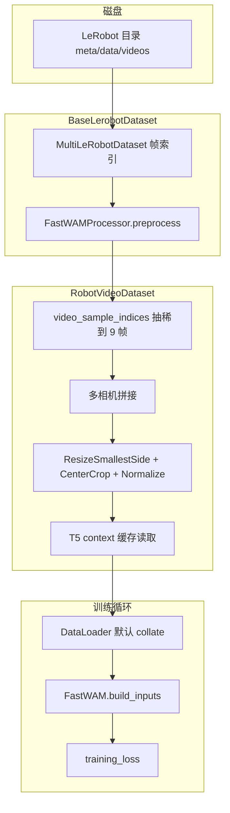

**直觉**：第一层负责「按 LeRobot 协议取 33 帧 + 归一化动作/状态 +  per-camera Resize」；第二层负责「压成 9 帧视频张量 + 拼相机 + 对齐 proprio + 加载预计算文本」。

#### 调用序列（单样本）

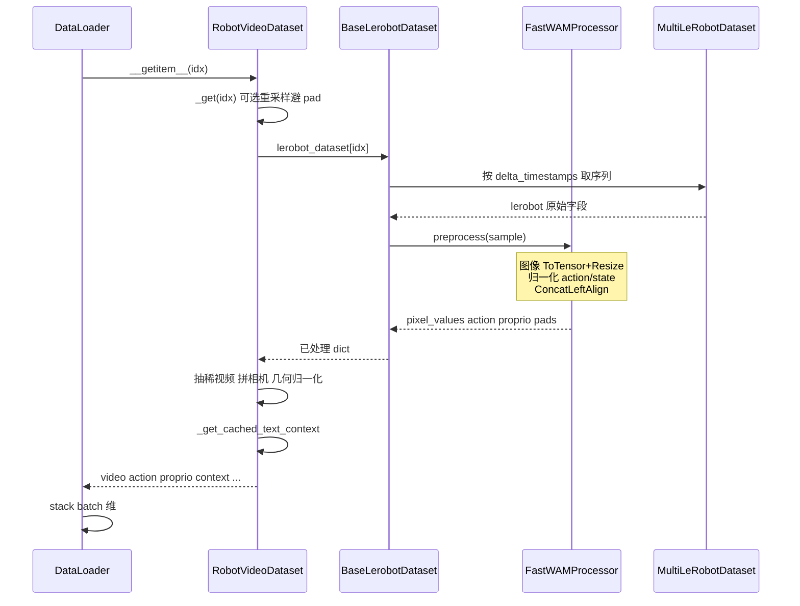

### 10.4 FastWAMProcessor：策略侧预处理

类定义见 [`fastwam_processor.py`](../../src/fastwam/datasets/lerobot/processors/fastwam_processor.py)。`preprocess` 是训练数据的**语义核心**，顺序固定：

#### （1）指令处理 `augment_instruction`

```python 120:147:src/fastwam/datasets/lerobot/processors/fastwam_processor.py
    def augment_instruction(self, data: Dict[str, str] | List[str]) -> List[str]:
        ...
        if np.random.rand() < self.drop_high_level_prob:
            instruction = f"{low_level_instruction}"
        else: 
            instruction = f"[High]: {high_level_instruction}, [Low]: {low_level_instruction}"
        
        return instruction
```

- 默认 `drop_high_level_prob=1.0`（构造参数默认值；LIBERO yaml **未覆盖**）→ **始终只使用** `task` 低层指令；
- 若指令含 `@`，可按 `use_zh_instruction` 选中/英文子串（Galaxea 数据格式）；
- 注意：`RobotVideoDataset` 最终不用这里的 `instruction` 字段直接训练，而是用 `DEFAULT_PROMPT.format(task=...)` 再查 T5 缓存（见 10.5）。

#### （2）图像变换 `train_transforms` / `val_transforms`

配置示例（LIBERO）：

```yaml
train_transforms:
  - ToTensor          # uint8 -> float [0,1]
  - Resize [224,224]  # 逐相机，在 T 维批量应用
```

对每个 `shape_meta["images"]` 的 key 依次应用；多相机 stack 为 `pixel_values`：`[num_cameras, T, C, H, W]`。**当前官方配置没有** RandomCrop、ColorJitter、翻转等随机视觉增广。

#### （3）动作 padding 与 delta 维

若配置了 `delta_action_dim_mask`（LIBERO 前 6 维为 delta 位姿，第 7 维夹爪为绝对量），在**归一化之前**把 padding 时间步上的 delta 维置零，避免无效差分污染统计：

```python 251:259:src/fastwam/datasets/lerobot/processors/fastwam_processor.py
        if "action" in data and self.delta_action_dim_mask is not None:
            action_is_pad = torch.as_tensor(data["action_is_pad"], dtype=torch.bool)
            if bool(action_is_pad.any().item()):
                for key, dim_mask in self.delta_action_dim_mask.items():
                    ...
                    cur_action[pad_delta_mask] = 0.0
```

#### （4）`action_state_transforms`

LIBERO / RoboTwin 的 yaml 中均为 **`null`**。仓库虽实现 `RelativePoseTransform`（`transforms/relative_action.py`）等，但**默认训练管线不做**「相对当前末帧位姿」的几何变换；数据集中的动作已是预处理后的格式（见 HF 数据集说明）。

#### （5）归一化 `LinearNormalizer`

- LIBERO：`norm_default_mode: min/max`，在首次训练时由 `get_dataset_stats` 扫描全 episode 得到 min/max（及分位数等），写入 `runs/.../dataset_stats.json`；
- RoboTwin：常用预置 `./data/robotwin2.0/dataset_stats.json` + **`z-score`**。

统计量在 episode 级并行聚合（`base_lerobot_dataset.py` `get_dataset_stats`），再 `processor.set_normalizer_from_stats`。

#### （6）合并 `ConcatLeftAlign`

将多 key 的 `action` / `state` dict 拼成单向量，并可能 left-pad 到 `action_output_dim` / `proprio_output_dim`，产出 `action_dim_is_pad` 等。输出字段名仍为 `state`，在 `RobotVideoDataset` 里当作 **proprio** 使用。

### 10.5 RobotVideoDataset：视频张量与文本缓存

#### 视频抽稀与多相机

**多相机空间拼接、LIBERO/RoboTwin 布局差异、评测/部署对齐与优化**见 **第 13 章**。下文仅保留与抽稀相关的最小代码摘录。

```python 63:63:src/fastwam/datasets/lerobot/robot_video_dataset.py
        self.video_sample_indices = list(range(0, num_frames, self.action_video_freq_ratio))
```

从 Processor 输出的 `pixel_values`（33 帧）上取索引 `[0,4,8,...,32]`，得到 **9 帧**。两相机水平拼接示例：

```python 179:181:src/fastwam/datasets/lerobot/robot_video_dataset.py
            if self.concat_multi_camera == "horizontal":
                video = torch.cat([video[i] for i in range(num_cameras)], dim=-1)
```

RoboTwin 的 `robotwin` 模式先将各相机 resize 到固定子分辨率，再拼成 **384×320**（顶视 256×320 + 底部双腕 128×160×2）。

#### 几何归一化（第二层，与 Processor 内 Resize 不同）

在拼接后的**整幅视频**上再做：

1. `ResizeSmallestSideAspectPreserving`：保持宽高比，短边缩放到至少覆盖 `video_size`；
2. `CenterCrop`：裁到 `video_size`（LIBERO 为 224×448）；
3. `Normalize(mean=0.5, std=0.5)`：像素映射到 **[-1, 1]**；
4. `permute(1,0,2,3)` → 张量形状 **`[C, T_v, H, W]`**。

#### proprio 与 action 时间对齐

```python 202:203:src/fastwam/datasets/lerobot/robot_video_dataset.py
        action = sample["action"] # [T-1, action_dim]
        proprio = sample["proprio"][:-1, :] # [T-1, state_dim]， to align with action
```

即 proprio 去掉最后一帧，与 32 步动作、9 帧视频（首帧对应 \(t_0\) 观测）在时间上配套。模型里 `build_inputs` 再取 **`proprio[:, 0, :]`** 拼入 T5 context（当前步本体）。

#### 语言条件：Prompt 模板 + 离线 T5

```python 16:16:src/fastwam/datasets/lerobot/robot_video_dataset.py
DEFAULT_PROMPT = "A video recorded from a robot's point of view executing the following instruction: {task}"
```

```python 216:221:src/fastwam/datasets/lerobot/robot_video_dataset.py
        instruction = DEFAULT_PROMPT.format(task=task)
        context, context_mask = self._get_cached_text_context(instruction)
        context[~context_mask] = 0.0
        context_mask = torch.ones_like(context_mask)
```

缓存文件命名：`sha256(prompt).t5_len{context_len}.wan22ti2v5b.pt`，需事先运行：

```bash
python scripts/precompute_text_embeds.py task=libero_uncond_2cam224_1e-4
```

训练时 **不加载 T5 权重**（`load_text_encoder: false`），只读缓存，降低 GPU 显存与 IO。

#### RobotVideoDataset 最终 `__getitem__` 字典

| 键 | 形状（单样本） | 含义 |
|----|----------------|------|
| `video` | `[3, T_v, H, W]` | \(T_v=9\)，[-1,1] |
| `action` | `[32, D_a]` | 已归一化 |
| `proprio` | `[32, D_s]` | 已归一化（与 action 对齐） |
| `prompt` | `str` | 完整英文模板句 |
| `context` | `[128, D_text]` | 预计算 T5 输出 |
| `context_mask` | `[128]` | 训练时会被置全 1（与 Wan 行为一致） |
| `image_is_pad` | `[T_v]` | 视频帧级 mask |
| `action_is_pad` / `proprio_is_pad` | `[32]` | loss 掩码 |

### 10.6 DataLoader → `build_inputs`：进入模型

[`trainer.py`](../../src/fastwam/trainer.py) 使用 **PyTorch 默认 collate**（无自定义 `collate_fn`），将上述字段 stack 出 batch 维：

| 字段 | Batch 形状 | 后续 |
|------|------------|------|
| `video` | `[B, 3, T_v, H, W]` | VAE encode → `input_latents` |
| `action` | `[B, 32, D_a]` | flow matching 目标 |
| `proprio` | `[B, 32, D_s]` | 取 `[:,0,:]` → `proprio_encoder` → 拼入 context |
| `context` | `[B, 128, D]` | 视频/动作 cross-attn |
| `*_is_pad` | 与单样本同形 + B | `training_loss` 掩码 |

`FastWAM.build_inputs` 关键校验与编码：

```291:311:src/fastwam/models/wan22/fastwam.py
        batch_size, _, num_frames, height, width = video.shape
        if height % 16 != 0 or width % 16 != 0:
            raise ValueError(...)
        if num_frames % 4 != 1:
            raise ValueError(f"Video T must satisfy T % 4 == 1, got T={num_frames}")
        ...
        if action_horizon % (num_frames - 1) != 0:
            raise ValueError(...)
```

因此 LIBERO 的 \(H{=}224,\, W{=}448\) 与 RoboTwin 的 \(384{\times}320\) 都满足 **16 整除**；\(T_v{=}9\) 满足 \(9 \bmod 4 = 1\)。动作 32 步相对 8 个「视频过渡」\((T_v-1)\)，每段 4 步动作，与 `action_video_freq_ratio=4` 一致。

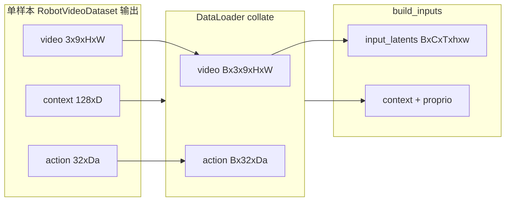

### 10.7 数据增广与随机性：做了什么、没做什么

很多读者会默认「大模型训练一定有强增广」；Fast-WAM 的 dataloader **刻意保持确定性视觉管线**，随机性主要来自采样与指令，而非图像破坏。

| 类型 | 默认是否启用 | 实现位置 | 说明 |
|------|--------------|----------|------|
| 随机裁剪 / 颜色抖动 / 翻转 | **否** | — | `train_transforms` 仅 ToTensor + Resize |
| 相对位姿 action 变换 | **否** | `action_state_transforms: null` | 可配 `RelativePoseTransform` 但未用 |
| Episode train/val 划分 | 是（RoboTwin 1% val） | `BaseLerobotDataset` | 按 episode 随机 shuffle 后切分 |
| 加载失败重试随机 index | 是 | `BaseLerobotDataset` 最多 5 次；`RobotVideoDataset` 异常时随机换样本 | 提高鲁棒性 |
| 避开 padding 帧重采样 | 可选（默认关） | `skip_padding_as_possible` | LIBERO/RoboTwin yaml 均为 `false` |
| 高层+低层指令混合 | 默认关（\(p{=}1\) 只用低层） | `augment_instruction` | 可改 `drop_high_level_prob` |
| 中英指令切换 | 可选 | `use_zh_instruction` | 需数据含 `@` 分隔 |
| 仿真场景随机化 | RoboTwin **采集数据**已含 | 环境 domain randomization | **非**训练时 online 增广 |
| 时间抽稀 | 是（确定性的） | `video_sample_indices` | 每 4 帧取 1 帧视频，非随机 |

**结论**：Fast-WAM 的「数据增强」主要体现在 **(1) 大规模多样化演示数据本身**、**(2) 视频 co-training 作为表征正则**；代码路径上**没有**典型的视觉增强库。若需更强增广，应在 `configs/data/*.yaml` 的 `train_transforms` 中显式添加 `torchvision` 随机算子，并注意与 `[-1,1]` 归一化顺序。

### 10.8 统计量计算与训练入口

```333:344:src/fastwam/runtime.py
def build_datasets(data_cfg: DictConfig):
    train_ds = instantiate(data_cfg.train)
    if data_cfg.get("val") is None:
        val_ds = train_ds
    else:
        ...
        val_ds = instantiate(data_cfg.val, pretrained_norm_stats=pretrained_norm_stats)
    return train_ds, val_ds
```

流程简述：

1. `hydra.instantiate(data_cfg.train)` → `RobotVideoDataset`；
2. 若无 `pretrained_norm_stats` 且为训练集：主进程调用 `get_dataset_stats` → 保存 `dataset_stats.json` → 全进程 broadcast；
3. `processor.set_normalizer_from_stats` 后，`BaseLerobotDataset.set_processor` 切换 `train()` / `eval()` 模式；
4. `run_training` → `Wan22Trainer` → `DataLoader(train_ds)`。

验证集（RoboTwin）复用训练统计量路径，避免在 val 上重新估计归一化参数。

### 10.9 端到端小结

1. **磁盘**：LeRobot 多模态 episode，按 33 帧窗口与 32 步动作对齐读取。  
2. **Processor**：per-camera Resize、动作/本体归一化、拼向量；**无默认视觉随机增广**。  
3. **RobotVideoDataset**：9 帧视频、相机拼图、[-1,1] 归一化、T5 缓存 context。  
4. **模型**：`build_inputs` VAE 编码视频 latent，proprio 注入文本条件，与 flow matching 联合训练。

理解该流水线后，可快速定位「形状不对 / 缓存缺失 / pad 掩码异常」等问题，并能有针对性地改 yaml 或增广策略。

---

## 11. 论文内容与本地实现对照

本章对照 [FastWAM.pdf](./FastWAM.pdf)（[arXiv:2603.16666](https://arxiv.org/abs/2603.16666)）、[项目主页](https://yuantianyuan01.github.io/FastWAM/) 与 [官方 GitHub](https://github.com/yuantianyuan01/FastWAM)，说明**本地仓库实现了论文的哪些部分、如何调用、关键逻辑在哪、缺什么以及对效果的影响**。第 3–10 章已分别讲方法、数据与实验；此处侧重 **paper ↔ code 映射**。

### 11.1 总览：论文主张 vs 仓库覆盖度

论文核心主张可概括为：

1. **训练**：保留视频 co-training（\(\mathcal{L}_{\mathrm{vid}}\)）塑造世界表征 \(z(o,\ell)\)；
2. **推理**：不显式去噪未来视频，直接 \(p_\theta(a_{1:H}\mid z(o,\ell))\)（Eq.3–4）；
3. **对照**：Joint / IDM 复现 imagine-then-execute；去掉 co-train 作消融。

#### 覆盖度总表

| 论文 / 官网内容 | 本地状态 | 主要实现位置 |
|-----------------|----------|--------------|
| MoT + Wan2.2-5B 视频 DiT + 1B ActionDiT | **已实现** | `FastWAM`, `MoT`, `WanVideoDiT`, `ActionDiT` |
| 结构化注意力（action 仅看首帧 video） | **已实现** | `FastWAM._build_mot_attention_mask` |
| 联合 Flow Matching \(\mathcal{L}=\mathcal{L}_{\mathrm{act}}+\lambda\mathcal{L}_{\mathrm{vid}}\) | **已实现** | `training_loss`, `WanContinuousFlowMatchScheduler` |
| 快速推理 `infer_action` + video KV cache | **已实现** | `prefill_video_cache`, `forward_action_with_video_cache` |
| Fast-WAM-Joint（范式 A） | **已实现** | `FastWAMJoint` + `task=*_joint_*` |
| Fast-WAM-IDM（范式 B） | **已实现** | `FastWAMIDM` + `task=*_idm_*` |
| w.o. video co-train 消融 | **需手动配置** | 无专用 task；设 `loss.lambda_video: 0` |
| LIBERO / RoboTwin 仿真评测 | **已实现** | `experiments/libero/`, `experiments/robotwin/` |
| 真机折毛巾 + 190ms 延迟 | **未开源** | 仅论文 / 项目页报告 |
| 外层长程「视频自回归 rollout」 | **论文省略** | 部署用 action chunk + replan |
| Embodied 预训练 | **未做**（论文设定） | 从 Wan2.2 初始化，无机器人 PT 管线 |

#### 模块映射（Mermaid）

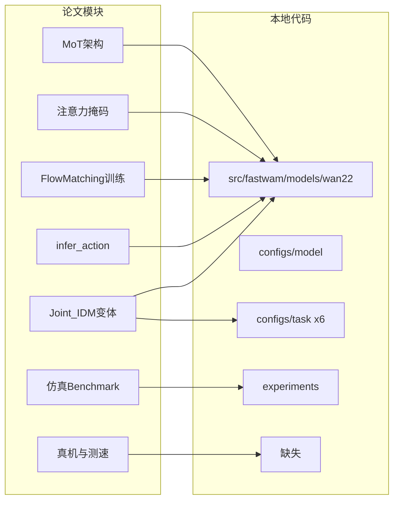

---

### 11.2 已实现：核心方法如何落地

#### 11.2.1 训练路径：调用关系与数据流

**入口链**：

```text
scripts/train.py  @hydra.main(train.yaml + task=...)
  → runtime.run_training(cfg)
      → instantiate(cfg.model)     # create_fastwam | joint | idm
      → build_datasets(cfg.data)   # RobotVideoDataset
      → Wan22Trainer.train()
```

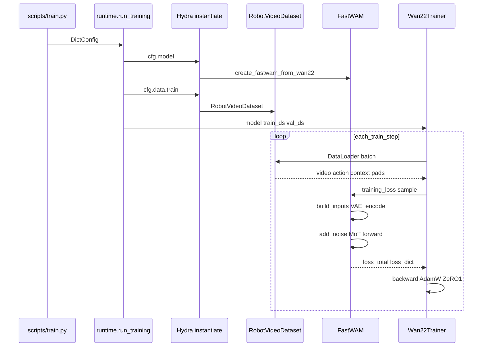

**损失与论文公式对应**（Sec.3.2 Eq.5–9）：

$$
y_t = (1-t)y + t\epsilon, \quad
\mathcal{L}_{\mathrm{FM}}(y) = \mathbb{E}\|f_\theta(y_t,t,o,\ell) - (\epsilon - y)\|^2
$$

\[
$$\mathcal{L} = \mathcal{L}_{\mathrm{act}} + \lambda \mathcal{L}_{\mathrm{vid}}$$
\]

代码中 `training_loss`（`fastwam.py`）对 `input_latents` 与 `action` 分别 `sample_training_t` → `add_noise` → MoT → MSE，并用 `training_weight(t)` 加权：

```563:567:src/fastwam/models/wan22/fastwam.py
        loss_total = self.loss_lambda_video * loss_video + self.loss_lambda_action * loss_action
        loss_dict = {
            "loss_video": self.loss_lambda_video * float(loss_video.detach().item()),
            "loss_action": self.loss_lambda_action * float(loss_action.detach().item()),
```

\($\lambda$\) 来自 `runtime.create_fastwam` 的 `loss.lambda_video` / `lambda_action`（默认均为 1.0，`configs/model/fastwam.yaml` 仅显式写 `lambda_action`）。

**实现差异（训练噪声时间 \(t\)）**：论文写 Following Wan2.2 采用 **logit-normal** 分布；本地 `WanContinuousFlowMatchScheduler.sample_training_t` 使用 \($u \sim \mathrm{Uniform}(0,1)$\) 再经 \($\phi(u,\mathrm{shift})$\) 映射到 \($\sigma$\)（`scheduler_continuous.py` L31–37）。这是与 Wan 官方实现路线一致的常见写法，对收敛影响通常次要，但严格复现论文文字时需知此差别。

**可训练参数**：`Wan22Trainer` 冻结 VAE /（训练时不加载）T5，仅优化 `model.dit`（即 MoT）与可选 `proprio_encoder`（`trainer.py` L84–93）。

#### 11.2.2 部署推理路径（论文主结论）

论文推理因子分解：

\[
$$p_\theta(a_{1:H} \mid o, \ell) \approx p_\theta(a_{1:H} \mid z(o,\ell)), \quad
z \text{ 由首帧 latent 单次前向得到，非积分 } \int p(v_{1:T})\,\mathrm{d}v$$
\]

**仿真部署默认走 `infer_action`**，而非 `infer` / `infer_joint`：

| 场景 | 调用 API | 文件 |
|------|----------|------|
| LIBERO 闭环 | `model.infer_action(**kwargs)` | `experiments/libero/eval_libero_single.py` L418 |
| RoboTwin 策略 | `self.model.infer_action(...)` | `experiments/robotwin/fastwam_policy/deploy_policy.py` L259 |
| 训练期 val 监控 | `model.infer(...)` → **`infer_joint`** | `trainer.py` L422 |


`infer_action` 核心步骤（与论文 Figure 1(C) 一致）：

1. `first_frame_latents`，`timestep_video = 0`；
2. `mot.prefill_video_cache`：30 层缓存 video K/V，**不迭代未来视频去噪**；
3. 仅对 `latents_action` 循环 `forward_action_with_video_cache` + `scheduler.step`。

```1013:1022:src/fastwam/models/wan22/fastwam.py
        video_kv_cache = self.mot.prefill_video_cache(
            video_tokens=video_pre["tokens"],
            ...
            video_attention_mask=attention_mask[:video_seq_len, :video_seq_len],
        )
```

#### 11.2.3 MoT 与三种掩码逻辑

**MoT**（`mot.py`）：每层将 video / action 专家的 Q、K、V 在序列维 `cat`，一次 `flash_attention`（带 mask），再各自 cross-attn(T5 context) + FFN。训练时 `mot.forward`；推理动作用 `forward_action_with_video_cache` 复用缓存的 video K/V。

| 变体类 | action → video 可见性 | 训练序列 | 推理默认 |
|--------|----------------------|----------|----------|
| `FastWAM` | **仅首帧** token | noisy 未来帧 + action | `infer_action` |
| `FastWAMJoint` | **全部** video token | 同左 | `infer_joint`（Joint 覆盖 `infer_action` 为 joint 循环） |
| `FastWAMIDM` | action → **cond** 支路 only | `[noisy \| cond \| action]`，`video_cond_noise_prob=0.5` | `infer_joint` 类路径 |

Fast-WAM 掩码构建（论文 Figure 2b）：

```396:407:src/fastwam/models/wan22/fastwam.py
        mask[:video_seq_len, :video_seq_len] = self.video_expert.build_video_to_video_mask(...)
        mask[video_seq_len:, video_seq_len:] = True
        first_frame_tokens = min(video_tokens_per_frame, video_seq_len)
        mask[video_seq_len:, :first_frame_tokens] = True
```

Joint 唯一改动：

```47:48:src/fastwam/models/wan22/fastwam_joint.py
        mask[video_seq_len:, :video_seq_len] = True
```

#### 11.2.4 仓库模块依赖图

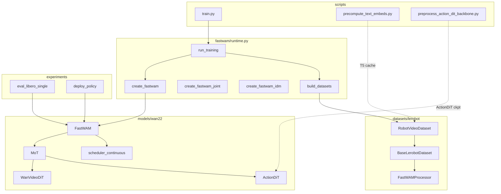

---

### 11.3 已实现：实验与工程配套

与论文 Sec.4 及 [GitHub README](https://github.com/yuantianyuan01/FastWAM) 对齐的部分：

| 论文实验设定 | 本地实现 |
|--------------|----------|
| Wan2.2-5B + Action expert 1024-d，约 6B | `configs/model/fastwam.yaml`；`preprocess_action_dit_backbone.py` |
| 动作 horizon \(H=32\)，视频 9 帧（4× 下采样） | `num_frames: 33`, `action_video_freq_ratio: 4`（第 10 章） |
| LIBERO 四 suite、20k steps | 数据路径 + `task=libero_*`；步数由 `num_epochs`×数据集大小决定，可设 `max_steps=20000` |
| RoboTwin multi-task、30k steps | `task=robotwin_*`；README 提及 64 卡加速，本地 `train_zero1.sh` 支持多机 |
| AdamW \(10^{-4}\), wd 0.01, cosine, bf16, clip 1.0 | `configs/task/*.yaml` 中 `weight_decay: 1e-2`；`train.yaml` + task 覆盖 lr |
| 推理 10 steps, CFG=1.0 | `eval_num_inference_steps: 10`；`sim_*.yaml` 中 `text_cfg_scale: 1.0` |
| unseen 指令（对齐 Motus） | `EVALUATION.instruction_type: unseen`（RoboTwin）；LIBERO 用任务文本 |
| 发布 checkpoint | Hugging Face `yuanty/fastwam` |

**评测闭环（非论文外层视频 AR）**：环境每 `replan_steps` 步重新调用策略；`action_horizon=32` 的 chunk 只执行前 `replan_steps` 步（`deploy_policy.py`）。详见 **§8.3 `replan_steps` 含义与调参**。这与论文「单 chunk、省略外层 AR」的 controlled comparison **一致**。

**可选：可视化未来视频**：`EVALUATION.visualize_future_video=true` 时走 `infer_joint`（`eval_libero_single.py` L414–415），用于调试/可视化，**不是** 默认部署路径。

**辅助但未论文主线的代码**：

- `Wan22Core` + `runtime.run_inference`：单图 → `model.infer` 存 MP4，偏视频生成 demo；
- `create_wan22_model`：纯视频 Wan，无 MoT/动作。

---

### 11.4 部分实现或与论文/官网不一致

| 项目 | 论文 / 官网 | 本地现状 | 对算法效果的影响 |
|------|-------------|----------|------------------|
| 训练 val 视频 rollout | 需监控生成质量 | `evaluate()` 调 **`infer` → `infer_joint`** | **不影响** 部署 `infer_action` 策略；wandb 上 PSNR/SSIM 反映「想象路径」，与 190ms 延迟无关 |
| `infer()` 命名 | 对外应 direct policy | `infer()` **硬编码转发** `infer_joint`（L1070） | 脚本若误用 `infer()` 会极慢、且行为像 Motus 式联合去噪；评测已规避 |
| `infer()` 默认 `text_cfg_scale` | 论文推理 CFG=1.0 | 函数默认 **5.0**；sim 显式传 1.0 | 按官方 eval 配置**无影响**；自定义脚本需注意 |
| 训练 \(t\) 采样 | logit-normal 表述 | Uniform + shift 映射 | 通常**影响很小** |
| 优化器 `betas` | 论文未写死 | `(0.9, 0.95)` | 次要超参 |
| `mot_checkpoint_mixed_attn` | 论文未强调 | LIBERO/RoboTwin task 设为 **`false`** | 省显存、略增计算；不改变方法定义 |
| `action_conditioned` | 部分 WAM 在 video cross-attn 拼 action | 代码支持，**yaml 均为 false** | 与 Fast-WAM 正文一致 |
| 训练步数 | LIBERO 20k / RoboTwin 30k | task 用 `num_epochs`，无内置 20k/30k | 需自行设 `max_steps` 或算 epoch，否则**复现表格数值**可能偏差 |

---

### 11.5 未实现项及对效果 / 复现的影响

#### （1）真机折毛巾（Galaxea R1 Lite）

- **缺失**：60h 遥操作数据、真机训练配置、R1 Lite 部署节点、成功率/完成时间评估脚本。
- **能否补**：需自建数据与机器人接口；不在官方 repo 范围。
- **影响**：无法验证项目页「真机 + 190ms」；**不影响** Table 1/2 仿真结论，因仿真管线完整。

#### （2）w.o. video co-train 消融

- **缺失**：无 `configs/task/*_no_video*.yaml`。
- **能否补**：训练时覆盖，例如：

```bash
bash scripts/train_zero1.sh 8 task=libero_uncond_2cam224_1e-4 \
  model.loss.lambda_video=0
```

`runtime.create_fastwam` 会传入 `loss_lambda_video=0`（`runtime.py` L156），视频分支 loss 权重为零，但前向仍计算 video（若想完全不算 video 前向需改代码，论文消融仅去 **objective**）。

- **影响**：**不跑则无法在本地验证论文最重要对照之一**（LIBERO 93.5% vs 97.6%，RoboTwin 83.8% vs 91.8%）——即「co-train 比 test-time imagination 更关键」。

#### （3）延迟 benchmark（190 ms vs IDM 810 ms）

- **缺失**：无官方 `benchmark_latency.py` 或 CI 测速。
- **能否补**：对 `infer_action` / `infer_joint` 包 `torch.cuda.synchronize()` 计时；需与论文一致：单卡 RTX 5090D、10 steps、CFG=1.0。
- **影响**：**不影响成功率**；仅影响「4× 加速」claim 的可复现性。IDM 慢主因是 test-time **完整 video denoise**，本地 `FastWAMIDM` 已实现该路径。

#### （4）外层长程「生成更长未来视频」的自回归

- **缺失**：无论文外的长视频 AR rollout。
- **设计**：论文 Sec.3.3 明确只研究 **single action chunk**；长任务靠环境 **replan**（执行 `replan_steps` 后重新观测）。参数说明见 **§8.3**。
- **影响**：与论文 controlled setting **一致**；不是实现疏漏。

#### （5）Embodied 预训练与第三方 WAM 训练

- **缺失**：无 Motus / LingBot-VA / \(\pi_0\) 训练代码。
- **影响**：论文对比的是**已发布 checkpoint**；本地只需仿真 eval + HF `fastwam` 权重。不影响 Fast-WAM 方法本身。

#### （6）其它「看起来像缺失、实则一致」的项

- **强视觉数据增广**：默认无（第 10 章）——与论文训练配方一致。
- **Motus 式 seen 指令**：RoboTwin 默认 unseen，可 `instruction_type=seen` 切换——README 已说明。

#### 未实现影响汇总（Mermaid）

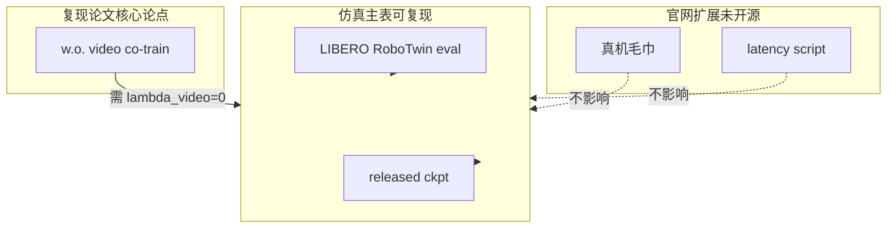

---

### 11.6 复现论文表格：最小命令对照

| 论文变体 | Hydra `task=` | 推理 API（部署） |
|----------|---------------|----------------|
| Fast-WAM | `libero_uncond_2cam224_1e-4` / `robotwin_uncond_3cam_384_1e-4` | `infer_action` |
| Fast-WAM-Joint | `libero_joint_2cam224_1e-4` / `robotwin_joint_3cam_384_1e-4` | `infer_joint` |
| Fast-WAM-IDM | `libero_idm_2cam224_1e-4` / `robotwin_idm_3cam_384_1e-4` | `infer_joint`（IDM 管线） |
| w.o. video co-train | 同上 uncond task + `model.loss.lambda_video=0` | `infer_action` |

训练前：`preprocess_action_dit_backbone.py`、`precompute_text_embeds.py`（第 5、10 章）。评测：第 5 章 `run_libero_manager.py` / `run_robotwin_manager.py` + HF release ckpt。

**论文步数对齐示例**（LIBERO 20k）：

```bash
bash scripts/train_zero1.sh 8 task=libero_uncond_2cam224_1e-4 max_steps=20000
```

RoboTwin 可设 `max_steps=30000`；多卡规模见 README（论文 64 GPU，本地可缩减）。

---

### 11.7 小结

本地 [FastWAM](https://github.com/yuantianyuan01/FastWAM) 仓库**完整实现了论文的方法论主体**：MoT 双专家、首帧约束掩码、视频–动作联合 Flow Matching、以及论文最核心的 **`infer_action` + KV cache** 快速推理；Joint / IDM 与六套 `configs/task` 支撑 controlled comparison；LIBERO / RoboTwin 评测与 HF 权重使 **Table 1/2 的仿真部分可复现**。

**未开源或需自行配置**的主要是：真机实验、官方延迟脚本、现成的 no-co-train task（可用 `lambda_video=0` 补上）。**易混淆点**：`model.infer()` 等价于慢的 `infer_joint`，而论文结论与部署依赖 `infer_action`；训练 `evaluate()` 亦走 joint 路径，监控指标不代表部署延迟。

阅读代码时建议路径：**`runtime.create_fastwam` → `FastWAM.training_loss` / `infer_action` → `experiments/*/eval_*` 或 `deploy_policy.py`**，并对照本章总表核对论文每一项是否覆盖。

---

## 12. 训练 Pipeline 全链路解析

本章专门拆解 **从 shell 命令到一次 `optimizer.step()`** 的完整训练链路：涉及哪些文件、谁调用谁、张量如何流动、哪些参数在更新。第 5 章给复现命令，第 10 章讲单样本数据，第 11 章对照论文；此处聚焦 **训练工程与 `training_loss` 内核**。

### 12.1 鸟瞰：从命令到一次参数更新

典型启动命令：

```bash
bash scripts/train_zero1.sh 8 task=libero_uncond_2cam224_1e-4 max_steps=20000
```

端到端调用链：

```text
train_zero1.sh
  → accelerate launch (DeepSpeed ZeRO-1, N GPU)
      → scripts/train.py  [@hydra: configs/train.yaml + task override]
          → runtime.run_training(cfg)
              → instantiate(cfg.model)     # FastWAM
              → build_datasets(cfg.data) # RobotVideoDataset
              → Wan22Trainer(...).train()
                  → loop: training_loss(batch) → backward → clip → step
```

训练产物目录（由 shell 注入 `output_dir`）：

```text
runs/<task_basename>/<RUN_ID>/
├── config.yaml              # 解析后的完整 Hydra 配置
├── dataset_stats.json       # 归一化统计（主进程写出）
├── checkpoints/
│   ├── weights/step_XXXXXX.pt   # 仅 MoT + proprio_encoder 权重
│   └── state/step_XXXXXX/       # Accelerate 全状态 + trainer_state.json
└── eval/                    # evaluate() 保存的拼接视频等
```

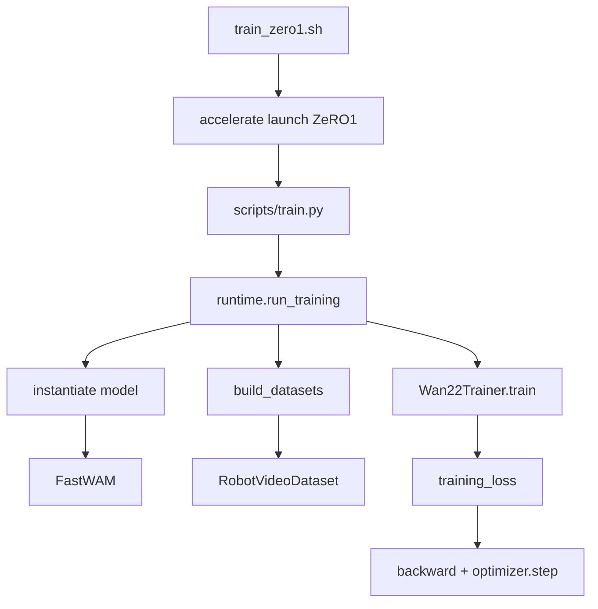

---

### 12.2 配置装配：Hydra 如何拼出一次实验

#### 12.2.1 三层 defaults

根配置 [`configs/train.yaml`](../../configs/train.yaml) 声明：

```yaml
defaults:
  - data: null
  - model: null
  - task: null
```

启动时必须指定 `task=libero_uncond_2cam224_1e-4` 等；task 文件再 **override** data 与 model：

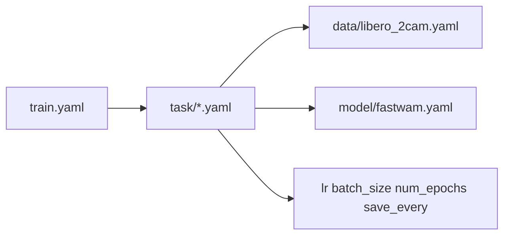

以 [`configs/task/libero_uncond_2cam224_1e-4.yaml`](../../configs/task/libero_uncond_2cam224_1e-4.yaml) 为例：

| 覆盖项 | 典型值 | 作用 |
|--------|--------|------|
| `batch_size` | 16 | 每卡 micro-batch |
| `learning_rate` | 1e-4 | AdamW |
| `weight_decay` | 1e-2 | 对齐论文 0.01 |
| `num_epochs` | 10 | 与 `max_steps` 二选一驱动总步数 |
| `max_steps` | null（可 CLI 覆盖） | 见 12.2.2 |
| `save_every` / `eval_every` | 2000 / 200 | checkpoint 与验证频率 |
| `model.mot_checkpoint_mixed_attn` | false | 混合注意力是否 gradient checkpoint |

`model` 段通过 `${data.train.processor.*}` 解析 action/proprio 维度（[`fastwam.yaml`](../../configs/model/fastwam.yaml)）。

#### 12.2.2 训练步数 `max_steps` 怎么定

`Wan22Trainer.__init__` 中（[`trainer.py`](../../src/fastwam/trainer.py)）：

1. 读取 `cfg.max_steps`（可为 `null`）；
2. 调用 `_estimate_total_train_steps()`：
   - 若 `cfg.max_steps` 已设 → 直接用；
   - 否则  
     \[
     $$T_{\mathrm{train}} \approx E \cdot \left\lceil \frac{|D|}{B_{\mathrm{global}} \cdot G_{\mathrm{acc}}} \right\rceil$$
     \]
     其中 E= `num_epochs`，$B_{\mathrm{global}} =$ `batch_size × num_processes`，\(G_{\mathrm{acc}}=\) `gradient_accumulation_steps`；
3. `self.max_steps = total_train_steps`（L97–98）。

主循环是 **`while self.global_step < self.max_steps`**（L659），DataLoader 耗尽则 `epoch += 1` 并重新 `iter(loader)`，**不是**简单的 `for epoch in range(num_epochs): for batch in loader`。

要对齐论文 LIBERO **20k steps**，应显式传：

```bash
bash scripts/train_zero1.sh 8 task=libero_uncond_2cam224_1e-4 max_steps=20000
```

#### 12.2.3 `run_training` 入口

```359:381:src/fastwam/runtime.py
def run_training(cfg: DictConfig):
    ...
    misc.register_work_dir(cfg.output_dir)
    ...  # 写 config.yaml
    model = instantiate(cfg.model, model_dtype=model_dtype, device=model_device)
    train_ds, val_ds = build_datasets(cfg.data)
    trainer = Wan22Trainer(cfg=cfg, model=model, train_dataset=train_ds, val_dataset=val_ds)
    trainer.train()
```

`instantiate(cfg.model)` 根据 `_target_` 分发到 `create_fastwam` / `create_fastwam_joint` / `create_fastwam_idm`（[`runtime.py`](../../src/fastwam/runtime.py) L76+）。

---

### 12.3 启动层：`train_zero1.sh` 与 Accelerate

[`scripts/train_zero1.sh`](../../scripts/train_zero1.sh) 职责：

1. 解析第一个参数为 `NPROC_PER_NODE`（每机 GPU 数）；
2. 从 `task=...` 提取 `TASK_BASENAME`，用于 `output_dir` 与 wandb 名；
3. 多机时通过 `torch.distributed.TCPStore` 同步 `RUN_ID`；
4. 调用：

```bash
accelerate launch \
  --config_file scripts/accelerate_configs/accelerate_zero1_ds.yaml \
  --num_processes "${NPROC_PER_NODE}" \
  scripts/train.py \
  "output_dir=./runs/${TASK_BASENAME}/${RUN_ID}" \
  "wandb.name=${TASK_BASENAME}" \
  "${EXTRA_ARGS[@]}"
```

Accelerate 使用 **DeepSpeed ZeRO-1**（[`accelerate_zero1_ds.yaml`](../../scripts/accelerate_configs/accelerate_zero1_ds.yaml) → `scripts/ds_configs/ds_zero1_config.json`），优化器状态分片；**混合精度**由 `train.yaml` 的 `mixed_precision: bf16` 传入 `Accelerator(mixed_precision=...)`，与 DS json 中 `mixed_precision: null` 分工明确。

旁征博引：这与 Hugging Face **Accelerate** 的常见模式一致——launcher 管进程与 DeepSpeed，Trainer 管 `autocast` 与 `backward`。

---

### 12.4 训练前依赖（Pipeline 前置门）

在进入 `run_training` 之前，需完成（详见第 5、10 章）：

| 步骤 | 脚本 | 产出 |
|------|------|------|
| ActionDiT 骨干 | `preprocess_action_dit_backbone.py` | `checkpoints/ActionDiT_....pt` |
| T5 文本缓存 | `precompute_text_embeds.py` | `data/text_embeds_cache/<task>/` |
| 数据 | HF 下载 + 解压 | `data/libero_*` 或 `data/robotwin2.0` |

缺 T5 缓存时，`RobotVideoDataset._get_cached_text_context` 会 `FileNotFoundError`，训练无法启动。

---

### 12.5 模型初始化与可训练参数

#### 12.5.1 `FastWAM.from_wan22_pretrained`

```120:150:src/fastwam/models/wan22/fastwam.py
        components = load_wan22_ti2v_5b_components(...)
        video_expert = components.dit
        action_expert = ActionDiT.from_pretrained(...)
        ...
        mot = MoT(mixtures={"video": video_expert, "action": action_expert}, ...)
```

组装结果：

- **video_expert**：Wan2.2-TI2V-5B DiT 权重（Hugging Face / 本地 `checkpoints`）；
- **action_expert**：结构同 DiT、hidden 1024，权重来自 Wan 线性插值 ckpt；
- **mot**：持有两个专家的 `blocks`，`model.dit = mot`（与 DiffSynth 习惯一致，Trainer 只优化 `model.dit`）；
- **vae**：冻结，用于 `build_inputs` 里 encode video；
- **text_encoder**：训练配置 `load_text_encoder: false`，文本来自数据集预计算 `context`。

#### 12.5.2 冻结策略：只训 MoT（+ proprio）

```287:295:src/fastwam/trainer.py
    def _apply_dit_only_train_mode(model):
        model.eval()
        model.requires_grad_(False)
        model.dit.train()
        model.dit.requires_grad_(True)
        proprio_encoder = getattr(model, "proprio_encoder", None)
        if proprio_encoder is not None:
            proprio_encoder.train()
            proprio_encoder.requires_grad_(True)
```

含义：

- VAE、Wan/Action 专家中**未纳入 MoT 梯度路径外的参数**保持 `eval` 且无梯度；
- 实际更新的是 **MoT 内混合注意力 + 各专家 cross-attn/FFN** 中 `requires_grad=True` 的部分，以及把 proprio 映射到 text 维的 `Linear`。

Optimizer 构造时（L85–94）：

```python
trainable_params = list(self.model.dit.parameters())
# + proprio_encoder.parameters() if exists
```

#### 12.5.3 核心类关系（UML classDiagram）

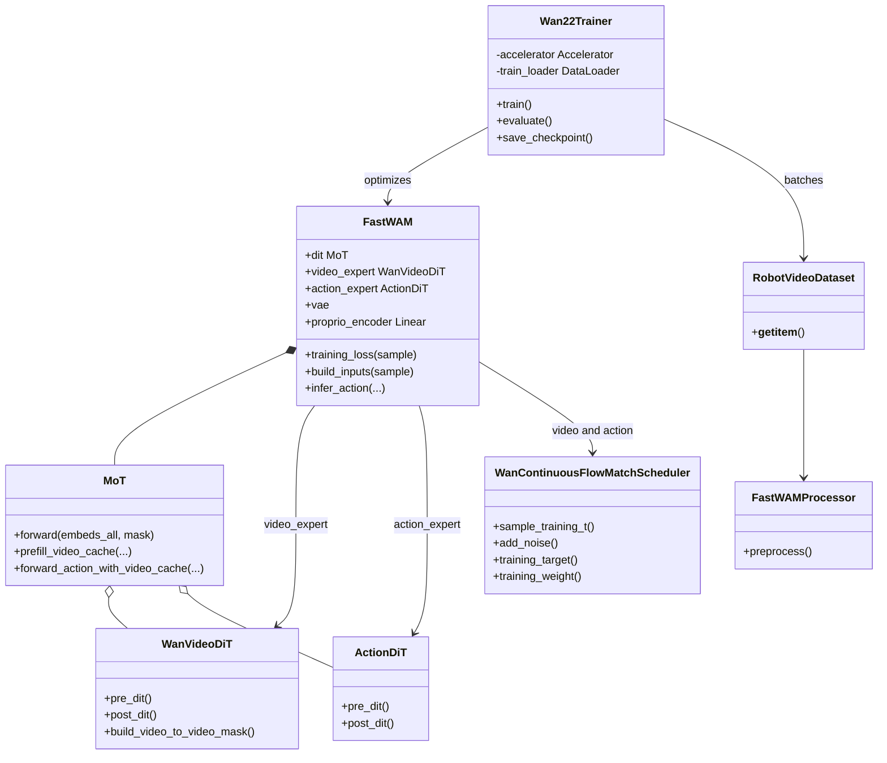

---

### 12.6 数据集、`build_datasets` 与 DataLoader

```333:344:src/fastwam/runtime.py
def build_datasets(data_cfg: DictConfig):
    train_ds = instantiate(data_cfg.train)
    ...
    val_ds = instantiate(data_cfg.val, pretrained_norm_stats=...)  # 或 val_ds = train_ds
```

**训练集首次运行**：主进程 `get_dataset_stats` → `dataset_stats.json` → `processor.set_normalizer_from_stats`（第 10 章）。

**DataLoader**（[`trainer._build_loader`](../../src/fastwam/trainer.py) L167–182）：

- `ResumableEpochSampler`：每个 epoch 对 \(|D|\) 做 `randperm`（种子 `seed + epoch`）；
- `shuffle=False`（顺序由 sampler 决定）；
- **无** `collate_fn` → PyTorch 默认将同名 tensor **stack** 出 batch 维。

#### 一次 `__getitem__` 的调用序列

```mermaid
sequenceDiagram
  participant DL as DataLoader Worker
  participant RVD as RobotVideoDataset
  participant BLD as BaseLerobotDataset
  participant FWP as FastWAMProcessor
  participant MLD as MultiLeRobotDataset

  DL->>RVD: __getitem__(idx)
  RVD->>BLD: lerobot_dataset[idx]
  BLD->>MLD: delta_timestamps 对齐 33 帧
  MLD-->>BLD: raw tensors + task string
  BLD->>FWP: preprocess
  FWP-->>BLD: pixel_values action proprio pads
  BLD-->>RVD: dict
  RVD->>RVD: 抽稀 9 帧 拼相机 归一化
  RVD->>RVD: load T5 cache from prompt hash
  RVD-->>DL: video action proprio context ...
  Note over DL: collate → B x ...
```

**进入 Trainer 的 batch 字段**（与 `training_loss` 对齐）：

| 键 | 形状（LIBERO 例） |
|----|-------------------|
| `video` | `[B, 3, 9, 224, 448]` |
| `action` | `[B, 32, 7]` |
| `proprio` | `[B, 32, 8]` |
| `context` | `[B, 128, D_text]` |
| `context_mask` | `[B, 128]` |
| `action_is_pad` / `image_is_pad` | 用于 mask loss |

多卡一致性：初始化后 `_assert_dataset_length_consistent` 要求各 rank 的 `len(dataset)` 相同，否则直接报错。

---

### 12.7 核心前向：`training_loss` 数据流

`FastWAM.forward` 直接转发到 `training_loss`（L1121–1122），Trainer 调用的是：

```python
loss, loss_dict = train_model.training_loss(sample)
```

#### 12.7.1 阶段分解

```mermaid
flowchart TB
  subgraph in [build_inputs]
    V[video Bx3xTxHxW] --> VAEe[VAE encode]
    VAEe --> Lat[input_latents]
    Lat --> Fix[可选: 固定首帧 latent]
    P[proprio] --> Ctx[append to context]
  end

  subgraph noise [加噪]
    Lat --> Nv[noise_video + t_v]
    Act[action] --> Na[noise_action + t_a]
  end

  subgraph mot [MoT]
    Nv --> PreV[video pre_dit]
    Na --> PreA[action pre_dit]
    PreV --> Mask[build_mot_attention_mask]
    PreA --> Mask
    Mask --> FWD[mot.forward]
    FWD --> PostV[video post_dit]
    FWD --> PostA[action post_dit]
  end

  subgraph loss [损失]
    PostV --> Lv["L_vid weighted MSE"]
    PostA --> La["L_act weighted MSE"]
    Lv --> Sum["loss_total"]
    La --> Sum
  end
```

**① `build_inputs`**（L277–383）

- `input_latents = _encode_video_latents(video)`：整段 9 帧进 VAE；
- `fuse_vae_embedding_in_latents` 时保存 `first_frame_latents`，训练后续帧加噪但首帧保持干净；
- `proprio[:, 0, :]` 经 `proprio_encoder` 拼入 `context`（当前步本体）；
- 校验 \(T \bmod 4 = 1\)，\(H,W\) 被 16 整除，动作步数整除 \(T-1\)。

**② 加噪与目标**（论文 Flow Matching）

\[
y_t = (1-t)y + t\epsilon, \quad \hat{v} = f_\theta(y_t,t,\cdot), \quad \mathcal{L} = \|\hat{v} - (\epsilon - y)\|^2
\]

```49:61:src/fastwam/models/wan22/schedulers/scheduler_continuous.py
    def add_noise(self, original_samples, noise, timestep):
        sigma = (timestep / float(self.num_train_timesteps)).to(...)
        return (1 - sigma) * original_samples + sigma * noise

    @staticmethod
    def training_target(sample, noise, timestep):
        return noise - sample
```

video 与 action **各自独立采样** \(t\)（`sample_training_t`），再联合过 MoT——体现「联合建模、独立噪声水平」。

**③ MoT + mask**

- `_build_mot_attention_mask`：action 只看首帧 video（第 3、11 章）；
- `mot.forward(embeds_all, attention_mask, ...)`：30 层混合注意力 + cross-attn(T5)。

**④ 损失聚合**

```563:567:src/fastwam/models/wan22/fastwam.py
        loss_total = self.loss_lambda_video * loss_video + self.loss_lambda_action * loss_action
```

`image_is_pad` / `action_is_pad` 在 token 维做 masked mean，避免 padding 帧污染。

Joint / IDM 变体：**替换** `training_loss` 与 mask 构建（`FastWAMJoint` / `FastWAMIDM`），Trainer 循环不变，仍调用 `model.training_loss(sample)`。

---

### 12.8 `Wan22Trainer` 主循环与分布式语义

#### 12.8.1 初始化顺序（摘要）

| 顺序 | 操作 |
|------|------|
| 1 | `_apply_dit_only_train_mode`（构造 Optimizer 前） |
| 2 | AdamW + LR Scheduler（5% warmup + cosine） |
| 3 | `DataLoader` + `ResumableEpochSampler` |
| 4 | 估算并设置 `max_steps` |
| 5 | `accelerator.prepare(model, optimizer, loader, scheduler)` |
| 6 | wandb、`resume` 加载 |

#### 12.8.2 训练循环序列图

```mermaid
sequenceDiagram
  participant Trainer as Wan22Trainer.train
  participant Loader as train_loader
  participant Acc as Accelerator
  participant M as FastWAM
  participant Opt as AdamW
  participant Sch as LRScheduler

  Trainer->>Trainer: set_dit_only_train_mode
  loop Until max_steps
    Trainer->>Loader: next batch
    alt Epoch rollover
      Trainer->>Trainer: epoch++ and reset iterator
    end
    Trainer->>Acc: accumulate
    Trainer->>M: training_loss
    M-->>Trainer: loss and loss_dict
    Trainer->>Acc: backward
    alt On sync_gradients
      Acc->>Acc: clip_grad_norm
      Acc->>Opt: optimizer step
      Acc->>Sch: scheduler step
      Acc->>Opt: zero_grad
      Trainer->>Trainer: global_step increment
      Trainer->>Acc: gather metrics
      alt Eval interval
        Trainer->>M: evaluate and infer_joint
      end
      alt Save interval
        Trainer->>Trainer: save_checkpoint
      end
    end
  end
```

**梯度累积**：`gradient_accumulation_steps > 1` 时，仅当 `accelerator.sync_gradients` 为真才 `optimizer.step()`（L677–683），有效 batch 变大而显存占用接近 micro-batch。

**日志**：`accelerator.gather` 对所有 rank 的 loss 取平均；`log_every` 打印 `loss_video` / `loss_action` 分解（来自 `loss_dict`）。

#### 12.8.3 训练期 `evaluate()` 做什么

与部署不同，验证阶段（L377+）：

1. 随机取 val 样本，`training_loss` → `val_loss`；
2. **`model.infer(...)`** → 内部 **`infer_joint`**，生成整段视频 + 动作；
3. 算 PSNR/SSIM（预测视频 vs GT）、VAE 重建基线、可选 action L1/L2（反归一化后）。

因此 wandb 上的 `eval/psnr_*` 反映的是 **想象路径**，不是 `infer_action` 部署路径（第 11 章）。调参时不要与仿真 success rate 混为一谈。

---

### 12.9 Checkpoint 保存与恢复

#### 12.9.1 `save_checkpoint()`

每 `save_every` 步及训练结束（L762–790）：

1. **权重文件**（主进程）：`checkpoints/weights/step_{global_step:06d}.pt`

```1088:1098:src/fastwam/models/wan22/fastwam.py
    def save_checkpoint(self, path, optimizer=None, step=None):
        payload = {
            "mot": self.mot.state_dict(),
            "step": step,
            "torch_dtype": str(self.torch_dtype),
        }
        if self.proprio_encoder is not None:
            payload["proprio_encoder"] = self.proprio_encoder.state_dict()
```

**不包含** VAE、Wan 全量副本；推理/续训需仍能访问 **原始 Wan2.2 权重** + 此 finetune 文件。

2. **训练状态目录**：`checkpoints/state/step_XXXXXX/`
   - `accelerator.save_state`：optimizer、scheduler、DeepSpeed 分片等；
   - `trainer_state.json`：`global_step`、`epoch`、`batch_in_epoch`（供 DataLoader 续跑）。

#### 12.9.2 `resume`

| `cfg.resume` 形式 | 行为 |
|-------------------|------|
| 目录 `.../checkpoints/state/step_XXXXXX` | `load_training_state`：恢复优化器 + sampler 偏移 |
| 单个 `.pt` | 仅 `load_checkpoint` 权重；**不**恢复 optimizer/step（L277 警告） |

仿真评测加载 release ckpt 时走 `load_checkpoint` + 外部 `dataset_stats.json`（`sim_*.yaml` 中 `skip_dit_load_from_pretrain: true` 等），属于另一条推理管线。

---

### 12.10 与论文训练设定（Sec.4.1）的对照

| 论文 | 本仓库落点 |
|------|------------|
| Wan2.2-5B + 1B action expert | `load_wan22` + `ActionDiT.from_pretrained` |
| 32 动作 / 9 视频帧 | `num_frames=33`, `action_video_freq_ratio=4` |
| Flow matching, shift=5 | 双 `WanContinuousFlowMatchScheduler` |
| \(\mathcal{L}_{act} + \lambda \mathcal{L}_{vid}\) | `training_loss` |
| AdamW \(10^{-4}\), wd 0.01, cosine | task yaml + `lr_scheduler_type: cosine` |
| bf16, grad clip 1.0 | `train.yaml` + `max_grad_norm` |
| LIBERO 20k / RoboTwin 30k steps | CLI `max_steps=`（推荐） |
| 推理 10 steps, CFG=1.0 | `eval_num_inference_steps` + sim yaml |

---

### 12.11 阅读与调试建议

**推荐阅读顺序（设断点）**：

1. `scripts/train.py` → `runtime.run_training`
2. `Wan22Trainer.train` L659–675（单步）
3. `FastWAM.training_loss` → `build_inputs` → `mot.forward`
4. 对比 `FastWAMJoint.training_loss` / `FastWAMIDM.training_loss` 理解对照实验

**常见问题**：

| 现象 | 可能原因 |
|------|----------|
| `Missing text embedding cache` | 未跑 `precompute_text_embeds.py` |
| `Video T must satisfy T % 4 == 1` | 数据抽稀帧数与 Wan 约定不符 |
| `dataset length mismatch across ranks` | 多卡下数据集长度不一致 |
| 训练 loss 降、仿真差 | 检查 eval 是否用 release ckpt + stats；指令 unseen/seen |
| 显存 OOM | 减小 `batch_size`；`mot_checkpoint_mixed_attn: true`（model yaml 默认 true，task 常关） |

**与推理 pipeline 的分界**：训练只调用 `training_loss`；`infer_action` 在 `experiments/*` 与 `deploy_policy.py` 中，不在 `Wan22Trainer.train` 热路径上。

---

### 12.12 小结

Fast-WAM 训练 pipeline 可概括为：

**Hydra 配置 → Accelerate 多进程 → `RobotVideoDataset` 产出 batch → `FastWAM.training_loss` 在 MoT 上联合优化视频与动作 Flow Matching 目标 → ZeRO-1 更新 MoT（及 proprio_encoder）→ 周期性 `evaluate`（joint 想象）与 `save_checkpoint`（仅 MoT 权重 + 全状态）。**

理解这一条链后，可自行改 `task`/`model`、插拔 Joint/IDM、设 `lambda_video=0` 做消融，或对齐论文 `max_steps` 复现表格——而不必在 Wan 全量 5B 参数上端到端微调。

---

## 13. 多相机拼接：数据溯源、处理与实现

本章专述 Fast-WAM 如何把 **多路 RGB 观测** 变成模型可吃的 **单路视频张量** `video: [C, T_v, H, W]`。§10 已覆盖整条数据流水线；此处只深挖 `concat_multi_camera`、`shape_meta.images` 顺序，以及训练 / 评测 / 部署三条路径的一致性。

### 13.1 设计动机：为何拼成单张「伪宽屏」视频

Wan2.2 视频分支与 `FastWAM.build_inputs` 约定输入为 **5D 单路 RGB**：

\[
\text{video} \in \mathbb{R}^{B \times 3 \times T \times H \times W}
\]

仓库 **没有**「每相机独立 VAE / 独立 patch 网格」的一等公民 API。因此官方做法是把多相机在 **空间维** 拼成一幅大图画，再当作一条短视频送入 VAE 与 video DiT，与 MoT 的 action 支路联合训练（§3、§12）。

配置开关：`data.train.concat_multi_camera` ∈ `{horizontal, vertical, robotwin}`（`None` 时单相机 `squeeze`）。实现集中在 [`robot_video_dataset.py`](../../src/fastwam/datasets/lerobot/robot_video_dataset.py) L154–190。

**硬约束**：拼接后的 \(H, W\) 须被 16 整除，否则 `build_inputs` 报错（[`fastwam.py`](../../src/fastwam/models/wan22/fastwam.py) L292–295）。LIBERO \(224 \times 448\)、RoboTwin \(384 \times 320\) 均满足。

### 13.2 数据从哪里来、如何采集与索引

#### 13.2.1 磁盘与 LeRobot 键映射

| Benchmark | 本地路径（见 [README](../../README.md)） | `shape_meta.images[].key` | 默认 `lerobot_key` | 相机数 |
|-----------|----------------------------------------|---------------------------|-------------------|--------|
| LIBERO | `data/libero_mujoco3.3.2/*_noops_lerobot` | `image`, `wrist_image` | `observation.images.image`, `observation.images.wrist_image` | 2 |
| RoboTwin | `data/robotwin2.0/robotwin2.0`（HF [robotwin2.0-fastwam](https://huggingface.co/datasets/yuanty/robotwin2.0-fastwam)） | `cam_high`, `cam_left_wrist`, `cam_right_wrist` | `observation.images.<key>` | 3 |

YAML 见 [`configs/data/libero_2cam.yaml`](../../configs/data/libero_2cam.yaml)、[`configs/data/robotwin.yaml`](../../configs/data/robotwin.yaml)。`num_output_cameras` 与 `images` 列表长度一致（LIBERO 2，RoboTwin 3）。

#### 13.2.2 采集形态与时间对齐

- **形态**：仿真 / 遥操作 episode 已离线转为 LeRobot v2 目录（`meta/`、`data/`、`videos/`）。训练时 **不再** 向环境采图，只做帧索引读取。
- **时间窗口**：`obs_size = num_frames = 33`，`action_size = 32`（§10.1）。对 **每个** 图像 key，[`BaseLerobotDataset`](../../src/fastwam/datasets/lerobot/base_lerobot_dataset.py) 构造 **相同长度** 的 `delta_timestamps`（L68–76），`MultiLeRobotDataset` 在 **统一 fps** 下对齐抽取，保证各相机、state、action 同一物理时刻。
- **原始像素**：`_get_image` 读 LeRobot 浮点张量，×255 转 `uint8`，形状 `[T, C, H, W]`（L150–157）。`raw_shape` 在 meta 中声明（如 LIBERO 512×512），当前实现 **不** 在 `_get_image` 里强制 assert 与磁盘一致。
- **Pad 掩码**：`image_is_pad` 取自 **第一个** `image_meta` 的 `lerobot_key`（L234），默认假设各相机时间轴 pad 一致；若某相机缺帧而另一路正常，mask 可能偏乐观（§13.7）。

```mermaid
sequenceDiagram
  participant Disk as LeRobot_on_disk
  participant MLD as MultiLeRobotDataset
  participant BLD as BaseLerobotDataset
  participant FWP as FastWAMProcessor
  participant RVD as RobotVideoDataset

  Disk->>MLD: delta_timestamps 多 key 同轴
  MLD->>BLD: lerobot_sample T=33
  BLD->>FWP: images 字典 每相机独立
  FWP->>RVD: pixel_values num_cam x T x C x H x W
  RVD->>RVD: 抽稀 T_v 再 concat 再全局几何
```

### 13.3 两阶段处理架构（核心）

多相机 **不是** 在 LeRobot 层就拼好，而是 **先分相机预处理，再在 `RobotVideoDataset` 里拼接**。

```mermaid
flowchart TB
  subgraph stageA [阶段A FastWAMProcessor 分相机]
    I1["cam0: T x 3 x H0 x W0"]
    I2["cam1: T x 3 x H0 x W0"]
    I3["cam2: T x 3 x H0 x W0"]
    Stack["stack -> num_cam x T x C x H x W"]
  end
  subgraph stageB [阶段B RobotVideoDataset]
    Sub["video_sample_indices T->T_v"]
    Cat["concat horizontal 或 robotwin"]
    Geom["ResizeSmallestSide + CenterCrop + Norm"]
    Out["video 3 x T_v x H_final x W_final"]
  end
  I1 --> Stack
  I2 --> Stack
  I3 --> Stack
  Stack --> Sub --> Cat --> Geom --> Out
```

#### 阶段 A：`FastWAMProcessor.preprocess`

[`fastwam_processor.py`](../../src/fastwam/datasets/lerobot/processors/fastwam_processor.py) L214–243：

1. 按 `shape_meta["images"]` **列表顺序**遍历相机（顺序决定后续 `horizontal` 左右关系）。
2. 每路：`ToTensor`（uint8→float \([0,1]\)）→ `Resize` 到 meta `shape`（LIBERO **224×224**；RoboTwin **240×320**）。
3. `torch.stack(processed_images, dim=0)` → **`pixel_values`: `[num_cameras, T, C, H, W]`**，**尚未空间拼接**。
4. 若 `num_output_cameras` 大于实际相机数，前部填真实相机、后部 **零 pad**（L234–237）；官方配置无此情况。

同一步内完成 action/state 归一化与 `ConcatLeftAlign`，与相机无关；时间维仍为 **T=33**。

#### 阶段 B：`RobotVideoDataset._get`

[`robot_video_dataset.py`](../../src/fastwam/datasets/lerobot/robot_video_dataset.py) L142–197：

| 步骤 | 操作 | 输出形状（示意） |
|------|------|------------------|
| 1 | `pixel_values[:, video_sample_indices]` 时间抽稀（§10.2，`r=4` → \(T_v=9\)） | `[num_cam, T_v, C, H, W]` |
| 2 | `concat_multi_camera` 空间拼接 | `[T_v, C, H', W']` |
| 3 | `ResizeSmallestSide` + `CenterCrop` → `video_size` | 对齐配置 `[H,W]` |
| 4 | `Normalize(0.5)` + `permute(1,0,2,3)` | `[C, T_v, H, W]`，\([-1,1]\) |

**注意**：阶段 A 的 per-camera `Resize` 与阶段 B 的 **整图** 几何变换是 **两层独立设计**——拼接后仍可能再裁切，RoboTwin `robotwin` 布局尤其如此。

### 13.4 三种拼接模式与像素布局

#### 13.4.1 `horizontal`（LIBERO 默认）

```179:181:src/fastwam/datasets/lerobot/robot_video_dataset.py
            if self.concat_multi_camera == "horizontal":
                video = torch.cat([video[i] for i in range(num_cameras)], dim=-1)
```

- **顺序**：`i=0,1,...` 对应 yaml 中 `images` 顺序。LIBERO 通常为 **第三人称 `image` | 腕部 `wrist_image`**（左→右）。
- **尺寸**：每路已 224×224 → 拼接后 **224×448**，与 `video_size: [224, 448]` 一致；阶段 B 的 resize/crop 多为 **恒等或微调**。

\[
H_{\text{final}} = H_0,\quad W_{\text{final}} = N_{\text{cam}} \cdot W_0,\quad N_{\text{cam}}=2 \Rightarrow 224 \times 448
\]

#### 13.4.2 `vertical`

沿 **高度** `dim=-2` 拼接。仓库支持，LIBERO/RoboTwin 默认 yaml **未使用**；若启用需重新检查 \(H,W \bmod 16\) 与 `video_size`。

#### 13.4.3 `robotwin`（RoboTwin 默认）

**非均匀网格**：顶视大、双腕小，代码 **硬编码** 子分辨率（与 Processor 的 240×320 不同）：

```159:178:src/fastwam/datasets/lerobot/robot_video_dataset.py
            cam_top = transforms_F.resize(video[0], size=[256, 320], ...)
            cam_left = transforms_F.resize(video[1], size=[128, 160], ...)
            cam_right = transforms_F.resize(video[2], size=[128, 160], ...)
            bottom = torch.cat([cam_left, cam_right], dim=-1)  # [T_video, C, 128, 320]
            video = torch.cat([cam_top, bottom], dim=-2)       # [T_video, C, 384, 320]
```

- `video[0]` = `cam_high`（头顶）；`video[1]`、`video[2]` = 左右腕。
- 拼后 **384×320**，再经 `video_size: [384, 320]` 的全局几何。

ASCII 布局（宽 × 高）：

```text
+----------+----------+  256 x 320  (cam_high)
+----+----+
| L  | R  |            128 x 160 each -> 128 x 320 bottom row
+----+----+
Total: 384 x 320
```

#### 13.4.4 模式对照表

| 模式 | 典型 benchmark | 拼接后空间尺寸（训练） | `video_size` |
|------|----------------|------------------------|--------------|
| `horizontal` | LIBERO 2 cam | \(H \times (N \cdot W)\) = 224×448 | `[224, 448]` |
| `robotwin` | RoboTwin 3 cam | 384×320 固定网格 | `[384, 320]` |
| `vertical` | 未默认启用 | \( (N \cdot H) \times W\) | 需自行对齐 |
| 单相机 | — | `squeeze(0)` | 由 yaml 定 |

### 13.5 与其它模态及时间轴的对齐

| 模态 | 是否受拼接影响 | 对齐方式 |
|------|----------------|----------|
| `action` | 否 | 仍 `[32, D_a]`；与视频 **时间抽稀无关** |
| `proprio` | 否 | `proprio[:-1]` 与 32 步 action 对齐（L202–203） |
| `image_is_pad` | 仅时间维 | 先随 `video_sample_indices` 抽稀到 \(T_v\)，再用于 video loss mask |
| `context` / T5 | 否 | 指令与相机无关；离线 cache |
| MoT `build_inputs` | 整图 VAE | 单路 latent；`proprio[:,0,:]` 拼入 text context（§10.6），**无 per-camera proprio** |

动作–视频 **时间比例** 由 `action_video_freq_ratio` 决定（§10.2）：\(T_v=9\) 时 8 段视频过渡、每段 4 步 action；拼接 **不** 改变该比例。

### 13.6 评测与部署：训练—推理一致性

| 路径 | 拼接实现 | 注意 |
|------|----------|------|
| **训练** | `RobotVideoDataset._get` | 基准 |
| **LIBERO eval** | [`eval_libero_single.py`](../../experiments/libero/eval_libero_single.py) L207–234：仿真 `image` / `wrist_image` → 各 `_center_crop_resize` → `np.concatenate`（horizontal/vertical） | **不支持** `robotwin`；`assert` 拼后 `(H,W) == video_size` |
| **RoboTwin deploy** | [`deploy_policy.py`](../../experiments/robotwin/fastwam_policy/deploy_policy.py) `_build_robotwin_image_tensor` L221–234 | NumPy 拼图，与 `robotwin` 子分辨率一致 |
| **WebSocket** | [`bt/fastwam_ws_server.py`](../../bt/fastwam_ws_server.py) `_prep_image` L245–280 | `robotwin` 后再 `resize`+`center_crop` 到 `video_size` |

**闭环 replan**（§8.3）：每次 `infer_action` 通常只吃 **当前一帧** 拼接图（+ proprio），与训练时 9 帧视频序列不同——这是 **推理剪枝**，不是拼接逻辑错误。

**改配置检查清单**：

1. `concat_multi_camera` 与 benchmark 相机数匹配（`robotwin` 必须 3 路）。
2. `video_size` 与拼接后几何一致，且 \(H,W \% 16 = 0\)。
3. `shape_meta.images` 顺序与期望左右/上下关系一致。
4. 同步修改 eval / deploy / `fastwam_ws_server` 中的拼图代码。

### 13.7 代码核心逻辑与调用链

#### 13.7.1 类关系

```mermaid
classDiagram
  class RobotVideoDataset {
    +lerobot_dataset BaseLerobotDataset
    +concat_multi_camera str
    +video_sample_indices list
    +__getitem__(idx)
    -_get(idx)
  }
  class BaseLerobotDataset {
    +multi_dataset MultiLeRobotDataset
    +processor FastWAMProcessor
    +__getitem__(idx)
  }
  class FastWAMProcessor {
    +preprocess(sample)
    +num_output_cameras int
  }
  RobotVideoDataset *-- BaseLerobotDataset
  BaseLerobotDataset o-- FastWAMProcessor
```

#### 13.7.2 训练单样本调用链

```mermaid
sequenceDiagram
  participant DL as DataLoader
  participant RVD as RobotVideoDataset
  participant BLD as BaseLerobotDataset
  participant FWP as FastWAMProcessor
  participant TR as Wan22Trainer
  participant FM as FastWAM

  DL->>RVD: __getitem__(idx)
  RVD->>BLD: lerobot_dataset[idx]
  BLD->>FWP: preprocess (pixel_values 多相机)
  FWP-->>BLD: action proprio pads
  BLD-->>RVD: dict
  RVD->>RVD: 抽稀 + concat + 几何 + T5 cache
  RVD-->>DL: video action proprio context
  DL->>TR: collate batch
  TR->>FM: training_loss(sample)
  FM->>FM: build_inputs VAE encode MoT
```

#### 13.7.3 关键代码锚点

| 逻辑 | 文件 | 行号（约） |
|------|------|------------|
| `lerobot_key` / `delta_timestamps` | `base_lerobot_dataset.py` | 68–76 |
| 读图 uint8 | `base_lerobot_dataset.py` | 150–157 |
| per-camera stack | `fastwam_processor.py` | 214–243 |
| 时间抽稀 + concat + 归一化 | `robot_video_dataset.py` | 142–197 |
| Wan 空间约束 | `fastwam.py` | 291–295 |
| LIBERO eval 拼图 | `eval_libero_single.py` | 207–234 |
| RoboTwin 部署拼图 | `deploy_policy.py` | 221–234 |

`RobotVideoDataset.camera_key` 在构造时保存但 **未在 `_get` 中使用**——无法仅靠 yaml 选子相机，需改 `shape_meta.images` 或代码。

### 13.8 可优化方向（算法效果 vs 计算性能）

#### 13.8.1 算法 / 表征

- **独立相机 encoder + fusion**：替代像素硬拼，减轻无几何标定的视角混叠；需改 VAE 输入接口或 early-fusion stem。
- **Camera / layout embedding**：尤其对 `robotwin` 非均匀网格，在 patch 级注入相机 ID 或 2D 位置编码。
- **同步增广**：跨相机一致 color jitter、同步 random crop（当前 §10 **无** 默认视觉随机增广）。
- **Per-camera pad mask**：`image_is_pad` 仅来自第一 image key；多路缺帧时应按相机分别 mask。

#### 13.8.2 计算性能

- **合并 Resize**：Processor per-camera Resize + 拼接后再 `ResizeSmallestSide` 构成 **双次** 缩放；可在标定尺寸后改为「仅拼接后一次 resize」。
- **`robotwin` 三次 `resize`**：对 `[T_v,C,H,W]` 每帧做 3 路缩放，可向量化或前移到 Processor（固定子分辨率预计算）。
- **统一拼图工具**：训练 Torch / eval NumPy / WS 服务三处逻辑 **重复**；抽 `concat_multicam_torch` + `concat_multicam_numpy` 减少分布漂移与维护成本。
- **单相机短路**：`num_cameras==1` 已 `squeeze`；多卡批处理时可按样本条件跳过 cat。

#### 13.8.3 配置 / 复现

- 改 `horizontal` ↔ `vertical` 会改变 \(H,W\) 与 Wan patch 纵横比，需重训或至少重跑 eval assert。
- 与论文 / HF checkpoint 对齐时，**不要**只改 `video_size` 而不改拼接模式（如把 RoboTwin 当成 horizontal 2×240）。

### 13.9 与现有章节的交叉引用

| 主题 | 章节 |
|------|------|
| LeRobot 窗口、delta 时间戳 | §10.1 |
| `action_video_freq_ratio`、\(T_v=9\) | §10.2 |
| Processor 归一化、无视觉增广 | §10.4 |
| batch → `build_inputs` | §10.6 |
| 训练主循环 | §12 |
| 推理 replan、单帧 `infer_action` | §8.3、§5 |

### 13.10 小结

Fast-WAM 的多相机策略可概括为：**LeRobot 多 key 同轴采样 → Processor 分相机统一 Resize 并 stack → RobotVideoDataset 时间抽稀后在空间维拼接（horizontal 或 robotwin 网格）→ 整图几何归一化 → 单路 `[3, T_v, H, W]` 进 VAE/MoT**。LIBERO 用等分辨率水平条带（224×448）；RoboTwin 用固定三格布局（384×320）。评测与部署必须在 **同一拼图语义** 下喂模型，否则易出现 assert 失败或静默分布偏移。

---

*笔记版本：与本地 FastWAM 仓库 main 分支对齐；若 upstream 更新 API，请以 `src/fastwam/models/wan22/` 为准。*
