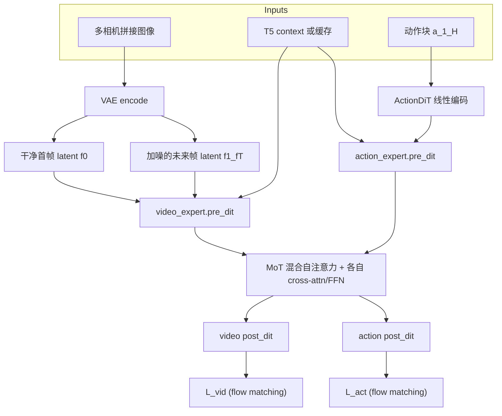
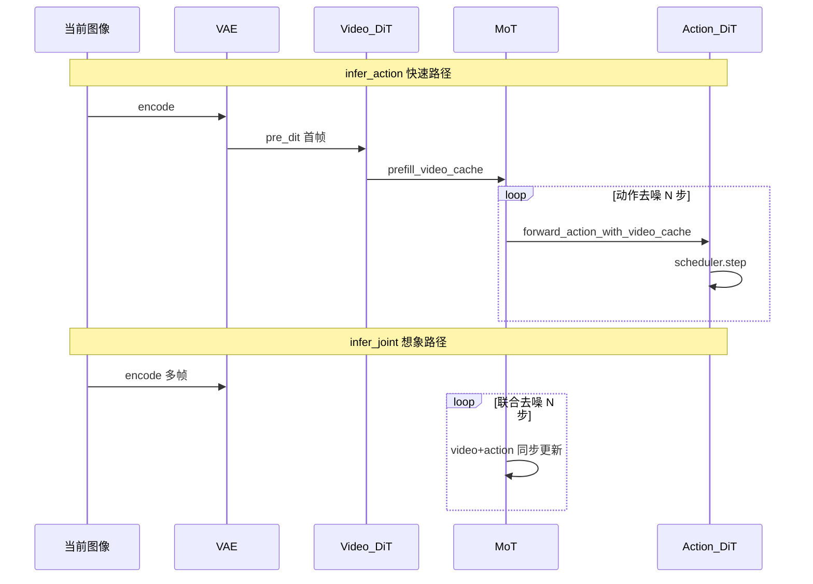
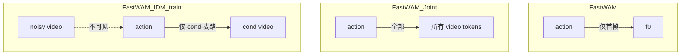
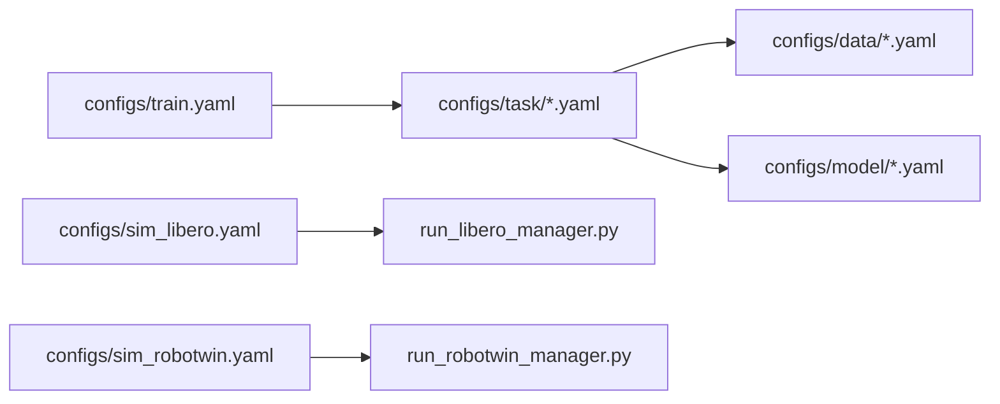
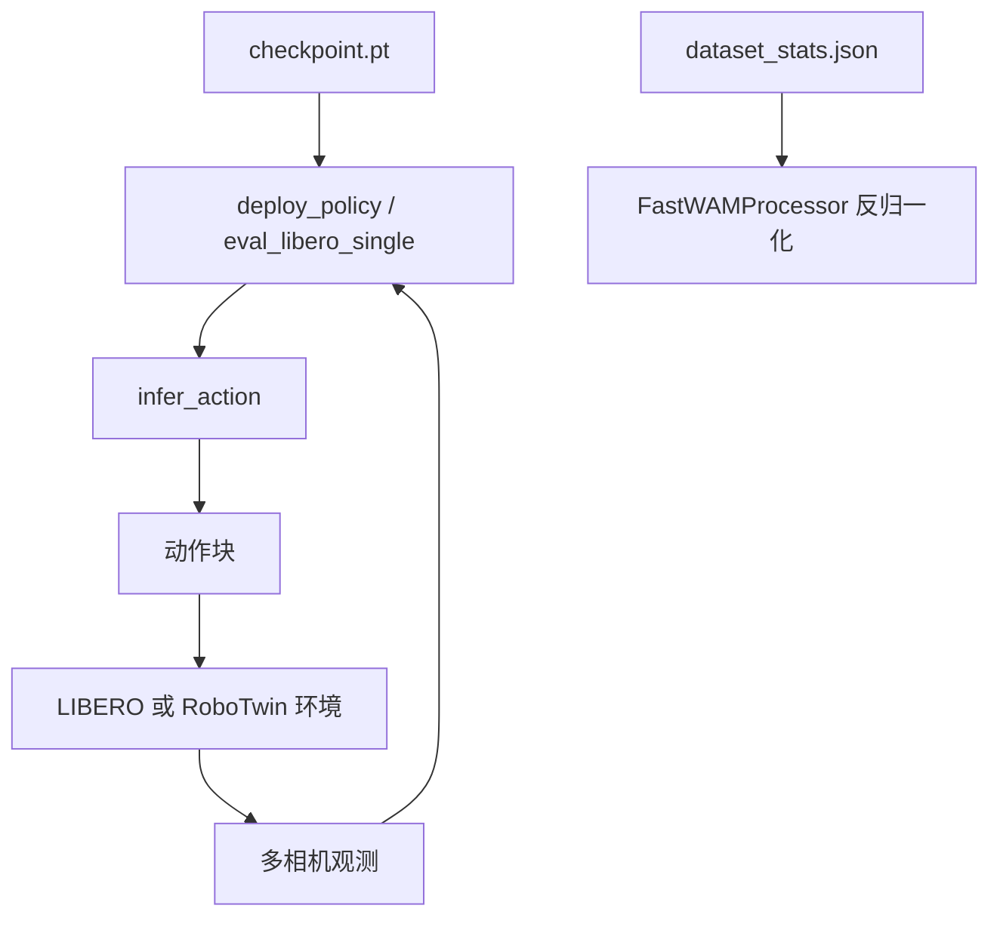
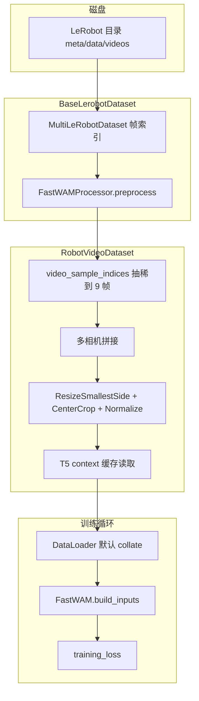
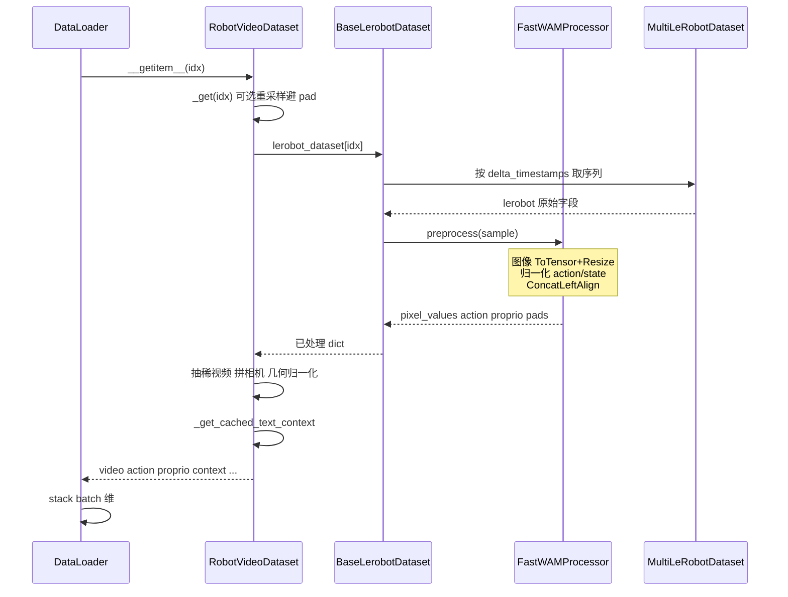
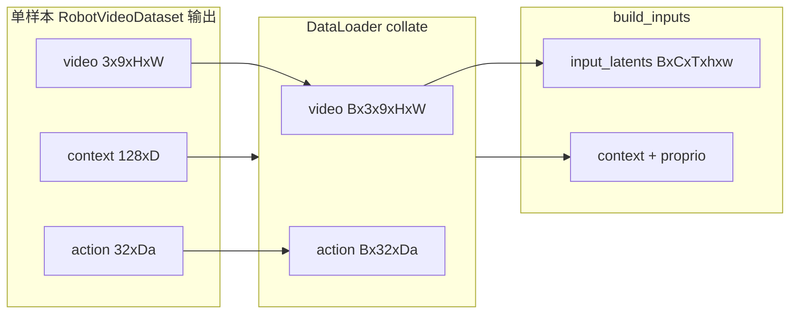

# Fast-WAM 深度解读笔记

> **资料来源**：本地论文 [`FastWAM.pdf`](./FastWAM.pdf)（arXiv: [2603.16666](https://arxiv.org/abs/2603.16666)）、[项目主页](https://yuantianyuan01.github.io/FastWAM/)、[官方 GitHub](https://github.com/yuantianyuan01/FastWAM)，以及本仓库 `src/fastwam/` 实现。  
> **阅读目标**：弄清「世界动作模型（WAM）到底需不需要在测试时想象未来」，以及论文设计如何在代码里落地。

---

## 目录

1. [导读：论文在问什么](#1-导读论文在问什么)
2. [背景：从 VLA 到 WAM](#2-背景从-vla-到-wam)
3. [Fast-WAM 方法](#3-fast-wam-方法)
4. [对照变体与消融](#4-对照变体与消融)
5. [工程复现：数据、训练、评估](#5-工程复现数据训练评估)
6. [实验结果解读](#6-实验结果解读)
7. [代码导航速查](#7-代码导航速查)
8. [讨论与局限](#8-讨论与局限)
9. [参考文献](#9-参考文献)
10. [训练数据格式与处理流水线](#10-训练数据格式与处理流水线)

---

## 1. 导读：论文在问什么

### 1.1 核心问题

**World Action Model（WAM，世界动作模型）** 在训练时往往同时学习「未来视频会怎样变」和「机器人该怎么动」。主流做法在**推理**时先迭代去噪生成未来画面，再据此出动作——即 **imagine-then-execute（先想象、再执行）**。这带来两个问题：

1. **延迟**：视频扩散每步都要跑完整 DiT，难以实时闭环；
2. **必要性不明**：性能提升究竟来自**训练期的视频联合建模**，还是**测试期真的需要看见未来像素**？

Fast-WAM 的立场很直接（[项目页 TL;DR](https://yuantianyuan01.github.io/FastWAM/)）：

| 因素 | 结论 |
|------|------|
| 训练期 video co-training | **关键**——去掉后仿真与真机都明显掉点 |
| 测试期显式 future imagination | **非必需**——Fast-WAM 不做未来视频去噪，仍与 Joint/IDM 变体接近 |
| 速度 | 单卡 RTX 5090D 上约 **190 ms**，约为 imagine-then-execute 路线的 **4×+** |

### 1.2 三条贡献（论文 Sec.1）

1. **问题化**：把 WAM 收益拆成「训练目标」与「推理结构」两个可独立调节的因素。
2. **架构**：保留训练期视频 co-training，推理时改为 **direct policy**——单次编码当前观测 latent，直接对动作 chunk 做 flow matching 去噪。
3. **对照实验**：在 LIBERO、RoboTwin 2.0、真机折毛巾上，用 Joint / IDM / 无 video co-train 等变体隔离因素。

下文按「直觉 → 公式 → 代码 → 实验」展开，并在关键处对照本仓库实现。

---

## 2. 背景：从 VLA 到 WAM

### 2.1 Vision-Language-Action（VLA）

VLA 学习条件分布：

\[
p_\theta(a_{1:H} \mid o, \ell)
\]

其中 \(o\) 为当前（或多帧）观测，\(\ell\) 为语言指令，\(a_{1:H}\) 为长度 \(H\) 的动作块（action chunk）。代表工作包括 OpenVLA、Physical Intelligence 的 \(\pi_0\) / \(\pi_{0.5}\) 等：依托大规模图文预训练获得语义泛化，但**预训练数据以静态图文为主**，对「动作如何改变世界」的显式建模较弱。

Fast-WAM 推理接口与 VLA 类似——**不采样未来视频**——但训练时额外施加视频 flow matching，使视觉骨干的 latent \(z(o,\ell)\) 带有物理动态先验。

### 2.2 Imagine-then-execute WAM

论文将许多 WAM 写为（Eq.2）：

\[
p(a_{1:H} \mid o, \ell) = \int p(v_{1:T} \mid o, \ell)\, p(a_{1:H} \mid o, \ell, v_{1:T})\, \mathrm{d}v_{1:T}
\]

\(v_{1:T}\) 为未来视觉观测。实现上常见两类（论文 Figure 1）：

- **(A) Joint**：未来视频 token 与动作 token **同步**多步去噪（如 Motus、部分 LingBot-VA 路线）；
- **(B) Video-then-action**：先 denoise 出未来视频表示，再条件于其上预测动作（逆动力学 / IDM 类，如部分 LingBot-VA、Genie 系工作）。

二者在测试时都要为 \(v_{1:T}\) 付出迭代扩散成本。

### 2.3 Fast-WAM 的解耦

训练仍预测未来 latent \(z_{1:T}\)（VAE 空间）；推理则**不实例化、不去噪**未来视频 token，而是：

\[
p_\theta(a_{1:H} \mid o, \ell) = p_\theta(a_{1:H} \mid z(o, \ell)), \qquad z \text{ 由视频骨干对当前观测的单次前向得到}
\]

这与 Eq.(2) 的本质区别：**\(z\) 不是对 \(v_{1:T}\) 的随机采样结果**，而是确定性（给定观测）的编码。

### 2.4 三种范式对比（Mermaid）


**旁征博引**：

| 方法 | 范式 | 与 Fast-WAM 关系 |
|------|------|------------------|
| [Motus](https://arxiv.org/abs/2508.04690) | Joint WAM，Wan 骨干 | 论文 Table 1/2 强基线；Fast-WAM-Joint 对齐其推理结构 |
| LingBot-VA | Video-then-action + Wan | Fast-WAM-IDM 对齐；论文比较了有无 embodied PT |
| \(\pi_0\) / \(\pi_{0.5}\) | VLA，无显式未来视频 | 数据效率对照；Fast-WAM 无 embodied PT 仍可比 |
| [Wan2.2](https://github.com/Wan-Video/Wan2.2) | 视频 DiT 预训练 | Fast-WAM 的 5B 世界骨干与 VAE/T5 来源 |

---

## 3. Fast-WAM 方法

### 3.1 模型总览

**参数量**（论文 Sec.4.1）：Wan2.2 视频 DiT **5B** + Action DiT **1B**（hidden 1024）≈ **6B** 总参数。

**组件**：

| 模块 | 作用 | 本地类/配置 |
|------|------|-------------|
| Wan2.2-TI2V-5B DiT | 视频 latent 去噪 / 编码 | `WanVideoDiT`，`configs/model/fastwam.yaml` |
| Action DiT | 动作 chunk flow matching | `ActionDiT`，由 Wan DiT **线性插值**初始化 |
| MoT | 视频/动作专家 **共享混合自注意力** | `MoT` in `mot.py` |
| Wan VAE | 图像 ↔ latent | `fuse_vae_embedding_in_latents: true` |
| T5 | 语言条件 | 训练用**预计算** embedding；仿真评测可在线编码 |

工厂入口：`fastwam.runtime.create_fastwam` → `FastWAM.from_wan22_pretrained()`（`fastwam.py`）。

#### 训练时数据流（Mermaid）



**数据形状**（LIBERO 配置 `configs/data/libero_2cam.yaml`）：

- `num_frames: 33`，`action_video_freq_ratio: 4` → **32 步动作**、约 **9 帧视频**（与论文一致）；
- 双相机水平拼接为 `224×448`，再进 VAE。

### 3.2 Mixture-of-Transformer（MoT）

MoT 不是「两个完全独立的模型」，而是在**每一层**把 video / action 专家的 Q、K、V 在序列维拼接，做一次带 mask 的 Flash Attention，再拆回各自分支做 cross-attention（接 T5 context）和 FFN。

核心约束（`mot.py` 初始化）：两专家 **层数、头数、head_dim 必须一致**，以便混合注意力维度对齐。

**训练**：每步 `mot.forward()` 对完整 `[video_tokens | action_tokens]` 联合计算。

**推理（Fast-WAM 默认）**：分两段——

1. `prefill_video_cache`：仅用**首帧** video tokens 跑完 30 层，缓存每层 K/V；
2. `forward_action_with_video_cache`：动作去噪每步只更新 action 支路，但 attention 中 **复用** 缓存的 video K/V，避免重复编码。

这对应论文 Figure 1(C) 的「Single Forward Pass + Denoise Action」。

### 3.3 结构化注意力掩码

论文将 token 分为三组：**干净首帧** \(f_0\)、**加噪未来帧** \(f_1,\ldots,f_T\)、**动作** \(a_1,\ldots,a_H\)。规则（Sec.3.2）：

- 未来视频：视频支路内双向；可看 \(f_0\)；
- 动作：动作支路内双向；**仅可看 \(f_0\)**，**不可看** \(f_1,\ldots,f_T\)；
- 干净首帧：**不 attend 任何其他 token**（防止信息泄漏）。

记 \(M_{ij}=1\) 表示 query 位置 \(i\) 可 attend key 位置 \(j\)。

#### 代码：`FastWAM._build_mot_attention_mask`

```396:407:src/fastwam/models/wan22/fastwam.py
        mask[:video_seq_len, :video_seq_len] = self.video_expert.build_video_to_video_mask(...)
        mask[video_seq_len:, video_seq_len:] = True
        first_frame_tokens = min(video_tokens_per_frame, video_seq_len)
        mask[video_seq_len:, :first_frame_tokens] = True
```

- 左上子块：视频-视频，由 `video_attention_mask_mode` 控制；
- 右下：动作-动作 全 True；
- 右上「动作→视频」：只有**首帧**对应列 True。

默认 `first_frame_causal`（`wan_video_dit.py`）：首帧 token 互相全连接；首帧可看全序列；**后续帧不能看首帧之后的 token**——既服务视频建模因果结构，又与「动作不能偷看未来」一致。

#### 掩码逻辑示意（Mermaid）

```mermaid
flowchart LR
  subgraph seq [序列: f0 | f_future | action]
    f0[f0 干净首帧]
    ff[f1..fT 加噪未来]
    act[a1..aH 动作]
  end

  f0 -->|"f0 不看别人"| block0[自块受限]
  ff -->|"ff 可看 f0 + ff 内部"| block1[视频块]
  act -->|"act 只看 f0 + act 内部"| block2[动作块]
```

**推理时**：不再创建 \(f_1,\ldots,f_T\) 的 noisy token；仅 \(f_0\) 经 `pre_dit` + `prefill_video_cache`，动作在去噪循环中通过 mask 与缓存 K/V 访问「世界表示」。

### 3.4 Flow Matching 训练目标

论文 Eq.(5)–(9)。对变量 \(y\)（动作或视频 latent）采样 \(\epsilon \sim \mathcal{N}(0,I)\)、\(t \in (0,1)\)：

\[
y_t = (1-t)\, y + t\, \epsilon
\]

\[
\mathcal{L}_{\mathrm{FM}}(y) = \mathbb{E}_{y,\epsilon,t}\left[ \left\| f_\theta(y_t, t, o, \ell) - (\epsilon - y) \right\|_2^2 \right]
\]

\[
\mathcal{L} = \mathcal{L}_{\mathrm{act}} + \lambda\, \mathcal{L}_{\mathrm{vid}}
\]

**代码对应**（`WanContinuousFlowMatchScheduler`）：

- `add_noise`: \(\; y_t = (1-\sigma) y + \sigma \epsilon\)，\(\sigma = t/T_{\mathrm{train}}\)；
- `training_target`: \(\; \epsilon - y\)（与 velocity field 约定一致）；
- `training_weight(t)`: 中间 timestep 加权（高斯型，见 `scheduler_continuous.py`）。

`training_loss`（`fastwam.py` L448–568）对视频、动作**分别**采样 \(t\)，经 MoT 联合前向，再加权 MSE。若 `fuse_vae_embedding_in_latents`，训练时**强制**首帧 latent 保持干净，与推理一致。

配置中 `loss.lambda_action: 1.0`；`lambda_video` 默认 1.0（`FastWAM` 构造函数）。消融「w.o. video co-train」即令 \(\lambda \to 0\) 或等价地不优化 \(\mathcal{L}_{\mathrm{vid}}\)。

### 3.5 训练 vs 推理

| 阶段 | 论文描述 | 本地 API | 是否生成未来视频 |
|------|----------|----------|------------------|
| 训练 | 联合 flow matching on \(z_{1:T}\) 与 \(a_{1:H}\) | `training_loss` | 作为 **监督目标** |
| 训练监控 | 可选重建视频算 PSNR/SSIM | `infer` / `infer_joint` | 是 |
| **部署默认** | 首帧编码 + 动作去噪 | `infer_action` | **否** |
| 对照 Joint/IDM | 与 (A)(B) 范式一致 | `FastWAMJoint.infer_joint` 等 | 是 |

#### `infer_action` 逐步（与代码对齐）

1. **编码观测**：`input_image` → VAE → `first_frame_latents`，`timestep_video = 0`（`fastwam.py` L993–1005）。
2. **构建 mask**：仅首帧 video + action 的 `_build_mot_attention_mask`（L1007–1012）。
3. **Prefill**：`mot.prefill_video_cache(...)`（L1013–1022），`mot.py` L257–341 逐层缓存 video K/V。
4. **动作去噪循环**：`build_inference_schedule` → 每步 `forward_action_with_video_cache` → `infer_action_scheduler.step`（L1024+）。
5. **约束**：必须 `video_attention_mask_mode == "first_frame_causal"`（L923–926），否则 raise。

仿真部署调用链：

- LIBERO：`experiments/libero/eval_libero_single.py` 检测 `model.infer_action`；
- RoboTwin：`experiments/robotwin/fastwam_policy/deploy_policy.py` 的 `_infer_action_chunk`。

#### 推理路径对比（Mermaid）



论文报告推理 **10 步** denoising、CFG scale **1.0**；仓库 sim 配置里 `num_inference_steps` 可覆盖（默认常与 10/20 对齐，以 `configs/sim_*.yaml` 为准）。

### 3.6 Action DiT 初始化

训练前需运行（[README_zh.md](../../README_zh.md)）：

```bash
python scripts/preprocess_action_dit_backbone.py \
  --model-config configs/model/fastwam.yaml \
  --output checkpoints/ActionDiT_linear_interp_Wan22_alphascale_1024hdim.pt \
  --device cuda --dtype bfloat16
```

脚本将 Wan2.2 DiT 权重在 hidden 维上**线性插值**到 1024 维，使动作专家与视频专家结构同构、便于 MoT 共享注意力。这是工程上复现的重要一步，论文中概括为「action expert shares architecture with reduced \(d_a=1024\)」。

---

## 4. 对照变体与消融

论文 Sec.3.3 在**同一 Wan 骨干、同一数据配方**下切换掩码与推理路径，以隔离因素。

| 变体 | 论文意图 | Hydra model | Python 类 | 关键差异 |
|------|----------|-------------|-----------|----------|
| **Fast-WAM** | 训练 co-train；推理不想象 | `fastwam` | `FastWAM` | action→仅首帧 video；`infer_action` |
| **Fast-WAM-Joint** | 范式 (A) | `fastwam_joint` | `FastWAMJoint` | action→**全部** video token（L47–48 `fastwam_joint.py`） |
| **Fast-WAM-IDM** | 范式 (B) | `fastwam_idm` | `FastWAMIDM` | 训练序列 `[noisy_video \| cond_video \| action]`；`video_cond_noise_prob=0.5` |
| **w.o. video co-train** | 消融 | 同架构 | 同 `FastWAM` | 仅去掉 \(\mathcal{L}_{\mathrm{vid}}\) |

#### Fast-WAM-Joint

继承 `FastWAM`，重写掩码：`mask[video_seq_len:, :video_seq_len] = True`，动作可见**所有**视频 latent——推理需 `infer_joint` 同步 rollout 未来视频与动作，延迟接近传统 WAM。

#### Fast-WAM-IDM

继承 `FastWAMJoint`，`training_loss` 三分支（`fastwam_idm.py` L58+）：

1. **noisy_video**：标准视频去噪目标；
2. **cond_video**：teacher forcing 的「未来」支路，以概率 0.5 加噪（论文 \(p=0.5\)）；
3. **action**：**仅 attend cond_video**，不 attend noisy_video（L54–55）。

推理时 IDM 仍走联合去噪管线；项目页报告 IDM 延迟约 **810 ms**，而 Fast-WAM 约 **190 ms**。

#### 掩码对比（Mermaid）



---

## 5. 工程复现：数据、训练、评估

### 5.1 配置组合（Hydra）



- **Task 名**即实验 ID，例如 `libero_uncond_2cam224_1e-4`：`uncond` → `fastwam`；`joint` / `idm` 后缀 → 对应 model yaml。
- `model.proprio_dim`、`action_dim` 等通过 `${data.train.processor.*}` 与数据配置绑定。

### 5.2 环境与依赖

```bash
conda create -n fastwam python=3.10 -y
conda activate fastwam
pip install torch==2.7.1+cu128 torchvision==0.22.1+cu128 \
  --extra-index-url https://download.pytorch.org/whl/cu128
pip install -e .
```

### 5.3 数据

| 基准 | Hugging Face 数据集 | 本地路径 |
|------|---------------------|----------|
| LIBERO | [yuanty/LIBERO-fastwam](https://huggingface.co/datasets/yuanty/LIBERO-fastwam) | `data/libero_mujoco3.3.2/*_lerobot` |
| RoboTwin 2.0 | [yuanty/robotwin2.0-fastwam](https://huggingface.co/datasets/yuanty/robotwin2.0-fastwam) | `data/robotwin2.0/robotwin2.0` |

**发布权重**：[yuanty/fastwam](https://huggingface.co/yuanty/fastwam)（含 `dataset_stats.json`）。

### 5.4 训练流水线

```bash
# 1. 预计算 T5 embedding（可按 task）
python scripts/precompute_text_embeds.py task=libero_uncond_2cam224_1e-4

# 2. DeepSpeed ZeRO-1，8 卡示例
bash scripts/train_zero1.sh 8 task=libero_uncond_2cam224_1e-4
```

`scripts/train.py` → `runtime.run_training`：实例化模型、`build_datasets`、 `Wan22Trainer.train()`。首次训练可将 `pretrained_norm_stats` 设为 `null`，跑完后用 `runs/<task>/<run_id>/dataset_stats.json` 继续训练。

**超参**（论文）：AdamW，\(10^{-4}\) 学习率，weight decay 0.01，cosine schedule，bf16，grad clip 1.0；LIBERO **20k steps**，RoboTwin **30k steps**。

### 5.5 评估流水线

**LIBERO**（需先装官方 LIBERO + `mujoco==3.3.2`）：

```bash
python experiments/libero/run_libero_manager.py \
  task=libero_uncond_2cam224_1e-4 \
  ckpt=./checkpoints/fastwam_release/libero_uncond_2cam224.pt \
  EVALUATION.dataset_stats_path=./checkpoints/fastwam_release/libero_uncond_2cam224_dataset_stats.json \
  MULTIRUN.num_gpus=8
```

Manager 生成 `tasks.txt` → `run_libero_parallel_test.sh`（tmux 并行）→ `eval_libero_single.py` → `summarize_results.py`。

**RoboTwin**：需按 `third_party/RoboTwin` 官方说明装环境、下资产，并：

```bash
ln -sfn "$(pwd)/experiments/robotwin/fastwam_policy" \
  "$(pwd)/third_party/RoboTwin/policy/fastwam_policy"
```

```bash
python experiments/robotwin/run_robotwin_manager.py \
  task=robotwin_uncond_3cam_384_1e-4 \
  ckpt=./checkpoints/fastwam_release/robotwin_uncond_3cam_384.pt \
  EVALUATION.dataset_stats_path=./checkpoints/fastwam_release/robotwin_uncond_3cam_384_dataset_stats.json \
  MULTIRUN.num_gpus=8
```

Python manager 对每个任务先 **clean** 再 **random** 两阶段。`sim_robotwin.yaml` 中 `EVALUATION.skip_get_obs_within_replan=true` 可加速但降低录像帧率。

**指令设定**：默认 **unseen** instruction（对齐 Motus）；可试 `EVALUATION.instruction_type=seen`（README 注明或略涨 1–2 点）。

### 5.6 评估数据流（Mermaid）



---

## 6. 实验结果解读

### 6.1 LIBERO（Table 2）

| 方法 | Embodied PT | Spatial | Object | Goal | Long | **Avg** |
|------|-------------|---------|--------|------|------|---------|
| \(\pi_{0.5}\) | ✓ | 98.8 | 98.2 | 98.0 | 92.4 | 96.9 |
| LingBot-VA | ✓ | 98.5 | 99.6 | 97.2 | 98.5 | **98.5** |
| Motus | ✓ | 96.8 | 99.8 | 96.6 | 97.6 | 97.7 |
| **Fast-WAM** | ✗ | 98.2 | 100.0 | 97.0 | 95.2 | **97.6** |
| Fast-WAM-Joint | ✗ | 99.6 | 99.4 | 98.2 | 96.8 | 98.5 |
| Fast-WAM-IDM | ✗ | 98.8 | 97.8 | 97.8 | 97.6 | 98.0 |
| w.o. video co-train | ✗ | 89.2 | 99.2 | 95.4 | 90.0 | **93.5** |

**读表要点**：

- 无 embodied PT 的 Fast-WAM **97.6%**，超过 \(\pi_{0.5}\)，接近最强 WAM（LingBot-VA 98.5%）。
- Joint / IDM 与 Fast-WAM **差距 < 1–2 点**，支持「测试时想象非关键」。
- 去掉 video co-training **掉 4+ 点**（尤其 Spatial / Long），支持「训练期世界建模是关键」。

### 6.2 RoboTwin 2.0（Table 1）

| 方法 | Clean | Rand. | **Avg** |
|------|-------|-------|---------|
| Motus (PT) | 88.66 | 87.02 | 87.8 |
| LingBot-VA (PT) | 92.90 | 91.50 | 92.2 |
| **Fast-WAM** | 91.88 | 91.78 | **91.8** |
| Fast-WAM-Joint | 90.84 | 90.32 | 90.6 |
| Fast-WAM-IDM | 91.16 | 91.34 | 91.3 |
| w.o. video co-train | 82.76 | 84.80 | 83.8 |

双臂、强随机化场景下 Fast-WAM 仍 **>SOTA 无 PT 基线**，与 Joint/IDM 同档；co-train 消融掉 **~8 点**。

### 6.3 真机折毛巾

Galaxea R1 Lite，60 小时遥操作数据，30k steps。项目页强调：

- **成功率**与 **完成时间** 同等重要（可折叠 ≠ 折叠得快）；
- Fast-WAM **190 ms** vs Fast-WAM-IDM **810 ms**；
- 去掉 video co-training：成功率与耗时双降。

### 6.4 实验 → 设计 对照表

| 现象 | 可能机制 | 代码/设计锚点 |
|------|----------|----------------|
| 去 test-time video 几乎不掉点 | \(z(o,\ell)\) 已在 co-train 中学好 | `infer_action` + 首帧 mask |
| 去 co-train 大掉点 | 视觉表征缺乏动态监督 | `L_vid`，`training_loss` 双路 |
| Joint 略高但慢 | 动作可见未来 latent，推理需联合 denoise | `FastWAMJoint` 全 video mask |
| IDM 精度尚可但更慢 | 两阶段 video→action 去噪 | `FastWAMIDM.infer_joint` |

---

## 7. 代码导航速查

| 想理解… | 阅读文件 |
|---------|----------|
| 训练入口 | `scripts/train.py` → `src/fastwam/runtime.py` `run_training` |
| 总损失与掩码 | `src/fastwam/models/wan22/fastwam.py` |
| MoT / KV cache | `src/fastwam/models/wan22/mot.py` |
| 视频 DiT 与 `first_frame_causal` | `src/fastwam/models/wan22/wan_video_dit.py` |
| Flow scheduler | `src/fastwam/models/wan22/schedulers/scheduler_continuous.py` |
| Joint / IDM 变体 | `fastwam_joint.py`, `fastwam_idm.py` |
| LeRobot 数据 | `src/fastwam/datasets/lerobot/robot_video_dataset.py` |
| 归一化与 delta action | `processors/fastwam_processor.py` |
| LIBERO 评测 | `experiments/libero/eval_libero_single.py`, `run_libero_manager.py` |
| RoboTwin 策略 | `experiments/robotwin/fastwam_policy/deploy_policy.py` |
| 默认超参 | `configs/model/fastwam.yaml`, `configs/task/*.yaml` |

---

## 8. 讨论与局限

### 8.1 核心结论（一句话）

> **WAM 里「预测未来视频」的主要价值，更像是训练时的表征正则；测试时反复想象未来，对 SOTA 控制性能并非必要，却是延迟的主要来源。**

Fast-WAM 用 **结构化 mask + 首帧 KV cache** 把这一结论写进架构，而不是仅靠调参。

### 8.2 与相邻工作的关系

- **相对 VLA**：推理同样是 direct policy，但训练多了 \(\mathcal{L}_{\mathrm{vid}}\)，换数据效率与物理 grounding。
- **相对 Motus / LingBot-VA**：共享「Wan + 联合建模」思想；Fast-WAM 证明可在**不削弱**仿真指标的前提下去掉 test-time video rollout。
- **相对纯世界模型**：不在部署时预测 \(v_{1:T}\)，世界模型退居**训练时辅助任务**。

### 8.3 局限与复现注意

1. **算力**：6B 模型 + 8×GPU 训练是论文默认；RoboTwin 论文用 64 卡加速，仓库 README 建议可减卡/减 epoch。
2. **依赖 Wan 权重**：需 `DIFFSYNTH_MODEL_BASE_PATH` 与 Hugging Face 上的 Wan2.2 组件。
3. **真机数据未开源**：毛巾折叠只能参考论文设置，无法完全复现真机数字。
4. **外层自回归**：论文聚焦**单个 action chunk**；长程任务靠环境闭环 + replan（`replan_steps` in sim config），未在本文展开。
5. **评测细节**：unseen vs seen 指令、RoboTwin 跳帧渲染等会改变分数与视频观感，对比基线时需对齐协议。

### 8.4 可延伸方向

- 将 `infer_action` 蒸馏到更小骨干，进一步压延迟；
- 探索 \(\lambda\) 调度、仅后期启用 \(\mathcal{L}_{\mathrm{vid}}\) 的课程学习；
- 在 co-train 下分析 \(z(o,\ell)\) 的探针（碰撞、接触预测），验证「表征更好」而不仅是「任务 loss 合流」。

---

## 9. 参考文献

### 9.1 本项目

- 论文 PDF：[b/d/FastWAM.pdf](./FastWAM.pdf)
- 项目页：<https://yuantianyuan01.github.io/FastWAM/>
- 代码：<https://github.com/yuantianyuan01/FastWAM>
- 模型：<https://huggingface.co/yuanty/fastwam>
- 数据： [LIBERO-fastwam](https://huggingface.co/datasets/yuanty/LIBERO-fastwam) · [robotwin2.0-fastwam](https://huggingface.co/datasets/yuanty/robotwin2.0-fastwam)

### 9.2 BibTeX

```bibtex
@article{yuan2026fastwam,
  title={Fast-WAM: Do World Action Models Need Test-time Future Imagination?},
  author={Tianyuan Yuan and Zibin Dong and Yicheng Liu and Hang Zhao},
  journal={arXiv preprint arXiv:2603.16666},
  year={2026},
  url={https://arxiv.org/abs/2603.16666}
}
```

---

## 10. 训练数据格式与处理流水线

本章结合本地代码，说明 Fast-WAM **训练时样本从磁盘到 `training_loss` 的完整路径**：原始 LeRobot 格式、Hydra 配置、`FastWAMProcessor` 与 `RobotVideoDataset` 两层处理、是否做数据增广，以及进入 `FastWAM.build_inputs` 后的张量形状。

### 10.1 原始数据：LeRobot 格式

#### 10.1.1 数据来源与目录

官方发布的预处理数据为 **LeRobot v2 风格** 目录，通过 Hugging Face 下载后解压：

| 基准 | 数据集 | 本地路径（默认） |
|------|--------|------------------|
| LIBERO | [yuanty/LIBERO-fastwam](https://huggingface.co/datasets/yuanty/LIBERO-fastwam) | `data/libero_mujoco3.3.2/*_lerobot`（4 个子集） |
| RoboTwin 2.0 | [yuanty/robotwin2.0-fastwam](https://huggingface.co/datasets/yuanty/robotwin2.0-fastwam) | `data/robotwin2.0/robotwin2.0` |

每个子目录内含 `meta/`、`data/`、`videos/` 等 LeRobot 标准结构；`BaseLerobotDataset` 用 `LeRobotDatasetMetadata` 读 fps、episode 数，再用 `MultiLeRobotDataset` 按**帧索引**统一采样。

#### 10.1.2 时间窗口与 delta_timestamps

对配置中的 `num_frames = 33`，底层约定（`base_lerobot_dataset.py`）：

- `obs_size = num_frames`：一次取 **33 帧观测**（图像 + state）；
- `action_size = num_frames - 1`：动作长度为 **32**（与「从 \(t_0\) 到 \(t_{31}\) 的执行」对齐，不含最后一帧的 action）；
- `global_sample_stride`：在时间轴上的步长倍率（默认 1）。

对每个 `shape_meta` 里的 key，按数据集 fps 构造相对时间戳列表。以图像为例，观测时间戳为：

\[
\tau_t = \frac{t \cdot \text{global\_sample\_stride}}{\text{fps}}, \quad t = 0, 1, \ldots, \text{obs\_size} - 1
\]

动作时间戳同理，长度为 `action_size`。LeRobot 据此从 episode 中**对齐抽取**多模态序列；若 episode 边界不足，会产生 `*_is_pad` 标记。

#### 10.1.3 BaseLerobotDataset 单次 `__getitem__` 输出

在挂载 `FastWAMProcessor` 之前，逻辑上的「原始样本」为（`base_lerobot_dataset.py`）：

| 字段 | 结构 | 说明 |
|------|------|------|
| `images[key]` | `[T, C, H, W]`，`uint8` | `_get_image` 将 LeRobot 浮点图 ×255 转 uint8 |
| `action[key]` | `[T-1, D_a]` | 与 32 步动作 horizon 对齐 |
| `state[key]` | `[T, D_s]` | 本体状态，与观测帧数对齐 |
| `action_is_pad` / `state_is_pad` / `image_is_pad` | `[T]` 或 `[T-1]` | padding 掩码 |
| `task` | `str` | 任务语言（低层指令） |
| `idx` | `int` | 帧级索引 |

随后若 `processor is not None`，立即调用 `processor.preprocess(sample)`，再返回给外层 `RobotVideoDataset`。

### 10.2 配置驱动：LIBERO 与 RoboTwin 对比

训练数据行为由 [`configs/data/libero_2cam.yaml`](../../configs/data/libero_2cam.yaml) 与 [`configs/data/robotwin.yaml`](../../configs/data/robotwin.yaml) 完全指定。核心参数对比如下：

| 配置项 | LIBERO（2 相机） | RoboTwin（3 相机） |
|--------|------------------|---------------------|
| `num_frames` | 33 | 33 |
| `action_video_freq_ratio` | 4 | 4 |
| 有效视频帧数 \(T_v\) | \((33-1)/4 + 1 = 9\) | 9 |
| 动作步数 \(T_a\) | 32 | 32 |
| `concat_multi_camera` | `horizontal` → 宽 448 | `robotwin` 专用布局 → **384×320** |
| `video_size`（最终裁剪） | `[224, 448]` | `[384, 320]` |
| `action_output_dim` / `proprio_output_dim` | 7 / 8 | 14 / 14 |
| `norm_default_mode` | `min/max` | `z-score` |
| `delta_action_dim_mask` | 前 6 维 delta，夹爪维绝对 | 未配置（无 mask） |
| `val_set_proportion` | 0（全量训练） | 0.01 |
| `text_embedding_cache_dir` | `./data/text_embeds_cache/libero` | `./data/text_embeds_cache/robotwin` |

#### 帧数硬约束（与 Wan VAE 对齐）

`RobotVideoDataset` 初始化时断言：

```59:63:src/fastwam/datasets/lerobot/robot_video_dataset.py
        assert (num_frames - 1) % self.action_video_freq_ratio == 0, \
            f"num_frames-1 must be divisible by action_video_freq_ratio, got {num_frames - 1} and {self.action_video_freq_ratio}"
        assert ((num_frames - 1) // self.action_video_freq_ratio) % 4 == 0, \
            f"video frames must be divisible by 4 for tokenization, got {(num_frames - 1) // self.action_video_freq_ratio}"
        self.video_sample_indices = list(range(0, num_frames, self.action_video_freq_ratio))
```

记 \(r = \texttt{action\_video\_freq\_ratio}\)，则需：

\[
\text{num\_frames} - 1 \equiv 0 \pmod{r}, \qquad \frac{\text{num\_frames}-1}{r} \equiv 0 \pmod{4}
\]

后者保证抽稀后的视频帧数 \(T_v = \frac{\text{num\_frames}-1}{r} + 1\) 在 **`build_inputs` 中满足 Wan 约定 \(T_v \equiv 1 \pmod{4}\)**（`fastwam.py` L296–297）。

### 10.3 双层 Dataset 架构

Fast-WAM 没有单独的「视频 Dataset 类」，而是用 **包装器** 把 LeRobot + Processor + 视频专用后处理串起来：



**直觉**：第一层负责「按 LeRobot 协议取 33 帧 + 归一化动作/状态 +  per-camera Resize」；第二层负责「压成 9 帧视频张量 + 拼相机 + 对齐 proprio + 加载预计算文本」。

#### 调用序列（单样本）



### 10.4 FastWAMProcessor：策略侧预处理

类定义见 [`fastwam_processor.py`](../../src/fastwam/datasets/lerobot/processors/fastwam_processor.py)。`preprocess` 是训练数据的**语义核心**，顺序固定：

#### （1）指令处理 `augment_instruction`

```120:147:src/fastwam/datasets/lerobot/processors/fastwam_processor.py
    def augment_instruction(self, data: Dict[str, str] | List[str]) -> List[str]:
        ...
        if np.random.rand() < self.drop_high_level_prob:
            instruction = f"{low_level_instruction}"
        else: 
            instruction = f"[High]: {high_level_instruction}, [Low]: {low_level_instruction}"
        
        return instruction
```

- 默认 `drop_high_level_prob=1.0`（构造参数默认值；LIBERO yaml **未覆盖**）→ **始终只使用** `task` 低层指令；
- 若指令含 `@`，可按 `use_zh_instruction` 选中/英文子串（Galaxea 数据格式）；
- 注意：`RobotVideoDataset` 最终不用这里的 `instruction` 字段直接训练，而是用 `DEFAULT_PROMPT.format(task=...)` 再查 T5 缓存（见 10.5）。

#### （2）图像变换 `train_transforms` / `val_transforms`

配置示例（LIBERO）：

```yaml
train_transforms:
  - ToTensor          # uint8 -> float [0,1]
  - Resize [224,224]  # 逐相机，在 T 维批量应用
```

对每个 `shape_meta["images"]` 的 key 依次应用；多相机 stack 为 `pixel_values`：`[num_cameras, T, C, H, W]`。**当前官方配置没有** RandomCrop、ColorJitter、翻转等随机视觉增广。

#### （3）动作 padding 与 delta 维

若配置了 `delta_action_dim_mask`（LIBERO 前 6 维为 delta 位姿，第 7 维夹爪为绝对量），在**归一化之前**把 padding 时间步上的 delta 维置零，避免无效差分污染统计：

```251:259:src/fastwam/datasets/lerobot/processors/fastwam_processor.py
        if "action" in data and self.delta_action_dim_mask is not None:
            action_is_pad = torch.as_tensor(data["action_is_pad"], dtype=torch.bool)
            if bool(action_is_pad.any().item()):
                for key, dim_mask in self.delta_action_dim_mask.items():
                    ...
                    cur_action[pad_delta_mask] = 0.0
```

#### （4）`action_state_transforms`

LIBERO / RoboTwin 的 yaml 中均为 **`null`**。仓库虽实现 `RelativePoseTransform`（`transforms/relative_action.py`）等，但**默认训练管线不做**「相对当前末帧位姿」的几何变换；数据集中的动作已是预处理后的格式（见 HF 数据集说明）。

#### （5）归一化 `LinearNormalizer`

- LIBERO：`norm_default_mode: min/max`，在首次训练时由 `get_dataset_stats` 扫描全 episode 得到 min/max（及分位数等），写入 `runs/.../dataset_stats.json`；
- RoboTwin：常用预置 `./data/robotwin2.0/dataset_stats.json` + **`z-score`**。

统计量在 episode 级并行聚合（`base_lerobot_dataset.py` `get_dataset_stats`），再 `processor.set_normalizer_from_stats`。

#### （6）合并 `ConcatLeftAlign`

将多 key 的 `action` / `state` dict 拼成单向量，并可能 left-pad 到 `action_output_dim` / `proprio_output_dim`，产出 `action_dim_is_pad` 等。输出字段名仍为 `state`，在 `RobotVideoDataset` 里当作 **proprio** 使用。

### 10.5 RobotVideoDataset：视频张量与文本缓存

#### 视频抽稀与多相机

```63:63:src/fastwam/datasets/lerobot/robot_video_dataset.py
        self.video_sample_indices = list(range(0, num_frames, self.action_video_freq_ratio))
```

从 Processor 输出的 `pixel_values`（33 帧）上取索引 `[0,4,8,...,32]`，得到 **9 帧**。两相机水平拼接示例：

```179:181:src/fastwam/datasets/lerobot/robot_video_dataset.py
            if self.concat_multi_camera == "horizontal":
                video = torch.cat([video[i] for i in range(num_cameras)], dim=-1)
```

RoboTwin 的 `robotwin` 模式先将各相机 resize 到固定子分辨率，再拼成 **384×320**（顶视 256×320 + 底部双腕 128×160×2）。

#### 几何归一化（第二层，与 Processor 内 Resize 不同）

在拼接后的**整幅视频**上再做：

1. `ResizeSmallestSideAspectPreserving`：保持宽高比，短边缩放到至少覆盖 `video_size`；
2. `CenterCrop`：裁到 `video_size`（LIBERO 为 224×448）；
3. `Normalize(mean=0.5, std=0.5)`：像素映射到 **[-1, 1]**；
4. `permute(1,0,2,3)` → 张量形状 **`[C, T_v, H, W]`**。

#### proprio 与 action 时间对齐

```202:203:src/fastwam/datasets/lerobot/robot_video_dataset.py
        action = sample["action"] # [T-1, action_dim]
        proprio = sample["proprio"][:-1, :] # [T-1, state_dim]， to align with action
```

即 proprio 去掉最后一帧，与 32 步动作、9 帧视频（首帧对应 \(t_0\) 观测）在时间上配套。模型里 `build_inputs` 再取 **`proprio[:, 0, :]`** 拼入 T5 context（当前步本体）。

#### 语言条件：Prompt 模板 + 离线 T5

```16:16:src/fastwam/datasets/lerobot/robot_video_dataset.py
DEFAULT_PROMPT = "A video recorded from a robot's point of view executing the following instruction: {task}"
```

```216:221:src/fastwam/datasets/lerobot/robot_video_dataset.py
        instruction = DEFAULT_PROMPT.format(task=task)
        context, context_mask = self._get_cached_text_context(instruction)
        context[~context_mask] = 0.0
        context_mask = torch.ones_like(context_mask)
```

缓存文件命名：`sha256(prompt).t5_len{context_len}.wan22ti2v5b.pt`，需事先运行：

```bash
python scripts/precompute_text_embeds.py task=libero_uncond_2cam224_1e-4
```

训练时 **不加载 T5 权重**（`load_text_encoder: false`），只读缓存，降低 GPU 显存与 IO。

#### RobotVideoDataset 最终 `__getitem__` 字典

| 键 | 形状（单样本） | 含义 |
|----|----------------|------|
| `video` | `[3, T_v, H, W]` | \(T_v=9\)，[-1,1] |
| `action` | `[32, D_a]` | 已归一化 |
| `proprio` | `[32, D_s]` | 已归一化（与 action 对齐） |
| `prompt` | `str` | 完整英文模板句 |
| `context` | `[128, D_text]` | 预计算 T5 输出 |
| `context_mask` | `[128]` | 训练时会被置全 1（与 Wan 行为一致） |
| `image_is_pad` | `[T_v]` | 视频帧级 mask |
| `action_is_pad` / `proprio_is_pad` | `[32]` | loss 掩码 |

### 10.6 DataLoader → `build_inputs`：进入模型

[`trainer.py`](../../src/fastwam/trainer.py) 使用 **PyTorch 默认 collate**（无自定义 `collate_fn`），将上述字段 stack 出 batch 维：

| 字段 | Batch 形状 | 后续 |
|------|------------|------|
| `video` | `[B, 3, T_v, H, W]` | VAE encode → `input_latents` |
| `action` | `[B, 32, D_a]` | flow matching 目标 |
| `proprio` | `[B, 32, D_s]` | 取 `[:,0,:]` → `proprio_encoder` → 拼入 context |
| `context` | `[B, 128, D]` | 视频/动作 cross-attn |
| `*_is_pad` | 与单样本同形 + B | `training_loss` 掩码 |

`FastWAM.build_inputs` 关键校验与编码：

```291:311:src/fastwam/models/wan22/fastwam.py
        batch_size, _, num_frames, height, width = video.shape
        if height % 16 != 0 or width % 16 != 0:
            raise ValueError(...)
        if num_frames % 4 != 1:
            raise ValueError(f"Video T must satisfy T % 4 == 1, got T={num_frames}")
        ...
        if action_horizon % (num_frames - 1) != 0:
            raise ValueError(...)
```

因此 LIBERO 的 \(H{=}224,\, W{=}448\) 与 RoboTwin 的 \(384{\times}320\) 都满足 **16 整除**；\(T_v{=}9\) 满足 \(9 \bmod 4 = 1\)。动作 32 步相对 8 个「视频过渡」\((T_v-1)\)，每段 4 步动作，与 `action_video_freq_ratio=4` 一致。



### 10.7 数据增广与随机性：做了什么、没做什么

很多读者会默认「大模型训练一定有强增广」；Fast-WAM 的 dataloader **刻意保持确定性视觉管线**，随机性主要来自采样与指令，而非图像破坏。

| 类型 | 默认是否启用 | 实现位置 | 说明 |
|------|--------------|----------|------|
| 随机裁剪 / 颜色抖动 / 翻转 | **否** | — | `train_transforms` 仅 ToTensor + Resize |
| 相对位姿 action 变换 | **否** | `action_state_transforms: null` | 可配 `RelativePoseTransform` 但未用 |
| Episode train/val 划分 | 是（RoboTwin 1% val） | `BaseLerobotDataset` | 按 episode 随机 shuffle 后切分 |
| 加载失败重试随机 index | 是 | `BaseLerobotDataset` 最多 5 次；`RobotVideoDataset` 异常时随机换样本 | 提高鲁棒性 |
| 避开 padding 帧重采样 | 可选（默认关） | `skip_padding_as_possible` | LIBERO/RoboTwin yaml 均为 `false` |
| 高层+低层指令混合 | 默认关（\(p{=}1\) 只用低层） | `augment_instruction` | 可改 `drop_high_level_prob` |
| 中英指令切换 | 可选 | `use_zh_instruction` | 需数据含 `@` 分隔 |
| 仿真场景随机化 | RoboTwin **采集数据**已含 | 环境 domain randomization | **非**训练时 online 增广 |
| 时间抽稀 | 是（确定性的） | `video_sample_indices` | 每 4 帧取 1 帧视频，非随机 |

**结论**：Fast-WAM 的「数据增强」主要体现在 **(1) 大规模多样化演示数据本身**、**(2) 视频 co-training 作为表征正则**；代码路径上**没有**典型的视觉增强库。若需更强增广，应在 `configs/data/*.yaml` 的 `train_transforms` 中显式添加 `torchvision` 随机算子，并注意与 `[-1,1]` 归一化顺序。

### 10.8 统计量计算与训练入口

```333:344:src/fastwam/runtime.py
def build_datasets(data_cfg: DictConfig):
    train_ds = instantiate(data_cfg.train)
    if data_cfg.get("val") is None:
        val_ds = train_ds
    else:
        ...
        val_ds = instantiate(data_cfg.val, pretrained_norm_stats=pretrained_norm_stats)
    return train_ds, val_ds
```

流程简述：

1. `hydra.instantiate(data_cfg.train)` → `RobotVideoDataset`；
2. 若无 `pretrained_norm_stats` 且为训练集：主进程调用 `get_dataset_stats` → 保存 `dataset_stats.json` → 全进程 broadcast；
3. `processor.set_normalizer_from_stats` 后，`BaseLerobotDataset.set_processor` 切换 `train()` / `eval()` 模式；
4. `run_training` → `Wan22Trainer` → `DataLoader(train_ds)`。

验证集（RoboTwin）复用训练统计量路径，避免在 val 上重新估计归一化参数。

### 10.9 端到端小结

1. **磁盘**：LeRobot 多模态 episode，按 33 帧窗口与 32 步动作对齐读取。  
2. **Processor**：per-camera Resize、动作/本体归一化、拼向量；**无默认视觉随机增广**。  
3. **RobotVideoDataset**：9 帧视频、相机拼图、[-1,1] 归一化、T5 缓存 context。  
4. **模型**：`build_inputs` VAE 编码视频 latent，proprio 注入文本条件，与 flow matching 联合训练。

理解该流水线后，可快速定位「形状不对 / 缓存缺失 / pad 掩码异常」等问题，并能有针对性地改 yaml 或增广策略。

---

*笔记版本：与本地 FastWAM 仓库 main 分支对齐；若 upstream 更新 API，请以 `src/fastwam/models/wan22/` 为准。*
