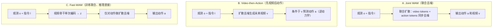
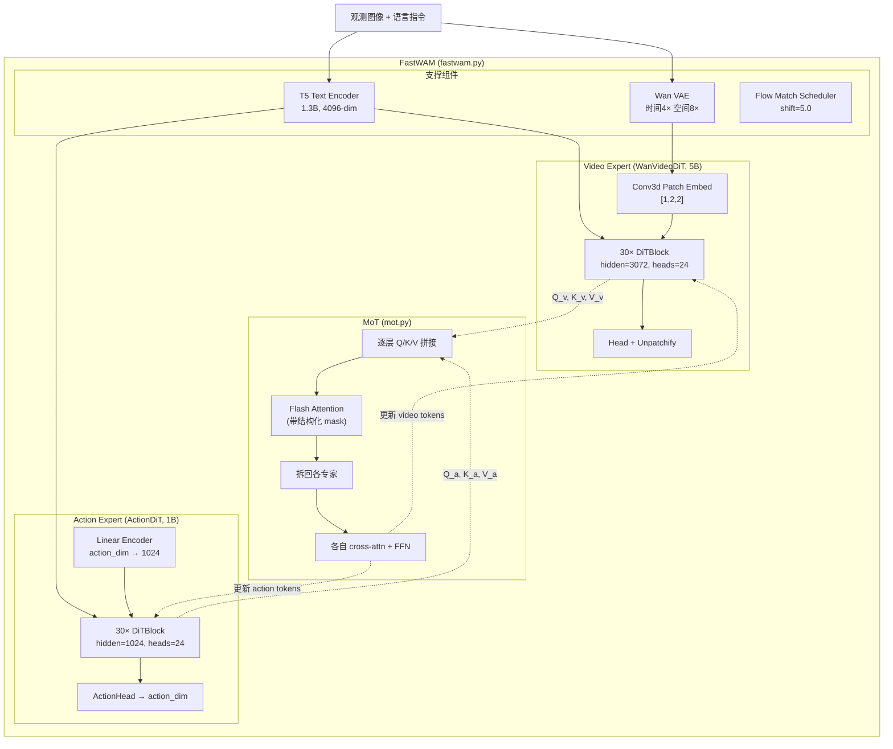
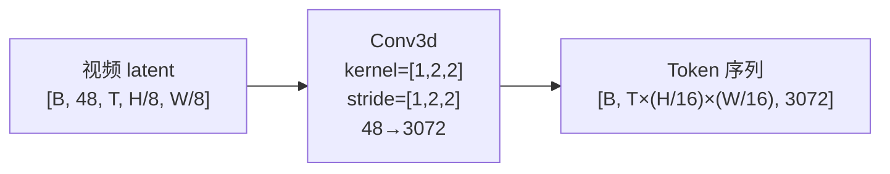
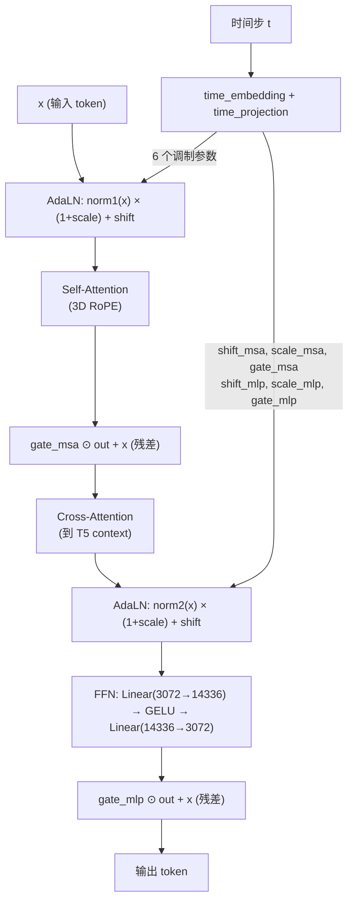
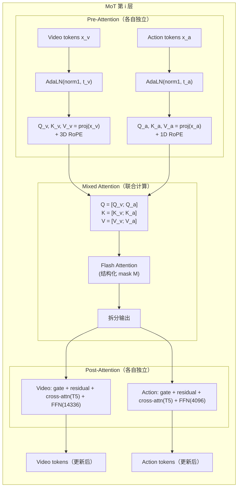
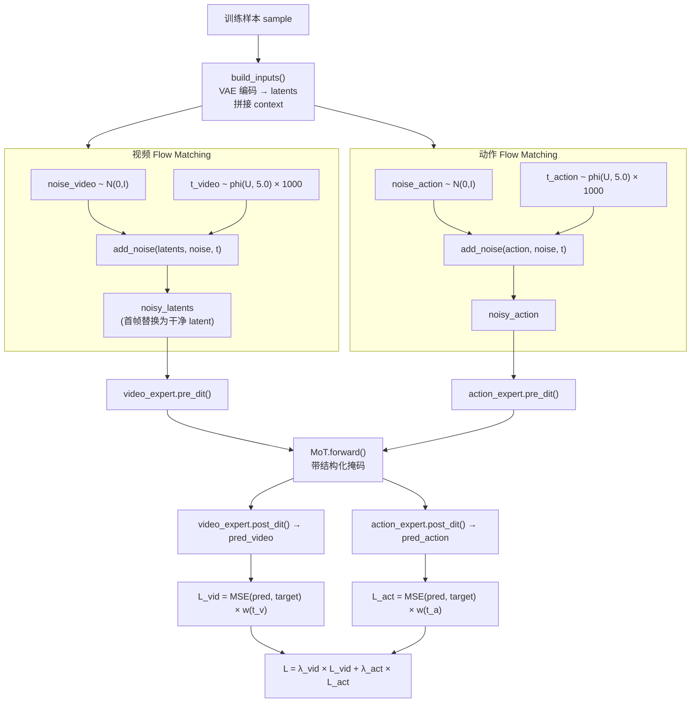
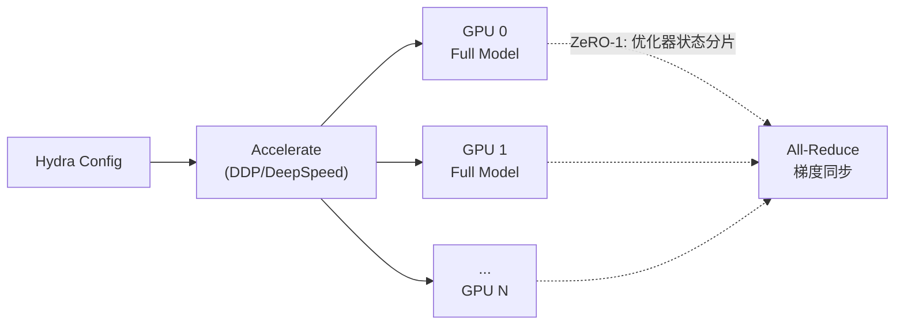
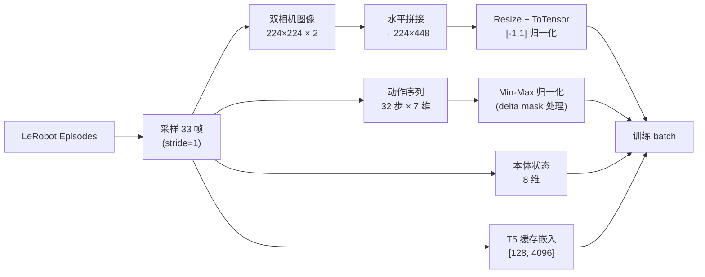
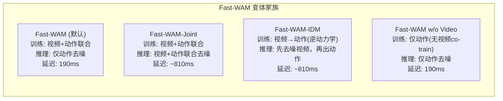

# Fast-WAM 深度技术解读

> **论文**：*Fast World Action Models*（arXiv: [2603.16666](https://arxiv.org/abs/2603.16666)）  
> **作者**：Tianyuan Yuan, Zibin Dong, Yicheng Liu, Hang Zhao  
> **资料**：[项目主页](https://yuantianyuan01.github.io/FastWAM/) | [GitHub](https://github.com/yuantianyuan01/FastWAM) | 本地代码库 `src/fastwam/`  
> **本文定位**：结合论文、官网与本地代码实现，做一次「从直觉到公式到代码」的完整拆解。

---

## 目录

1. [动机与核心命题](#1-动机与核心命题)
2. [背景：从 VLA 到 WAM 再到 Fast-WAM](#2-背景从-vla-到-wam-再到-fast-wam)
3. [架构深度拆解](#3-架构深度拆解)
4. [训练流水线](#4-训练流水线)
5. [推理流水线——"Fast"之所在](#5-推理流水线fast之所在)
6. [变体对照与消融实验](#6-变体对照与消融实验)
7. [实验结果深度解读](#7-实验结果深度解读)
8. [代码导航手册](#8-代码导航手册)
9. [讨论与展望](#9-讨论与展望)
10. [参考文献](#10-参考文献)

---

## 1. 动机与核心命题

### 1.1 一句话总结

> **视频联合训练（video co-training）是 WAM 性能的主要来源；测试时的「未来想象」大多是冗余的。**

这个看似反直觉的结论由 Fast-WAM 通过严格的消融实验验证：在 LIBERO 与 RoboTwin 2.0 两大仿真基准以及真实机器人折叠毛巾任务上，**去掉 video co-training 导致 4-8 分的性能下降**，而去掉测试时的未来视频去噪却几乎不影响结果。

### 1.2 为什么这个问题重要

当前主流世界动作模型（World Action Model, WAM）在推理时需要先用多步扩散去噪出未来视频帧，再据此生成动作序列——即 **"先想象、再执行"（imagine-then-execute）**。这带来两个核心痛点：

| 痛点 | 具体表现 |
|------|----------|
| **延迟高** | 每个控制步需要完整跑一轮视频扩散（30 层 DiT × 20 步去噪），难以满足实时闭环控制的时延要求 |
| **收益不明** | 性能提升到底来自训练时视频联合建模对表征的改善，还是推理时真的需要"看到"未来像素？ |

Fast-WAM 的回答是：训练期继续做视频 co-training（这对学到好的世界表征至关重要），但推理时**只做一次视频骨干的前向传播编码当前观测**，然后专注于动作去噪——达到 **190 ms** 延迟，比 imagine-then-execute 路线快 **4 倍以上**。

### 1.3 核心发现总览

| 对比因素 | RoboTwin 变化 | LIBERO 变化 | 结论 |
|----------|:---:|:---:|------|
| 去掉 video co-training | **-8.0** (91.8 → 83.8) | **-4.1** (97.6 → 93.5) | 训练期视频信号至关重要 |
| 去掉测试期 future imagination | **~0** (与 Joint 变体相当) | **~0** | 推理时不需要显式想象未来 |
| 延迟对比 | 190 ms vs >760 ms | — | 4× 速度提升 |

---

## 2. 背景：从 VLA 到 WAM 再到 Fast-WAM

### 2.1 Vision-Language-Action（VLA）范式

VLA 模型学习的是给定观测和语言指令后的动作条件分布：

\[
p_\theta(a_{1:H} \mid o, \ell)
\]

其中 \(o\) 为当前（或短历史）视觉观测，\(\ell\) 为自然语言任务指令，\(a_{1:H}\) 为长度为 \(H\) 的动作块（action chunk）。

代表工作包括：

- **OpenVLA**（Kim et al., 2024）：基于 VLM 的开源方案，直接将图像-语言理解迁移到动作预测
- **\(\pi_0\) / \(\pi_{0.5}\)**（Physical Intelligence, 2024-2025）：大规模跨体预训练 + flow matching 生成动作序列
- **Octo**（Ghosh et al., 2024）：Transformer 架构的通用机器人策略

VLA 的核心优势在于**语义泛化**——借助大规模图文预训练获得的视觉-语言理解能力。但其预训练数据以**静态图文为主**，对「动作如何改变世界」的显式建模较弱。这正是 WAM 试图解决的问题。

### 2.2 世界动作模型（WAM）范式

WAM 在 VLA 的基础上引入了对未来视觉观测 \(v_{1:T}\) 的显式建模。按照全概率公式：

\[
p(a_{1:H} \mid o, \ell) = \int p(v_{1:T} \mid o, \ell)\, p(a_{1:H} \mid o, \ell, v_{1:T})\, \mathrm{d}v_{1:T}
\]

实际实现中有两种主要路线（对应论文 Figure 1）：



| 范式 | 训练 | 推理 | 延迟 | 代表工作 |
|------|------|------|------|----------|
| Joint WAM | 视频+动作联合 | 视频+动作联合去噪 | 高 | Motus, 部分 LingBot-VA |
| Video-then-Action | 视频+逆动力学 | 先去噪视频，再出动作 | 高 | 部分 LingBot-VA, Genie 系 |
| **Fast-WAM** | 视频+动作联合 | **仅动作去噪** | **低** | 本文 |

### 2.3 Wan2.2 视频基础模型

Fast-WAM 选择 **Wan2.2-TI2V-5B**（Text-Image-to-Video，50 亿参数）作为视频骨干，这是一个基于 Diffusion Transformer（DiT）的大规模视频生成模型。选择它的关键理由：

1. **强大的时空建模能力**：30 层 DiT 块，3072 维隐层，24 头注意力
2. **3D RoPE 位置编码**：对帧、高度、宽度三维空间的精确位置感知
3. **配套 VAE**：高效的时空压缩（时间 4× 下采样，空间 8× 下采样）
4. **T5 文本编码器**：1.3B 参数，4096 维输出，提供丰富的语言条件信号

### 2.4 Flow Matching 简明入门

Fast-WAM 使用 **Continuous Flow Matching** 而非传统的 DDPM/DDIM 扩散框架。核心差异：

| | DDPM/DDIM | Flow Matching |
|---|---|---|
| 前向过程 | 离散马尔可夫链 \(q(x_t \mid x_{t-1})\) | 连续线性插值 \(x_t = (1-t)x_0 + t\epsilon\) |
| 学习目标 | 预测噪声 \(\epsilon_\theta(x_t, t)\) | 预测速度场 \(v_\theta(x_t, t) = \epsilon - x_0\) |
| 采样步数 | 通常需要较多步 | 天然适合少步采样 |
| 训练稳定性 | 需要方差调度 | 路径更直，训练更稳定 |

数学上，Flow Matching 定义概率路径 \(\psi_t(x) = (1-t)x_0 + t\epsilon\)，其中 \(\epsilon \sim \mathcal{N}(0,I)\)、\(t \in [0,1]\)，对应的条件速度场为：

\[
u_t(x \mid x_0) = \epsilon - x_0
\]

训练目标是让网络 \(v_\theta\) 拟合这个速度场：

\[
\mathcal{L}_{\text{FM}} = \mathbb{E}_{x_0, \epsilon, t} \left[ \| v_\theta(\psi_t(x_0), t) - u_t \|^2 \right]
\]

推理时从纯噪声 \(x_1 = \epsilon\) 出发，沿学到的速度场积分回 \(x_0\)：

\[
x_{t-\Delta t} = x_t + v_\theta(x_t, t) \cdot \Delta t
\]

---

## 3. 架构深度拆解

### 3.1 系统总览



**参数量分布**（`fastwam.yaml` + 代码推算）：

| 组件 | 参数量 | 说明 |
|------|--------|------|
| WanVideoDiT | ~5B | 30 层 × (3072² × 4 + 3072 × 14336 × 2) ≈ 5B |
| ActionDiT | ~1B | 30 层 × (1024² × 4 + 1024 × 4096 × 2) ≈ 1B |
| MoT 额外参数 | 0 | MoT 本身无独立参数，复用两个专家的 Q/K/V 投影 |
| Wan VAE | ~数百 M | 视频编解码器 |
| T5 | ~1.3B | 文本编码器（推理时可用预计算缓存替代） |

### 3.2 Video Expert：WanVideoDiT 详解

Video Expert 继承自 Wan2.2-TI2V-5B 的 DiT 架构，是整个系统的"世界模型骨干"。

#### 3.2.1 Patch Embedding——从像素到 token



关键设计决策：
- **时间维不压缩**（patch_size 时间维=1）：保留每一帧的独立表示，便于首帧编码与未来帧分离
- **空间 2×2 压缩**：在 VAE 已做 8× 下采样的基础上再做 2×，总空间压缩达 16×
- **输入通道 48**：Wan VAE 的 latent 通道数（z_dim=48）

对于 LIBERO 的 224×448 输入图像：

\[
\text{VAE 后}: [B, 48, T_\text{latent}, 28, 56] \xrightarrow{\text{Patch}} [B, T_\text{latent} \times 14 \times 28, 3072]
\]

每帧产生 \(14 \times 28 = 392\) 个 token。

#### 3.2.2 DiTBlock 内部结构

每个 DiTBlock 包含三个子模块，通过**自适应层归一化（AdaLN）**实现时间步条件化：



**AdaLN 调制机制**（`mot.py:_split_modulation`）：

\[
\text{modulate}(x, \text{shift}, \text{scale}) = x \cdot (1 + \text{scale}) + \text{shift}
\]

每个 DiTBlock 从时间步嵌入生成 **6 个调制向量**（各维度 \(D\)）：
- \((\text{shift}_\text{msa}, \text{scale}_\text{msa}, \text{gate}_\text{msa})\) 控制自注意力分支
- \((\text{shift}_\text{mlp}, \text{scale}_\text{mlp}, \text{gate}_\text{mlp})\) 控制 FFN 分支

门控残差连接的作用是让网络自适应地决定「这一层该做多少改变」，类似 Highway Network 的思想。

#### 3.2.3 Separated Timestep——首帧的特殊地位

Fast-WAM 的一个关键设计是 **分离时间步嵌入**（`seperated_timestep: true`）：

- **首帧（frame 0）**：始终使用 \(t=0\)（干净），代表"这是真实的当前观测"
- **未来帧（frame 1..T）**：使用采样的扩散时间步 \(t\)，代表"这是加噪的未来"

这在代码中体现为 `wan_video_dit.py` 的 `pre_dit()` 方法中：

```python
token_timesteps = torch.ones((batch_size, x.shape[2], tokens_per_frame))
token_timesteps[:, 0, :] = 0  # 首帧 timestep 永远为 0
```

这个设计的深层原因：首帧是**唯一的真实输入锚点**，其 token 必须获得一个与噪声状态不同的调制信号，才能在注意力中为其他 token 提供可靠的"参考坐标"。

#### 3.2.4 3D RoPE 位置编码

Video DiT 使用三维旋转位置编码（3D Rotary Position Embedding）：

\[
\text{freqs} = \text{concat}\left[\text{RoPE}_{f}(i_f),\; \text{RoPE}_{h}(i_h),\; \text{RoPE}_{w}(i_w)\right]
\]

其中 \((i_f, i_h, i_w)\) 是 token 在帧、高度、宽度三个维度上的坐标。这使得注意力机制能够感知 token 间的 3D 空间-时间关系。

相比之下，Action DiT 使用 **1D RoPE**（按时间步顺序），因为动作序列是纯一维时间序列。

#### 3.2.5 视频注意力掩码模式

`build_video_to_video_mask` 支持三种模式（`wan_video_dit.py`）：

| 模式 | 逻辑 | 适用场景 |
|------|------|----------|
| `bidirectional` | 全连接，无掩码 | 最快，忽略因果性 |
| `per_frame_causal` | 每帧只能看到当前及之前帧 | 严格时间因果 |
| **`first_frame_causal`** | 首帧不看后续帧；后续帧可看所有帧 | **默认**，平衡效率与因果 |

默认的 `first_frame_causal` 的精妙之处在于：

```
         f0   f1   f2   ...   fT
  f0  [  1    0    0   ...    0  ]   ← 首帧只看自己
  f1  [  1    1    1   ...    1  ]   ← 后续帧看全部
  f2  [  1    1    1   ...    1  ]
  ...
  fT  [  1    1    1   ...    1  ]
```

首帧的"信息封锁"防止它被未来噪声 token 污染——这在推理时尤其重要，因为首帧的干净 latent 将直接决定世界表征的质量。

### 3.3 Action Expert：ActionDiT 详解

#### 3.3.1 架构对照

| 参数 | Video DiT | Action DiT | 设计考量 |
|------|:---------:|:----------:|----------|
| hidden_dim | 3072 | **1024** | 动作空间远小于视频空间，无需同等容量 |
| ffn_dim | 14336 | **4096** | 保持约 4× 的 FFN 放大比 |
| num_layers | 30 | **30** | **必须相同**——MoT 逐层混合要求层数对齐 |
| num_heads | 24 | **24** | **必须相同**——混合注意力在 head 维拼接 |
| attn_head_dim | 128 | **128** | **必须相同**——Q/K/V 维度必须匹配才能做联合 attention |
| patch/input | Conv3d, in_dim=48 | **Linear, action_dim→1024** | 动作无需 patch 化 |
| 位置编码 | 3D RoPE | **1D RoPE** | 动作是 1D 时间序列 |

**关键约束**：MoT 要求两个专家的 **层数、头数、head_dim 完全一致**（`mot.py:__init__` 中有显式校验），因为混合注意力在每一层都要拼接 Q/K/V。但 hidden_dim 和 ffn_dim 可以不同——这些是各自独立的线性投影和 FFN。

#### 3.3.2 线性插值初始化

ActionDiT 的初始化策略非常巧妙：不是随机初始化，而是**从 Wan2.2 的 5B DiT 权重通过线性插值得到**（`scripts/preprocess_action_dit_backbone.py`）。

这个过程将 3072-dim 的 Wan DiT 权重"压缩"到 1024-dim，采用 alpha-scaling 插值方案。好处是：

1. **继承预训练知识**：Action DiT 从一开始就具备基本的注意力模式和表示能力
2. **训练更稳定**：避免两个专家初始化差异过大导致的 MoT 不稳定
3. **收敛更快**：只需微调而非从头学习 Transformer 的基本行为

#### 3.3.3 ActionHead

ActionDiT 的输出头（`action_dit.py:ActionHead`）也使用 AdaLN 调制：

\[
\hat{a} = \text{proj}\left(\text{LayerNorm}(x) \cdot (1 + \text{scale}(t)) + \text{shift}(t)\right)
\]

这确保了动作预测也受到时间步条件的调制——在不同去噪阶段，网络关注的信号强度和偏置应当不同。

### 3.4 MoT：Mixture-of-Transformers 核心机制

MoT 是 Fast-WAM 架构创新的核心。它不是简单地把两个独立模型拼在一起，而是在**每一层**进行深度交互。

#### 3.4.1 逐层混合注意力



**核心代码流程**（`mot.py:forward`）：

```
for layer_idx in range(30):
    # 1. 各专家独立计算 Q/K/V（包含各自的 RoPE 和 AdaLN）
    q_v, k_v, v_v = video_expert.blocks[i].qkv(x_v, freqs_v, t_mod_v)
    q_a, k_a, v_a = action_expert.blocks[i].qkv(x_a, freqs_a, t_mod_a)
    
    # 2. 拼接后做一次联合 Flash Attention
    q = [q_v; q_a]  # 序列维拼接
    k = [k_v; k_a]
    v = [v_v; v_a]
    attn_out = flash_attention(q, k, v, mask=M)
    
    # 3. 拆回各专家的 attention 输出
    out_v, out_a = split(attn_out)
    
    # 4. 各自独立的 post-block：门控残差 → cross-attention → FFN
    x_v = post_block_v(out_v, x_v, t5_context)
    x_a = post_block_a(out_a, x_a, t5_context)
```

**为什么 Q/K 的维度可以不同但 head 维度必须相同？**

在混合注意力中，Q 来自查询专家，K/V 来自所有专家。注意力计算为：

\[
\text{Attn}(Q, K, V) = \text{softmax}\left(\frac{QK^\top}{\sqrt{d_\text{head}}}\right) V
\]

这里 \(Q \in \mathbb{R}^{B \times n_\text{heads} \times S_q \times d_\text{head}}\)，\(K \in \mathbb{R}^{B \times n_\text{heads} \times S_k \times d_\text{head}}\)。乘法 \(QK^\top\) 要求 \(d_\text{head}\) 和 \(n_\text{heads}\) 必须匹配，但序列长度 \(S_q, S_k\) 可以不同。而 hidden_dim = \(n_\text{heads} \times d_\text{head}\) 一致保证了这一点。

**但 Video DiT 的 hidden_dim=3072 ≠ Action DiT 的 hidden_dim=1024 呀？**

看似矛盾，实则不然——关键在于 Q/K/V 的投影维度。两个专家的 Q/K/V 投影都输出 \(n_\text{heads} \times d_\text{head} = 24 \times 128 = 3072\) 维。Video DiT 的情况是 \(W_q: 3072 \to 3072\)，Action DiT 是 \(W_q: 1024 \to 3072\)。投影后的维度一致，所以可以拼接做联合注意力。

#### 3.4.2 梯度检查点策略

MoT 的内存占用很大（两个专家的完整 token 序列 + 联合注意力矩阵），因此代码提供了两级梯度检查点：

1. **混合注意力检查点**（`mot_checkpoint_mixed_attn`）：在 `_mixed_attention()` 中对 Flash Attention 做检查点，以时间换空间
2. **专家内检查点**（`use_gradient_checkpointing`）：每个 DiTBlock 内部的 `_apply_post_with_optional_checkpoint()` 可独立开启

### 3.5 结构化注意力掩码——信息流的精确控制

#### 3.5.1 掩码矩阵设计

`_build_mot_attention_mask`（`fastwam.py:386-407`）构建了一个 \((S_v + S_a) \times (S_v + S_a)\) 的布尔矩阵，精确控制信息流向：

```
                  ┌─────────────────────────────────────┐
                  │  Video Tokens (Sv)  │ Action Tokens  │
                  │  f0  │  f1...fT    │     (Sa)       │
    ──────────────┼──────┼─────────────┼────────────────┤
    f0  tokens    │  1   │     0       │      0         │
    ──────────────┼──────┼─────────────┼────────────────┤
    f1...fT       │  1   │     1       │      0         │
    tokens        │      │             │                │
    ──────────────┼──────┼─────────────┼────────────────┤
    Action        │  1   │     0       │      1         │
    tokens        │      │             │                │
    ──────────────┴──────┴─────────────┴────────────────┘
    
    行=Query, 列=Key; 1=可 attend, 0=被 mask
```

**信息流规则详解**：

| Query → Key | 允许？ | 原因 |
|-------------|:------:|------|
| 首帧 → 首帧 | Yes | 首帧内部自由交互 |
| 首帧 → 未来帧 | **No** | 防止首帧被未来噪声污染（核心保护） |
| 首帧 → 动作 | **No** | 首帧不应依赖于正在去噪的动作 |
| 未来帧 → 首帧 | Yes | 未来帧需要以真实观测为锚点 |
| 未来帧 → 未来帧 | Yes | 视频帧之间需要时空一致性 |
| 未来帧 → 动作 | **No** | 视频和动作是平行预测，避免循环依赖 |
| 动作 → 首帧 | Yes | 动作需要以当前观测为条件 |
| 动作 → 未来帧 | **No** | **核心设计**：动作不偷看未来 |
| 动作 → 动作 | Yes | 动作 token 内部双向交互 |

这个掩码设计的精妙之处在于**训练-推理一致性**：推理时根本不创建未来帧 token，动作 token 只能看到首帧——这与训练时的掩码约束完全一致，确保了分布匹配。

#### 3.5.2 代码实现

```python
# fastwam.py:394-407
mask = torch.zeros((total_seq_len, total_seq_len), dtype=torch.bool)
# video → video: 由 first_frame_causal 模式控制
mask[:video_seq_len, :video_seq_len] = self.video_expert.build_video_to_video_mask(...)
# action → action: 全连接
mask[video_seq_len:, video_seq_len:] = True
# action → first-frame video only: 只看首帧
first_frame_tokens = min(video_tokens_per_frame, video_seq_len)
mask[video_seq_len:, :first_frame_tokens] = True
```

### 3.6 VAE、文本编码器与本体感受编码

#### 3.6.1 Wan VAE

Wan VAE 完成图像/视频与 latent 空间的双向映射：

| 维度 | 下采样因子 | 说明 |
|------|:---------:|------|
| 时间 | 4× | `temporal_downsample_factor`，33 帧 → 9 个 latent 帧（\((33-1)/4+1=9\)） |
| 空间 | 8× | `upsampling_factor`，224×448 → 28×56 |
| 通道 | 3→48 | `z_dim=48` |

编码：`_encode_video_latents()` 和 `_encode_input_image_latents_tensor()`  
解码：`_decode_latents()` → clip 到 [-1,1] → 映射到 [0,255] → PIL Image

#### 3.6.2 T5 文本编码器与缓存

训练时为了避免每个 batch 都重新编码文本（同一任务的指令不变），系统支持**预计算缓存**：

```bash
python scripts/precompute_text_embeds.py  # 提前缓存 T5 输出
```

缓存后 `context` 和 `context_mask` 直接从磁盘加载，输出维度 \([B, L, 4096]\)，\(L\) 由 `tokenizer_max_len=128` 控制。

推理时可以通过 `encode_prompt()` 在线编码，也可使用缓存。

#### 3.6.3 本体感受编码（Proprioception）

FastWAM 支持将机器人本体状态（如末端执行器位姿+夹爪状态）编码为额外的条件 token：

\[
\text{context}_\text{new} = [\text{context}_\text{T5};\; \text{Linear}(\text{proprio})]
\]

通过 `_append_proprio_to_context()`（`fastwam.py:219-240`），本体感受向量经线性投影到 4096 维后拼接到 T5 context 序列末尾，作为额外的 cross-attention key。

---

## 4. 训练流水线

### 4.1 Flow Matching 训练目标详解

#### 4.1.1 前向加噪与训练目标

Fast-WAM 使用 `WanContinuousFlowMatchScheduler`（`scheduler_continuous.py`）实现连续流匹配。

**前向过程**（`add_noise`）：

\[
y_t = (1 - \sigma) \cdot y_0 + \sigma \cdot \epsilon, \quad \sigma = \frac{t}{T_\text{train}}, \quad \epsilon \sim \mathcal{N}(0, I)
\]

**训练目标**（`training_target`）：

\[
\text{target} = \epsilon - y_0
\]

这对应 flow matching 中的条件速度场——网络需要学会将噪声样本"拉向"干净数据的方向。

#### 4.1.2 Shift-based 时间步采样

标准均匀采样 \(u \sim \text{Uniform}(0,1)\) 会导致大量采样落在扩散过程的"平坦区"（极小或极大噪声），浪费训练信号。Wan2.2 使用**shift-based** 采样重分布时间步：

\[
\phi(u, s) = \frac{s \cdot u}{1 + (s-1) \cdot u}
\]

\[
t = \phi(u, s) \cdot T_\text{train}
\]

其中 shift \(s = 5.0\)（默认）。这个变换的效果：

- \(s > 1\) 时，\(\phi(u,s) > u\) 对大部分 \(u\)，即**偏向高噪声区间采样**
- 高噪声区间通常包含更强的训练信号（从几乎纯噪声中"识别"数据结构）
- Shift 越大，采样越集中于高噪声端

#### 4.1.3 训练权重函数

即使 shift 重分布了采样密度，不同时间步的损失梯度幅度仍然差异很大。因此引入**高斯型权重**：

\[
w(t) = \exp\left(-2 \left(\frac{t - T/2}{T}\right)^2\right)
\]

经过最小值平移和归一化后应用：

\[
\tilde{w}(t) = \frac{w(t) - w_\text{min}}{C}
\]

这个权重在 \(t = T/2\) 处最大——中等噪声水平通常包含最具区分度的训练信号，既不是"几乎纯噪声"（信号被淹没），也不是"几乎干净"（预测过于简单）。

### 4.2 联合训练损失

#### 4.2.1 完整的 training_loss 流程

`fastwam.py:training_loss()`（行 448-568）是训练的核心：



**关键实现细节**：

1. **独立采样时间步**：视频和动作的噪声 \(\epsilon\) 和时间步 \(t\) 是**独立采样**的，这增加了训练的多样性
2. **首帧保护**：`latents[:, :, 0:1] = first_frame_latents` 确保首帧始终干净
3. **Padding 处理**：对不等长的动作/视频序列，通过 `action_is_pad` 和 `image_is_pad` 掩码排除 padding 区域的损失贡献

#### 4.2.2 损失加权

\[
\mathcal{L}_\text{total} = \lambda_\text{vid} \cdot \mathcal{L}_\text{vid} + \lambda_\text{act} \cdot \mathcal{L}_\text{act}
\]

默认 \(\lambda_\text{vid} = 1.0,\; \lambda_\text{act} = 1.0\)（`fastwam.yaml:loss.lambda_action`）。

各分量的计算：

\[
\mathcal{L}_\text{vid} = \frac{1}{B} \sum_{i=1}^{B} \tilde{w}(t_i^v) \cdot \frac{1}{|\mathcal{V}_i|} \sum_{j \in \mathcal{V}_i} \| \hat{v}_j - (\epsilon_j^v - v_j) \|^2
\]

\[
\mathcal{L}_\text{act} = \frac{1}{B} \sum_{i=1}^{B} \tilde{w}(t_i^a) \cdot \frac{1}{|\mathcal{A}_i|} \sum_{k \in \mathcal{A}_i} \| \hat{a}_k - (\epsilon_k^a - a_k) \|^2
\]

其中 \(\mathcal{V}_i\) 和 \(\mathcal{A}_i\) 是第 \(i\) 个样本的非 padding 位置集合。

### 4.3 训练基础设施

#### 4.3.1 分布式训练架构



| 配置项 | LIBERO | RoboTwin | 说明 |
|--------|:------:|:--------:|------|
| GPU 数 | 8 | 64 | 单节点 vs 多节点 |
| Batch size/GPU | 16 | ~2 | 总 batch = BS × GPU |
| ZeRO Stage | 1 | 1 | 只分片优化器状态 |
| 混合精度 | bf16 | bf16 | bfloat16 训练 |
| 梯度裁剪 | 1.0 | 1.0 | max_grad_norm |

#### 4.3.2 优化器与学习率

- **优化器**：AdamW（`weight_decay=1e-2`）
- **学习率调度**：Cosine Annealing + 5% 线性 Warmup

\[
\eta(t) = \begin{cases}
\eta_\text{max} \cdot \frac{t}{T_\text{warmup}} & t < T_\text{warmup} \\
\eta_\text{min} + \frac{\eta_\text{max} - \eta_\text{min}}{2}\left(1 + \cos\frac{\pi(t - T_\text{warmup})}{T - T_\text{warmup}}\right) & t \geq T_\text{warmup}
\end{cases}
\]

其中 \(\eta_\text{max} = 10^{-4}\)，\(T_\text{warmup} = 0.05 \times T\)。

#### 4.3.3 冻结策略与可训练参数

检查点只保存 MoT 的权重（`save_checkpoint` 在 `fastwam.py:1088-1098`），这意味着：

- **可训练**：MoT 的所有参数（包含 Video DiT 和 Action DiT 的 DiTBlock 权重 + 各自的 text/time embedding + head）
- **冻结**：VAE（预训练权重不动）、T5 text encoder（使用预计算缓存时甚至不加载）

### 4.4 数据流水线

#### 4.4.1 RobotVideoDataset

`robot_video_dataset.py` 负责将 LeRobot 格式的数据集转化为训练所需的张量：



**关键配置**（`configs/data/libero_2cam.yaml`）：

| 参数 | 值 | 说明 |
|------|-----|------|
| `num_frames` | 33 | 1 首帧 + 32 后续帧 |
| `action_video_freq_ratio` | 4 | 动作频率 = 4× 视频帧率 |
| `video_size` | [224, 448] | 拼接后尺寸 |
| `action_output_dim` | 7 | 6D 末端位姿变化 + 1D 夹爪 |
| `proprio_output_dim` | 8 | 6D 位姿 + 2D 夹爪状态 |

**Delta Action Mask**：`delta_action_dim_mask: [true,true,true,true,true,true,false]` 表明前 6 维（末端位姿）是增量动作，第 7 维（夹爪）是绝对值。

---

## 5. 推理流水线——"Fast"之所在

### 5.1 核心洞察

Fast-WAM 推理快的根本原因在于**将视频骨干从迭代去噪循环中解耦**：

| 推理模式 | 视频骨干调用次数 | 每步计算量 | 总 FLOPs |
|----------|:----------------:|:----------:|:--------:|
| Joint WAM | \(N\) 次（每去噪步都要） | \(O(S_v^2 + S_a^2 + S_v \cdot S_a)\) | \(N \times O_\text{joint}\) |
| **Fast-WAM** | **1 次**（prefill） | \(O(S_a \cdot (S_{f_0} + S_a))\) | \(O_\text{prefill} + N \times O_\text{action}\) |

由于 \(S_v \gg S_a\)（视频 token 数远大于动作 token 数）且 \(O_\text{prefill}\) 只做一次，总计算量大幅降低。

### 5.2 infer_action() 详细拆解

`infer_action()`（`fastwam.py:906-1048`）是 Fast-WAM 的默认推理入口。

```mermaid
sequenceDiagram
    participant User as 调用方
    participant FastWAM as FastWAM
    participant VAE as Wan VAE
    participant VE as Video Expert
    participant MoT as MoT
    participant AE as Action Expert
    participant Sched as Flow Scheduler
    
    User->>FastWAM: infer_action(image, prompt, action_horizon=32)
    
    Note over FastWAM: === Phase 1: 编码当前观测 ===
    FastWAM->>VAE: encode(image)
    VAE-->>FastWAM: first_frame_latents [1, 48, 1, H/8, W/8]
    
    Note over FastWAM: === Phase 2: 视频骨干 Prefill ===
    FastWAM->>VE: pre_dit(first_frame_latents, timestep=0)
    VE-->>FastWAM: video_pre {tokens, freqs, t_mod, context}
    
    FastWAM->>FastWAM: _build_mot_attention_mask()
    
    FastWAM->>MoT: prefill_video_cache(video_tokens, ...)
    
    loop 30 层
        MoT->>MoT: build Q_v, K_v, V_v
        MoT->>MoT: self-attention (video-only mask)
        MoT->>MoT: cross-attn + FFN
        MoT->>MoT: cache {K_v, V_v} for this layer
    end
    MoT-->>FastWAM: video_kv_cache [30 × {K, V}]
    
    Note over FastWAM: === Phase 3: 动作去噪循环 ===
    FastWAM->>FastWAM: latents_action ~ N(0,I) [1, 32, 7]
    FastWAM->>Sched: build_inference_schedule(steps=20)
    Sched-->>FastWAM: timesteps, deltas
    
    loop 20 步去噪
        FastWAM->>AE: pre_dit(latents_action, timestep_i)
        AE-->>FastWAM: action_pre {tokens, freqs, t_mod}
        
        FastWAM->>MoT: forward_action_with_video_cache(action_tokens, kv_cache)
        Note over MoT: K = [K_v_cached; K_a_new]<br/>V = [V_v_cached; V_a_new]<br/>只有 action Q 参与计算
        MoT-->>FastWAM: updated action tokens
        
        FastWAM->>AE: post_dit(tokens) → pred_action_noise
        FastWAM->>Sched: step(pred, delta, latents)
        Sched-->>FastWAM: updated latents_action
    end
    
    FastWAM-->>User: {action: [32, 7]}
```

**关键步骤详解**：

**Step 1: VAE 编码**——将当前观测图像编码为 latent：
```python
first_frame_latents = self._encode_input_image_latents_tensor(input_image)
# [1, 48, 1, H/8, W/8]
```

**Step 2: Prefill**——视频骨干对首帧做一次前向，缓存每层的 K/V：
```python
timestep_video = torch.zeros(...)  # 关键：timestep=0 表示干净输入
video_pre = self.video_expert.pre_dit(x=first_frame_latents, timestep=0, ...)
video_kv_cache = self.mot.prefill_video_cache(video_tokens=video_pre["tokens"], ...)
```

这一步是**确定性的**（不涉及采样或去噪），对同一输入图像只需做一次。

**Step 3: 动作去噪**——使用缓存的 K/V，只迭代更新动作 token：
```python
for step_t, step_delta in zip(timesteps, deltas):
    pred_action = self._predict_action_noise_with_cache(
        latents_action, timestep_action, context, context_mask,
        video_kv_cache, attention_mask, video_seq_len
    )
    latents_action = self.infer_action_scheduler.step(pred_action, step_delta, latents_action)
```

每步的 `forward_action_with_video_cache`（`mot.py:343-445`）做的事情：

\[
K = [K_v^\text{cached};\; K_a^\text{new}], \quad V = [V_v^\text{cached};\; V_a^\text{new}]
\]

\[
\text{attn\_out} = \text{FlashAttn}(Q_a, K, V, \text{mask}=M_{\text{action rows}})
\]

注意：**只有 action 的 Q 参与计算**——video 的 Q 不需要了，因为我们不更新 video tokens。这进一步减少了计算量。

### 5.3 与 infer_joint() 的对比

`infer_joint()`（`fastwam.py:726-903`）是完整的联合去噪推理：

```mermaid
flowchart TB
  subgraph Joint ["infer_joint: 每步都要"]
    J1["video_expert.pre_dit(noisy_video)"] --> J2["action_expert.pre_dit(noisy_action)"]
    J2 --> J3["MoT.forward(video+action)"]
    J3 --> J4["post_dit → pred_video, pred_action"]
    J4 --> J5["scheduler.step → update video + action"]
    J5 -->|"重复 N 步"| J1
  end
  
  subgraph Fast ["infer_action: 首帧 prefill 一次"]
    F1["video_expert.pre_dit(clean_frame)"] --> F2["MoT.prefill → cache K/V"]
    F2 --> F3["action_expert.pre_dit(noisy_action)"]
    F3 --> F4["MoT.forward_with_cache(action_only)"]
    F4 --> F5["post_dit → pred_action"]
    F5 --> F6["scheduler.step → update action"]
    F6 -->|"重复 N 步"| F3
  end
```



关键差异：
1. Joint 模式每步都要完整跑 Video DiT（5B 参数！），Fast-WAM 只跑一次
2. Joint 模式的注意力矩阵是完整的 \((S_v + S_a)^2\)，Fast-WAM 每步只有 \(S_a \times (S_{f_0} + S_a)\)
3. Joint 模式额外产出未来视频帧（可用于可视化但不影响动作质量）

有趣的是，`infer_joint()` 默认会同时调用 `infer_action()` 并对比两者的动作输出（`test_action_with_infer_action=True`），用于验证一致性——如果差异过大会发出警告。

### 5.4 计算复杂度分析

设 \(L\) 为 Transformer 层数，\(S_v\) 为视频 token 总数，\(S_{f_0}\) 为首帧 token 数，\(S_a\) 为动作 token 数，\(N\) 为去噪步数。

**Joint 推理**每步的注意力计算量（忽略 FFN 等）：

\[
\text{Cost}_\text{joint/step} = L \cdot O\left((S_v + S_a)^2 \cdot d_\text{head}\right)
\]

总计：\(N \cdot \text{Cost}_\text{joint/step}\)。

**Fast-WAM 推理**分两部分：

\[
\text{Cost}_\text{prefill} = L \cdot O\left(S_{f_0}^2 \cdot d_\text{head}\right)
\]

\[
\text{Cost}_\text{action/step} = L \cdot O\left(S_a \cdot (S_{f_0} + S_a) \cdot d_\text{head}\right)
\]

总计：\(\text{Cost}_\text{prefill} + N \cdot \text{Cost}_\text{action/step}\)。

以 LIBERO 的具体数值（224×448，33帧）估算：

| | Joint | Fast-WAM |
|---|---|---|
| \(S_v\) | ~3500 (9帧×392/帧) | — |
| \(S_{f_0}\) | — | 392 (1帧) |
| \(S_a\) | 32 | 32 |
| 每步注意力规模 | ~\((3532)^2 \approx 12.5M\) | ~\(32 \times 424 \approx 13.6K\) |
| **速度比** | 1× | ~**900×**（注意力部分） |

实际端到端速度比约 4× 而非 900×，因为 VAE 编码、T5 编码、FFN、cross-attention 等也占用大量时间。但注意力部分的压倒性优势使得 Fast-WAM 达到了 **190 ms** 的实时延迟。

---

## 6. 变体对照与消融实验

论文设计了一组精心控制的变体来隔离不同因素的贡献：

### 6.1 变体定义



| 变体 | 训练时视频损失 | 推理时生成视频 | 训练-推理结构 | 目的 |
|------|:---:|:---:|------|------|
| **Fast-WAM** | Yes | No | 联合训练 + 直接推理 | 验证核心命题 |
| Fast-WAM-Joint | Yes | Yes | 联合训练 + 联合推理 | 对照：增加推理开销能否提升？ |
| Fast-WAM-IDM | Yes | Yes | 联合训练 + 先视频后动作 | 对照：逆动力学路线的价值 |
| w/o Video | No | No | 纯动作训练 + 直接推理 | 消融：去掉 video co-training |

### 6.2 消融分析框架

这四个变体允许进行如下因子分解：

1. **Video co-training 效果** = Fast-WAM vs w/o Video（固定推理方式，切换训练目标）
2. **Test-time imagination 效果** = Fast-WAM vs Fast-WAM-Joint（固定训练方式，切换推理结构）
3. **IDM vs Direct 路线** = Fast-WAM-IDM vs Fast-WAM-Joint（两种 imagine-then-execute 风格）

---

## 7. 实验结果深度解读

### 7.1 RoboTwin 2.0 基准

RoboTwin 2.0 是一个包含多种双臂机器人操作任务的仿真基准，有 Clean（标准环境）和 Random（随机化环境）两种评测条件。

| 方法 | Embodied PT | Clean | Random | **Average** |
|------|:---:|:---:|:---:|:---:|
| \(\pi_0\) | Yes | — | — | 62.2 |
| \(\pi_{0.5}\) | Yes | — | — | 79.8 |
| Motus (无 PT) | No | 77.56 | 77.00 | 77.3 |
| Motus (有 PT) | Yes | — | — | 87.8 |
| LingBot-VA (无 PT) | No | 80.60 | — | 80.6 |
| LingBot-VA (有 PT) | Yes | — | — | **92.2** |
| **Fast-WAM** | **No** | **91.88** | **91.78** | **91.8** |
| Fast-WAM w/o Video | No | 82.76 | 84.80 | 83.8 |

**深度解读**：

1. **Fast-WAM 在无 embodied 预训练条件下达到 91.8，接近 LingBot-VA 有预训练的 92.2**——这说明 video co-training 可以在很大程度上替代昂贵的跨体预训练数据
2. **去掉 video co-training 掉 8.0 分**——从 91.8 到 83.8，这是最强的消融证据
3. **Clean 和 Random 差异极小**（91.88 vs 91.78）——说明 Fast-WAM 学到了鲁棒的表征

### 7.2 LIBERO 基准

LIBERO 包含 4 个子套件，测试不同层面的泛化能力：

| 方法 | Embodied PT | Spatial | Object | Goal | Long | **Average** |
|------|:---:|:---:|:---:|:---:|:---:|:---:|
| OpenVLA | Yes | — | — | — | — | 76.5 |
| \(\pi_0\) | Yes | — | — | — | — | 94.1 |
| \(\pi_{0.5}\) | Yes | — | — | — | — | 96.9 |
| Motus (有 PT) | Yes | — | — | — | — | 97.7 |
| LingBot-VA (有 PT) | Yes | — | — | — | — | 98.5 |
| **Fast-WAM** | **No** | **98.2** | **100.0** | **97.0** | **95.2** | **97.6** |
| Fast-WAM w/o Video | No | 89.2 | 99.2 | 95.4 | 90.0 | 93.5 |

**深度解读**：

1. **Object 套件满分 100.0**——物体操作是视频预训练最擅长的领域
2. **Long 套件相对较低（95.2）但仍优秀**——长程任务需要更强的时间推理，video co-training 帮助最大（去掉后 95.2 → 90.0，跌 5.2 分）
3. **无预训练的 97.6 与有预训练的 Motus 97.7 几乎相当**——再次证明 video co-training 可替代 embodied 预训练

### 7.3 真实机器人：Galaxea R1 Lite 折叠毛巾

论文在真实的 Galaxea R1 Lite 双臂机器人上验证了折叠毛巾任务。这是一个**可变形物体操作**任务，特别适合测试世界模型的价值——因为布料的物理行为难以用简单规则描述。

| 变体 | 成功率 | 延迟 |
|------|:------:|:----:|
| Fast-WAM | 高 | 190 ms |
| Fast-WAM-IDM | 较高 | 810 ms |
| w/o Video | 显著下降 | 190 ms |

关键发现：去掉 video co-training 在真机上的退化**比仿真中更严重**——真实世界中布料的复杂动态更依赖于训练期获得的物理先验。

### 7.4 延迟分析

| 方法 | 推理架构 | 延迟 | 相对 Fast-WAM |
|------|----------|:----:|:---:|
| **Fast-WAM** | Prefill + Action-only | **190 ms** | 1× |
| Fast-WAM-IDM | Full video → IDM | ~810 ms | ~4.3× |
| Imagine-then-execute WAMs | Full joint denoising | >760 ms | >4× |

190 ms 意味着可以达到 **~5 Hz** 的控制频率，对于许多操作任务已经足够实时。

---

## 8. 代码导航手册

### 8.1 核心文件索引

| 文件 | 主要类/函数 | 职责 |
|------|-------------|------|
| `src/fastwam/models/wan22/fastwam.py` | `FastWAM` | 顶层模型：训练损失、推理入口、掩码构建 |
| `src/fastwam/models/wan22/mot.py` | `MoT` | 混合注意力：`forward()`, `prefill_video_cache()`, `forward_action_with_video_cache()` |
| `src/fastwam/models/wan22/action_dit.py` | `ActionDiT`, `ActionHead` | 动作专家：编码器 + 30 层 DiT + 输出头 |
| `src/fastwam/models/wan22/wan_video_dit.py` | `WanVideoDiT`, `DiTBlock` | 视频专家：patch 化 + 30 层 DiT + 掩码 |
| `src/fastwam/models/wan22/schedulers/scheduler_continuous.py` | `WanContinuousFlowMatchScheduler` | Flow matching 调度器 |
| `src/fastwam/trainer.py` | `Wan22Trainer` | 训练循环：DDP、优化器、评测、检查点 |
| `src/fastwam/runtime.py` | `create_fastwam()`, `run_training()` | 工厂函数、训练入口 |
| `src/fastwam/datasets/lerobot/robot_video_dataset.py` | `RobotVideoDataset` | 数据集：多相机、多格式 |
| `scripts/train.py` | `main()` | Hydra 训练脚本入口 |
| `scripts/preprocess_action_dit_backbone.py` | — | ActionDiT 权重插值预处理 |
| `scripts/precompute_text_embeds.py` | — | T5 嵌入缓存生成 |

### 8.2 配置体系

```
configs/
├── train.yaml              # 基础训练参数（LR、batch size 等）
├── model/
│   ├── fastwam.yaml         # Fast-WAM 模型配置（DiT 参数、调度器等）
│   ├── fastwam_joint.yaml   # Joint 变体配置
│   └── fastwam_idm.yaml     # IDM 变体配置
├── data/
│   ├── libero_2cam.yaml     # LIBERO 数据配置
│   └── robotwin.yaml        # RoboTwin 数据配置
└── task/
    ├── libero_uncond_2cam224_1e-4.yaml   # LIBERO 训练任务
    └── robotwin_uncond_3cam_384_1e-4.yaml # RoboTwin 训练任务
```

Hydra 的配置组合机制：`task` 文件通过 `defaults` 选择 `data` 和 `model`，并可覆盖基础参数。

### 8.3 快速上手命令

```bash
# 1. 环境安装
conda create -n fastwam python=3.10
pip install torch==2.7.1+cu128 torchvision==0.22.1+cu128
pip install -e .

# 2. 准备 ActionDiT 预训练权重
python scripts/preprocess_action_dit_backbone.py \
  --model-config configs/model/fastwam.yaml \
  --output checkpoints/ActionDiT_linear_interp_Wan22_alphascale_1024hdim.pt

# 3. 预计算文本嵌入
python scripts/precompute_text_embeds.py

# 4. 训练（8 GPU，DeepSpeed ZeRO-1）
bash scripts/train_zero1.sh  # 内部调用 accelerate launch scripts/train.py

# 5. 评测（LIBERO）
python experiments/libero/run_libero_manager.py
```

### 8.4 关键方法速查

| 我想了解… | 看这里 |
|-----------|--------|
| 训练一个 batch 的完整流程 | `fastwam.py:training_loss()` (L448-568) |
| 推理时如何快速出动作 | `fastwam.py:infer_action()` (L906-1048) |
| MoT 逐层混合注意力怎么做 | `mot.py:forward()` (L447-530) |
| 视频 K/V 缓存如何产生 | `mot.py:prefill_video_cache()` (L257-341) |
| 动作如何利用缓存 | `mot.py:forward_action_with_video_cache()` (L343-445) |
| 注意力掩码的规则 | `fastwam.py:_build_mot_attention_mask()` (L386-407) |
| Flow matching 如何加噪/去噪 | `scheduler_continuous.py:add_noise()` / `step()` |
| 训练时间步如何采样 | `scheduler_continuous.py:sample_training_t()` (L31-37) |
| ActionDiT 从 Wan 如何初始化 | `action_dit.py:from_pretrained()` (L112+) |

---

## 9. 讨论与展望

### 9.1 为什么 Video Co-training 有效

Fast-WAM 的核心发现可以用**表征学习**的视角来理解：

1. **多任务学习效应**：视频预测任务迫使 DiT 学习「动作如何改变世界状态」的因果模型，这些表征对动作预测也有价值
2. **数据增强效应**：视频信号提供了远多于动作标签的监督信息（每帧每像素 vs 每步 7 维动作），有效对抗过拟合
3. **物理先验注入**：Wan2.2 在海量互联网视频上预训练，已经编码了丰富的物理常识——通过 video co-training，这些知识被"蒸馏"到联合表征空间中

**类比**：这类似于 NLP 中的辅助语言建模目标——即使我们最终只关心分类任务，联合训练一个语言模型头也能显著改善分类性能（因为改善了底层表征）。

### 9.2 与相关工作的深层对比

| 维度 | Fast-WAM | Motus | LingBot-VA | \(\pi_0\) |
|------|----------|-------|------------|-----------|
| 世界模型 | Wan2.2 5B | Wan 系列 | Wan 系列 | 自研 |
| Embodied PT | 不需要 | 可选 | 可选 | 需要 |
| 推理结构 | Direct policy | Joint | Video-then-action | Direct policy |
| 核心创新 | MoT + KV Cache | 联合扩散 | 逆动力学 | 大规模预训练 |
| 延迟 | 190 ms | >760 ms | >760 ms | — |

### 9.3 局限与开放问题

1. **长程推理**：当前的 prefill-then-denoise 方案假设首帧编码足以支撑整个动作 chunk 的预测。对于非常长的操作序列，可能需要周期性地重新编码新的观测
2. **多轮 re-planning**：实际部署中机器人会不断获取新的观测并重新规划——Fast-WAM 的 prefill 步骤是否可以增量更新而非完全重做？
3. **视频生成的诊断价值**：虽然推理时不需要生成视频，但 `infer_joint()` 生成的视频可以用于人类监督和调试——这种"按需想象"的能力是否值得保留？
4. **跨体泛化**：当前结果在单一机器人体上验证。能否利用 video co-training 的表征优势实现跨体迁移？

### 9.4 更广泛的启示

Fast-WAM 的核心结论——**「训练时的辅助目标比推理时的复杂结构更重要」**——与深度学习的多个领域形成呼应：

- **BERT vs GPT 的争论**：预训练时的掩码语言建模目标与推理时的自回归生成可以解耦
- **知识蒸馏**：teacher 模型的知识可以通过训练信号迁移给更小的 student，推理时不需要 teacher
- **数据增强理论**：训练时引入额外信号（如 CutMix、MixUp）即使在推理时不使用也能提升性能

Fast-WAM 本质上是这种理念在**具身智能**领域的一次成功验证：世界模型的价值在于训练时的**表征塑造**，而非推理时的**像素生成**。

---

## 10. 参考文献

1. Yuan, T., Dong, Z., Liu, Y., & Zhao, H. (2025). *Fast World Action Models*. arXiv:2603.16666.
2. Wan-AI. (2025). *Wan2.2: Open-source Large Video Generation Models*. GitHub.
3. Kim, M. J. et al. (2024). *OpenVLA: An Open-Source Vision-Language-Action Model*. CoRL 2024.
4. Physical Intelligence. (2024). *\(\pi_0\): A Vision-Language-Action Flow Model for General Robot Control*. arXiv:2410.24164.
5. Physical Intelligence. (2025). *\(\pi_{0.5}\): a Vision-Language-Action Model with Open-World Generalization*. arXiv:2504.16054.
6. Lipman, Y. et al. (2023). *Flow Matching for Generative Modeling*. ICLR 2023.
7. Peebles, W. & Xie, S. (2023). *Scalable Diffusion Models with Transformers*. ICCV 2023.
8. Su, J. et al. (2024). *RoFormer: Enhanced Transformer with Rotary Position Embedding*. Neurocomputing.
