# Fast-WAM 深度技术解读

> **论文**：*Fast World Action Models*（arXiv: [2603.16666](https://arxiv.org/abs/2603.16666)）  
> **作者**：Tianyuan Yuan, Zibin Dong, Yicheng Liu, Hang Zhao  
> **资料**：[项目主页](https://yuantianyuan01.github.io/FastWAM/) | [GitHub](https://github.com/yuantianyuan01/FastWAM) | 本地代码库 `src/fastwam/`  
> **本文定位**：结合论文、官网与本地代码实现，做一次「从直觉到公式到代码」的完整拆解。

---

## 目录

1. [动机与核心命题](#1-动机与核心命题)
2. [背景：从 VLA 到 WAM 再到 Fast-WAM](#2-背景从-vla-到-wam-再到-fast-wam)
3. [架构深度拆解](#3-架构深度拆解)
4. [训练流水线](#4-训练流水线)
5. [推理流水线——"Fast"之所在](#5-推理流水线fast之所在)
6. [变体对照与消融实验](#6-变体对照与消融实验)
7. [实验结果深度解读](#7-实验结果深度解读)
8. [代码导航手册](#8-代码导航手册)
9. [讨论与展望](#9-讨论与展望)
10. [参考文献](#10-参考文献)

---

## 1. 动机与核心命题

### 1.1 一句话总结

> **视频联合训练（video co-training）是 WAM 性能的主要来源；测试时的「未来想象」大多是冗余的。**

这个看似反直觉的结论由 Fast-WAM 通过严格的消融实验验证：在 LIBERO 与 RoboTwin 2.0 两大仿真基准以及真实机器人折叠毛巾任务上，**去掉 video co-training 导致 4-8 分的性能下降**，而去掉测试时的未来视频去噪却几乎不影响结果。

### 1.2 为什么这个问题重要

当前主流世界动作模型（World Action Model, WAM）在推理时需要先用多步扩散去噪出未来视频帧，再据此生成动作序列——即 **"先想象、再执行"（imagine-then-execute）**。这带来两个核心痛点：

| 痛点 | 具体表现 |
|------|----------|
| **延迟高** | 每个控制步需要完整跑一轮视频扩散（30 层 DiT × 20 步去噪），难以满足实时闭环控制的时延要求 |
| **收益不明** | 性能提升到底来自训练时视频联合建模对表征的改善，还是推理时真的需要"看到"未来像素？ |

Fast-WAM 的回答是：训练期继续做视频 co-training（这对学到好的世界表征至关重要），但推理时**只做一次视频骨干的前向传播编码当前观测**，然后专注于动作去噪——达到 **190 ms** 延迟，比 imagine-then-execute 路线快 **4 倍以上**。

### 1.3 核心发现总览

| 对比因素 | RoboTwin 变化 | LIBERO 变化 | 结论 |
|----------|:---:|:---:|------|
| 去掉 video co-training | **-8.0** (91.8 → 83.8) | **-4.1** (97.6 → 93.5) | 训练期视频信号至关重要 |
| 去掉测试期 future imagination | **~0** (与 Joint 变体相当) | **~0** | 推理时不需要显式想象未来 |
| 延迟对比 | 190 ms vs >760 ms | — | 4× 速度提升 |

---

## 2. 背景：从 VLA 到 WAM 再到 Fast-WAM

### 2.1 Vision-Language-Action（VLA）范式

VLA 模型学习的是给定观测和语言指令后的动作条件分布：

\[
p_\theta(a_{1:H} \mid o, \ell)
\]

其中 \(o\) 为当前（或短历史）视觉观测，\(\ell\) 为自然语言任务指令，\(a_{1:H}\) 为长度为 \(H\) 的动作块（action chunk）。

代表工作包括：

- **OpenVLA**（Kim et al., 2024）：基于 VLM 的开源方案，直接将图像-语言理解迁移到动作预测
- **\(\pi_0\) / \(\pi_{0.5}\)**（Physical Intelligence, 2024-2025）：大规模跨体预训练 + flow matching 生成动作序列
- **Octo**（Ghosh et al., 2024）：Transformer 架构的通用机器人策略

VLA 的核心优势在于**语义泛化**——借助大规模图文预训练获得的视觉-语言理解能力。但其预训练数据以**静态图文为主**，对「动作如何改变世界」的显式建模较弱。这正是 WAM 试图解决的问题。

### 2.2 世界动作模型（WAM）范式

WAM 在 VLA 的基础上引入了对未来视觉观测 \(v_{1:T}\) 的显式建模。按照全概率公式：

\[
p(a_{1:H} \mid o, \ell) = \int p(v_{1:T} \mid o, \ell)\, p(a_{1:H} \mid o, \ell, v_{1:T})\, \mathrm{d}v_{1:T}
\]

实际实现中有两种主要路线（对应论文 Figure 1）：

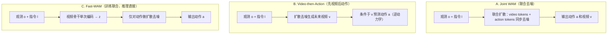

| 范式 | 训练 | 推理 | 延迟 | 代表工作 |
|------|------|------|------|----------|
| Joint WAM | 视频+动作联合 | 视频+动作联合去噪 | 高 | Motus, 部分 LingBot-VA |
| Video-then-Action | 视频+逆动力学 | 先去噪视频，再出动作 | 高 | 部分 LingBot-VA, Genie 系 |
| **Fast-WAM** | 视频+动作联合 | **仅动作去噪** | **低** | 本文 |

### 2.3 Wan2.2 视频基础模型

Fast-WAM 选择 **Wan2.2-TI2V-5B**（Text-Image-to-Video，50 亿参数）作为视频骨干，这是一个基于 Diffusion Transformer（DiT）的大规模视频生成模型。选择它的关键理由：

1. **强大的时空建模能力**：30 层 DiT 块，3072 维隐层，24 头注意力
2. **3D RoPE 位置编码**：对帧、高度、宽度三维空间的精确位置感知
3. **配套 VAE**：高效的时空压缩（时间 4× 下采样，空间 8× 下采样）
4. **T5 文本编码器**：1.3B 参数，4096 维输出，提供丰富的语言条件信号

### 2.4 Flow Matching 简明入门

Fast-WAM 使用 **Continuous Flow Matching** 而非传统的 DDPM/DDIM 扩散框架。核心差异：

| | DDPM/DDIM | Flow Matching |
|---|---|---|
| 前向过程 | 离散马尔可夫链 \(q(x_t \mid x_{t-1})\) | 连续线性插值 \(x_t = (1-t)x_0 + t\epsilon\) |
| 学习目标 | 预测噪声 \(\epsilon_\theta(x_t, t)\) | 预测速度场 \(v_\theta(x_t, t) = \epsilon - x_0\) |
| 采样步数 | 通常需要较多步 | 天然适合少步采样 |
| 训练稳定性 | 需要方差调度 | 路径更直，训练更稳定 |

数学上，Flow Matching 定义概率路径 \(\psi_t(x) = (1-t)x_0 + t\epsilon\)，其中 \(\epsilon \sim \mathcal{N}(0,I)\)、\(t \in [0,1]\)，对应的条件速度场为：

\[
u_t(x \mid x_0) = \epsilon - x_0
\]

训练目标是让网络 \(v_\theta\) 拟合这个速度场：

\[
\mathcal{L}_{\text{FM}} = \mathbb{E}_{x_0, \epsilon, t} \left[ \| v_\theta(\psi_t(x_0), t) - u_t \|^2 \right]
\]

推理时从纯噪声 \(x_1 = \epsilon\) 出发，沿学到的速度场积分回 \(x_0\)：

\[
x_{t-\Delta t} = x_t + v_\theta(x_t, t) \cdot \Delta t
\]

---

## 3. 架构深度拆解

### 3.1 系统总览

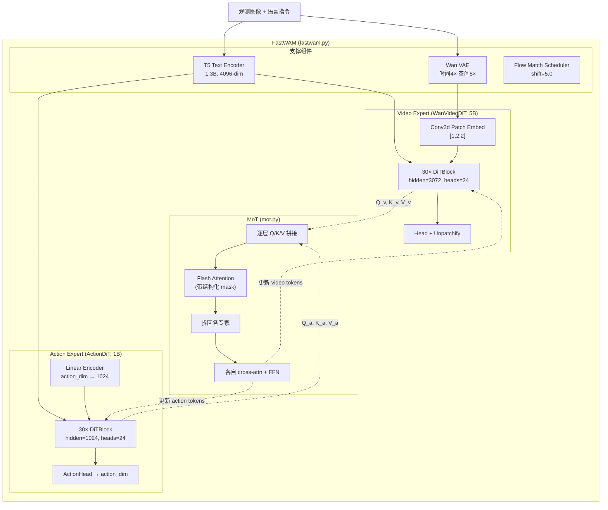

**参数量分布**（`fastwam.yaml` + 代码推算）：

| 组件 | 参数量 | 说明 |
|------|--------|------|
| WanVideoDiT | ~5B | 30 层 × (3072² × 4 + 3072 × 14336 × 2) ≈ 5B |
| ActionDiT | ~1B | 30 层 × (1024² × 4 + 1024 × 4096 × 2) ≈ 1B |
| MoT 额外参数 | 0 | MoT 本身无独立参数，复用两个专家的 Q/K/V 投影 |
| Wan VAE | ~数百 M | 视频编解码器 |
| T5 | ~1.3B | 文本编码器（推理时可用预计算缓存替代） |

### 3.2 Video Expert：WanVideoDiT 详解

Video Expert 继承自 Wan2.2-TI2V-5B 的 DiT 架构，是整个系统的"世界模型骨干"。

#### 3.2.1 Patch Embedding——从像素到 token

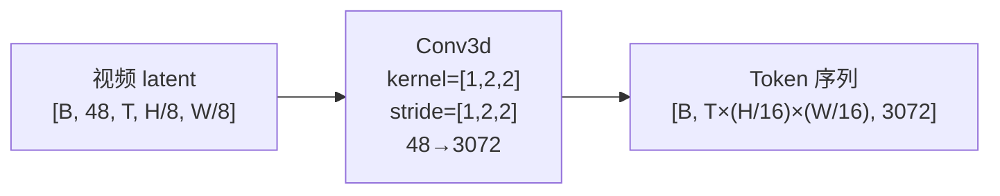

关键设计决策：
- **时间维不压缩**（patch_size 时间维=1）：保留每一帧的独立表示，便于首帧编码与未来帧分离
- **空间 2×2 压缩**：在 VAE 已做 8× 下采样的基础上再做 2×，总空间压缩达 16×
- **输入通道 48**：Wan VAE 的 latent 通道数（z_dim=48）

对于 LIBERO 的 224×448 输入图像：

\[
\text{VAE 后}: [B, 48, T_\text{latent}, 28, 56] \xrightarrow{\text{Patch}} [B, T_\text{latent} \times 14 \times 28, 3072]
\]

每帧产生 \(14 \times 28 = 392\) 个 token。

#### 3.2.2 DiTBlock 内部结构

每个 DiTBlock 包含三个子模块，通过**自适应层归一化（AdaLN）**实现时间步条件化：

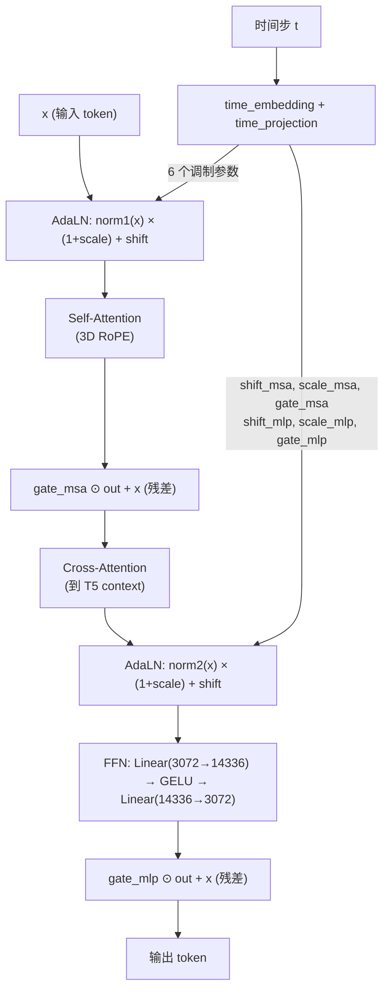

**AdaLN 调制机制**（`mot.py:_split_modulation`）：

\[
\text{modulate}(x, \text{shift}, \text{scale}) = x \cdot (1 + \text{scale}) + \text{shift}
\]

每个 DiTBlock 从时间步嵌入生成 **6 个调制向量**（各维度 \(D\)）：
- \((\text{shift}_\text{msa}, \text{scale}_\text{msa}, \text{gate}_\text{msa})\) 控制自注意力分支
- \((\text{shift}_\text{mlp}, \text{scale}_\text{mlp}, \text{gate}_\text{mlp})\) 控制 FFN 分支

门控残差连接的作用是让网络自适应地决定「这一层该做多少改变」，类似 Highway Network 的思想。

#### 3.2.3 Separated Timestep——首帧的特殊地位

Fast-WAM 的一个关键设计是 **分离时间步嵌入**（`seperated_timestep: true`）：

- **首帧（frame 0）**：始终使用 \(t=0\)（干净），代表"这是真实的当前观测"
- **未来帧（frame 1..T）**：使用采样的扩散时间步 \(t\)，代表"这是加噪的未来"

这在代码中体现为 `wan_video_dit.py` 的 `pre_dit()` 方法中：

```python
token_timesteps = torch.ones((batch_size, x.shape[2], tokens_per_frame))
token_timesteps[:, 0, :] = 0  # 首帧 timestep 永远为 0
```

这个设计的深层原因：首帧是**唯一的真实输入锚点**，其 token 必须获得一个与噪声状态不同的调制信号，才能在注意力中为其他 token 提供可靠的"参考坐标"。

#### 3.2.4 3D RoPE 位置编码

Video DiT 使用三维旋转位置编码（3D Rotary Position Embedding）：

\[
\text{freqs} = \text{concat}\left[\text{RoPE}_{f}(i_f),\; \text{RoPE}_{h}(i_h),\; \text{RoPE}_{w}(i_w)\right]
\]

其中 \((i_f, i_h, i_w)\) 是 token 在帧、高度、宽度三个维度上的坐标。这使得注意力机制能够感知 token 间的 3D 空间-时间关系。

相比之下，Action DiT 使用 **1D RoPE**（按时间步顺序），因为动作序列是纯一维时间序列。

#### 3.2.5 视频注意力掩码模式

`build_video_to_video_mask` 支持三种模式（`wan_video_dit.py`）：

| 模式 | 逻辑 | 适用场景 |
|------|------|----------|
| `bidirectional` | 全连接，无掩码 | 最快，忽略因果性 |
| `per_frame_causal` | 每帧只能看到当前及之前帧 | 严格时间因果 |
| **`first_frame_causal`** | 首帧不看后续帧；后续帧可看所有帧 | **默认**，平衡效率与因果 |

默认的 `first_frame_causal` 的精妙之处在于：

```
         f0   f1   f2   ...   fT
  f0  [  1    0    0   ...    0  ]   ← 首帧只看自己
  f1  [  1    1    1   ...    1  ]   ← 后续帧看全部
  f2  [  1    1    1   ...    1  ]
  ...
  fT  [  1    1    1   ...    1  ]
```

首帧的"信息封锁"防止它被未来噪声 token 污染——这在推理时尤其重要，因为首帧的干净 latent 将直接决定世界表征的质量。

### 3.3 Action Expert：ActionDiT 详解

#### 3.3.1 架构对照

| 参数 | Video DiT | Action DiT | 设计考量 |
|------|:---------:|:----------:|----------|
| hidden_dim | 3072 | **1024** | 动作空间远小于视频空间，无需同等容量 |
| ffn_dim | 14336 | **4096** | 保持约 4× 的 FFN 放大比 |
| num_layers | 30 | **30** | **必须相同**——MoT 逐层混合要求层数对齐 |
| num_heads | 24 | **24** | **必须相同**——混合注意力在 head 维拼接 |
| attn_head_dim | 128 | **128** | **必须相同**——Q/K/V 维度必须匹配才能做联合 attention |
| patch/input | Conv3d, in_dim=48 | **Linear, action_dim→1024** | 动作无需 patch 化 |
| 位置编码 | 3D RoPE | **1D RoPE** | 动作是 1D 时间序列 |

**关键约束**：MoT 要求两个专家的 **层数、头数、head_dim 完全一致**（`mot.py:__init__` 中有显式校验），因为混合注意力在每一层都要拼接 Q/K/V。但 hidden_dim 和 ffn_dim 可以不同——这些是各自独立的线性投影和 FFN。

#### 3.3.2 线性插值初始化

ActionDiT 的初始化策略非常巧妙：不是随机初始化，而是**从 Wan2.2 的 5B DiT 权重通过线性插值得到**（`scripts/preprocess_action_dit_backbone.py`）。

这个过程将 3072-dim 的 Wan DiT 权重"压缩"到 1024-dim，采用 alpha-scaling 插值方案。好处是：

1. **继承预训练知识**：Action DiT 从一开始就具备基本的注意力模式和表示能力
2. **训练更稳定**：避免两个专家初始化差异过大导致的 MoT 不稳定
3. **收敛更快**：只需微调而非从头学习 Transformer 的基本行为

#### 3.3.3 ActionHead

ActionDiT 的输出头（`action_dit.py:ActionHead`）也使用 AdaLN 调制：

\[
\hat{a} = \text{proj}\left(\text{LayerNorm}(x) \cdot (1 + \text{scale}(t)) + \text{shift}(t)\right)
\]

这确保了动作预测也受到时间步条件的调制——在不同去噪阶段，网络关注的信号强度和偏置应当不同。

### 3.4 MoT：Mixture-of-Transformers 核心机制

MoT 是 Fast-WAM 架构创新的核心。它不是简单地把两个独立模型拼在一起，而是在**每一层**进行深度交互。

#### 3.4.1 逐层混合注意力

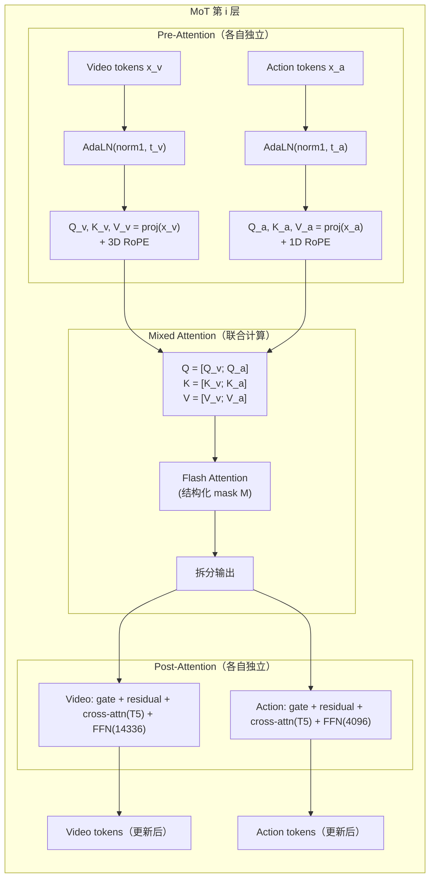

**核心代码流程**（`mot.py:forward`）：

```
for layer_idx in range(30):
    # 1. 各专家独立计算 Q/K/V（包含各自的 RoPE 和 AdaLN）
    q_v, k_v, v_v = video_expert.blocks[i].qkv(x_v, freqs_v, t_mod_v)
    q_a, k_a, v_a = action_expert.blocks[i].qkv(x_a, freqs_a, t_mod_a)
    
    # 2. 拼接后做一次联合 Flash Attention
    q = [q_v; q_a]  # 序列维拼接
    k = [k_v; k_a]
    v = [v_v; v_a]
    attn_out = flash_attention(q, k, v, mask=M)
    
    # 3. 拆回各专家的 attention 输出
    out_v, out_a = split(attn_out)
    
    # 4. 各自独立的 post-block：门控残差 → cross-attention → FFN
    x_v = post_block_v(out_v, x_v, t5_context)
    x_a = post_block_a(out_a, x_a, t5_context)
```

**为什么 Q/K 的维度可以不同但 head 维度必须相同？**

在混合注意力中，Q 来自查询专家，K/V 来自所有专家。注意力计算为：

\[
\text{Attn}(Q, K, V) = \text{softmax}\left(\frac{QK^\top}{\sqrt{d_\text{head}}}\right) V
\]

这里 \(Q \in \mathbb{R}^{B \times n_\text{heads} \times S_q \times d_\text{head}}\)，\(K \in \mathbb{R}^{B \times n_\text{heads} \times S_k \times d_\text{head}}\)。乘法 \(QK^\top\) 要求 \(d_\text{head}\) 和 \(n_\text{heads}\) 必须匹配，但序列长度 \(S_q, S_k\) 可以不同。而 hidden_dim = \(n_\text{heads} \times d_\text{head}\) 一致保证了这一点。

**但 Video DiT 的 hidden_dim=3072 ≠ Action DiT 的 hidden_dim=1024 呀？**

看似矛盾，实则不然——关键在于 Q/K/V 的投影维度。两个专家的 Q/K/V 投影都输出 \(n_\text{heads} \times d_\text{head} = 24 \times 128 = 3072\) 维。Video DiT 的情况是 \(W_q: 3072 \to 3072\)，Action DiT 是 \(W_q: 1024 \to 3072\)。投影后的维度一致，所以可以拼接做联合注意力。

#### 3.4.2 梯度检查点策略

MoT 的内存占用很大（两个专家的完整 token 序列 + 联合注意力矩阵），因此代码提供了两级梯度检查点：

1. **混合注意力检查点**（`mot_checkpoint_mixed_attn`）：在 `_mixed_attention()` 中对 Flash Attention 做检查点，以时间换空间
2. **专家内检查点**（`use_gradient_checkpointing`）：每个 DiTBlock 内部的 `_apply_post_with_optional_checkpoint()` 可独立开启

### 3.5 结构化注意力掩码——信息流的精确控制

#### 3.5.1 掩码矩阵设计

`_build_mot_attention_mask`（`fastwam.py:386-407`）构建了一个 \((S_v + S_a) \times (S_v + S_a)\) 的布尔矩阵，精确控制信息流向：

```
                  ┌─────────────────────────────────────┐
                  │  Video Tokens (Sv)  │ Action Tokens  │
                  │  f0  │  f1...fT    │     (Sa)       │
    ──────────────┼──────┼─────────────┼────────────────┤
    f0  tokens    │  1   │     0       │      0         │
    ──────────────┼──────┼─────────────┼────────────────┤
    f1...fT       │  1   │     1       │      0         │
    tokens        │      │             │                │
    ──────────────┼──────┼─────────────┼────────────────┤
    Action        │  1   │     0       │      1         │
    tokens        │      │             │                │
    ──────────────┴──────┴─────────────┴────────────────┘
    
    行=Query, 列=Key; 1=可 attend, 0=被 mask
```

**信息流规则详解**：

| Query → Key | 允许？ | 原因 |
|-------------|:------:|------|
| 首帧 → 首帧 | Yes | 首帧内部自由交互 |
| 首帧 → 未来帧 | **No** | 防止首帧被未来噪声污染（核心保护） |
| 首帧 → 动作 | **No** | 首帧不应依赖于正在去噪的动作 |
| 未来帧 → 首帧 | Yes | 未来帧需要以真实观测为锚点 |
| 未来帧 → 未来帧 | Yes | 视频帧之间需要时空一致性 |
| 未来帧 → 动作 | **No** | 视频和动作是平行预测，避免循环依赖 |
| 动作 → 首帧 | Yes | 动作需要以当前观测为条件 |
| 动作 → 未来帧 | **No** | **核心设计**：动作不偷看未来 |
| 动作 → 动作 | Yes | 动作 token 内部双向交互 |

这个掩码设计的精妙之处在于**训练-推理一致性**：推理时根本不创建未来帧 token，动作 token 只能看到首帧——这与训练时的掩码约束完全一致，确保了分布匹配。

#### 3.5.2 代码实现

```python
# fastwam.py:394-407
mask = torch.zeros((total_seq_len, total_seq_len), dtype=torch.bool)
# video → video: 由 first_frame_causal 模式控制
mask[:video_seq_len, :video_seq_len] = self.video_expert.build_video_to_video_mask(...)
# action → action: 全连接
mask[video_seq_len:, video_seq_len:] = True
# action → first-frame video only: 只看首帧
first_frame_tokens = min(video_tokens_per_frame, video_seq_len)
mask[video_seq_len:, :first_frame_tokens] = True
```

### 3.6 VAE、文本编码器与本体感受编码

#### 3.6.1 Wan VAE

Wan VAE 完成图像/视频与 latent 空间的双向映射：

| 维度 | 下采样因子 | 说明 |
|------|:---------:|------|
| 时间 | 4× | `temporal_downsample_factor`，33 帧 → 9 个 latent 帧（\((33-1)/4+1=9\)） |
| 空间 | 8× | `upsampling_factor`，224×448 → 28×56 |
| 通道 | 3→48 | `z_dim=48` |

编码：`_encode_video_latents()` 和 `_encode_input_image_latents_tensor()`  
解码：`_decode_latents()` → clip 到 [-1,1] → 映射到 [0,255] → PIL Image

#### 3.6.2 T5 文本编码器与缓存

训练时为了避免每个 batch 都重新编码文本（同一任务的指令不变），系统支持**预计算缓存**：

```bash
python scripts/precompute_text_embeds.py  # 提前缓存 T5 输出
```

缓存后 `context` 和 `context_mask` 直接从磁盘加载，输出维度 \([B, L, 4096]\)，\(L\) 由 `tokenizer_max_len=128` 控制。

推理时可以通过 `encode_prompt()` 在线编码，也可使用缓存。

#### 3.6.3 本体感受编码（Proprioception）

FastWAM 支持将机器人本体状态（如末端执行器位姿+夹爪状态）编码为额外的条件 token：

\[
\text{context}_\text{new} = [\text{context}_\text{T5};\; \text{Linear}(\text{proprio})]
\]

通过 `_append_proprio_to_context()`（`fastwam.py:219-240`），本体感受向量经线性投影到 4096 维后拼接到 T5 context 序列末尾，作为额外的 cross-attention key。

---

## 4. 训练流水线

### 4.1 Flow Matching 训练目标详解

#### 4.1.1 前向加噪与训练目标

Fast-WAM 使用 `WanContinuousFlowMatchScheduler`（`scheduler_continuous.py`）实现连续流匹配。

**前向过程**（`add_noise`）：

\[
y_t = (1 - \sigma) \cdot y_0 + \sigma \cdot \epsilon, \quad \sigma = \frac{t}{T_\text{train}}, \quad \epsilon \sim \mathcal{N}(0, I)
\]

**训练目标**（`training_target`）：

\[
\text{target} = \epsilon - y_0
\]

这对应 flow matching 中的条件速度场——网络需要学会将噪声样本"拉向"干净数据的方向。

#### 4.1.2 Shift-based 时间步采样

标准均匀采样 \(u \sim \text{Uniform}(0,1)\) 会导致大量采样落在扩散过程的"平坦区"（极小或极大噪声），浪费训练信号。Wan2.2 使用**shift-based** 采样重分布时间步：

\[
\phi(u, s) = \frac{s \cdot u}{1 + (s-1) \cdot u}
\]

\[
t = \phi(u, s) \cdot T_\text{train}
\]

其中 shift \(s = 5.0\)（默认）。这个变换的效果：

- \(s > 1\) 时，\(\phi(u,s) > u\) 对大部分 \(u\)，即**偏向高噪声区间采样**
- 高噪声区间通常包含更强的训练信号（从几乎纯噪声中"识别"数据结构）
- Shift 越大，采样越集中于高噪声端

#### 4.1.3 训练权重函数

即使 shift 重分布了采样密度，不同时间步的损失梯度幅度仍然差异很大。因此引入**高斯型权重**：

\[
w(t) = \exp\left(-2 \left(\frac{t - T/2}{T}\right)^2\right)
\]

经过最小值平移和归一化后应用：

\[
\tilde{w}(t) = \frac{w(t) - w_\text{min}}{C}
\]

这个权重在 \(t = T/2\) 处最大——中等噪声水平通常包含最具区分度的训练信号，既不是"几乎纯噪声"（信号被淹没），也不是"几乎干净"（预测过于简单）。

### 4.2 联合训练损失

#### 4.2.1 完整的 training_loss 流程

`fastwam.py:training_loss()`（行 448-568）是训练的核心：

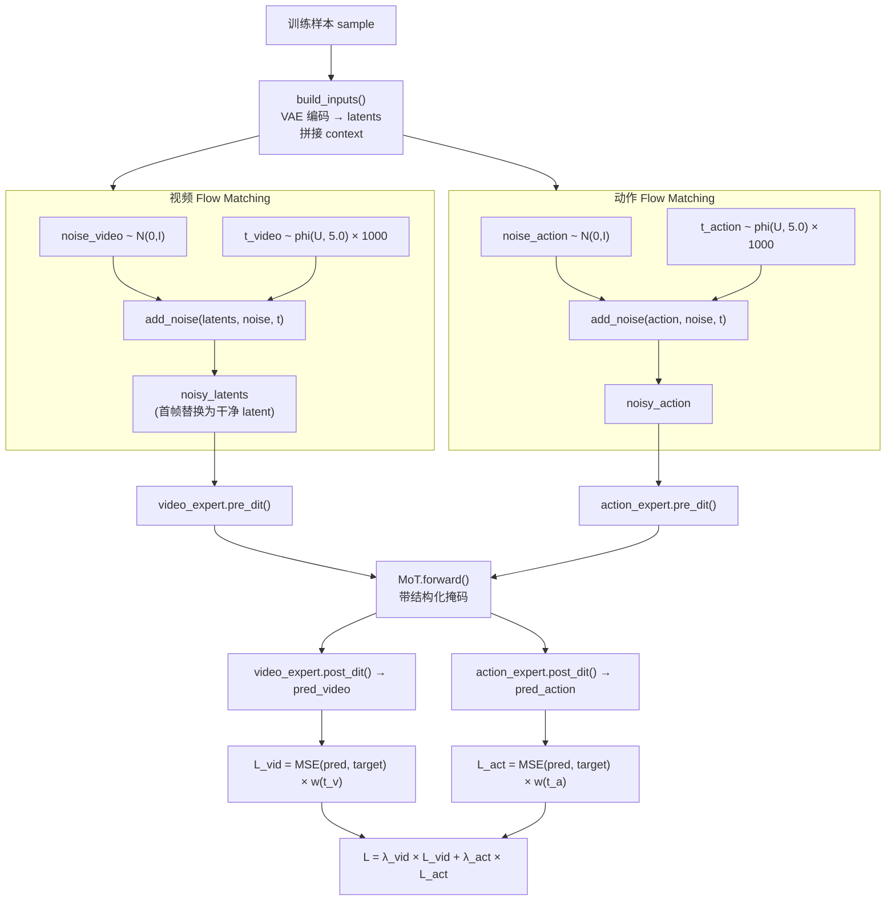

**关键实现细节**：

1. **独立采样时间步**：视频和动作的噪声 \(\epsilon\) 和时间步 \(t\) 是**独立采样**的，这增加了训练的多样性
2. **首帧保护**：`latents[:, :, 0:1] = first_frame_latents` 确保首帧始终干净
3. **Padding 处理**：对不等长的动作/视频序列，通过 `action_is_pad` 和 `image_is_pad` 掩码排除 padding 区域的损失贡献

#### 4.2.2 损失加权

\[
\mathcal{L}_\text{total} = \lambda_\text{vid} \cdot \mathcal{L}_\text{vid} + \lambda_\text{act} \cdot \mathcal{L}_\text{act}
\]

默认 \(\lambda_\text{vid} = 1.0,\; \lambda_\text{act} = 1.0\)（`fastwam.yaml:loss.lambda_action`）。

各分量的计算：

\[
\mathcal{L}_\text{vid} = \frac{1}{B} \sum_{i=1}^{B} \tilde{w}(t_i^v) \cdot \frac{1}{|\mathcal{V}_i|} \sum_{j \in \mathcal{V}_i} \| \hat{v}_j - (\epsilon_j^v - v_j) \|^2
\]

\[
\mathcal{L}_\text{act} = \frac{1}{B} \sum_{i=1}^{B} \tilde{w}(t_i^a) \cdot \frac{1}{|\mathcal{A}_i|} \sum_{k \in \mathcal{A}_i} \| \hat{a}_k - (\epsilon_k^a - a_k) \|^2
\]

其中 \(\mathcal{V}_i\) 和 \(\mathcal{A}_i\) 是第 \(i\) 个样本的非 padding 位置集合。

### 4.3 训练基础设施

#### 4.3.1 分布式训练架构

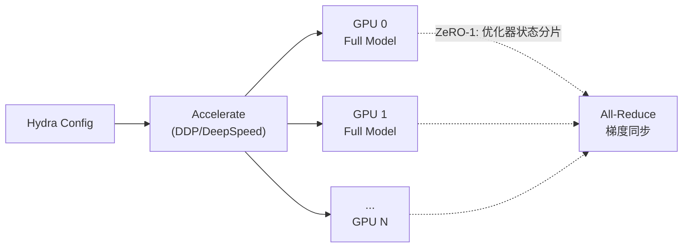

| 配置项 | LIBERO | RoboTwin | 说明 |
|--------|:------:|:--------:|------|
| GPU 数 | 8 | 64 | 单节点 vs 多节点 |
| Batch size/GPU | 16 | ~2 | 总 batch = BS × GPU |
| ZeRO Stage | 1 | 1 | 只分片优化器状态 |
| 混合精度 | bf16 | bf16 | bfloat16 训练 |
| 梯度裁剪 | 1.0 | 1.0 | max_grad_norm |

#### 4.3.2 优化器与学习率

- **优化器**：AdamW（`weight_decay=1e-2`）
- **学习率调度**：Cosine Annealing + 5% 线性 Warmup

\[
\eta(t) = \begin{cases}
\eta_\text{max} \cdot \frac{t}{T_\text{warmup}} & t < T_\text{warmup} \\
\eta_\text{min} + \frac{\eta_\text{max} - \eta_\text{min}}{2}\left(1 + \cos\frac{\pi(t - T_\text{warmup})}{T - T_\text{warmup}}\right) & t \geq T_\text{warmup}
\end{cases}
\]

其中 \(\eta_\text{max} = 10^{-4}\)，\(T_\text{warmup} = 0.05 \times T\)。

#### 4.3.3 冻结策略与可训练参数

检查点只保存 MoT 的权重（`save_checkpoint` 在 `fastwam.py:1088-1098`），这意味着：

- **可训练**：MoT 的所有参数（包含 Video DiT 和 Action DiT 的 DiTBlock 权重 + 各自的 text/time embedding + head）
- **冻结**：VAE（预训练权重不动）、T5 text encoder（使用预计算缓存时甚至不加载）

### 4.4 数据流水线

#### 4.4.1 RobotVideoDataset

`robot_video_dataset.py` 负责将 LeRobot 格式的数据集转化为训练所需的张量：

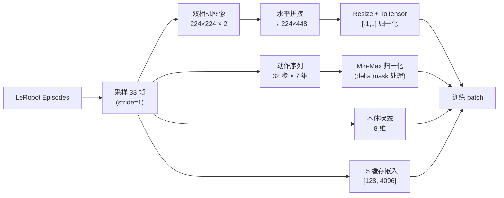

**关键配置**（`configs/data/libero_2cam.yaml`）：

| 参数 | 值 | 说明 |
|------|-----|------|
| `num_frames` | 33 | 1 首帧 + 32 后续帧 |
| `action_video_freq_ratio` | 4 | 动作频率 = 4× 视频帧率 |
| `video_size` | [224, 448] | 拼接后尺寸 |
| `action_output_dim` | 7 | 6D 末端位姿变化 + 1D 夹爪 |
| `proprio_output_dim` | 8 | 6D 位姿 + 2D 夹爪状态 |

**Delta Action Mask**：`delta_action_dim_mask: [true,true,true,true,true,true,false]` 表明前 6 维（末端位姿）是增量动作，第 7 维（夹爪）是绝对值。

---

## 5. 推理流水线——"Fast"之所在

### 5.1 核心洞察

Fast-WAM 推理快的根本原因在于**将视频骨干从迭代去噪循环中解耦**：

| 推理模式 | 视频骨干调用次数 | 每步计算量 | 总 FLOPs |
|----------|:----------------:|:----------:|:--------:|
| Joint WAM | \(N\) 次（每去噪步都要） | \(O(S_v^2 + S_a^2 + S_v \cdot S_a)\) | \(N \times O_\text{joint}\) |
| **Fast-WAM** | **1 次**（prefill） | \(O(S_a \cdot (S_{f_0} + S_a))\) | \(O_\text{prefill} + N \times O_\text{action}\) |

由于 \(S_v \gg S_a\)（视频 token 数远大于动作 token 数）且 \(O_\text{prefill}\) 只做一次，总计算量大幅降低。

### 5.2 infer_action() 详细拆解

`infer_action()`（`fastwam.py:906-1048`）是 Fast-WAM 的默认推理入口。

```mermaid
sequenceDiagram
    participant User as 调用方
    participant FastWAM as FastWAM
    participant VAE as Wan VAE
    participant VE as Video Expert
    participant MoT as MoT
    participant AE as Action Expert
    participant Sched as Flow Scheduler
    
    User->>FastWAM: infer_action(image, prompt, action_horizon=32)
    
    Note over FastWAM: === Phase 1: 编码当前观测 ===
    FastWAM->>VAE: encode(image)
    VAE-->>FastWAM: first_frame_latents [1, 48, 1, H/8, W/8]
    
    Note over FastWAM: === Phase 2: 视频骨干 Prefill ===
    FastWAM->>VE: pre_dit(first_frame_latents, timestep=0)
    VE-->>FastWAM: video_pre {tokens, freqs, t_mod, context}
    
    FastWAM->>FastWAM: _build_mot_attention_mask()
    
    FastWAM->>MoT: prefill_video_cache(video_tokens, ...)
    
    loop 30 层
        MoT->>MoT: build Q_v, K_v, V_v
        MoT->>MoT: self-attention (video-only mask)
        MoT->>MoT: cross-attn + FFN
        MoT->>MoT: cache {K_v, V_v} for this layer
    end
    MoT-->>FastWAM: video_kv_cache [30 × {K, V}]
    
    Note over FastWAM: === Phase 3: 动作去噪循环 ===
    FastWAM->>FastWAM: latents_action ~ N(0,I) [1, 32, 7]
    FastWAM->>Sched: build_inference_schedule(steps=20)
    Sched-->>FastWAM: timesteps, deltas
    
    loop 20 步去噪
        FastWAM->>AE: pre_dit(latents_action, timestep_i)
        AE-->>FastWAM: action_pre {tokens, freqs, t_mod}
        
        FastWAM->>MoT: forward_action_with_video_cache(action_tokens, kv_cache)
        Note over MoT: K = [K_v_cached; K_a_new]<br/>V = [V_v_cached; V_a_new]<br/>只有 action Q 参与计算
        MoT-->>FastWAM: updated action tokens
        
        FastWAM->>AE: post_dit(tokens) → pred_action_noise
        FastWAM->>Sched: step(pred, delta, latents)
        Sched-->>FastWAM: updated latents_action
    end
    
    FastWAM-->>User: {action: [32, 7]}
```

**关键步骤详解**：

**Step 1: VAE 编码**——将当前观测图像编码为 latent：
```python
first_frame_latents = self._encode_input_image_latents_tensor(input_image)
# [1, 48, 1, H/8, W/8]
```

**Step 2: Prefill**——视频骨干对首帧做一次前向，缓存每层的 K/V：
```python
timestep_video = torch.zeros(...)  # 关键：timestep=0 表示干净输入
video_pre = self.video_expert.pre_dit(x=first_frame_latents, timestep=0, ...)
video_kv_cache = self.mot.prefill_video_cache(video_tokens=video_pre["tokens"], ...)
```

这一步是**确定性的**（不涉及采样或去噪），对同一输入图像只需做一次。

**Step 3: 动作去噪**——使用缓存的 K/V，只迭代更新动作 token：
```python
for step_t, step_delta in zip(timesteps, deltas):
    pred_action = self._predict_action_noise_with_cache(
        latents_action, timestep_action, context, context_mask,
        video_kv_cache, attention_mask, video_seq_len
    )
    latents_action = self.infer_action_scheduler.step(pred_action, step_delta, latents_action)
```

每步的 `forward_action_with_video_cache`（`mot.py:343-445`）做的事情：

\[
K = [K_v^\text{cached};\; K_a^\text{new}], \quad V = [V_v^\text{cached};\; V_a^\text{new}]
\]

\[
\text{attn\_out} = \text{FlashAttn}(Q_a, K, V, \text{mask}=M_{\text{action rows}})
\]

注意：**只有 action 的 Q 参与计算**——video 的 Q 不需要了，因为我们不更新 video tokens。这进一步减少了计算量。

### 5.3 与 infer_joint() 的对比

`infer_joint()`（`fastwam.py:726-903`）是完整的联合去噪推理：

```mermaid
flowchart TB
  subgraph Joint ["infer_joint: 每步都要"]
    J1["video_expert.pre_dit(noisy_video)"] --> J2["action_expert.pre_dit(noisy_action)"]
    J2 --> J3["MoT.forward(video+action)"]
    J3 --> J4["post_dit → pred_video, pred_action"]
    J4 --> J5["scheduler.step → update video + action"]
    J5 -->|"重复 N 步"| J1
  end
  
  subgraph Fast ["infer_action: 首帧 prefill 一次"]
    F1["video_expert.pre_dit(clean_frame)"] --> F2["MoT.prefill → cache K/V"]
    F2 --> F3["action_expert.pre_dit(noisy_action)"]
    F3 --> F4["MoT.forward_with_cache(action_only)"]
    F4 --> F5["post_dit → pred_action"]
    F5 --> F6["scheduler.step → update action"]
    F6 -->|"重复 N 步"| F3
  end
```

关键差异：
1. Joint 模式每步都要完整跑 Video DiT（5B 参数！），Fast-WAM 只跑一次
2. Joint 模式的注意力矩阵是完整的 \((S_v + S_a)^2\)，Fast-WAM 每步只有 \(S_a \times (S_{f_0} + S_a)\)
3. Joint 模式额外产出未来视频帧（可用于可视化但不影响动作质量）

有趣的是，`infer_joint()` 默认会同时调用 `infer_action()` 并对比两者的动作输出（`test_action_with_infer_action=True`），用于验证一致性——如果差异过大会发出警告。

### 5.4 计算复杂度分析

设 \(L\) 为 Transformer 层数，\(S_v\) 为视频 token 总数，\(S_{f_0}\) 为首帧 token 数，\(S_a\) 为动作 token 数，\(N\) 为去噪步数。

**Joint 推理**每步的注意力计算量（忽略 FFN 等）：

\[
\text{Cost}_\text{joint/step} = L \cdot O\left((S_v + S_a)^2 \cdot d_\text{head}\right)
\]

总计：\(N \cdot \text{Cost}_\text{joint/step}\)。

**Fast-WAM 推理**分两部分：

\[
\text{Cost}_\text{prefill} = L \cdot O\left(S_{f_0}^2 \cdot d_\text{head}\right)
\]

\[
\text{Cost}_\text{action/step} = L \cdot O\left(S_a \cdot (S_{f_0} + S_a) \cdot d_\text{head}\right)
\]

总计：\(\text{Cost}_\text{prefill} + N \cdot \text{Cost}_\text{action/step}\)。

以 LIBERO 的具体数值（224×448，33帧）估算：

| | Joint | Fast-WAM |
|---|---|---|
| \(S_v\) | ~3500 (9帧×392/帧) | — |
| \(S_{f_0}\) | — | 392 (1帧) |
| \(S_a\) | 32 | 32 |
| 每步注意力规模 | ~\((3532)^2 \approx 12.5M\) | ~\(32 \times 424 \approx 13.6K\) |
| **速度比** | 1× | ~**900×**（注意力部分） |

实际端到端速度比约 4× 而非 900×，因为 VAE 编码、T5 编码、FFN、cross-attention 等也占用大量时间。但注意力部分的压倒性优势使得 Fast-WAM 达到了 **190 ms** 的实时延迟。

---

## 6. 变体对照与消融实验

论文设计了一组精心控制的变体来隔离不同因素的贡献：

### 6.1 变体定义

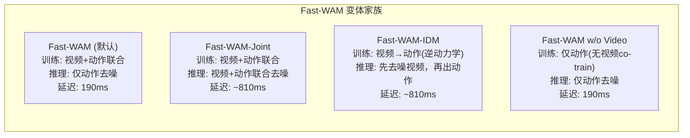

| 变体 | 训练时视频损失 | 推理时生成视频 | 训练-推理结构 | 目的 |
|------|:---:|:---:|------|------|
| **Fast-WAM** | Yes | No | 联合训练 + 直接推理 | 验证核心命题 |
| Fast-WAM-Joint | Yes | Yes | 联合训练 + 联合推理 | 对照：增加推理开销能否提升？ |
| Fast-WAM-IDM | Yes | Yes | 联合训练 + 先视频后动作 | 对照：逆动力学路线的价值 |
| w/o Video | No | No | 纯动作训练 + 直接推理 | 消融：去掉 video co-training |

### 6.2 消融分析框架

这四个变体允许进行如下因子分解：

1. **Video co-training 效果** = Fast-WAM vs w/o Video（固定推理方式，切换训练目标）
2. **Test-time imagination 效果** = Fast-WAM vs Fast-WAM-Joint（固定训练方式，切换推理结构）
3. **IDM vs Direct 路线** = Fast-WAM-IDM vs Fast-WAM-Joint（两种 imagine-then-execute 风格）

---

## 7. 实验结果深度解读

### 7.1 RoboTwin 2.0 基准

RoboTwin 2.0 是一个包含多种双臂机器人操作任务的仿真基准，有 Clean（标准环境）和 Random（随机化环境）两种评测条件。

| 方法 | Embodied PT | Clean | Random | **Average** |
|------|:---:|:---:|:---:|:---:|
| \(\pi_0\) | Yes | — | — | 62.2 |
| \(\pi_{0.5}\) | Yes | — | — | 79.8 |
| Motus (无 PT) | No | 77.56 | 77.00 | 77.3 |
| Motus (有 PT) | Yes | — | — | 87.8 |
| LingBot-VA (无 PT) | No | 80.60 | — | 80.6 |
| LingBot-VA (有 PT) | Yes | — | — | **92.2** |
| **Fast-WAM** | **No** | **91.88** | **91.78** | **91.8** |
| Fast-WAM w/o Video | No | 82.76 | 84.80 | 83.8 |

**深度解读**：

1. **Fast-WAM 在无 embodied 预训练条件下达到 91.8，接近 LingBot-VA 有预训练的 92.2**——这说明 video co-training 可以在很大程度上替代昂贵的跨体预训练数据
2. **去掉 video co-training 掉 8.0 分**——从 91.8 到 83.8，这是最强的消融证据
3. **Clean 和 Random 差异极小**（91.88 vs 91.78）——说明 Fast-WAM 学到了鲁棒的表征

### 7.2 LIBERO 基准

LIBERO 包含 4 个子套件，测试不同层面的泛化能力：

| 方法 | Embodied PT | Spatial | Object | Goal | Long | **Average** |
|------|:---:|:---:|:---:|:---:|:---:|:---:|
| OpenVLA | Yes | — | — | — | — | 76.5 |
| \(\pi_0\) | Yes | — | — | — | — | 94.1 |
| \(\pi_{0.5}\) | Yes | — | — | — | — | 96.9 |
| Motus (有 PT) | Yes | — | — | — | — | 97.7 |
| LingBot-VA (有 PT) | Yes | — | — | — | — | 98.5 |
| **Fast-WAM** | **No** | **98.2** | **100.0** | **97.0** | **95.2** | **97.6** |
| Fast-WAM w/o Video | No | 89.2 | 99.2 | 95.4 | 90.0 | 93.5 |

**深度解读**：

1. **Object 套件满分 100.0**——物体操作是视频预训练最擅长的领域
2. **Long 套件相对较低（95.2）但仍优秀**——长程任务需要更强的时间推理，video co-training 帮助最大（去掉后 95.2 → 90.0，跌 5.2 分）
3. **无预训练的 97.6 与有预训练的 Motus 97.7 几乎相当**——再次证明 video co-training 可替代 embodied 预训练

### 7.3 真实机器人：Galaxea R1 Lite 折叠毛巾

论文在真实的 Galaxea R1 Lite 双臂机器人上验证了折叠毛巾任务。这是一个**可变形物体操作**任务，特别适合测试世界模型的价值——因为布料的物理行为难以用简单规则描述。

| 变体 | 成功率 | 延迟 |
|------|:------:|:----:|
| Fast-WAM | 高 | 190 ms |
| Fast-WAM-IDM | 较高 | 810 ms |
| w/o Video | 显著下降 | 190 ms |

关键发现：去掉 video co-training 在真机上的退化**比仿真中更严重**——真实世界中布料的复杂动态更依赖于训练期获得的物理先验。

### 7.4 延迟分析

| 方法 | 推理架构 | 延迟 | 相对 Fast-WAM |
|------|----------|:----:|:---:|
| **Fast-WAM** | Prefill + Action-only | **190 ms** | 1× |
| Fast-WAM-IDM | Full video → IDM | ~810 ms | ~4.3× |
| Imagine-then-execute WAMs | Full joint denoising | >760 ms | >4× |

190 ms 意味着可以达到 **~5 Hz** 的控制频率，对于许多操作任务已经足够实时。

---

## 8. 代码导航手册

### 8.1 核心文件索引

| 文件 | 主要类/函数 | 职责 |
|------|-------------|------|
| `src/fastwam/models/wan22/fastwam.py` | `FastWAM` | 顶层模型：训练损失、推理入口、掩码构建 |
| `src/fastwam/models/wan22/mot.py` | `MoT` | 混合注意力：`forward()`, `prefill_video_cache()`, `forward_action_with_video_cache()` |
| `src/fastwam/models/wan22/action_dit.py` | `ActionDiT`, `ActionHead` | 动作专家：编码器 + 30 层 DiT + 输出头 |
| `src/fastwam/models/wan22/wan_video_dit.py` | `WanVideoDiT`, `DiTBlock` | 视频专家：patch 化 + 30 层 DiT + 掩码 |
| `src/fastwam/models/wan22/schedulers/scheduler_continuous.py` | `WanContinuousFlowMatchScheduler` | Flow matching 调度器 |
| `src/fastwam/trainer.py` | `Wan22Trainer` | 训练循环：DDP、优化器、评测、检查点 |
| `src/fastwam/runtime.py` | `create_fastwam()`, `run_training()` | 工厂函数、训练入口 |
| `src/fastwam/datasets/lerobot/robot_video_dataset.py` | `RobotVideoDataset` | 数据集：多相机、多格式 |
| `scripts/train.py` | `main()` | Hydra 训练脚本入口 |
| `scripts/preprocess_action_dit_backbone.py` | — | ActionDiT 权重插值预处理 |
| `scripts/precompute_text_embeds.py` | — | T5 嵌入缓存生成 |

### 8.2 配置体系

```
configs/
├── train.yaml              # 基础训练参数（LR、batch size 等）
├── model/
│   ├── fastwam.yaml         # Fast-WAM 模型配置（DiT 参数、调度器等）
│   ├── fastwam_joint.yaml   # Joint 变体配置
│   └── fastwam_idm.yaml     # IDM 变体配置
├── data/
│   ├── libero_2cam.yaml     # LIBERO 数据配置
│   └── robotwin.yaml        # RoboTwin 数据配置
└── task/
    ├── libero_uncond_2cam224_1e-4.yaml   # LIBERO 训练任务
    └── robotwin_uncond_3cam_384_1e-4.yaml # RoboTwin 训练任务
```

Hydra 的配置组合机制：`task` 文件通过 `defaults` 选择 `data` 和 `model`，并可覆盖基础参数。

### 8.3 快速上手命令

```bash
# 1. 环境安装
conda create -n fastwam python=3.10
pip install torch==2.7.1+cu128 torchvision==0.22.1+cu128
pip install -e .

# 2. 准备 ActionDiT 预训练权重
python scripts/preprocess_action_dit_backbone.py \
  --model-config configs/model/fastwam.yaml \
  --output checkpoints/ActionDiT_linear_interp_Wan22_alphascale_1024hdim.pt

# 3. 预计算文本嵌入
python scripts/precompute_text_embeds.py

# 4. 训练（8 GPU，DeepSpeed ZeRO-1）
bash scripts/train_zero1.sh  # 内部调用 accelerate launch scripts/train.py

# 5. 评测（LIBERO）
python experiments/libero/run_libero_manager.py
```

### 8.4 关键方法速查

| 我想了解… | 看这里 |
|-----------|--------|
| 训练一个 batch 的完整流程 | `fastwam.py:training_loss()` (L448-568) |
| 推理时如何快速出动作 | `fastwam.py:infer_action()` (L906-1048) |
| MoT 逐层混合注意力怎么做 | `mot.py:forward()` (L447-530) |
| 视频 K/V 缓存如何产生 | `mot.py:prefill_video_cache()` (L257-341) |
| 动作如何利用缓存 | `mot.py:forward_action_with_video_cache()` (L343-445) |
| 注意力掩码的规则 | `fastwam.py:_build_mot_attention_mask()` (L386-407) |
| Flow matching 如何加噪/去噪 | `scheduler_continuous.py:add_noise()` / `step()` |
| 训练时间步如何采样 | `scheduler_continuous.py:sample_training_t()` (L31-37) |
| ActionDiT 从 Wan 如何初始化 | `action_dit.py:from_pretrained()` (L112+) |

---

## 9. 讨论与展望

### 9.1 为什么 Video Co-training 有效

Fast-WAM 的核心发现可以用**表征学习**的视角来理解：

1. **多任务学习效应**：视频预测任务迫使 DiT 学习「动作如何改变世界状态」的因果模型，这些表征对动作预测也有价值
2. **数据增强效应**：视频信号提供了远多于动作标签的监督信息（每帧每像素 vs 每步 7 维动作），有效对抗过拟合
3. **物理先验注入**：Wan2.2 在海量互联网视频上预训练，已经编码了丰富的物理常识——通过 video co-training，这些知识被"蒸馏"到联合表征空间中

**类比**：这类似于 NLP 中的辅助语言建模目标——即使我们最终只关心分类任务，联合训练一个语言模型头也能显著改善分类性能（因为改善了底层表征）。

### 9.2 与相关工作的深层对比

| 维度 | Fast-WAM | Motus | LingBot-VA | \(\pi_0\) |
|------|----------|-------|------------|-----------|
| 世界模型 | Wan2.2 5B | Wan 系列 | Wan 系列 | 自研 |
| Embodied PT | 不需要 | 可选 | 可选 | 需要 |
| 推理结构 | Direct policy | Joint | Video-then-action | Direct policy |
| 核心创新 | MoT + KV Cache | 联合扩散 | 逆动力学 | 大规模预训练 |
| 延迟 | 190 ms | >760 ms | >760 ms | — |

### 9.3 局限与开放问题

1. **长程推理**：当前的 prefill-then-denoise 方案假设首帧编码足以支撑整个动作 chunk 的预测。对于非常长的操作序列，可能需要周期性地重新编码新的观测
2. **多轮 re-planning**：实际部署中机器人会不断获取新的观测并重新规划——Fast-WAM 的 prefill 步骤是否可以增量更新而非完全重做？
3. **视频生成的诊断价值**：虽然推理时不需要生成视频，但 `infer_joint()` 生成的视频可以用于人类监督和调试——这种"按需想象"的能力是否值得保留？
4. **跨体泛化**：当前结果在单一机器人体上验证。能否利用 video co-training 的表征优势实现跨体迁移？

### 9.4 更广泛的启示

Fast-WAM 的核心结论——**「训练时的辅助目标比推理时的复杂结构更重要」**——与深度学习的多个领域形成呼应：

- **BERT vs GPT 的争论**：预训练时的掩码语言建模目标与推理时的自回归生成可以解耦
- **知识蒸馏**：teacher 模型的知识可以通过训练信号迁移给更小的 student，推理时不需要 teacher
- **数据增强理论**：训练时引入额外信号（如 CutMix、MixUp）即使在推理时不使用也能提升性能

Fast-WAM 本质上是这种理念在**具身智能**领域的一次成功验证：世界模型的价值在于训练时的**表征塑造**，而非推理时的**像素生成**。

---

## 10. 参考文献

1. Yuan, T., Dong, Z., Liu, Y., & Zhao, H. (2025). *Fast World Action Models*. arXiv:2603.16666.
2. Wan-AI. (2025). *Wan2.2: Open-source Large Video Generation Models*. GitHub.
3. Kim, M. J. et al. (2024). *OpenVLA: An Open-Source Vision-Language-Action Model*. CoRL 2024.
4. Physical Intelligence. (2024). *\(\pi_0\): A Vision-Language-Action Flow Model for General Robot Control*. arXiv:2410.24164.
5. Physical Intelligence. (2025). *\(\pi_{0.5}\): a Vision-Language-Action Model with Open-World Generalization*. arXiv:2504.16054.
6. Lipman, Y. et al. (2023). *Flow Matching for Generative Modeling*. ICLR 2023.
7. Peebles, W. & Xie, S. (2023). *Scalable Diffusion Models with Transformers*. ICCV 2023.
8. Su, J. et al. (2024). *RoFormer: Enhanced Transformer with Rotary Position Embedding*. Neurocomputing.

---

## 11. 论文-代码对照分析

> 本节系统比较论文（arXiv: 2603.16666）描述的全部内容与本地代码库 `src/fastwam/` 的实际实现，回答三个问题：**实现了什么？怎么实现的？缺了什么？缺失对效果有何影响？**

### 11.1 总览：论文组件 vs 代码实现对照表

| 论文组件 | 实现状态 | 代码位置 | 备注 |
|----------|:--------:|----------|------|
| **Fast-WAM（默认变体）** | ✅ 完整 | `fastwam.py:FastWAM` | training_loss + infer_action(KV cache) |
| **Fast-WAM-Joint** | ✅ 完整 | `fastwam_joint.py:FastWAMJoint` | 继承 FastWAM，重写掩码 |
| **Fast-WAM-IDM** | ✅ 完整 | `fastwam_idm.py:FastWAMIDM` | 两阶段推理 + teacher-forcing 训练 |
| **w/o video co-training** | ⚠️ 缺配置 | 无现成配置文件 | 可通过设 `loss.lambda_video: 0` 实现 |
| **MoT 混合注意力** | ✅ 完整 | `mot.py:MoT` | forward / prefill / forward_with_cache |
| **结构化注意力掩码** | ✅ 完整 | 三个 `_build_*_mask` 方法 | 三变体各有独立掩码 |
| **Flow Matching 训练** | ✅ 完整 | `scheduler_continuous.py` | shift-based 采样（非论文提及的 logit-normal） |
| **Wan2.2 视频骨干** | ✅ 完整 | `wan_video_dit.py:WanVideoDiT` | 5B 参数，30 层 DiT |
| **ActionDiT 动作专家** | ✅ 完整 | `action_dit.py:ActionDiT` | 1B 参数，线性插值初始化 |
| **VAE 编解码** | ✅ 完整 | `wan_video_vae.py` | 时间 4×，空间 8× |
| **T5 文本编码** | ✅ 完整 | `wan_video_text_encoder.py` + 预计算缓存 | 在线编码 + 离线缓存双模式 |
| **本体感受编码** | ✅ 完整 | `fastwam.py:_append_proprio_to_context` | 线性投影拼接到 T5 context |
| **LIBERO 评测流水线** | ✅ 完整 | `experiments/libero/` | 并行任务分发 + 结果汇总 |
| **RoboTwin 评测流水线** | ✅ 完整 | `experiments/robotwin/` | 并行任务分发 + 结果汇总 |
| **Classifier-Free Guidance** | ⚠️ 残留代码 | `wan22.py:Wan22Core`（遗留） | FastWAM 变体不使用，论文 cfg=1.0 |
| **Action-conditioned Video** | ⚠️ 死代码 | `wan_video_dit.py` 有完整实现 | 所有配置 `action_conditioned: false` |
| **真实机器人部署** | ❌ 未实现 | — | 无 Galaxea R1 Lite 控制代码 |
| **CFG 训练时条件丢弃** | ❌ 未实现 | — | 训练时不丢弃文本/动作条件 |
| **FID/FVD 视频指标** | ❌ 未实现 | — | 仅有 PSNR/SSIM |
| **Re-planning 控制器** | ⚠️ 外部实现 | `configs/sim_robotwin.yaml` 的 `replan_steps` | 由 RoboTwin 模拟器处理 |

图例：✅ 完整实现 | ⚠️ 部分/差异/残留 | ❌ 未实现

---

### 11.2 已完整实现的核心内容

#### 11.2.1 三大模型变体——类继承结构

代码通过继承实现了三个变体，共享大部分基础设施，仅在掩码构建和推理流程上有差异：

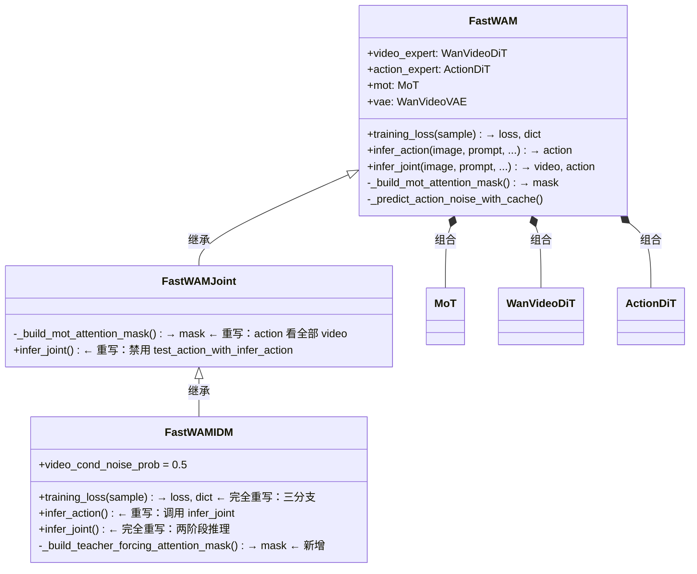

**关键方法重写对照**：

| 方法 | FastWAM | FastWAMJoint | FastWAMIDM |
|------|:-------:|:------------:|:----------:|
| `_build_mot_attention_mask` | 首帧掩码 | **全视频掩码** | 继承 Joint |
| `training_loss` | 继承 | 继承 | **三分支 teacher-forcing** |
| `infer_joint` | 联合去噪 | 继承（禁用交叉验证） | **两阶段去噪** |
| `infer_action` | KV-cache 快速推理 | 继承 | **转发到 infer_joint** |

#### 11.2.2 三变体掩码差异的精确对比

```
Fast-WAM 掩码:                    FastWAM-Joint 掩码:
     f0  f1..fT  action                f0  f1..fT  action
f0  [ 1    0      0  ]           f0  [ 1    0      0  ]
f1  [ 1    1      0  ]    →      f1  [ 1    1      0  ]
act [ 1    0      1  ]           act [ 1    1      1  ]  ← 动作看全部视频！

FastWAM-IDM 训练掩码:
     noisy_v  cond_v  action
nv  [  1       0       0  ]     ← 噪声视频互相看
cv  [  0       1       0  ]     ← 条件视频互相看  
act [  0       1       1  ]     ← 动作只看条件视频 + 动作自身
```

对应代码：
- Fast-WAM: `fastwam.py:_build_mot_attention_mask()` L386-407 — `mask[video_seq_len:, :first_frame_tokens] = True`
- Joint: `fastwam_joint.py:_build_mot_attention_mask()` L29-49 — `mask[video_seq_len:, :video_seq_len] = True`
- IDM: `fastwam_idm.py:_build_teacher_forcing_attention_mask()` L20-56 — 三段式掩码

---

### 11.3 三变体推理流程对比

#### Fast-WAM：单次 Prefill + 动作去噪

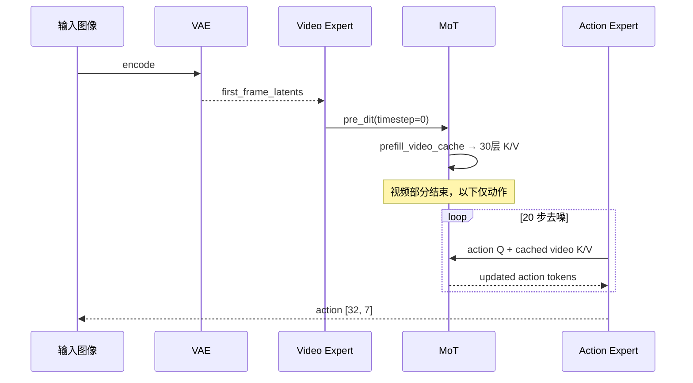

**延迟**: ~190 ms（1 次 video forward + 20 × action-only forward）

#### Fast-WAM-Joint：完整联合去噪

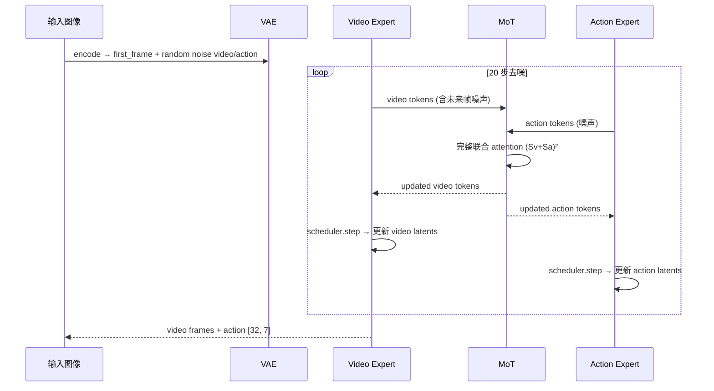

**延迟**: ~760+ ms（每步都跑完整 5B Video DiT）

#### Fast-WAM-IDM：两阶段去噪

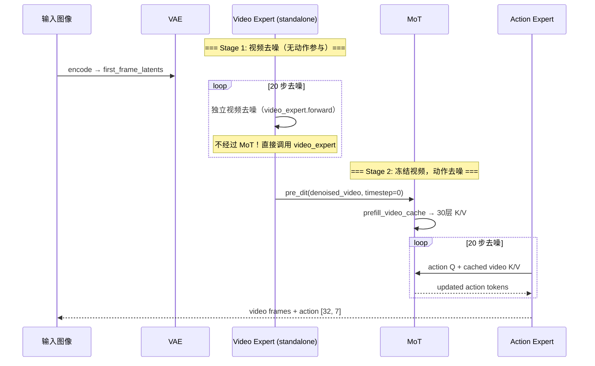

**延迟**: ~810 ms（20 步视频去噪 + 1 次 prefill + 20 步动作去噪）

**关键实现差异**（`fastwam_idm.py:380-452`）：
- Stage 1 直接调用 `self.video_expert(x=latents_video, ...)` 而非经过 MoT——这意味着视频去噪时**动作信息完全不参与**
- Stage 2 使用 `prefill_video_cache` + `_predict_action_noise_with_cache`，与 Fast-WAM 的推理路径相同

---

### 11.4 IDM 训练数据流——三分支 Teacher-Forcing

IDM 的 `training_loss()`（`fastwam_idm.py:58-227`）是最复杂的变体，涉及三个并行分支：

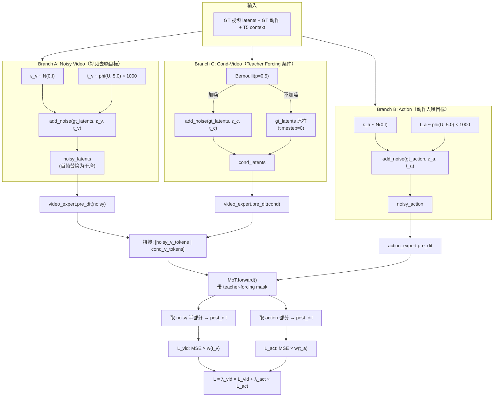

**Teacher-Forcing 的精妙之处**：

1. **条件视频的 50% 噪声增强**（`video_cond_noise_prob = 0.5`）：训练时随机对条件视频加噪，使模型学会从不完美的视频预测中提取动作信息——这对推理时的泛化至关重要，因为 Stage 1 生成的视频不可能完美
2. **注意力掩码隔离**：noisy-video 和 cond-video 互不可见，action 只看 cond-video——这模拟了推理时的两阶段结构
3. **仅 noisy 半部分计算视频损失**：`pred_video_tokens = tokens_out["video"][:, :noisy_video_seq_len]`——cond-video 的目的是提供条件信号，不参与视频损失

---

### 11.5 已实现但存在差异的部分

#### 11.5.1 噪声采样分布

| | 论文描述 | 代码实现 |
|---|---|---|
| 分布 | Logit-normal distribution | Uniform \(u \sim U(0,1)\) + shift-based \(\phi(u,s)\) |
| 公式 | — | \(\phi(u, s) = \frac{s \cdot u}{1 + (s-1) \cdot u}\)，\(t = \phi(u,s) \times T\) |
| 效果 | 偏向中间噪声水平 | 偏向高噪声端（shift=5.0 时） |

**差异分析**：两种分布都实现了「非均匀时间步采样」的目标，但侧重点不同。Logit-normal 产生对称的钟形分布集中在 \(t=0.5\) 附近，而 shift-based 采样在 \(s>1\) 时偏向高噪声端。实际上，Wan2.2 官方实现使用的就是 shift-based 采样，论文可能是用 "logit-normal" 对这种非均匀采样的简化描述。配合训练权重函数 \(w(t)\)（在 \(t=T/2\) 处最大）后，两种方案的训练效果差异应当很小。

#### 11.5.2 Classifier-Free Guidance（CFG）

**论文**：推理时使用 `cfg_scale = 1.0`，即**实质上禁用了 CFG**。

**代码现状**：

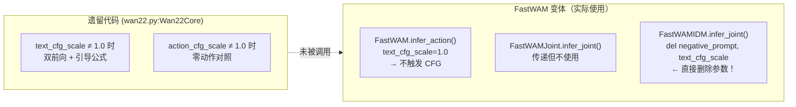

**结论**：CFG 基础设施完整存在于遗留 `Wan22Core` 中，但三个 FastWAM 变体均不使用。这与论文 `cfg_scale=1.0` 的设定一致——CFG 在 Fast-WAM 场景下被有意禁用。原因可能是：机器人操作的文本指令通常是明确的任务描述，不需要像通用文本-视频生成那样做无条件引导。

#### 11.5.3 Action-Conditioned Video（动作条件视频生成）

`WanVideoDiT` 在代码层面**完整实现**了动作条件视频生成（`action_conditioned` 参数控制）：

- 当启用时，Action embedding 层被创建：`nn.Linear(action_dim, hidden_dim)`
- GT 动作被编码为 token 拼接到 T5 context 中
- 通过 `group_diagonal` 掩码控制每帧只看对应时间步的动作

然而，**所有配置文件** (`fastwam.yaml`, `fastwam_joint.yaml`, `fastwam_idm.yaml`) 都设为 `action_conditioned: false`。

这意味着当前 Fast-WAM 的视频生成**不以 GT 动作为条件**——视频骨干仅根据当前观测和语言指令预测未来。这可能是有意为之：动作条件会引入训练-推理不一致（推理时没有 GT 动作可用），除非配合 CFG 在推理时丢弃动作条件。

---

### 11.6 未实现的部分

#### 11.6.1 w/o Video Co-training 变体

**论文作用**：这是论文最关键的消融实验——去掉视频 co-training 后性能下降 4-8 分，直接支撑核心命题。

**代码现状**：无现成配置文件。但实现极其简单：

```yaml
# 只需创建一个新的 task config，覆盖 loss.lambda_video
# configs/task/libero_no_video_2cam224_1e-4.yaml
defaults:
  - override /data: libero_2cam
  - override /model: fastwam
  - _self_

model:
  loss:
    lambda_video: 0.0  # ← 关键：视频损失权重设为 0

# 其余参数同 libero_uncond_2cam224_1e-4.yaml
```

代码已支持 `loss_lambda_video` 参数（`fastwam.py` L39, L86, L563），只是没有预置配置。

#### 11.6.2 真实机器人部署代码

论文在 Galaxea R1 Lite 上完成了折叠毛巾实验，但代码库**完全没有真机相关代码**：

| 缺失内容 | 说明 |
|----------|------|
| 机器人控制接口 | 无 ROS / 自定义控制 API |
| 实时推理循环 | 无 observation → action → execute 闭环 |
| 相机标定/配置 | 无真实相机参数 |
| 数据采集脚本 | 无遥操作数据录制工具 |
| 安全机制 | 无碰撞检测/急停逻辑 |

仅有 LIBERO（MuJoCo）和 RoboTwin（Isaac Gym）两种仿真评测。

#### 11.6.3 CFG 训练时条件丢弃

有效的 CFG 需要在训练时以一定概率丢弃条件信号（如随机用空字符串替换文本指令）。代码中**没有此实现**——训练时文本条件始终存在。由于论文使用 `cfg_scale=1.0`（不启用 CFG），这不影响当前结果，但限制了未来启用 CFG 的能力。

#### 11.6.4 FID/FVD 视频质量指标

仅实现了像素级指标（`video_metrics.py`）：

| 已实现 | 未实现 |
|--------|--------|
| PSNR（峰值信噪比） | FID（Fréchet Inception Distance） |
| SSIM（结构相似性） | FVD（Fréchet Video Distance） |

FID/FVD 需要预训练的特征提取器（如 I3D），属于评测工具而非模型本身。

#### 11.6.5 Re-planning 控制器

论文提及的 re-planning 行为（每隔 N 步重新预测动作 chunk）由**外部仿真器**处理：

```yaml
# configs/sim_robotwin.yaml
replan_steps: 24  # 每 24 步重新调用模型
skip_get_obs_within_replan: false  # 是否跳过中间观测获取
```

这意味着 re-planning 逻辑在 `third_party/RoboTwin/script/eval_policy.py` 中，而非 FastWAM 模型内部。模型只负责给定一帧观测输出 32 步动作。

---

### 11.7 缺失部分对算法效果的影响分析

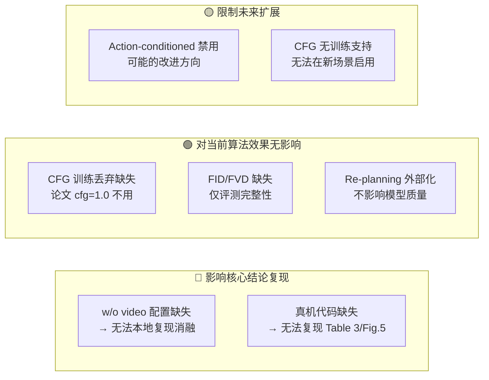

**逐项分析**：

| 缺失 | 影响级别 | 详细分析 |
|------|:--------:|----------|
| **w/o video 配置** | 🔴 高 | 论文最核心消融（Table 1/2 最后一行）无法本地复现。但修复极简单——创建一个 `lambda_video: 0` 的配置文件即可 |
| **真机代码** | 🔴 高 | 论文 Table 3 和 Figure 5 的真机折叠毛巾实验完全无法复现。需要 Galaxea R1 Lite 硬件 + 专用控制栈 |
| **CFG 训练丢弃** | 🟢 无 | 论文推理时 `cfg_scale=1.0` 等价于不使用 CFG，因此训练时是否丢弃条件无关紧要 |
| **FID/FVD** | 🟢 无 | 这些是评估视频生成质量的指标，论文主要关注任务成功率而非视频质量 |
| **Re-planning** | 🟢 无 | 由仿真器的 receding horizon 控制循环处理，模型只需支持 `infer_action()` 接口即可 |
| **Action-conditioned** | 🟡 中 | 代码基础设施完整但禁用。启用后可能改善视频预测质量（视频知道动作将如何执行），但需配合 CFG 解决训练-推理不一致 |

---

### 11.8 代码中有但论文未明确描述的实现细节

以下是代码中存在但论文未详细展开的重要技术决策：

#### 11.8.1 Separated Timestep（分离时间步嵌入）

`wan_video_dit.py` 中 `seperated_timestep: true` 使**每个 token 获得独立的时间步嵌入**，而非整个序列共享一个。这意味着：
- 首帧所有 token 的 \(t=0\)（干净输入信号）
- 未来帧所有 token 的 \(t=t_\text{sampled}\)（噪声水平信号）

这创造了一种**时间步感知的位置编码**——模型可以从 AdaLN 调制信号中区分"当前真实观测"和"未来噪声预测"。

\[
t_\text{mod}(i,j) = \text{project}\left(\text{sinusoidal}(\delta_{i=0} \cdot 0 + (1-\delta_{i=0}) \cdot t)\right)
\]

其中 \(i\) 是帧索引，\(j\) 是帧内空间位置，\(\delta_{i=0}\) 是首帧指示函数。

#### 11.8.2 Delta Action Mask

`configs/data/libero_2cam.yaml` 中：
```yaml
delta_action_dim_mask:
  default: [true, true, true, true, true, true, false]
```

前 6 维（末端执行器位姿）使用**增量动作**（\(\Delta\) pose），第 7 维（夹爪）使用**绝对值**。这种混合空间设计确保夹爪状态不会因累积误差而漂移。

#### 11.8.3 两级梯度检查点

代码提供了精细的内存-计算权衡控制：

| 级别 | 开关 | 作用域 | 效果 |
|------|------|--------|------|
| Level 1 | `mot_checkpoint_mixed_attn` | MoT 联合注意力 | 检查点 Flash Attention 计算 |
| Level 2 | `use_gradient_checkpointing` | DiTBlock post-block | 检查点 cross-attn + FFN |

任务配置 `libero_uncond_2cam224_1e-4.yaml` 将 `mot_checkpoint_mixed_attn: false`（关闭检查点换取速度），而模型默认配置设为 `true`（节省内存）。

#### 11.8.4 T5 嵌入预计算缓存

训练时通过 `scripts/precompute_text_embeds.py` 一次性生成所有任务的 T5 嵌入并保存到 `data/text_embeds_cache/`。数据集加载时直接读取 \([L, 4096]\) 张量，跳过 T5 前向——节省约 **1.3B 参数的显存和计算**。

#### 11.8.5 IDM 条件视频噪声增强概率

`FastWAMIDM.video_cond_noise_prob = 0.5` 是一个硬编码的超参数，论文提及但未讨论如何选择。50% 的概率意味着：
- 一半训练样本中，动作专家看到的是**干净的 GT 视频**（理想情况）
- 另一半中，看到的是**加了随机噪声的视频**（模拟推理时的不完美视频预测）

这种数据增强策略类似于 scheduled sampling，在 teacher-forcing 和 free-running 之间做插值。

---

### 11.9 关键实现细节的代码逻辑

#### 11.9.1 Fast-WAM 推理的完整调用链

```
FastWAM.infer_action()                          [fastwam.py:906]
├── _encode_input_image_latents_tensor()         [fastwam.py:254] → VAE 编码
├── encode_prompt() 或使用预计算 context          [fastwam.py:202]
├── _append_proprio_to_context()                 [fastwam.py:219] → 可选 proprio
├── video_expert.pre_dit(timestep=0)             [wan_video_dit.py:509]
│   ├── patchify (Conv3d)                        → [B, T*H'*W', 3072]
│   ├── sinusoidal_embedding_1d(t=0)             → per-token timestep
│   ├── text_embedding(context)                  → [B, L, 3072]
│   └── compute 3D RoPE freqs                   → [S, 1, 128]
├── _build_mot_attention_mask()                  [fastwam.py:386]
├── mot.prefill_video_cache()                    [mot.py:257]
│   └── for layer in 30:
│       ├── _build_expert_attention_io()         → Q, K, V + post-block state
│       ├── _mixed_attention(Q, K, V, mask)      → Flash Attention
│       ├── _apply_post_with_optional_checkpoint → cross-attn + FFN
│       └── cache.append({K, V})
├── infer_action_scheduler.build_inference_schedule(steps=20)
└── for step in 20:
    ├── action_expert.pre_dit(noisy_action, t_i) [action_dit.py:226]
    │   ├── action_encoder (Linear)              → [B, 32, 1024]
    │   ├── sinusoidal_embedding_1d(t_i)         → timestep embed
    │   └── text_embedding(context)              → [B, L, 1024]
    ├── mot.forward_action_with_video_cache()     [mot.py:343]
    │   └── for layer in 30:
    │       ├── build action Q, K, V
    │       ├── K_cat = [K_video_cached; K_action]
    │       ├── V_cat = [V_video_cached; V_action]
    │       └── flash_attention(Q_a, K_cat, V_cat, mask)
    ├── action_expert.post_dit(tokens)           → pred_noise [B, 32, 7]
    └── scheduler.step(pred, delta, latents)     → updated latents

返回: {action: [32, 7]}
```

#### 11.9.2 训练 loss 的核心数学实现

`training_loss` 中的损失计算可以展开为以下步骤：

**Step 1**: 独立采样两套噪声和时间步

\[
\epsilon_v \sim \mathcal{N}(0,I), \quad t_v = \phi(u_v, 5) \times 1000, \quad u_v \sim U(0,1)
\]
\[
\epsilon_a \sim \mathcal{N}(0,I), \quad t_a = \phi(u_a, 5) \times 1000, \quad u_a \sim U(0,1)
\]

**Step 2**: 构造加噪样本和目标

\[
z_t = (1 - \sigma_v) z_0 + \sigma_v \epsilon_v, \quad \text{target}_v = \epsilon_v - z_0
\]
\[
a_t = (1 - \sigma_a) a_0 + \sigma_a \epsilon_a, \quad \text{target}_a = \epsilon_a - a_0
\]

**Step 3**: 前向传播（经过 MoT 联合注意力）

\[
[\hat{v}, \hat{a}] = \text{MoT}(\text{pre\_dit}_v(z_t, t_v), \text{pre\_dit}_a(a_t, t_a), M)
\]

**Step 4**: 加权损失

\[
\mathcal{L} = \lambda_v \cdot \underbrace{\frac{1}{B}\sum_i \tilde{w}(t_i^v) \cdot \text{MSE}(\hat{v}_i, \text{target}_i^v)}_{\mathcal{L}_\text{vid}} + \lambda_a \cdot \underbrace{\frac{1}{B}\sum_i \tilde{w}(t_i^a) \cdot \text{MSE}(\hat{a}_i, \text{target}_i^a)}_{\mathcal{L}_\text{act}}
\]

其中 padding 位置通过 `action_is_pad` 和 `image_is_pad` 掩码排除。

---

### 11.10 总结

本地代码库高度忠实地实现了论文的核心方法和全部三个模型变体（Fast-WAM、Joint、IDM），包括训练和推理的完整流水线。主要的"缺口"集中在两方面：

1. **实验复现**：w/o video 消融需要补一个简单的配置文件；真机实验需要专用硬件和控制栈，不在开源范围内
2. **功能扩展**：CFG 训练支持和 action-conditioned video 是完整但未启用的代码基础设施，为未来改进留有空间

从算法效果角度看，**所有影响模型训练和推理质量的核心组件都已完整实现**——缺失的部分要么是评测工具（FID/FVD），要么是被论文有意禁用的功能（CFG），要么是外部系统（真机控制、re-planning 循环）。

---

## 12. 训练 Pipeline 深度拆解

> 本节从命令行入口开始，逐层追踪到梯度更新的最内层，完整呈现 FastWAM 训练流水线的每一个环节。所有序列图、数据流图、类图均用 Mermaid 绘制，数学公式用 LaTeX 表示。

### 12.1 训练 Pipeline 全景图

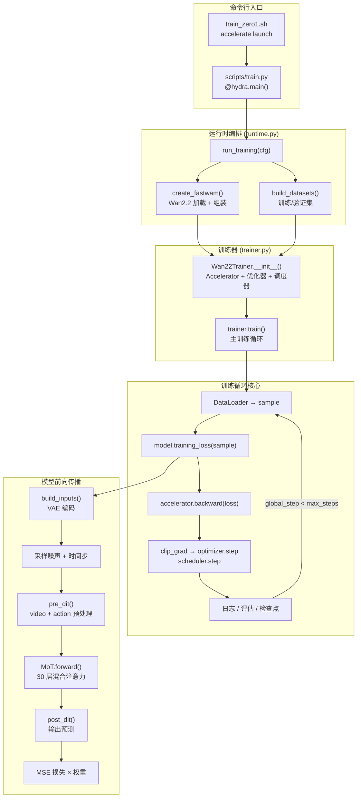

**涉及文件全表**：

| 文件 | 层次 | 核心职责 |
|------|------|----------|
| `scripts/train_zero1.sh` | 启动 | DeepSpeed accelerate launch |
| `scripts/train.py` | 入口 | Hydra 配置加载，调用 `run_training` |
| `src/fastwam/runtime.py` | 编排 | 模型工厂 + 数据集构建 + 训练启动 |
| `src/fastwam/trainer.py` | 训练器 | 训练循环 + 评估 + 检查点 |
| `src/fastwam/datasets/lerobot/robot_video_dataset.py` | 数据 | 视频/动作/文本样本构建 |
| `src/fastwam/datasets/lerobot/processors/fastwam_processor.py` | 处理 | 归一化 + 增量动作 + 合并 |
| `src/fastwam/datasets/lerobot/utils/normalizer.py` | 工具 | min-max / z-score 归一化 |
| `src/fastwam/utils/samplers.py` | 工具 | 可恢复分布式采样器 |
| `src/fastwam/models/wan22/fastwam.py` | 模型 | 顶层模型：build_inputs + training_loss |
| `src/fastwam/models/wan22/wan_video_dit.py` | 模型 | 视频专家：pre_dit + post_dit + DiTBlock |
| `src/fastwam/models/wan22/action_dit.py` | 模型 | 动作专家：pre_dit + post_dit |
| `src/fastwam/models/wan22/mot.py` | 模型 | MoT 混合注意力 |
| `src/fastwam/models/wan22/schedulers/scheduler_continuous.py` | 调度 | Flow Matching 噪声调度 |
| `scripts/preprocess_action_dit_backbone.py` | 预处理 | ActionDiT 权重线性插值 |
| `scripts/precompute_text_embeds.py` | 预处理 | T5 嵌入缓存 |

---

### 12.2 启动与配置层

#### 12.2.1 配置组合机制

FastWAM 使用 **Hydra** 配置框架，通过 `defaults` 列表实现模块化配置组合：

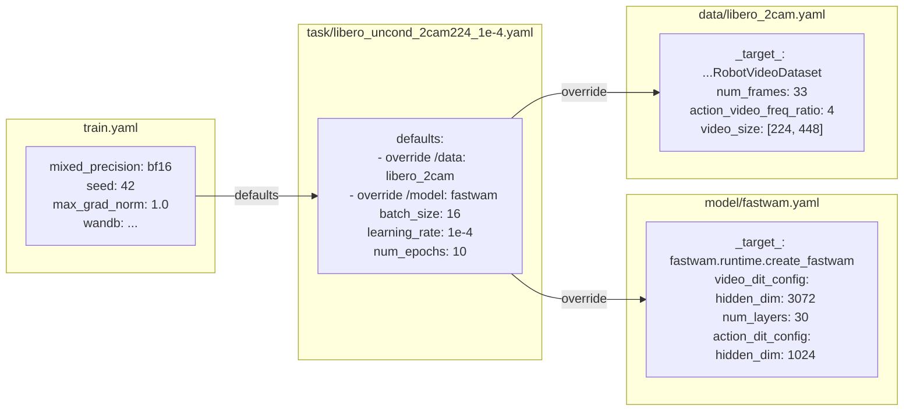

最终合并的配置是一个深层嵌套的 `DictConfig`，所有的 `${...}` 引用在运行时解析。例如 `action_dim: ${data.train.processor.action_output_dim}` 会被替换为 7。

#### 12.2.2 训练入口：三行代码的力量

`scripts/train.py` 是整个训练系统的入口，仅有 **6 行有效代码**：

```python
from fastwam.runtime import run_training, register_default_resolvers
register_default_resolvers()

@hydra.main(config_path="../configs", config_name="train", version_base="1.3")
def main(cfg: DictConfig):
    run_training(cfg)
```

Hydra 会自动扫描 `configs/` 目录，根据 `defaults` 列表合并所有 YAML，然后将合并后的配置传给 `main()`。

#### 12.2.3 DeepSpeed 启动

`scripts/train_zero1.sh` 通过 HuggingFace Accelerate 启动分布式训练：

```bash
accelerate launch \
  --config_file scripts/accelerate_configs/accelerate_zero1_ds.yaml \
  --num_processes "${NPROC_PER_NODE}" \
  scripts/train.py \
  "output_dir=./runs/${TASK}/${RUN_ID}" \
  "${EXTRA_ARGS[@]}"
```

关键参数：
- **ZeRO Stage 1**：只分片优化器状态（每个 GPU 保存完整模型 + 梯度）
- **bf16 混合精度**：平衡精度与速度
- **多机支持**：通过 TCPStore 同步 run ID

---

### 12.3 运行时编排层

`runtime.py:run_training()`（L359-381）是训练的总指挥：

```mermaid
sequenceDiagram
    participant Main as train.py
    participant RT as runtime.py
    participant Model as FastWAM
    participant DS as RobotVideoDataset
    participant Trainer as Wan22Trainer
    
    Main->>RT: run_training(cfg)
    
    Note over RT: 1. 设备与精度
    RT->>RT: _resolve_train_device() → "cuda:0"
    RT->>RT: _normalize_mixed_precision() → "bf16"
    
    Note over RT: 2. 模型创建
    RT->>Model: instantiate(cfg.model) → create_fastwam()
    activate Model
    Model->>Model: load_wan22_ti2v_5b_components()
    Note over Model: 加载 Wan2.2 预训练权重:<br/>VAE + Video DiT + T5
    Model->>Model: ActionDiT.from_pretrained()
    Note over Model: 线性插值初始化 Action DiT
    Model->>Model: MoT(video_expert, action_expert)
    Model->>Model: FastWAM(video, action, mot, vae, ...)
    deactivate Model
    
    Note over RT: 3. 数据集构建
    RT->>DS: build_datasets(cfg.data)
    activate DS
    DS->>DS: RobotVideoDataset(train)
    DS->>DS: compute_normalization_stats()
    DS->>DS: RobotVideoDataset(val)
    deactivate DS
    
    Note over RT: 4. 训练器启动
    RT->>Trainer: Wan22Trainer(model, train_ds, val_ds, cfg)
    Trainer->>Trainer: __init__() → Accelerator + AdamW + Scheduler
    RT->>Trainer: trainer.train()
    Note over Trainer: 进入主训练循环
```

#### 模型工厂：create_fastwam()

`create_fastwam()`（L76-158）的组装步骤：

1. **加载 Wan2.2 预训练组件**：`load_wan22_ti2v_5b_components()` → VAE, Video DiT (5B), T5 Text Encoder, Tokenizer
2. **构建 Action DiT**：`ActionDiT.from_pretrained()` → 从预处理的 backbone 文件加载（线性插值权重）
3. **组装 MoT**：`MoT({"video": video_expert, "action": action_expert})`
4. **创建 FastWAM**：传入所有组件 + 调度器配置 + 损失权重

三个工厂函数的差异仅在于返回的类不同：
- `create_fastwam()` → `FastWAM`
- `create_fastwam_joint()` → `FastWAMJoint`
- `create_fastwam_idm()` → `FastWAMIDM`

---

### 12.4 数据流水线层

#### 12.4.1 RobotVideoDataset：从磁盘到训练样本

```mermaid
flowchart TB
  subgraph Init ["__init__() 初始化"]
    LeRobot["BaseLerobotDataset\n加载 LeRobot 格式 episode"]
    Indices["video_sample_indices\n= [0, 4, 8, ..., 32]\n(stride=4, 9帧)"]
    Transforms["图像变换链\nResize → CenterCrop → Normalize"]
    Stats["归一化统计\ncompute → broadcast → set"]
  end
  
  subgraph GetItem ["__getitem__(idx) 采样流程"]
    Raw["LeRobot sample\n{pixel_values, action, state, instruction, ...}"]
    
    subgraph VideoProc ["视频处理"]
      FrameSample["帧采样\nvideo_sample_indices"]
      MultiCam["多相机拼接\nhorizontal: 224×224 × 2 → 224×448"]
      VidTransform["Resize → CenterCrop → Normalize\n→ [C, T, H, W], 值域 [-1,1]"]
    end
    
    subgraph ActionProc ["动作/状态处理"]
      ActionRaw["action [32, 7]\nstate [33, 8]"]
      Processor["FastWAMProcessor.preprocess()"]
    end
    
    subgraph TextProc ["文本处理"]
      Instruction["instruction 构建"]
      Cache["T5 缓存查找\nSHA256(prompt) → .pt 文件"]
      Context["context [128, 4096]\ncontext_mask [128]"]
    end
    
    Raw --> FrameSample --> MultiCam --> VidTransform
    Raw --> ActionRaw --> Processor
    Raw --> Instruction --> Cache --> Context
  end
```

**帧采样细节**：

配置 `num_frames=33, action_video_freq_ratio=4` 意味着：
- 原始 33 帧中，每隔 4 帧取 1 帧视频：`video_sample_indices = [0, 4, 8, 12, 16, 20, 24, 28, 32]` → **9 帧视频**
- 动作保持原频率：**32 步动作**（比视频快 4×）
- 约束：`(33-1) % 4 == 0` 且 `(33-1) / 4 % 4 == 0`（VAE 时间维要求）

**多相机拼接模式**：

| 模式 | LIBERO (2 cam) | RoboTwin (3 cam) |
|------|:---:|:---:|
| `horizontal` | 224×224 + 224×224 → 224×448 | — |
| `robotwin` | — | top(256×320) + [left(128×160)\|right(128×160)] → 384×320 |

#### 12.4.2 FastWAMProcessor：归一化与合并

```mermaid
flowchart TB
  Input["原始 sample dict"] --> InstAug["指令增强\n[High]: ... [Low]: ...\n随机丢弃 high-level"]
  Input --> ImgTrans["图像变换\nToTensor → Resize(224)"]
  Input --> DeltaMask["Delta Action Mask\n前6维(EEF)=增量, 第7维(夹爪)=绝对\n→ padding 位置的增量维归零"]
  
  DeltaMask --> ActStateTrans["Action-State Transform\n可选的坐标变换链"]
  ActStateTrans --> Normalize["LinearNormalizer.forward()\nmin-max → [-1, 1]\n(clamp 到 [-5, 5])"]
  Normalize --> Merge["ConcatLeftAlign.forward()\n多 key 拼接 + 维度 padding"]
  
  ImgTrans --> Output["处理后 sample"]
  InstAug --> Output
  Merge --> Output
```

**归一化数学**（`SingleFieldLinearNormalizer`）：

对于 min-max 模式：

\[
\hat{x} = \text{clamp}\left(\frac{2(x - x_\min)}{x_\max - x_\min} - 1,\; -5,\; 5\right)
\]

对于 z-score 模式：

\[
\hat{x} = \text{clamp}\left(\frac{x - \mu}{\sigma + 10^{-8}},\; -5,\; 5\right)
\]

clamp 到 \([-5, 5]\) 是防止离群值在混合精度训练中导致数值溢出。

#### 12.4.3 一个训练样本的完整张量流

```mermaid
flowchart LR
  subgraph Raw ["原始数据"]
    R_img["pixel_values\n[2, 33, 3, 512, 512]"]
    R_act["action\n[32, 7]"]
    R_sta["state\n[33, 8]"]
    R_txt["instruction: str"]
  end
  
  subgraph Processed ["处理后"]
    P_vid["video\n[3, 9, 224, 448]"]
    P_act["action\n[32, 7]"]
    P_pro["proprio\n[32, 8]"]
    P_ctx["context\n[128, 4096]"]
    P_msk["context_mask\n[128]"]
    P_apad["action_is_pad\n[32]"]
    P_ipad["image_is_pad\n[9]"]
  end
  
  subgraph Batched ["DataLoader 批次"]
    B_vid["video\n[B, 3, 9, 224, 448]"]
    B_act["action\n[B, 32, 7]"]
    B_pro["proprio\n[B, 32, 8]"]
    B_ctx["context\n[B, 128, 4096]"]
  end
  
  R_img -->|"帧采样 + 拼接 + 变换"| P_vid
  R_act -->|"归一化 + 合并"| P_act
  R_sta -->|"归一化 → proprio"| P_pro
  R_txt -->|"SHA256 → 缓存加载"| P_ctx
  
  P_vid -->|"collate"| B_vid
  P_act -->|"collate"| B_act
  P_pro -->|"collate"| B_pro
  P_ctx -->|"collate"| B_ctx
```

---

### 12.5 训练器核心

#### 12.5.1 Trainer 初始化流程

`Wan22Trainer.__init__()`（`trainer.py:29-130`）按顺序完成以下初始化：

```mermaid
flowchart TB
  subgraph Step1 ["1. 配置提取"]
    Cfg["cfg → lr, wd, bs, epochs,\nlog/save/eval_every,\ngrad_accum, max_grad_norm"]
  end
  
  subgraph Step2 ["2. Accelerator"]
    Acc["Accelerator(\n  gradient_accumulation_steps,\n  mixed_precision='bf16',\n  step_scheduler_with_optimizer=False\n)"]
  end
  
  subgraph Step3 ["3. 模型冻结"]
    Freeze["model.eval() → 全部冻结\nmodel.dit.train() → MoT 解冻\nproprio_encoder.train() → 解冻"]
  end
  
  subgraph Step4 ["4. 优化器"]
    Optim["AdamW(\n  params = dit + proprio_encoder,\n  lr = 1e-4,\n  weight_decay = 1e-2,\n  betas = (0.9, 0.95)\n)"]
  end
  
  subgraph Step5 ["5. 数据加载器"]
    DL["DataLoader(\n  sampler = ResumableEpochSampler,\n  batch_size, num_workers,\n  pin_memory = True\n)"]
  end
  
  subgraph Step6 ["6. 学习率调度"]
    LR["5% warmup: LinearLR(1/T → 1)\n↓\n95% cosine: CosineAnnealingLR(\n  eta_min = lr × 0.01\n)"]
  end
  
  subgraph Step7 ["7. 分布式包装"]
    Prep["accelerator.prepare(\n  model, optimizer,\n  dataloader, scheduler\n)\n→ DDP/DeepSpeed 包装"]
  end
  
  Cfg --> Acc --> Step3 --> Optim --> DL --> LR --> Prep
```

#### 12.5.2 冻结策略——只训练 MoT

```python
# trainer.py:_apply_dit_only_train_mode() (L287-295)
model.eval()                      # 所有层设为 eval 模式
model.requires_grad_(False)       # 所有参数冻结
model.dit.train()                 # MoT (包含 video+action DiT) 解冻为训练模式
model.dit.requires_grad_(True)    # MoT 梯度开启
# proprio_encoder 如果存在，也单独解冻
```

**效果**：VAE（编码/解码）和 T5（文本编码）的参数**完全冻结**，它们只做前向传播。只有 MoT 内的参数（Video DiT 30层 + Action DiT 30层 + 各自的 embedding/head）参与梯度更新。

**类比**：这类似于 LoRA fine-tuning 的理念——保持预训练骨干不动，只训练新引入的交互层。但 FastWAM 更激进：整个 DiT 参数（包括预训练权重）都会更新，只是 VAE/T5 不动。

#### 12.5.3 学习率调度

\[
\eta(t) = \begin{cases}
\eta_\max \cdot \frac{t}{T_w} & 0 \leq t < T_w \quad \text{(线性热身)} \\[6pt]
\eta_\min + \frac{\eta_\max - \eta_\min}{2}\left(1 + \cos\frac{\pi(t - T_w)}{T - T_w}\right) & T_w \leq t < T \quad \text{(余弦衰减)}
\end{cases}
\]

其中 \(T_w = 0.05 \times T\)（5% 热身），\(\eta_\min = 0.01 \times \eta_\max\)。

**对于 LIBERO 的典型参数**：
- 总步数 \(T\) ≈ 20000（10 epochs × ~2000 steps/epoch）
- 热身 \(T_w\) = 1000 步
- \(\eta_\max = 10^{-4}\)，\(\eta_\min = 10^{-6}\)

#### 12.5.4 主训练循环

```mermaid
sequenceDiagram
    participant Sampler as ResumableEpochSampler
    participant DL as DataLoader
    participant Model as FastWAM
    participant Acc as Accelerator
    participant Opt as AdamW
    participant Sched as CosineAnnealingLR
    participant Log as W&B / Console
    
    loop while global_step < max_steps
        DL->>Sampler: next batch indices
        Sampler-->>DL: shuffled indices (epoch-seeded)
        DL-->>Model: sample batch
        
        Note over Acc: accumulate context (梯度累积)
        
        rect rgb(240, 248, 255)
            Note over Model: 前向传播
            Model->>Model: training_loss(sample)
            Model-->>Acc: loss, loss_dict
            
            Note over Acc: 反向传播
            Acc->>Acc: backward(loss)
        end
        
        alt sync_gradients == true (累积完成)
            Acc->>Acc: clip_grad_norm_(max=1.0)
            Acc->>Opt: step()
            Opt->>Sched: step() (if not skipped)
            Opt->>Opt: zero_grad(set_to_none=True)
            Note over Model: global_step += 1
        end
        
        alt global_step % log_every == 0
            Model-->>Log: loss, grad_norm, lr, speed
        end
        
        alt global_step % eval_every == 0
            Model->>Model: evaluate()
            Model-->>Log: val_loss, PSNR, SSIM, action_L1/L2
        end
        
        alt global_step % save_every == 0
            Model->>Model: save_checkpoint()
            Note over Model: weights + state + trainer_state.json
        end
    end
```

**梯度累积机制**（`accelerator.accumulate(model)` 上下文管理器）：

当 `gradient_accumulation_steps=N` 时：
- 前 N-1 次前向/反向：梯度**累加**但不同步跨 GPU，不执行 optimizer.step
- 第 N 次：`sync_gradients=True`，触发 all-reduce 梯度同步 + optimizer.step
- 等效批大小 = `batch_size × N × num_GPUs`

#### 12.5.5 评估流程

`evaluate()`（`trainer.py:376-565`）在每个 eval 间隔执行：

1. 从验证集随机取 1 个样本
2. 计算**验证损失**（与训练相同的 `training_loss()`）
3. 执行**推理**：`model.infer()` 生成视频 + 动作
4. 计算**视频指标**：
   - 预测 vs GT：PSNR, SSIM
   - VAE重建 vs GT：PSNR, SSIM（衡量 VAE 信息损失上界）
   - 预测 vs VAE重建：PSNR, SSIM（衡量去噪质量）
5. 计算**动作指标**：反归一化后的 L1 和 L2 误差
6. 生成**可视化视频**：水平拼接 [预测 | VAE重建 | GT]，保存为 MP4
7. 跨 GPU 聚合所有指标

---

### 12.6 模型前向传播——training_loss() 的完整生命周期

#### 12.6.1 build_inputs()：从样本到模型输入

`fastwam.py:build_inputs()`（L277-383）完成原始训练样本到模型可消费格式的转换：

```mermaid
flowchart TB
  Sample["训练 sample\n{video, action, proprio,\ncontext, context_mask, ...}"]
  
  Sample --> VideoEnc["VAE.encode(video)\n[B,3,9,224,448] → [B,48,3,28,56]"]
  VideoEnc --> FirstFrame["提取首帧 latent\nfirst_frame_latents [B,48,1,28,56]"]
  VideoEnc --> AllLatents["input_latents [B,48,3,28,56]"]
  
  Sample --> CtxMove["context → device, dtype\n[B, 128, 4096]"]
  Sample --> ProprioEnc["proprio_encoder(proprio[:,0,:])\n[B, 8] → Linear → [B, 1, 4096]"]
  CtxMove --> CtxConcat["context = cat([context, proprio_token])\n[B, 129, 4096]"]
  ProprioEnc --> CtxConcat
  
  Sample --> ActMove["action → device, dtype\n[B, 32, 7]"]
```

**VAE 编码的张量变化**（以 LIBERO 224×448 为例）：

\[
\underbrace{[B, 3, 9, 224, 448]}_{\text{原始视频}} \xrightarrow{\text{VAE}} \underbrace{[B, 48, 3, 28, 56]}_{\text{latent 视频}}
\]

时间维：\((9-1)/4 + 1 = 3\) 个 latent 帧；空间维：\(224/8 = 28\)，\(448/8 = 56\)

#### 12.6.2 噪声采样——两条独立的 Flow Matching 路径

```mermaid
flowchart LR
  subgraph VideoNoise ["视频噪声路径"]
    uv["u_v ~ U(0,1)"]
    uv --> phiv["σ_v = φ(u_v, 5.0)"]
    phiv --> tv["t_v = σ_v × 1000"]
    
    epv["ε_v ~ N(0,I)\n[B,48,3,28,56]"]
    
    tv --> addv["latents_v = (1-σ_v)·z₀ + σ_v·ε_v"]
    epv --> addv
    addv --> targetv["target_v = ε_v - z₀"]
    addv --> freezev["latents_v[:,:,0:1] = first_frame\n（首帧替换为干净 latent）"]
  end
  
  subgraph ActionNoise ["动作噪声路径"]
    ua["u_a ~ U(0,1)"]
    ua --> phia["σ_a = φ(u_a, 5.0)"]
    phia --> ta["t_a = σ_a × 1000"]
    
    epa["ε_a ~ N(0,I)\n[B,32,7]"]
    
    ta --> adda["action_t = (1-σ_a)·a₀ + σ_a·ε_a"]
    epa --> adda
    adda --> targeta["target_a = ε_a - a₀"]
  end
```

**关键设计**：视频和动作的噪声 \(\epsilon\) 和时间步 \(t\) 是**完全独立采样**的。这意味着在同一个训练样本中，视频可能处于"几乎纯噪声"状态，而动作处于"几乎干净"状态——反之亦然。这种解耦增加了训练信号的多样性。

#### 12.6.3 Video Expert pre_dit()：Patchify + 分离时间步 + 3D RoPE

`wan_video_dit.py:pre_dit()`（L509-620）将 VAE latent 转化为 DiT 可处理的 token 序列：

```mermaid
flowchart TB
  Latents["noisy_latents\n[B, 48, 3, 28, 56]"]
  
  Latents --> Patch["Conv3d Patchify\nkernel=[1,2,2], stride=[1,2,2]\n48 → 3072"]
  Patch --> PatchOut["[B, 3072, 3, 14, 28]"]
  PatchOut --> Flatten["rearrange → [B, 1176, 3072]\nseq_len = 3×14×28 = 1176"]
  
  subgraph TimestepEmbed ["分离时间步嵌入"]
    T_input["timestep [B]"]
    T_input --> TokenT["构造 per-token timestep\n首帧: t=0, 后续帧: t=t_sampled\n[B, 3, 392] → flatten [B×1176]"]
    TokenT --> SinEmb["sinusoidal_embedding_1d\n→ [B×1176, 256]"]
    SinEmb --> TimeMLP["time_embedding (MLP)\n→ [B×1176, 3072]"]
    TimeMLP --> TimeProj["time_projection\n→ [B, 1176, 6, 3072]\n6 个 AdaLN 调制参数"]
  end
  
  subgraph RoPE ["3D RoPE 频率"]
    Coords["3D 坐标 (f, h, w)\n每个 token 的帧/高/宽位置"]
    Coords --> FreqsCat["freqs = cat[RoPE_f, RoPE_h, RoPE_w]\n[1176, 1, 128]"]
  end
  
  subgraph TextEmb ["文本嵌入"]
    Ctx["context [B, 129, 4096]"]
    Ctx --> TextProj["Linear(4096 → 3072)\n→ [B, 129, 3072]"]
  end
```

**tokens_per_frame 计算**（以 LIBERO 为例）：

\[
\text{tokens\_per\_frame} = \frac{28}{2} \times \frac{56}{2} = 14 \times 28 = 392
\]

总序列长度 \(S_v = 3 \times 392 = 1176\)。

#### 12.6.4 Action Expert pre_dit()

`action_dit.py:pre_dit()`（L226-299）处理动作序列：

| 步骤 | 操作 | 输入 → 输出 |
|------|------|------------|
| 动作编码 | `nn.Linear(7 → 1024)` | [B, 32, 7] → [B, 32, 1024] |
| 时间步嵌入 | `sinusoidal → MLP` | [B] → [B, 1024] → t_mod [B, 6, 1024] |
| 文本嵌入 | `nn.Sequential(4096→1024→GELU→1024)` | [B, 129, 4096] → [B, 129, 1024] |
| 1D RoPE | `precompute_freqs_cis` | → [32, 1, 128] |

**与 Video Expert 的对比**：
- 时间步嵌入是**全序列共享**的（[B, 6, 1024]），不是 per-token 的——因为所有动作 token 处于同一噪声水平
- RoPE 是**一维**的（只有时间维），不是三维的

#### 12.6.5 MoT.forward()：逐层混合注意力

MoT 的核心是在**每一层**都将两个专家的 token 序列拼接做一次联合 Flash Attention，然后拆回各自分支做独立的 cross-attention 和 FFN。

```mermaid
sequenceDiagram
    participant V as Video Expert Layer i
    participant A as Action Expert Layer i
    participant MoT as Mixed Attention
    participant VPost as Video Post-Block
    participant APost as Action Post-Block
    
    Note over V,A: === 第 i 层（共 30 层）===
    
    rect rgb(255, 245, 238)
        Note over V,A: 1. 各自独立的 Pre-Attention
        V->>V: AdaLN(norm1, t_mod_v) → modulated_v
        V->>V: Q_v = RoPE(norm_q(q_proj(modulated_v)))
        V->>V: K_v = RoPE(norm_k(k_proj(modulated_v)))
        V->>V: V_v = v_proj(modulated_v)
        Note over V: [B, 1176, 3072] each
        
        A->>A: AdaLN(norm1, t_mod_a) → modulated_a
        A->>A: Q_a = RoPE(norm_q(q_proj(modulated_a)))
        A->>A: K_a = RoPE(norm_k(k_proj(modulated_a)))
        A->>A: V_a = v_proj(modulated_a)
        Note over A: [B, 32, 3072] each
    end
    
    rect rgb(240, 248, 255)
        Note over MoT: 2. 拼接 + Flash Attention
        V->>MoT: Q_v, K_v, V_v
        A->>MoT: Q_a, K_a, V_a
        MoT->>MoT: Q = [Q_v; Q_a] → [B, 1208, 3072]
        MoT->>MoT: K = [K_v; K_a] → [B, 1208, 3072]
        MoT->>MoT: V = [V_v; V_a] → [B, 1208, 3072]
        MoT->>MoT: FlashAttn(Q, K, V, mask[1208,1208])
        MoT->>MoT: split → out_v[B,1176,3072], out_a[B,32,3072]
    end
    
    rect rgb(245, 255, 245)
        Note over VPost,APost: 3. 各自独立的 Post-Attention
        MoT->>VPost: out_v
        VPost->>VPost: x_v = gate_msa ⊙ o_proj(out_v) + residual_v
        VPost->>VPost: x_v += cross_attn(norm3(x_v), T5_context)
        VPost->>VPost: x_v += gate_mlp ⊙ FFN(AdaLN(norm2(x_v)))
        Note over VPost: FFN: 3072→14336→GELU→3072
        
        MoT->>APost: out_a
        APost->>APost: x_a = gate_msa ⊙ o_proj(out_a) + residual_a
        APost->>APost: x_a += cross_attn(norm3(x_a), T5_context)
        APost->>APost: x_a += gate_mlp ⊙ FFN(AdaLN(norm2(x_a)))
        Note over APost: FFN: 1024→4096→GELU→1024
    end
```

**一层的计算量分析**：

混合注意力矩阵大小：\((S_v + S_a) \times (S_v + S_a) = 1208 \times 1208 \approx 1.46\text{M}\) 个元素。

但由于结构化掩码，实际有效计算量更小——被 mask 掉的位置在 Flash Attention 中跳过。

#### 12.6.6 post_dit()：从 token 回到预测

**Video Expert**（`wan_video_dit.py:post_dit`）：

\[
\underbrace{[B, 1176, 3072]}_{\text{token}} \xrightarrow{\text{Head}} [B, 1176, 48 \times 1 \times 2 \times 2] = [B, 1176, 192] \xrightarrow{\text{unpatchify}} \underbrace{[B, 48, 3, 28, 56]}_{\text{latent}}
\]

Head 包含 AdaLN 调制（使用时间步嵌入 `t`）+ Linear 投影。

**Action Expert**（`action_dit.py:post_dit`）：

\[
\underbrace{[B, 32, 1024]}_{\text{token}} \xrightarrow{\text{Linear}} \underbrace{[B, 32, 7]}_{\text{predicted noise}}
\]

直接一层线性投影，简洁明了。

#### 12.6.7 损失计算的完整数学

**完整损失函数**：

\[
\mathcal{L} = \lambda_v \cdot \mathcal{L}_\text{vid} + \lambda_a \cdot \mathcal{L}_\text{act}
\]

**视频损失**（含 padding 掩码）：

\[
\mathcal{L}_\text{vid} = \frac{1}{B} \sum_{i=1}^{B} \tilde{w}(t_i^v) \cdot \frac{\sum_{j=1}^{T_z} \mathbb{1}[\text{valid}_j^i] \cdot \frac{1}{C \cdot H_z \cdot W_z} \| \hat{v}_{i,j} - (\epsilon_{i,j}^v - z_{i,j}^0) \|_F^2}{\sum_{j=1}^{T_z} \mathbb{1}[\text{valid}_j^i]}
\]

其中 \(\mathbb{1}[\text{valid}_j^i] = 1 - \text{image\_is\_pad}[i, j]\)，padding 位置不参与损失。

**动作损失**：

\[
\mathcal{L}_\text{act} = \frac{1}{B} \sum_{i=1}^{B} \tilde{w}(t_i^a) \cdot \frac{\sum_{k=1}^{H} \mathbb{1}[\text{valid}_k^i] \cdot \frac{1}{d_a} \| \hat{a}_{i,k} - (\epsilon_{i,k}^a - a_{i,k}^0) \|^2}{\sum_{k=1}^{H} \mathbb{1}[\text{valid}_k^i]}
\]

**训练权重**（来自 `scheduler_continuous.py:training_weight`）：

\[
\tilde{w}(t) = \frac{\exp\left(-2\left(\frac{t - T/2}{T}\right)^2\right) - w_\min}{\bar{w} + \epsilon}
\]

这个高斯权重让模型**更关注中等噪声水平的样本**——这些样本包含最有区分度的训练信号。

---

### 12.7 完整类图

```mermaid
classDiagram
    class Wan22Trainer {
        -model: FastWAM
        -accelerator: Accelerator
        -optimizer: AdamW
        -scheduler: SequentialLR
        -train_loader: DataLoader
        -global_step: int
        +train()
        +evaluate() → dict
        +save_checkpoint()
        +load_training_state()
        -_build_scheduler()
        -_apply_dit_only_train_mode()
        -_estimate_eta()
    }
    
    class FastWAM {
        +video_expert: WanVideoDiT
        +action_expert: ActionDiT
        +mot: MoT
        +vae: WanVideoVAE
        +proprio_encoder: Linear
        +train_video_scheduler: FlowMatchScheduler
        +train_action_scheduler: FlowMatchScheduler
        +training_loss(sample) → loss, dict
        +build_inputs(sample) → dict
        +save_checkpoint(path)
    }
    
    class WanVideoDiT {
        +patch_embedding: Conv3d
        +blocks: ModuleList~DiTBlock~
        +head: Head
        +text_embedding: Linear
        +time_embedding: Sequential
        +pre_dit(x, t, ctx) → dict
        +post_dit(tokens, state) → Tensor
        +build_video_to_video_mask()
    }
    
    class ActionDiT {
        +action_encoder: Linear
        +blocks: ModuleList~DiTBlock~
        +head: Linear
        +text_embedding: Sequential
        +time_embedding: Sequential
        +pre_dit(tokens, t, ctx) → dict
        +post_dit(tokens, state) → Tensor
    }
    
    class MoT {
        +mixtures: ModuleDict
        +num_layers: int
        +forward(embeds, mask, freqs, ctx, t_mod) → dict
        +prefill_video_cache() → list
        +forward_action_with_video_cache()
        -_mixed_attention(q, k, v, mask)
        -_build_expert_attention_io()
        -_apply_expert_post_block()
    }
    
    class DiTBlock {
        +self_attn: SelfAttention
        +cross_attn: CrossAttention
        +ffn: Sequential
        +norm1, norm2, norm3: LayerNorm
        +modulation: Parameter
        +gate: GateModule
    }
    
    class FlowMatchScheduler {
        +shift: float
        +num_train_timesteps: int
        +sample_training_t(B) → Tensor
        +add_noise(x, ε, t) → Tensor
        +training_target(x, ε, t) → Tensor
        +training_weight(t) → Tensor
        +step(pred, δ, x) → Tensor
    }
    
    class RobotVideoDataset {
        -lerobot_dataset: BaseLerobotDataset
        -processor: FastWAMProcessor
        -video_sample_indices: list
        +__getitem__(idx) → dict
        -_get_cached_text_context()
    }
    
    class FastWAMProcessor {
        -normalizer: LinearNormalizer
        -action_state_merger: ConcatLeftAlign
        -delta_action_dim_mask: dict
        +preprocess(sample) → dict
        +augment_instruction(data) → str
        +set_normalizer_from_stats()
    }
    
    class ResumableEpochSampler {
        -seed: int
        -epoch: int
        -resume_batch_offset: int
        +__iter__() → Iterator
        +set_epoch_offset()
        +set_resume_batch_offset()
    }
    
    Wan22Trainer --> FastWAM : trains
    Wan22Trainer --> RobotVideoDataset : loads data
    Wan22Trainer --> ResumableEpochSampler : samples
    FastWAM *-- WanVideoDiT : video_expert
    FastWAM *-- ActionDiT : action_expert
    FastWAM *-- MoT : mot
    FastWAM *-- FlowMatchScheduler : schedulers
    MoT o-- WanVideoDiT : mixtures["video"]
    MoT o-- ActionDiT : mixtures["action"]
    WanVideoDiT *-- DiTBlock : blocks × 30
    ActionDiT *-- DiTBlock : blocks × 30
    RobotVideoDataset --> FastWAMProcessor : processor
```

---

### 12.8 预处理脚本

#### 12.8.1 ActionDiT 骨干预处理——从 5B 到 1B 的智慧压缩

`scripts/preprocess_action_dit_backbone.py` 通过**线性插值 + alpha scaling** 从 Wan2.2 的 5B Video DiT 初始化 1B Action DiT：

```mermaid
flowchart LR
  WanDiT["Wan2.2 Video DiT\nhidden=3072, ffn=14336\n每层权重矩阵"] --> Extract["提取 backbone keys\n(跳过 action_encoder, head)"]
  Extract --> Check{shape 匹配?}
  Check -->|"Yes"| Copy["直接复制\n(e.g. bias, 1D params)"]
  Check -->|"No"| Interp["线性插值\n_resize_tensor_to_shape()\n3072→1024, 14336→4096"]
  Interp --> Alpha{"alpha scaling?"}
  Alpha -->|"Yes"| Scale["value × √(d_src/d_dst)\n= × √(3072/1024) ≈ ×1.73"]
  Alpha -->|"No"| NoScale["原样"]
  Copy --> Save["保存 .pt 文件\n{backbone_state_dict, meta, policy}"]
  Scale --> Save
  NoScale --> Save
```

**Alpha scaling 的数学原理**：

当将宽度为 \(d_\text{src}\) 的权重矩阵插值到 \(d_\text{dst}\) 时，为保持输出方差不变（类似 Xavier 初始化的思想），需要乘以：

\[
\alpha = \sqrt{\frac{d_\text{src}}{d_\text{dst}}}
\]

这确保了 Action DiT 初始化后的激活分布与 Video DiT 类似，有利于训练稳定性。

#### 12.8.2 T5 嵌入预计算

`scripts/precompute_text_embeds.py` 为所有训练任务的文本指令预计算 T5 嵌入：

1. 收集所有数据集目录中的唯一指令
2. 对每个指令：`prompt → SHA256 hash → cache_path`
3. 批量通过 T5 编码：`text → tokenize → T5 forward → [L, 4096]`
4. 原子写入缓存文件（临时文件 + rename，避免并发写入损坏）

文件名格式：`{sha256_hash}.t5_len128.wan22ti2v5b.pt`

---

### 12.9 分布式训练与检查点

#### 12.9.1 DeepSpeed ZeRO-1 集成

```mermaid
flowchart TB
  subgraph GPU0 ["GPU 0"]
    M0["完整模型参数"]
    G0["完整梯度"]
    O0["优化器状态 1/N\n(分片)"]
  end
  
  subgraph GPU1 ["GPU 1"]
    M1["完整模型参数"]
    G1["完整梯度"]
    O1["优化器状态 2/N\n(分片)"]
  end
  
  subgraph GPUn ["GPU N"]
    Mn["完整模型参数"]
    Gn["完整梯度"]
    On["优化器状态 N/N\n(分片)"]
  end
  
  G0 <-->|"All-Reduce\n梯度同步"| G1
  G1 <-->|"All-Reduce"| Gn
```

**ZeRO-1 的核心思想**：每个 GPU 保留完整的模型参数和梯度副本（用于计算），但**优化器状态**（AdamW 的一阶/二阶矩估计）被**均匀分片**到所有 GPU。

对 6B 参数的 FastWAM：
- 模型参数：~12 GB（bf16）
- 优化器状态（fp32）：~48 GB → 分片后每 GPU ~6 GB（8 GPU）
- 显存节约：约 42 GB / GPU

#### 12.9.2 检查点三部件

每次 `save_checkpoint()`（`trainer.py:583-599`）保存三部分：

| 部件 | 路径 | 内容 | 保存者 |
|------|------|------|--------|
| **权重** | `checkpoints/weights/step_*.pt` | MoT 参数 + proprio_encoder | 仅主进程 |
| **训练状态** | `checkpoints/state/step_*/` | 优化器 + 调度器 + RNG 状态 | Accelerator (全部进程) |
| **Trainer 状态** | `checkpoints/state/step_*/trainer_state.json` | global_step, epoch, batch_in_epoch | 仅主进程 |

**恢复流程**（`load_training_state()`，L601-644）：

```mermaid
flowchart TB
  Resume["resume 参数"]
  Resume -->|"是目录"| LoadFull["完整恢复\naccelerator.load_state(dir)\n+ trainer_state.json"]
  Resume -->|"是文件"| LoadWeights["仅加载权重\nmodel.load_checkpoint(file)"]
  Resume -->|"False"| Skip["跳过恢复"]
  
  LoadFull --> RestoreStep["global_step = saved_step"]
  LoadFull --> RestoreEpoch["epoch = saved_epoch"]
  LoadFull --> RestoreBatch["sampler.set_resume_batch_offset(batch_in_epoch)"]
  
  RestoreBatch --> Continue["从断点继续训练\n跳过已处理的 batch"]
```

`ResumableEpochSampler` 的恢复机制确保了**精确断点续训**：通过 `set_resume_batch_offset(batch_in_epoch)` 跳过当前 epoch 中已处理的 batch，从中断的精确位置继续。

---

### 12.10 端到端时间线：一个训练 step 的生命周期

以 LIBERO 配置（batch_size=16, 8 GPU, bf16）为例，一个完整训练 step 的时间线：

```mermaid
gantt
    title 一个训练 step 的时间分解（估算）
    dateFormat X
    axisFormat %s ms
    
    section 数据加载
    DataLoader fetch + preprocess :d1, 0, 50
    
    section 前向传播
    VAE encode (frozen)           :f1, 50, 70
    Noise sampling + add_noise    :f2, 70, 72
    Video pre_dit (patch+embed)   :f3, 72, 80
    Action pre_dit (embed)        :f4, 80, 82
    MoT 30 layers mixed-attn     :f5, 82, 250
    post_dit (head + unpatch)     :f6, 250, 260
    Loss computation              :f7, 260, 265
    
    section 反向传播
    backward through MoT          :b1, 265, 500
    
    section 优化器
    All-Reduce gradients           :o1, 500, 520
    Gradient clipping              :o2, 520, 525
    AdamW step                     :o3, 525, 540
    LR scheduler step              :o4, 540, 542
```

**粗略估算**：
- 前向传播：~215 ms（MoT 占 ~170 ms，即 ~80%）
- 反向传播：~235 ms（约为前向的 1.1×，因为梯度检查点会重算部分前向）
- 通信 + 优化器：~42 ms
- **总计**：~500 ms / step

对于 20000 步训练（LIBERO）：~2.8 小时（8× H100 GPU）。

---

## 13. DreamZero SFT 在 RLinf 中的深度解析

> **代码库**：RLinf（`d:\SRC\RL\RLinf\`）+ DreamZero / Groot（`d:\SRC\Robot\dreamzero\`）  
> **官方文档**：[DreamZero Supervised Fine-Tuning](https://rlinf.readthedocs.io/en/latest/rst_source/examples/embodied/sft_dreamzero.html)  
> **本节定位**：以两份代码库为基础，完整拆解 DreamZero 模型在 RLinf 框架中做 SFT 微调时的架构设计、代码调用流程、数据管道、训练目标与损失函数，以及 RLinf 整合第三方模型的通用设计模式。

### 13.1 DreamZero 模型概览与 SFT 动机

#### 13.1.1 什么是 DreamZero

DreamZero 是 NVIDIA Groot 团队推出的 Vision-Language-Action（VLA）模型。与第 1-12 章剖析的 Fast-WAM 不同，DreamZero 采用 **Causal Chunk** 架构而非 MoT（Mixture-of-Transformers）：它将 WAN 2.x 视频生成 DiT 作为统一的 action head，在一个 Transformer 序列中同时处理视频 latent tokens 和动作 tokens，通过因果注意力掩码实现自回归时序分块（temporal chunking）。

核心组件构成：

| 组件 | 类名 | 功能 |
|------|------|------|
| **Backbone** | `IdentityBackbone` | 恒等映射（passthrough），DreamZero 不使用独立 backbone |
| **Text Encoder** | `WanTextEncoder`（T5-XXL） | 将自然语言指令编码为 prompt embeddings |
| **Image Encoder** | `WanImageEncoder`（OpenCLIP ViT-H/14） | 编码首帧图像为 CLIP 特征 |
| **VAE** | `WanVideoVAE` / `WanVideoVAE38` | 将视频帧编码为低维 latent 表示 |
| **DiT** | `CausalWanModel` | 因果 Transformer，联合预测视频噪声和动作噪声 |
| **Scheduler** | `FlowMatchScheduler` | Flow Matching 噪声调度与训练目标计算 |

```mermaid
graph TB
    subgraph DreamZeroPolicy ["DreamZeroPolicy (VLA + BasePolicy)"]
        direction TB
        BB["backbone\n(IdentityBackbone)"] --> AH
        subgraph AH ["action_head (WANPolicyHead)"]
            direction LR
            T5["Text Encoder\n(T5-XXL)"]
            CLIP["Image Encoder\n(OpenCLIP ViT-H)"]
            VAE["Video VAE\n(WanVideoVAE38)"]
            DIT["CausalWanModel\n(DiT, 5B/14B params)"]
            SCH["FlowMatchScheduler"]
            T5 --> DIT
            CLIP --> DIT
            VAE --> DIT
            SCH --> DIT
        end
    end
    
    INPUT["输入 batch\n(video, text, state, action)"] --> BB
    AH --> OUTPUT["输出\n{loss, dynamics_loss, action_loss}"]
```

#### 13.1.2 与 Fast-WAM 的架构对比

| 维度 | Fast-WAM (Ch.1-12) | DreamZero |
|------|---------------------|-----------|
| **Video + Action 融合** | MoT 逐层混合注意力 | Causal Chunk 序列拼接 + 因果掩码 |
| **Action 专家** | 独立 ActionDiT (1B) | 共享 CausalWanModel + action encoder/decoder |
| **推理策略** | 跳过视频去噪（fast 路线） | 联合去噪或 lazy 去噪 |
| **多 Embodiment** | 单一 embodiment | `MultiEmbodimentActionEncoder` 支持多机器人 |
| **训练框架** | 自有训练循环 | RLinf FSDP 分布式训练 |
| **视频 VAE** | WanVideoVAE (时间4×, 空间8×) | WanVideoVAE38 (WAN2.2, 48通道) |

#### 13.1.3 为什么需要 RLinf 做 SFT

预训练的 DreamZero 权重（如 DreamZero-DROID 14B）具备通用视频生成能力，但尚未适配特定机器人平台的动作空间、观测布局和任务指令。SFT 微调是让模型「从通用视频模型变为特定机器人操控策略」的关键步骤。RLinf 提供了：

- **FSDP2 分布式训练**：5B/14B 参数模型无法单 GPU 训练，需要模型分片
- **梯度检查点**：CausalWanModel 的 32 层 Transformer 在 A100 80GB 上需要 checkpointing 才能 fit
- **混合精度**：fp32 optimizer states + bf16 forward/backward，兼顾稳定性和显存
- **StatefulDataLoader**：支持 checkpoint resume 时精确恢复数据迭代位置
- **配置系统**：Hydra 配置 + YAML 与 checkpoint config.json 的自动合并

---

### 13.2 RLinf SFT 训练调用链

#### 13.2.1 从命令行到梯度更新

整个 SFT 训练的调用链可以分为 **启动阶段** 和 **训练循环** 两部分。

**启动阶段**：

```
bash examples/sft/run_vla_sft.sh libero_sft_dreamzero_5b
  └─▶ python examples/sft/train_vla_sft.py --config-name libero_sft_dreamzero_5b
        ├─ cfg = validate_cfg(cfg)           # 配置校验 + DreamZero 特殊处理
        ├─ cluster = Cluster(cfg.cluster)     # Ray 集群初始化
        ├─ component_placement = HybridComponentPlacement(cfg, cluster)
        ├─ actor_group = FSDPVlaSftWorker.create_group(cfg).launch(...)
        │    └─ 每个 FSDP rank 上：
        │       ├─ init_worker()
        │       │    ├─ model_provider_func() → get_model(cfg) → DreamZeroPolicy
        │       │    ├─ setup_model_and_optimizer()  # FSDP wrap + optimizer
        │       │    └─ build_dataloader()  # DreamZero 数据管道
        │       └─ 等待 Runner 调度
        ├─ runner = SFTRunner(cfg, actor=actor_group)
        ├─ runner.init_workers()             # 加载 checkpoint（如果 resume）
        └─ runner.run()                      # 进入训练循环
```

**训练循环**（`SFTRunner.run()`）：

```python
for _step in range(start_step, max_steps):
    actor_handle = self.actor.run_training()   # → FSDPVlaSftWorker.train_step()
    actor_metrics = actor_handle.wait()        # 阻塞等待
    self.global_step += 1
    # 按 save_interval / val_check_interval 决定是否保存/评估
```

`run_training()` 内部的关键路径：

```python
# FSDPSftWorker.train_step() — 梯度累积循环
for idx in range(gradient_accumulation):
    batch = next(self.data_iter)
    loss, step_metrics = self.get_train_model_output(batch)
    scaled_loss = loss / gradient_accumulation
    scaled_loss.backward()

self.optimizer.step()
self.optimizer.zero_grad()
self.lr_scheduler.step()
```

#### 13.2.2 调用序列图

```mermaid
sequenceDiagram
    participant CLI as train_vla_sft.py
    participant CFG as validate_cfg()
    participant W as FSDPVlaSftWorker
    participant GM as get_model()
    participant R as SFTRunner
    participant M as DreamZeroPolicy
    participant VLA as VLA.forward()
    participant AH as WANPolicyHead

    CLI->>CFG: validate_cfg(cfg)
    CFG-->>CLI: merged DictConfig

    CLI->>W: create_group(cfg).launch()
    W->>GM: model_provider_func()
    GM->>GM: Patcher.apply() (monkey-patch Groot)
    GM->>M: DreamZeroPolicy(config)
    GM->>GM: load weights (safetensors / components)
    GM-->>W: model instance

    W->>W: build_dataloader() → DreamZero branch
    W-->>CLI: actor_group ready

    CLI->>R: SFTRunner(cfg, actor)
    R->>W: init_workers()

    loop 每个训练步
        R->>W: run_training()
        W->>W: batch = next(data_iter)
        W->>M: model(forward_type=SFT, data=batch)
        M->>M: sft_forward(data)
        M->>VLA: super().forward(data)
        VLA->>VLA: prepare_input(data) → validate + to_device
        VLA->>AH: action_head.forward(backbone_out, action_in)
        AH->>AH: VAE.encode(video) → latents
        AH->>AH: T5.encode(text) → prompt_embs
        AH->>AH: CLIP.encode(image) → clip_feas
        AH->>AH: sample noise + add_noise
        AH->>AH: CausalWanModel(noisy_latents, ...)
        AH->>AH: MSE loss computation
        AH-->>M: {loss, dynamics_loss, action_loss}
        M-->>W: loss tensor
        W->>W: loss.backward() + optimizer.step()
        W-->>R: step_metrics
    end
```

#### 13.2.3 类继承关系

RLinf 通过**双继承**将第三方模型（Groot 的 VLA）无缝接入自己的 Worker-Runner 训练框架：

```mermaid
classDiagram
    class PreTrainedModel {
        +forward()
        +from_pretrained()
    }
    class VLA {
        +backbone
        +action_head
        +forward(inputs)
        +prepare_input(inputs)
        +validate_inputs(inputs)
    }
    class BasePolicy {
        +forward(forward_type, **kwargs)
        +predict_action_batch()
        +apply(batch)
        +unapply(batch)
    }
    class DreamZeroPolicy {
        +sft_forward(data)
        +predict_action_batch(env_obs, mode)
        +apply(batch)
        +unapply(batch, obs)
        +gradient_checkpointing_enable()
    }
    class Worker {
        +init_worker()
        +train_step()
    }
    class FSDPSftWorker {
        +setup_model_and_optimizer()
        +get_train_model_output(batch)
        +save_checkpoint()
    }
    class FSDPVlaSftWorker {
        +build_dataloader()
        +get_train_model_output(batch)
    }
    class SFTRunner {
        +run()
        +init_workers()
        +_save_checkpoint()
    }
    class WANPolicyHead {
        +forward(backbone_out, action_in)
        +encode_video()
        +encode_prompt()
        +encode_image()
    }

    PreTrainedModel <|-- VLA
    VLA <|-- DreamZeroPolicy
    BasePolicy <|-- DreamZeroPolicy
    Worker <|-- FSDPSftWorker
    FSDPSftWorker <|-- FSDPVlaSftWorker
    SFTRunner o-- FSDPVlaSftWorker : actor
    DreamZeroPolicy o-- WANPolicyHead : action_head
```

关键设计：`DreamZeroPolicy` 同时继承 `VLA`（Groot 模型能力）和 `BasePolicy`（RLinf 接口协议），通过 `forward_type` 枚举（`ForwardType.SFT` / `ForwardType.DEFAULT`）在 SFT 训练和 rollout 推理之间切换。

---

### 13.3 模型构建与权重加载

`get_model()` 函数（`rlinf/models/embodiment/dreamzero/__init__.py`）是整个模型初始化的核心，承担了 Patcher 注入、配置合并、模型实例化、权重加载四项职责。

#### 13.3.1 Patcher 机制

RLinf 使用 **monkey-patching** 技术对 Groot 库的类进行非侵入式修改，无需 fork 上游代码：

```python
Patcher.add_patch(
    "groot.vla.model.dreamzero.modules.wan_video_vae.WanVideoVAE",       # 原始类
    "rlinf.models.embodiment.dreamzero.patch.wan_video_vae.WanVideoVAE", # 替换类
)
Patcher.add_wrapper(
    "...CausalWanSelfAttention._process_noisy_image_blocks",
    torch.compile(mode="reduce-overhead"),  # 用 torch.compile 包裹
)
Patcher.add_patch(
    "...CausalWanModel._forward_train",
    "rlinf.models.embodiment.dreamzero.patch.wan_causal_model_forward_train._forward_train",
)
```

Patcher 做了三件事：
1. **替换 VAE 实现**：修复兼容性问题（如 tiling 参数处理）
2. **torch.compile 注意力方法**：对 CausalWanSelfAttention 的四个子方法添加 `reduce-overhead` 编译，减少 CUDA kernel launch 开销
3. **替换训练前向**：用 RLinf 优化版的 `_forward_train` 替换原版（可能包含梯度检查点优化）

#### 13.3.2 权重加载决策树

```mermaid
flowchart TD
    A["get_model(cfg)"] --> B{model_path 是否设置?}
    B -->|是| C{model.safetensors\n或 index.json 存在?}
    B -->|否| F["全部组件路径\n必须在 YAML 中指定"]
    C -->|是| D["全量加载\nload_state_dict(strict=False)"]
    C -->|否| E["组件冷启动\nskip_component_loading=False"]
    D --> G["_promote_scalar_params_to_1d\n(FSDP 兼容)"]
    E --> G
    F --> E2["WANPolicyHead.__init__\n从各 pretrained_path 加载\nDiT + T5 + CLIP + VAE"]
    E2 --> G
    G --> H["model.to(dtype=torch_dtype)"]
    
    style D fill:#2d5016,color:#fff
    style E fill:#4a3000,color:#fff
    style E2 fill:#4a3000,color:#fff
```

**全量加载路径**（从已有 DreamZero checkpoint）：
- 读取 `model.safetensors`（单文件）或 `model.safetensors.index.json`（分片）
- 处理 `.base_layer.` key 前缀（LoRA 权重兼容）
- `strict=False`：允许 missing/unexpected keys（如新增的 embodiment projector）

**组件冷启动路径**（从 WAN 预训练权重开始）：
- `WANPolicyHead.__init__` 内部自动从配置的 `*_pretrained_path` 加载各组件
- DiT: `diffusion_model_pretrained_path` → CausalWanModel 权重
- T5: `text_encoder_pretrained_path` → 文本编码器权重
- CLIP: `image_encoder_pretrained_path` → 图像编码器权重
- VAE: `vae_pretrained_path` → 视频 VAE 权重

#### 13.3.3 LoRA 与 FSDP 适配

- **LoRA 注入时机**：`defer_lora_injection=False` 确保 LoRA adapter 在模型构造时就创建，而非加载权重后再注入，避免 state_dict key 不匹配
- **标量参数提升**：FSDP 不支持 0 维 Parameter（如某些 normalization 的 learnable scale），`_promote_scalar_params_to_1d()` 将它们 reshape 为 `[1]`
- **_no_split_modules**：指定哪些模块不能被 FSDP 拆分到不同 rank：`T5SelfAttention`, `AttentionBlock`(VAE), `CausalWanModel`, `CausalWanAttentionBlock`

---

### 13.4 数据管道：从 LeRobot 到训练张量

DreamZero SFT 的数据管道是整个训练流程中最复杂的部分，涉及数据集加载、时序采样、多模态变换、批次整理四个层次。

#### 13.4.1 数据集加载：DreamZeroLeRobotDataset

`DreamZeroLeRobotDataset`（`rlinf/data/datasets/dreamzero/dreamzero.py`）是一个 `torch.utils.data.Dataset` 子类，负责从 LeRobot v2/v3 格式数据集中加载多模态样本。

**三种存储后端**：

| 模式 | 条件 | 数据存储 | 特点 |
|------|------|----------|------|
| **Lazy Map-Style** | `sampling_mode="multi_anchor"` + `lazy_load=True` | parquet + mp4 | 推荐；按需解码视频帧 |
| **LeRobot v3** | 非 lazy | parquet + mp4 | 通过 LeRobotDataset 库加载 |
| **v2 Image Parquet** | 检测到 image parquet 列 | 图像直接存储在 parquet 中 | 较旧格式 |

**Lazy Map-Style 模式的数据组织**：

```
dataset_root/
├── meta/
│   ├── episodes.jsonl        # episode 元数据（长度、fps 等）
│   ├── modality.json         # 各模态的列名映射
│   └── info.json             # 数据集全局信息
├── data/
│   ├── train-00000.parquet   # state, action 等标量数据
│   ├── train-00001.parquet
│   └── ...
└── videos/
    ├── video.image/
    │   ├── episode_000000.mp4
    │   └── ...
    └── video.wrist_image/
        ├── episode_000000.mp4
        └── ...
```

**关键机制**：
- **Parquet LRU 缓存**：`_pq_cache`（`OrderedDict`）缓存最近访问的 episode parquet 数据，默认最多 512 个 episode，避免重复 I/O
- **Episode 索引**：`_episode_starts` 是 episode 起始帧的累加和数组，`__getitem__(idx)` 通过 `bisect` 在 $O(\log N)$ 时间内定位 episode 和帧位置
- **视频解码**：使用 `pyav` 或 `torchcodec` 后端按需解码指定帧，通过 `video_tolerance_s` 容忍时间戳微小偏差

#### 13.4.2 时序采样策略

时序采样决定了每个训练样本从 episode 中选取哪些帧。DreamZero 支持两种模式（`rlinf/data/datasets/dreamzero/sampling_strategy.py`）：

##### Fixed Window 模式

从锚点开始取一个连续窗口：

```
Episode 时间轴：
... |--- anchor t ---[====== 连续视频窗口 ======]--->  ...

video:    [t+0, t+1, t+2, ..., t+num_frames-1]    # 连续 33 帧
state:    [t+0, t+16, t+32, t+48]                  # 每个 macro block 一个
action:   [t+0..15, t+16..31, t+32..47, t+48..63]  # 4 blocks × 16 actions
```

##### Multi-Anchor 模式（推荐）

沿 episode 展开多个时间锚点，**在同一语言标签范围内**采样：

```
Episode 时间轴（带语言标注）：
  ... |---- 语言 A: "pick up the red cup" ----|---- 语言 B: "place on table" ----| ...
       ^anchor₀          ^anchor₁         ^anchor₂         (在此停止，不跨越语言边界)
       |<-- macro_stride=24 -->|<-- 24 -->|

每个 anchor_k 处，采样 8 个视频微帧：
  anchor_k + {0, 3, 6, 9, 12, 15, 18, 21}

video:  max_chunk_size × 8 + 1 = 33 帧（含边界帧）
action: max_chunk_size × action_horizon = 4 × 16 = 64 步
state:  max_chunk_size = 4 个（每个 anchor 一个）
```

```mermaid
flowchart LR
    subgraph Episode ["Episode 时间轴"]
        direction LR
        F0["帧 0"] --- F24["帧 24"] --- F48["帧 48"] --- F72["帧 72"] --- F96["帧 96"]
    end
    
    subgraph LangA ["语言段 A: pick up red cup"]
        A0["anchor₀\n帧 24"]
        A1["anchor₁\n帧 48"]
        A2["anchor₂\n帧 72"]
    end
    
    subgraph Sample ["采样结果"]
        V["video: 33 帧\n(3×8+1 boundary)"]
        Act["action: 48 步\n(3×16)"]
        S["state: 3 个"]
    end
    
    A0 --> V
    A1 --> V
    A2 --> V
    A0 --> Act
    A1 --> Act
    A2 --> Act
```

**语言边界强制**：当 multi-anchor 采样从锚点向前/后扩展时，如果遇到不同的 `language_annotations[idx]`，立即停止扩展。这防止了在一个训练样本中混合不同任务指令的数据。

**错误重试**：如果采样失败（如 episode 太短或无法凑齐 `max_chunk_size` 个完整 chunk），抛出 `EmptyTemporalSampleError`，`__getitem__` 捕获后随机重采样另一个 idx，最多重试 8 次。

#### 13.4.3 Transform 链：从原始数据到训练张量

每个训练样本通过一条 `ComposedModalityTransform` 链处理。以 LIBERO（`libero_sim`）为例：

```mermaid
flowchart TB
    subgraph Raw ["原始数据"]
        RV["video.image: (T,H,W,3) uint8\nvideo.wrist_image: (T,H,W,3) uint8"]
        RS["state.state: (T,10) float32"]
        RA["action.actions: (T,7) float32"]
        RL["annotation.task: str"]
    end
    
    subgraph VideoTransforms ["视频变换"]
        VT["① VideoToTensor\nuint8→tensor"]
        VC["② VideoCrop(0.95)\n随机裁剪增强"]
        VR["③ VideoResize(256×256)\n统一分辨率"]
        VJ["④ VideoColorJitter\n(亮度0.3/对比0.4/饱和0.5/色调0.08)"]
        VN["⑤ VideoToNumpy\n回到 numpy"]
    end
    
    subgraph StateActionTransforms ["State/Action 变换"]
        ST["⑥ StateActionToTensor"]
        SN["⑦ StateActionTransform\nq99 归一化"]
        AT["⑧ StateActionToTensor"]
        AN["⑨ StateActionTransform\nq99 归一化"]
    end
    
    subgraph Merge ["合并与填充"]
        CT["⑩ ConcatTransform\n多 key 拼接为单向量"]
        DT["⑪ DreamTransform\n填充到 max_dim + 多视角拼接\n+ embodiment_id + 文本格式化"]
    end
    
    RV --> VT --> VC --> VR --> VJ --> VN
    RS --> ST --> SN
    RA --> AT --> AN
    VN --> CT
    SN --> CT
    AN --> CT
    RL --> DT
    CT --> DT
    
    DT --> OUT["训练就绪样本\nimages: (1,T,C,H,2W) uint8\nstate: (64,) float32\naction: (32,) float32\ntext: str\nembodiment_id: int\naction_mask: (32,) float32"]
```

**q99 归一化**：这是 DreamZero 对 state/action 的核心预处理方式。

\[
x_{\text{norm}} = \frac{x - \mu}{q_{99} - \mu}
\]

其中 $\mu$ 是均值，$q_{99}$ 是第 99 百分位值，来自 `metadata.json` 中预计算的统计信息。相比标准差归一化，q99 对离群值更鲁棒，将大多数数据压缩到 $[-1, 1]$ 范围。

**metadata.json 结构**：

```json
{
  "libero_sim": {
    "modalities": {
      "state": {
        "state": {
          "shape": [10],
          "statistics": { "mean": [...], "std": [...], "q99": [...] }
        }
      },
      "action": {
        "actions": {
          "shape": [7],
          "statistics": { "mean": [...], "std": [...], "q99": [...] }
        }
      }
    }
  }
}
```

通过 `toolkits/lerobot/generate_dreamzero_metadata.py` 脚本生成，使用 `--preset libero_sim` 等预设。

**ConcatTransform**：将多个 state/action key 拼接为单向量。例如 DROID 有 `state.joint_position`（7 维）和 `state.gripper_position`（1 维），拼接后为 8 维。

**DreamTransform**：最终的「DreamZero 适配」变换：
- 将 state 填充到 `max_state_dim=64`，action 填充到 `max_action_dim=32`（零填充）
- 生成 `action_mask`：真实维度为 1，填充维度为 0
- 多视角拼接：LIBERO 水平拼接 exterior + wrist → `(1, T, C, H, 2W)`
- 格式化文本 prompt：`"A multi-view video shows that a robot {instruction}. The video is split into two horizontal views: the left view shows the exterior camera and the right view shows the wrist camera."`
- 分配 `embodiment_id`（LIBERO=21, DROID=17）

#### 13.4.4 Collator 与批次组装

`DreamZeroCollator`（同一文件中定义）将多个样本整理为训练 batch：

```python
class DreamZeroCollator:
    def collate_batch(features, tokenizer, embodiment_tag_mapping):
        batch = {}
        # 文本：用 T5 tokenizer 编码
        texts = [format_training_prompt(elem["text"], ...) for elem in features]
        batch["text"], batch["text_attention_mask"] = tokenizer(texts)
        
        # 其他模态：直接 stack
        batch["images"] = torch.from_numpy(np.stack([f["images"] for f in features]))
        batch["state"]  = torch.from_numpy(np.stack([f["state"] for f in features]))
        batch["action"] = torch.from_numpy(np.stack([f["action"] for f in features]))
        batch["action_mask"] = torch.from_numpy(np.stack([...]))
        batch["has_real_action"] = torch.from_numpy(np.stack([...]))
        batch["embodiment_id"] = torch.tensor([f["embodiment_id"] for f in features])
        return batch
```

#### 13.4.5 数据格式在各阶段的变化

| 阶段 | video | state | action | 其他 |
|------|-------|-------|--------|------|
| **① LeRobot 磁盘** | mp4 视频文件 | parquet float32 | parquet float32 | task 字符串 |
| **② __getitem__ 后** | `(T,H,W,3)` uint8 | `(T,10)` float32 | `(T,7)` float32 | 文本、episode_id |
| **③ Transform 后** | `(1,T,3,256,512)` uint8 | `(64,)` float32 归一化 | `(32,)` float32 归一化 | action_mask `(32,)` |
| **④ Collate 后** | `(B,1,T,3,H,2W)` uint8 | `(B,64)` float32 | `(B,T_a,32)` float32 | text `(B,512)` int64 |
| **⑤ WANPolicyHead 内** | latents `(B,C,T',H',W')` | `(B,T_s,64)` | noisy `(B,T_a,32)` | prompt_embs, clip_feas |

#### 13.4.6 Embodiment Transform 协议

RLinf 通过 `DreamZeroEmbodimentTransform` 协议（Protocol class）定义了一套可扩展的 embodiment 注册机制：

```python
@runtime_checkable
class DreamZeroEmbodimentTransform(Protocol):
    TAG: str                                    # 唯一标识，如 "libero_sim"
    DEFAULT_TAG_MAPPING: dict[str, int]          # TAG → embodiment_id 映射
    DEFAULT_ACTION_HORIZON: int                  # 默认 action_horizon
    ROLLOUT_OBS_LAYOUT: RolloutObsLayout         # 推理时的观测布局
    
    @staticmethod
    def get_modality_config() -> dict[str, ModalityConfig]: ...
    @staticmethod
    def get_transform(tokenizer_path, cfg, mapping) -> ComposedModalityTransform: ...
    @staticmethod
    def format_training_prompt(instruction: str) -> str: ...
    @staticmethod
    def concat_multiview_video(images: np.ndarray) -> np.ndarray: ...
```

注册表位于 `rlinf/data/datasets/dreamzero/data_transforms/__init__.py`：

```python
_EMBODIMENT_REGISTRY = {
    LiberoSimDataTransform.TAG: LiberoSimDataTransform,    # "libero_sim"
    OxeDroidDataTransform.TAG: OxeDroidDataTransform,      # "oxe_droid"
}
```

添加新机器人平台只需：(1) 实现协议类 (2) 注册到 `_EMBODIMENT_REGISTRY` (3) 生成 `metadata.json` (4) 编写配置 YAML。

---

### 13.5 训练目标与损失函数

这是整个 SFT 训练的数学核心。DreamZero 使用 **Flow Matching** 框架，同时训练视频预测（dynamics）和动作预测两个目标。

#### 13.5.1 Flow Matching 基础

Flow Matching 是一种生成建模方法，通过学习从噪声分布到数据分布的确定性传输映射（velocity field）来生成样本。

**前向过程**（加噪）：给定干净样本 $x_0$ 和标准高斯噪声 $\epsilon \sim \mathcal{N}(0, I)$，在时间步 $t$ 处的噪声样本为：

\[
x_t = (1 - \sigma_t) \cdot x_0 + \sigma_t \cdot \epsilon
\]

其中 $\sigma_t$ 是噪声调度函数。DreamZero 使用带 shift 的线性调度：

\[
\sigma_{\text{lin}} = \frac{t}{T}, \qquad \sigma_t = \frac{s \cdot \sigma_{\text{lin}}}{1 + (s - 1) \cdot \sigma_{\text{lin}}}
\]

其中 $s$ 是 shift 因子（默认 $s = 5$），$T = 1000$ 是总时间步数。shift 使得噪声在早期时间步增长更快。

**训练目标**：模型预测 velocity field $v_\theta(x_t, t)$，目标是：

\[
\text{target} = \epsilon - x_0
\]

这是从 $x_0$ 到 $\epsilon$ 的速度方向。训练损失为加权 MSE：

\[
\mathcal{L} = \mathbb{E}_{t, \epsilon}\left[ w(t) \cdot \left\| v_\theta(x_t, t) - (\epsilon - x_0) \right\|^2 \right]
\]

#### 13.5.2 双流目标：Video + Action

DreamZero 的损失函数由两部分组成：

\[
\mathcal{L}_{\text{total}} = \mathcal{L}_{\text{dynamics}} + \mathcal{L}_{\text{action}}
\]

**视频损失（dynamics loss）**：

- $x_0^{\text{video}}$：VAE 编码后的视频 latents，形状 `[B, C, T', H', W']`
- 模型输出 `video_noise_pred`
- MSE 在 channel、height、width 上求均值：

\[
\mathcal{L}_{\text{dynamics}} = \frac{1}{B \cdot T'} \sum_{b,t} w(t_b^{(t)}) \cdot \frac{1}{C \cdot H' \cdot W'} \sum_{c,h,w} \left\| \hat{v}^{\text{video}}_{b,c,t,h,w} - \text{target}^{\text{video}}_{b,c,t,h,w} \right\|^2
\]

**动作损失（action loss）**：

- $x_0^{\text{action}}$：q99 归一化后的动作向量，形状 `[B, T_a, D_a]`
- 使用 `action_mask` 屏蔽填充维度（如 LIBERO 真实 7 维，填充到 32 维）
- 使用 `has_real_action` 屏蔽无效样本（某些轨迹可能没有动作标注）

\[
\mathcal{L}_{\text{action}} = \frac{1}{B \cdot T_a} \sum_{b,t} w(t_b^{(t)}) \cdot \mathbb{1}[\text{has\_real\_action}_b] \cdot \frac{1}{D_a} \sum_{d} m_{b,t,d} \cdot \left\| \hat{v}^{\text{action}}_{b,t,d} - \text{target}^{\text{action}}_{b,t,d} \right\|^2
\]

其中 $m_{b,t,d}$ 是 `action_mask`（1 表示真实维度，0 表示填充），$\mathbb{1}[\cdot]$ 是 `has_real_action` 标志。

**什么是 label/target**：
- **视频 target**：干净的 VAE latents 与采样噪声之差 $\epsilon - x_0^{\text{video}}$（velocity field 方向）
- **动作 target**：干净的归一化动作与采样噪声之差 $\epsilon - x_0^{\text{action}}$
- 两者都不是传统意义上的分类标签，而是扩散模型中的**去噪方向**

#### 13.5.3 训练权重：Gaussian 中间时间步强调

`FlowMatchScheduler.training_weight(t)` 返回每个时间步的训练权重，使用以中间时间步为中心的 Gaussian 分布：

\[
y(t) = \exp\left( -2 \left( \frac{t - T/2}{T} \right)^2 \right)
\]

\[
w(t) = \frac{y(t) - y_{\min}}{\sum_{t'} \left( y(t') - y_{\min} \right)} \cdot T
\]

**直觉**：在 $t \approx T/2$ 附近（信噪比转换最剧烈的区域），给予更高的训练权重。在 $t \approx 0$（几乎无噪声）和 $t \approx T$（几乎纯噪声）时降低权重，因为这些区域的学习信号较弱。

#### 13.5.4 三种噪声调度模式

DreamZero 支持三种时间步采样策略，通过配置切换：

```mermaid
flowchart LR
    subgraph Standard ["STANDARD (默认)"]
        SV["Video t ~ Uniform(0,1000)"]
        SA["Action t = Video t (耦合)"]
    end
    
    subgraph HighNoise ["HIGH_NOISE_EMPHASIS"]
        HV["Video t ~ Beta(3,1)\n→ 偏向高噪声"]
        HA["Action t = Video t (耦合)"]
    end
    
    subgraph Decoupled ["DECOUPLED"]
        DV["Video t ~ Beta(3,1)\n→ 偏向高噪声"]
        DA["Action t ~ Uniform(0,1000)\n(独立)"]
    end
```

| 模式 | Video 时间步 | Action 时间步 | 配置 | 适用场景 |
|------|-------------|--------------|------|----------|
| **STANDARD** | Uniform $[0, 1000)$ | 与 Video 耦合 | 默认 | 基线训练 |
| **HIGH_NOISE_EMPHASIS** | Beta($\alpha=3, \beta=1$) | 与 Video 耦合 | `use_high_noise_emphasis: true` | 强调高噪声区域 |
| **DECOUPLED** | Beta($\alpha=3, \beta=1$) | 独立 Uniform | `decouple_video_action_noise: true` | 训练-推理对齐 |

**Beta($3, 1$) 分布**的均值为 0.75，这意味着采样的噪声比例偏向 0.75（对应低时间步 ID、高噪声水平），使模型更多地练习从强噪声中恢复信号。

**DECOUPLED 模式的动机**：在推理时，视频去噪可能被跳过或用更少的步骤（lazy 推理），而动作始终需要完整去噪。解耦训练时的噪声采样使动作分支在各种噪声水平上都有充分训练，而视频分支则专注于高噪声区域（因为低噪声区域在推理时可能被跳过）。

---

### 13.6 WANPolicyHead 前向传播详解

`WANPolicyHead.forward()`（`wan_flow_matching_action_tf.py`）是整个 SFT 训练的计算核心，涵盖编码、加噪、DiT 前向和损失计算。

#### 13.6.1 多模态编码

```mermaid
flowchart TB
    subgraph Encoding ["多模态编码"]
        direction TB
        
        V_IN["video: (B,T,H,W,3) uint8"] --> V_NORM["rearrange → normalize\n(B,3,T,H,W) float [-1,1]"]
        V_NORM --> V_RESIZE["resize to\n(target_h, target_w)\ne.g. 176×320"]
        V_RESIZE --> V_VAE["VAE.encode(tiled=True)\n→ latents (B,C,T',H',W')\nC=48 for WAN2.2"]
        
        T_IN["text: (B, seq_len) int64"] --> T_ENC["T5.encode()\n→ prompt_embs\n(B, seq_len, 4096)"]
        
        I_IN["first_frame: (B,1,3,H,W)"] --> I_CLIP["CLIP.encode()\n→ clip_feas\n(B, 257, 1280)"]
        I_IN --> I_VAE["VAE.encode(frame+zeros)\n→ ys (B, 20, T', H', W')"]
    end
    
    subgraph Noise ["噪声采样与加噪"]
        direction TB
        SAMPLE["采样 ε ~ N(0,I)\n采样 t (按模式)"]
        ADD["x_t = (1-σ_t)·x_0 + σ_t·ε\n→ noisy_latents, noisy_actions"]
        TARGET["target = ε - x_0\n→ training_target, training_target_action"]
    end
    
    subgraph DiT ["CausalWanModel 前向"]
        DIT_FWD["DiT(noisy_latents, t,\nclip_feas, ys,\nprompt_embs, state,\nembodiment_id,\nnoisy_actions, t_action,\nclean_latents)\n→ video_pred, action_pred"]
    end
    
    subgraph Loss ["损失计算"]
        L_DYN["dynamics_loss =\nMSE(video_pred, target)\n× training_weight(t)"]
        L_ACT["action_loss =\nMSE(action_pred, target_action)\n× action_mask × has_real_action\n× training_weight(t_action)"]
        L_TOTAL["loss = dynamics_loss + action_loss"]
    end
    
    V_VAE --> SAMPLE
    SAMPLE --> ADD
    ADD --> TARGET
    ADD --> DIT_FWD
    T_ENC --> DIT_FWD
    I_CLIP --> DIT_FWD
    I_VAE --> DIT_FWD
    TARGET --> Loss
    DIT_FWD --> Loss
```

#### 13.6.2 VAE 编码细节

视频 VAE（`WanVideoVAE38`，WAN2.2 版本）将像素空间的视频压缩到 latent 空间：

- 输入：`(B, 3, T, H, W)` float32，值域 $[-1, 1]$
- 输出：`(B, 48, T', H', W')` float32
  - 时间压缩：$T' = T / 4$（temporal stride 4）
  - 空间压缩：$H' = H / 8, W' = W / 8$（spatial stride 8×8）
  - 通道：48（WAN2.2）或 16（WAN2.1）
- **Tiled 编码**：为了节省显存，大分辨率视频被分块编码（tile_size=34×34, tile_stride=18×16），然后拼接

CLIP 图像编码产生两个输出：
- `clip_feas`：OpenCLIP ViT-H/14 的 patch tokens `(B, 257, 1280)`（256 patches + 1 CLS）
- `ys`：首帧 + 零帧的 VAE 编码 + 掩码，`(B, 20, T', H', W')`（4 通道掩码 + 16/48 通道 latent）

#### 13.6.3 CausalWanModel 内部流程

CausalWanModel 是一个因果 DiT（Diffusion Transformer），训练时的 `_forward_train` 方法：

1. **Patch Embedding**：Conv3d 将 latents 转换为 token 序列
   - `(B, C_in, T, H', W') → (B, dim, f, h, w) → (B, seq_len, dim)`
   - `seq_len = f × h × w`（例如 220 tokens/帧 × 4 帧 = 880）

2. **Time Embedding**：正弦位置编码 + MLP 投影
   - 每个 token 根据其所属帧的时间步获得调制参数
   - 输出 6 组 shift/scale 参数（3 个子层 × 2）

3. **Context Embedding**：T5 文本 + CLIP 图像特征拼接
   - `context = [clip_embedding (257, dim) | text_embedding (seq_len, dim)]`

4. **Action/State Register**：
   - `MultiEmbodimentActionEncoder`：将动作向量 + 时间步 + embodiment ID 编码为 token
   - `CategorySpecificMLP`：将状态向量 + embodiment ID 编码为 token
   - 拼接到主序列：`x = [video_tokens | action_tokens | state_tokens]`

5. **Transformer Blocks**（32 层）：
   - Self-attention（带 Rotary Position Embedding，视频用 3D RoPE，动作用 1D RoPE）
   - Cross-attention（到 text+CLIP context）
   - MLP feedforward
   - Time modulation（AdaLN：shift + scale from time embedding）
   - 梯度检查点（`torch.utils.checkpoint.checkpoint`）

6. **Head + Unpatchify**：
   - 视频 tokens → Linear → unpatchify → `video_noise_pred (B, C_out, T, H', W')`
   - 动作 tokens → `CategorySpecificMLP` decoder → `action_noise_pred (B, T_a, D_a)`

**精确张量形状**（以 WAN2.2 5B + LIBERO 为例）：

| 阶段 | 张量 | 形状 |
|------|------|------|
| VAE latents | `latents` | `(B, 48, 4, 22, 40)` |
| Patch embedded | `x` | `(B, 880, 2048)` |
| Action register | `action_features` | `(B, 64, 2048)` |
| State register | `state_features` | `(B, 4, 2048)` |
| 拼接后 | `x` | `(B, 948, 2048)` |
| Context | `context` | `(B, 769, 2048)` |
| Video output | `video_noise_pred` | `(B, 48, 4, 22, 40)` |
| Action output | `action_noise_pred` | `(B, 64, 32)` |

---

### 13.7 RLinf 第三方模型集成设计模式

从 DreamZero 的集成可以提炼出 RLinf 整合第三方 VLA 模型的通用设计模式，该模式由**四个集成接缝**组成：

#### 13.7.1 四个集成接缝

```mermaid
classDiagram
    class ModelRegistration ["① 模型注册"] {
        SupportedModel enum
        register("dreamzero")
        EMBODIED_MODEL set
    }
    
    class ModelFactory ["② 模型工厂"] {
        get_model(cfg) → Policy
        Patcher (monkey-patching)
        Config merging
        Weight loading
    }
    
    class WorkerDispatch ["③ Worker 分发"] {
        build_dataloader()
        get_train_model_output()
        model-type branching
    }
    
    class PolicyInterface ["④ 策略接口"] {
        forward(forward_type)
        predict_action_batch()
        apply() / unapply()
    }
    
    ModelRegistration --> ModelFactory : config.py validates
    ModelFactory --> PolicyInterface : returns instance
    WorkerDispatch --> PolicyInterface : calls forward
    WorkerDispatch --> ModelFactory : calls get_model
```

| 接缝 | 位置 | DreamZero 实现 |
|------|------|----------------|
| **① 模型注册** | `rlinf/config.py` | `SupportedModel.DREAMZERO = register("dreamzero")` |
| **② 模型工厂** | `rlinf/models/embodiment/dreamzero/__init__.py` | `get_model()` 含 Patcher + 配置合并 + 权重加载 |
| **③ Worker 分发** | `rlinf/workers/sft/fsdp_vla_sft_worker.py` | `build_dataloader()` 中 `if model_type == DREAMZERO:` 分支 |
| **④ 策略接口** | `dreamzero_policy.py` | `DreamZeroPolicy(VLA, BasePolicy)` 双继承 |

**数据侧的扩展模式**：通过 Embodiment Transform 协议 + TAG 注册表（`_EMBODIMENT_REGISTRY`），新机器人平台只需实现协议接口并注册，无需修改数据集核心代码。

#### 13.7.2 设计优势

1. **低耦合**：RLinf 框架代码不依赖任何特定模型库（Groot、OpenPI 等），通过 `SupportedModel` 枚举和 `if-elif` 分支进行运行时分发
2. **非侵入**：Patcher 机制避免了 fork 上游库，上游更新时仅需维护 patch 文件
3. **协议驱动**：`BasePolicy` 定义了清晰的接口契约（`forward_type`、`apply/unapply`），第三方模型只需「桥接」到这些接口
4. **数据独立**：每个模型的数据管道在 `build_dataloader()` 中完全独立，可以使用自己的 Dataset、Transform、Collator

---

### 13.8 推理路径：从观测到动作

SFT 训练完成后，DreamZeroPolicy 在 RLinf rollout 环境中执行推理。推理路径与训练路径共享 `apply/unapply` 变换，但使用不同的前向方法。

```python
def predict_action_batch(self, env_obs, mode, **kwargs):
    # 1. 观测转换：RLinf rollout 格式 → DreamZero 模态 key
    converted_obs = self._observation_convert(env_obs)
    
    # 2. 归一化变换：q99 + concat + pad（与训练一致）
    batch = Batch(obs=converted_obs)
    normalized_input = self._process_batch(batch)
    
    # 3. 推理前向：联合视频-动作去噪（多步迭代）
    with torch.no_grad():
        model_pred = self.lazy_joint_video_action_causal(normalized_input)
    
    # 4. 动作反归一化：pad→slice→reverse q99
    normalized_action = model_pred["action_pred"].float()
    batch = self.unapply(Batch(normalized_action=normalized_action), obs=converted_obs)
    actions = self._actions_from_unapply(batch.act)
    
    # 5. 夹爪二值化（如果需要）
    if self._rollout_obs_layout.binarize_gripper:
        actions[..., -1] = np.where(actions[..., -1] > 0, 1.0, -1.0)
    
    return actions, result
```

**关键差异**：
- 训练时调用 `sft_forward()` → `VLA.forward()` → `WANPolicyHead.forward()`（加噪 + 单步预测 + 计算 loss）
- 推理时调用 `lazy_joint_video_action_causal()` → `WANPolicyHead.lazy_joint_video_action()`（多步迭代去噪 + 生成动作）

**相对动作转换**：如果配置了 `relative_action=True`（如 DROID 的 `joint_position`），`unapply()` 在反归一化后将相对动作加上当前状态得到绝对动作：

\[
a_{\text{abs}}^{(t)} = a_{\text{rel}}^{(t)} + s_{\text{current}}
\]

---

### 13.9 关键设计决策与工程考量

#### 13.9.1 FSDP + 梯度检查点

CausalWanModel 有 32 层 Transformer block，5B 参数。在 FSDP 下：

- **_no_split_modules**：`["T5SelfAttention", "AttentionBlock", "CausalWanModel", "CausalWanAttentionBlock"]` — 这些模块内部的参数必须在同一个 FSDP unit 中，否则因果注意力的中间状态传递会断裂
- **梯度检查点**：每个 `CausalWanAttentionBlock` 使用 `torch.utils.checkpoint.checkpoint(use_reentrant=False)` 包裹，以时间换空间
- **混合精度**：`param_dtype=bf16, reduce_dtype=bf16, buffer_dtype=bf16`，但 optimizer states 保持 fp32 以保证训练稳定性

#### 13.9.2 Patcher 的非侵入式设计

RLinf 的 `Patcher` 工具实现了一种「可撤销的 monkey-patching」：

```python
Patcher.add_patch(target_path, replacement_path)     # 类/方法替换
Patcher.add_wrapper(target_path, wrapper_func)       # 方法包装（如 torch.compile）
Patcher.apply()                                       # 批量应用所有 patch
Patcher.clear()                                       # 清除所有 patch
```

优势在于：
- 上游 Groot 库以 `pip install` 安装，不需要源码修改
- Patch 文件集中在 `rlinf/models/embodiment/dreamzero/patch/` 目录
- `Patcher.clear()` + `Patcher.apply()` 在 `get_model()` 开头调用，确保每次初始化都从干净状态开始

#### 13.9.3 StatefulDataLoader 的可复现性

`FSDPVlaSftWorker` 在 checkpoint 时保存三类状态：
1. **模型权重**：FSDP sharded state dict
2. **DataLoader 状态**：`StatefulDataLoader.state_dict()` — 记录每个 rank 已迭代到哪个样本
3. **RNG 状态**：`get_rng_state()` — 包括 Python random、numpy、torch CPU/CUDA 的随机数生成器状态

Resume 时按 rank 恢复所有三类状态，确保训练完全可复现——即使在 worker 失败后重启也能从断点继续，不会重复或遗漏样本。

#### 13.9.4 torch.compile 与 Dynamo 限制

DreamZero 推理时，`FlowMatchScheduler` 的 UniPC 多步求解器使用 `torch.compile(fullgraph=True, dynamic=False)`。由于去噪过程中张量 rank 可能变化（3D action vs 5D video），默认的 `recompile_limit=8` 不够用。RLinf 在 `get_model()` 中将限制提升到 800/1000：

```python
torch._dynamo.config.recompile_limit = 800
torch._dynamo.config.cache_size_limit = 1000
```

---

### 13.10 总结与完整架构图

DreamZero SFT 在 RLinf 中的集成涉及五个核心子系统：

1. **配置系统**：Hydra YAML + checkpoint config.json 合并 + model-specific 校验
2. **模型构建**：Patcher 非侵入式修改 + 双继承策略接口 + 灵活的权重加载
3. **数据管道**：LeRobot v2/v3 → 时序采样（multi_anchor / fixed_window）→ Transform 链 → Collator
4. **训练循环**：FSDP2 + 梯度累积 + 混合精度 + 梯度检查点 + StatefulDataLoader
5. **损失计算**：Flow Matching 双流目标（video + action）+ 三种噪声调度模式 + Gaussian 权重

```mermaid
flowchart TB
    subgraph Entry ["入口层"]
        CLI["train_vla_sft.py"] --> HYDRA["Hydra Config\n+ validate_cfg()"]
    end
    
    subgraph Infra ["训练基础设施"]
        HYDRA --> CLUSTER["Ray Cluster\n+ HybridPlacement"]
        CLUSTER --> WORKER["FSDPVlaSftWorker\n(每个 GPU 一个)"]
        WORKER --> RUNNER["SFTRunner\n训练循环"]
    end
    
    subgraph ModelInit ["模型初始化"]
        WORKER --> PATCHER["Patcher\n(monkey-patch Groot)"]
        PATCHER --> GETMODEL["get_model(cfg)"]
        GETMODEL --> POLICY["DreamZeroPolicy\n(VLA + BasePolicy)"]
        GETMODEL --> WEIGHTS["权重加载\n(全量 / 组件冷启动)"]
    end
    
    subgraph DataPipeline ["数据管道"]
        WORKER --> BUILDER["build_dreamzero_sft_dataloader()"]
        BUILDER --> DATASET["DreamZeroLeRobotDataset\n(LeRobot v2/v3)"]
        BUILDER --> TRANSFORM["Transform 链\n(VideoAug → q99 → Concat → Dream)"]
        BUILDER --> COLLATOR["DreamZeroCollator\n(T5 tokenize + stack)"]
        BUILDER --> LOADER["StatefulDataLoader\n(DistributedSampler)"]
    end
    
    subgraph TrainLoop ["训练步骤"]
        RUNNER --> BATCH["batch = next(data_iter)"]
        BATCH --> FWD["model(ForwardType.SFT, data=batch)"]
        FWD --> SFTFWD["sft_forward()"]
        SFTFWD --> VLAFWD["VLA.forward(data)"]
    end
    
    subgraph ModelForward ["WANPolicyHead 前向"]
        VLAFWD --> ENCODE["多模态编码\nVAE(video) + T5(text) + CLIP(image)"]
        ENCODE --> NOISE["噪声采样\n(Standard / HighNoise / Decoupled)"]
        NOISE --> ADDNOISE["加噪\nx_t = (1-σ)x_0 + σε"]
        ADDNOISE --> DIT["CausalWanModel\n(32层 DiT + 因果注意力)"]
        DIT --> PRED["video_pred + action_pred"]
        PRED --> LOSS["损失计算\nL = MSE(video) × w(t)\n+ MSE(action) × mask × w(t)"]
    end
    
    LOSS --> BACKWARD["loss.backward()\noptimizer.step()"]
    BACKWARD --> CKPT["Checkpoint\n(model + dataloader + RNG)"]
```

这套集成设计体现了 RLinf 的核心理念：**框架提供训练基础设施，模型保持独立性**。通过四个清晰的集成接缝（注册、工厂、分发、接口）和非侵入式的 Patcher 机制，RLinf 能够以最小的上游修改接入 DreamZero、OpenPI、GR00T 等不同的第三方 VLA 模型，同时为所有模型提供统一的分布式训练、checkpoint 管理和评估能力。
