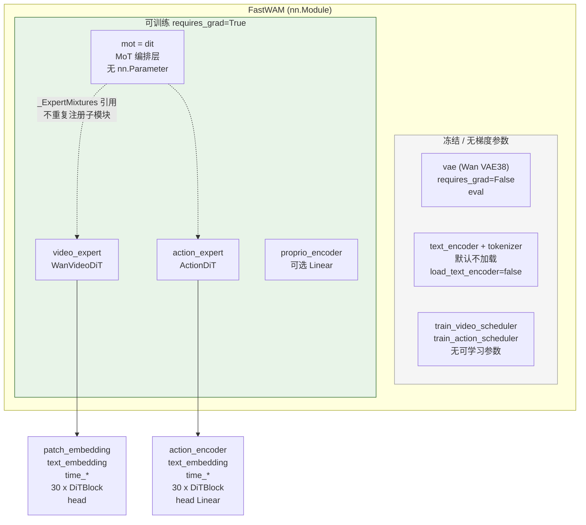

# FastWAM 训练时的冻结策略与可训练模块详解

本文档基于 **当前本地 FastWAM 仓库代码**（`src/fastwam/`、`configs/model/fastwam.yaml`、`trainer.py`）整理：训练时哪些子模块参与 autograd、哪些权重会被优化器更新、前向中哪些路径在 `torch.no_grad()` 下执行。

**权威入口**：`Wan22Trainer._apply_dit_only_train_mode`（[`src/fastwam/trainer.py`](src/fastwam/trainer.py)）与 `FastWAM.training_loss` / `build_inputs`（[`src/fastwam/models/wan22/fastwam.py`](src/fastwam/models/wan22/fastwam.py)）。

---

## 1. 总览：谁训练、谁冻结

| 模块 | `requires_grad` | 进入 AdamW | `train()` 模式 | 说明 |
|------|-----------------|------------|----------------|------|
| **VAE**（`fastwam.vae`） | `False`（构造时固定） | 否 | `eval`（随全局 `model.eval()`） | 仅编码视频 latent；`encode` 在 `@torch.no_grad()` 中调用 |
| **T5 文本编码器**（`text_encoder` / `tokenizer`） | `False`（若加载） | 否 | `eval` | 默认配置 **`load_text_encoder: false`**；训练用数据集预计算的 `context` |
| **Flow-Matching 调度器**（`train_*_scheduler`） | 无 `nn.Parameter` | 否 | N/A | 纯数学运算，无可学习权重 |
| **MoT**（`fastwam.mot` / `fastwam.dit`） | 自身无参数 | 通过 `dit.parameters()` 间接包含 expert | `train` | 混合注意力编排层；权重在两侧 expert 上 |
| **Video expert**（`WanVideoDiT`，`video_expert`） | `True` | 是（经 `model.dit.parameters()`） | `train` | Wan2.2 视频 DiT + patch/time/text 嵌入 + 30×`DiTBlock` + `Head` |
| **Action expert**（`ActionDiT`，`action_expert`） | `True` | 是（同上） | `train` | 动作 DiT：`action_encoder`、30×`DiTBlock`、`head` 等 |
| **Proprio 编码器**（`proprio_encoder`，可选） | `True`（若 `proprio_dim` 非空） | 是（单独加入 optimizer） | `train` | `nn.Linear(proprio_dim → text_dim)`，在 `build_inputs` 中拼到 `context` |

**优化器参数来源**（`Wan22Trainer.__init__`）：

```python
trainable_params = list(self.model.dit.parameters())
if proprio_encoder is not None:
    trainable_params.extend(list(proprio_encoder.parameters()))
self.optimizer = torch.optim.AdamW(trainable_params, ...)
```

**冻结逻辑**（`Wan22Trainer._apply_dit_only_train_mode`）：

```python
model.eval()
model.requires_grad_(False)      # 整模型先冻结
model.dit.train()
model.dit.requires_grad_(True)   # 仅 dit（MoT 代理的 video/action expert）解冻
if proprio_encoder is not None:
    proprio_encoder.train()
    proprio_encoder.requires_grad_(True)
```

设计意图与注释一致：**对齐 DiffSynth 的 `freeze_except("dit")`**——只训练扩散主干（此处为 MoT 所引用的双 expert），其余（VAE、可选 T5、调度器）不更新。

---

## 2. 模型架构与数据流（Mermaid）

### 2.1 模块树与冻结关系



说明：

- `self.dit = self.mot`（[`fastwam.py` L53–54](src/fastwam/models/wan22/fastwam.py)）：trainer 的「DiT」在语义上 = **MoT + 其引用的 video/action expert**。
- MoT 使用 [`_ExpertMixtures`](src/fastwam/models/wan22/mot.py)：expert **只注册在** `FastWAM.video_expert` / `action_expert` 下，MoT 通过自定义 `parameters()` 把两侧 expert 参数交给优化器（L99–103）。

### 2.2 训练一步 `training_loss` 数据流

```mermaid
sequenceDiagram
    participant Batch as batch sample
    participant BI as build_inputs
    participant VAE as vae.encode
    participant PE as proprio_encoder
    participant VE as video_expert
    participant AE as action_expert
    participant MoT as mot MoT.forward
    participant Loss as MSE losses

  Note over BI,VAE: torch.no_grad
    Batch->>BI: video, context, action, proprio
    BI->>VAE: _encode_video_latents
    VAE-->>BI: input_latents
    opt PE on
    BI->>PE: append proprio to context
    PE-->>BI: context 增维

  Note over VE,Loss: 有梯度
    BI->>VE: pre_dit latents, t_video, context
    BI->>AE: pre_dit noisy_action, t_action, context
    VE-->>MoT: video tokens, t_mod, freqs, context
    AE-->>MoT: action tokens, t_mod, freqs, context
    Note over MoT: _build_mot_attention_mask 在 no_grad
    MoT-->>VE: tokens_out video
    MoT-->>AE: tokens_out action
    VE->>Loss: post_dit pred_video
    AE->>Loss: post_dit pred_action
    Loss->>Loss: loss_video + loss_action
```

---

## 3. 训练入口与模式位

| 步骤 | 代码位置 | 行为 |
|------|----------|------|
| 构建模型 | `runtime.run_training` → `instantiate(cfg.model)` | 默认 [`configs/model/fastwam.yaml`](configs/model/fastwam.yaml) |
| 冻结 + 优化器 | `Wan22Trainer.__init__` L82–94 | 先 `_apply_dit_only_train_mode`，再 `AdamW` 只含 `dit` + `proprio_encoder` |
| 每步训练 | `Wan22Trainer.train` L646–675 | `_set_dit_only_train_mode()` 再次应用；`training_loss(sample)` → `backward` |
| 梯度裁剪 | L678 | `clip_grad_norm_(self.model.parameters(), ...)` — 仅 `requires_grad=True` 且存在 `.grad` 的参数生效 |

**`train()` / `eval()` 语义**：

- 全局 `model.eval()`：VAE、未解冻部分保持 inference 行为（如 BN/LayerNorm 用 eval 统计量）。
- `model.dit.train()`：video/action expert 的 `DiTBlock` 等处于 train 模式（若将来启用 dropout 等）。
- VAE 在 [`wan_video_vae.py` L1075](src/fastwam/models/wan22/wan_video_vae.py) 构造时已 `.eval().requires_grad_(False)`，与 trainer 冻结一致。

---

## 4. 各子模块逐项说明

### 4.1 VAE（冻结，前向无梯度）

- **类**：`VideoVAE` / `VideoVAE38` 包装，`self.model = VideoVAE_(...).eval().requires_grad_(False)`。
- **训练调用**：`build_inputs` → `_encode_video_latents`（[`@torch.no_grad()`](src/fastwam/models/wan22/fastwam.py) L244–253）。
- **作用**：像素视频 `[B,3,T,H,W]` → latent `[B,C,T',H',W']`；不参与 loss 对像素的反向（目标在 latent 空间做 flow matching）。
- **推理解码**：`_decode_latents` 无 `no_grad` 装饰，但训练路径不调用；且 VAE 参数仍不更新。

### 4.2 文本条件（默认：离线 T5，训练时不跑 T5）

- **默认配置**：`load_text_encoder: false`（[`configs/model/fastwam.yaml`](configs/model/fastwam.yaml) L5）。
- **数据**：`build_inputs` 要求 batch 含 **`context`**、**`context_mask`**（预计算，见 `scripts/precompute_text_embeds.py` 与数据集 `text_embedding_cache_dir`）。
- **可选在线编码**：`encode_prompt` 为 `@torch.no_grad()`（L203–219）；仅当加载 `text_encoder` 且推理/特殊路径调用。
- **可训练的 text 路径**：**不是 T5**，而是 expert 内的 **`text_embedding`**（两层 Linear + GELU）：
  - `video_expert.pre_dit`：`context = self.text_embedding(context)`（[`wan_video_dit.py` L558](src/fastwam/models/wan22/wan_video_dit.py)）
  - `action_expert.pre_dit`：`context_emb = self.text_embedding(context)`（[`action_dit.py` L284](src/fastwam/models/wan22/action_dit.py)）  
  即：**冻结的 T5 向量作为输入特征，经可学习的投影层进入 cross-attn**（两侧各一套，不共享权重）。

### 4.3 Proprio 编码器（可选，可训练）

- 当 `proprio_dim` 设置时（yaml：`proprio_dim: ${data.train.processor.proprio_output_dim}`）：
  - `nn.Linear(proprio_dim, text_dim)`。
  - `build_inputs` 中取 `proprio[:, 0, :]`，经 `_append_proprio_to_context` 拼到 `context` 末尾（**有梯度**）。
- 优化器 **显式** 加入 `proprio_encoder.parameters()`，不在 `dit` 子树内。

### 4.4 Video expert（`WanVideoDiT`，可训练）

在 `training_loss` 中参与梯度的子路径：

| 子模块 | 在训练中的角色 |
|--------|----------------|
| `patch_embedding` | `pre_dit` 对 noisy latent patchify |
| `time_embedding` / `time_projection` | 生成 per-token `t_mod`（`seperated_timestep` + `fuse_vae_embedding_in_latents`） |
| `text_embedding` | 将预计算 text 特征投影到 hidden_dim |
| `blocks[0..29]`（`DiTBlock`） | 由 **MoT** 按层调用 q/k/v、混合注意力、post（非 `DiTBlock.forward` 整条） |
| `head` | `post_dit` 输出预测 latent |
| `freqs` | buffer/预计算 RoPE 表（`precompute_freqs_cis_3d`，非 Parameter） |

默认 yaml：`action_conditioned: false`，训练时 **`pre_dit` 不传 `action`** 给 video 分支（仅 action expert 处理动作 token）。

**梯度检查点**：`use_gradient_checkpointing: ${model.mot_checkpoint_mixed_attn}`；MoT 侧还有 `mot_checkpoint_mixed_attn` 对 **混合注意力** 做 checkpoint（[`mot.py`](src/fastwam/models/wan22/mot.py) `_mixed_attention`）。

### 4.5 Action expert（`ActionDiT`，可训练）

| 子模块 | 说明 |
|--------|------|
| `action_encoder` | `pre_dit`：`Linear(action_dim → hidden_dim)` |
| `text_embedding` | 与 video 侧独立的 text 投影 |
| `time_embedding` / `time_projection` | 动作分支时间调制 |
| `blocks[0..29]` | 同 video，经 MoT 混合注意力 |
| `head` | `post_dit`：`Linear(hidden_dim → action_dim)`，预测 flow target |

**预训练加载**（`ActionDiT.from_pretrained`）：

- checkpoint 的 `backbone_state_dict` 覆盖 **除** `action_encoder.`、`head.` 前缀外的键（[`ACTION_BACKBONE_SKIP_PREFIXES`](src/fastwam/models/wan22/action_dit.py) L33）。
- 因此 **`action_encoder` 与 `head` 常为随机初始化**，训练中 **仍会更新**（在 `dit.parameters()` 内）。

Video expert 权重来自 `load_wan22_ti2v_5b_components` 的 `components.dit`（Wan2.2 TI2V 5B DiT）。

### 4.6 MoT（编排，无可学习权重）

- **类**：[`MoT`](src/fastwam/models/wan22/mot.py)：混合 video/action token 的自注意力 + 各 expert 的 post block。
- **参数**：无独立 `nn.Parameter`；`parameters()` 委托给 `mixtures["video"]` 与 `mixtures["action"]`。
- **冻结语义**：`model.dit.requires_grad_(True)` 作用于 MoT 的 `parameters()` 迭代器所指向的 **同一份** `video_expert` / `action_expert` 参数（与 `FastWAM.video_expert` 共享 Tensor）。

### 4.7 调度器（无权重更新）

- `WanContinuousFlowMatchScheduler`：仅 `num_train_timesteps`、`shift` 等标量；`sample_training_t`、`add_noise`、`training_target`、`training_weight` 均为张量运算。
- `training_loss` 中：`noise - sample` 目标、按 timestep 加权 MSE；**不向 scheduler 反传**（无可反传参数）。

---

## 5. `torch.no_grad()` 与「仍冻结」的边界

| 函数 / 路径 | 装饰器 / 状态 | 梯度 |
|-------------|---------------|------|
| `_encode_video_latents` | `@torch.no_grad` | VAE 无梯度 |
| `_build_mot_attention_mask` | `@torch.no_grad` | mask 不参与学习 |
| `encode_prompt` | `@torch.no_grad` | T5 无梯度 |
| `randn_like` / `add_noise` / `training_target` | 无装饰；依赖输入是否 `requires_grad` | latent/action 来自 no_grad 编码或数据张量，**噪声与 target 通常不挂参**；梯度经 **pred_* 路径** 回传到 expert |
| `proprio_encoder` in `build_inputs` | 无 no_grad | **有梯度**（若启用） |
| `video_pre` / `action_pre` / `mot` / `post_dit` | 无 no_grad | **主训练计算图** |

损失（[`training_loss` L541–565](src/fastwam/models/wan22/fastwam.py)）：

- `loss_video`：预测 latent vs `target_video`（flow matching）。
- `loss_action`：预测动作 vs `target_action`。
- 总损失：`loss_lambda_video * loss_video + loss_lambda_action * loss_action`（yaml 默认 `lambda_action: 1.0`，`lambda_video` 默认 1.0）。

---

## 6. 默认配置下的参数量归属（小结表）

**会更新权重的模块（optimizer 覆盖）**：

1. `video_expert.*`（全部 `nn.Parameter`，含 30 层 `DiTBlock` 与 `head`、`patch_embedding` 等）
2. `action_expert.*`（含 `action_encoder`、`head`、30 层 `DiTBlock`、`text_embedding`、`time_*` 等）
3. `proprio_encoder.*`（若 `proprio_dim` 非空）

**不会更新权重的模块**：

1. `vae.*`
2. `text_encoder.*` / `tokenizer`（默认未加载）
3. `train_video_scheduler` / `train_action_scheduler` / infer 调度器
4. `mot` 容器自身（无参数）

**前向使用但不更新**：

- 预计算 `context` / `context_mask`（数据集；T5 权重不在图中）
- VAE 编码得到的 `input_latents`

---

## 7. 与其它变体的关系（简要）

本文描述 **`fastwam.runtime.create_fastwam` → `FastWAM`** 的标准 SFT 路径（`Wan22Trainer`）。

- **`FastWAMIDM` / `FastWAMJoint`**（[`configs/model/fastwam_idm.yaml`](configs/model/fastwam_idm.yaml)、`fastwam_joint.yaml`）：可能有分阶段冻结（如 IDM 中「冻结去噪视频、仅训 action」等），需单独读对应 `training_loss`；**不以本节为准**。
- **推理 / 评估脚本**（`bt/fastwam_eval_*.py`）：普遍 `model.eval()`，全模块 `requires_grad=False` 行为由 `eval()` 推断，**不是训练冻结策略**。

---

## 8. 代码索引

| 主题 | 文件 |
|------|------|
| 冻结 + 优化器 | [`src/fastwam/trainer.py`](src/fastwam/trainer.py) L82–94, L280–295, L646–675 |
| 训练损失与前向 | [`src/fastwam/models/wan22/fastwam.py`](src/fastwam/models/wan22/fastwam.py) `build_inputs`, `training_loss` |
| MoT 与 expert 引用 | [`src/fastwam/models/wan22/mot.py`](src/fastwam/models/wan22/mot.py) |
| Video DiT | [`src/fastwam/models/wan22/wan_video_dit.py`](src/fastwam/models/wan22/wan_video_dit.py) |
| Action DiT | [`src/fastwam/models/wan22/action_dit.py`](src/fastwam/models/wan22/action_dit.py) |
| VAE 冻结 | [`src/fastwam/models/wan22/wan_video_vae.py`](src/fastwam/models/wan22/wan_video_vae.py) |
| 默认模型配置 | [`configs/model/fastwam.yaml`](configs/model/fastwam.yaml) |

---

*文档生成依据：本地 `FastWAM` 源码静态分析；若 trainer 或 `MoT` 冻结逻辑变更，请以 `trainer._apply_dit_only_train_mode` 与 `optimizer` 构造为准同步更新本文。*
