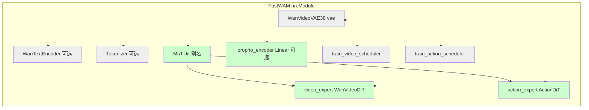
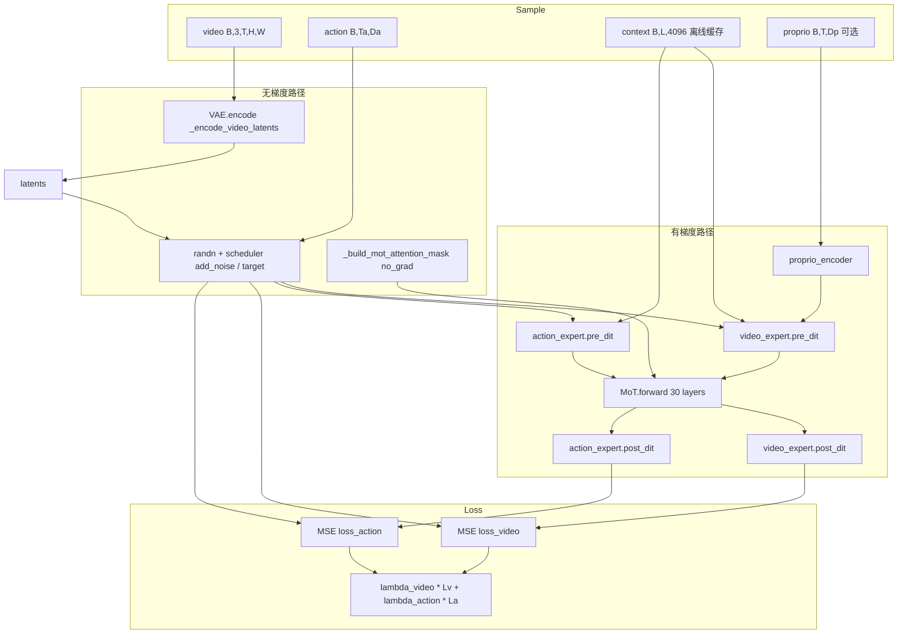

# FastWAM 训练：模块冻结、梯度与权重更新分析

> **文档性质**：基于本地 FastWAM 源码的只读分析，说明标准 SFT/世界模型训练（`Wan22Trainer` + `FastWAM.training_loss`）中各子模块的 `requires_grad`、计算图参与情况，以及 AdamW 实际更新的参数。  
> **代码根目录**：`/home/Luogang/SRC/Robot/FastWAM`  
> **训练入口**：`scripts/train.py` → `fastwam.runtime.run_training` → `Wan22Trainer`  
> **日期**：2026-06-01

---

## 目录

1. [一句话结论](#1-一句话结论)
2. [模块总览表](#2-模块总览表)
3. [模型架构图](#3-模型架构图)
4. [冻结机制：唯一入口](#4-冻结机制唯一入口)
5. [Optimizer 与权重更新范围](#5-optimizer-与权重更新范围)
6. [training_loss 前向与梯度路径](#6-training_loss-前向与梯度路径)
7. [MoT 训练路径与 Expert 内子模块](#7-mot-训练路径与-expert-内子模块)
8. [Gradient Checkpointing（非冻结）](#8-gradient-checkpointing非冻结)
9. [Checkpoint 保存范围](#9-checkpoint-保存范围)
10. [Eval 与 train/eval 模式](#10-eval-与-traineval-模式)
11. [变体模型说明](#11-变体模型说明)
12. [本地验证脚本](#12-本地验证脚本)
13. [外部集成提示（RLinf）](#13-外部集成提示rlinf)

---

## 1. 一句话结论

FastWAM 训练采用 **「只训 DiT（MoT）+ 可选 proprio_encoder」** 策略：整模型先 `requires_grad=False`，再对 `model.dit`（即 `model.mot`，含 video/action 两个 expert 的全部 `DiTBlock` 与 embedding/head）打开梯度；**VAE、T5（默认不加载）、Flow-Matching scheduler** 不参与反传与优化器更新。前向中 VAE 编码在 `@torch.no_grad()` 下执行；语言条件默认来自 **离线 T5 缓存**（`context`/`context_mask`），不经 `text_encoder`。

---

## 2. 模块总览表

| 模块 | `nn.Module` | 训练前向调用 | 计算图 / 反传 | `requires_grad`（训练时） | AdamW 更新 | 主要代码位置 |
|------|-------------|-------------|---------------|---------------------------|------------|--------------|
| **WanVideoVAE38** | 是 | 是（`build_inputs`） | 否（`@torch.no_grad`） | `False`（构造时固定） | 否 | `wan_video_vae.py` L1381；`fastwam.py` L242–251 |
| **WanTextEncoder** | 是（可选） | 默认否 | 否 | `False` | 否 | `configs/model/fastwam.yaml` `load_text_encoder: false` |
| **HuggingfaceTokenizer** | 否/无参数 | 默认否 | — | — | 否 | 同上 |
| **proprio_encoder** | 是（`proprio_dim` 非空时） | 是（`build_inputs`） | 是 | `True`（trainer 单独打开） | 是 | `fastwam.py` L58–59；`trainer.py` L292–295 |
| **video_expert** (`WanVideoDiT`) | 是 | 是 | 是 | `True`（经 `model.dit`） | 是 | `fastwam.py` L43–47；`mot.py` `forward` |
| **action_expert** (`ActionDiT`) | 是 | 是 | 是 | `True`（经 `model.dit`） | 是 | 同上 |
| **MoT** | 是 | 是 | 是（无独立 Parameter） | `True`（子树） | 是（复用 expert 参数） | `mot.py` |
| **train_*_scheduler** | 否（Python 类） | 是（采样 t、噪声、loss 权重） | 否 | — | 否 | `scheduler_continuous.py` |

**权威可训练参数集合**：`list(model.dit.parameters())` + 可选 `list(model.proprio_encoder.parameters())`，与 `Wan22Trainer.__init__` 中构建 optimizer 的列表一致（`trainer.py` L85–90）。

---

## 3. 模型架构图

### 3.1 静态模块树（`FastWAM`）



说明：图中灰色为**冻结/不更新**；绿色为**可训练**（`dit` 子树 + `proprio_encoder`）。`video_expert` / `action_expert` 与 `mot.mixtures.video` / `mot.mixtures.action` 指向**同一模块实例**（`from_wan22_pretrained` 传入 MoT 的 dict 与 `FastWAM` 顶层字段共享引用）。

### 3.2 `training_loss` 数据流（梯度视角）



---

## 4. 冻结机制：唯一入口

所有标准训练均通过 `Wan22Trainer._apply_dit_only_train_mode` 设置，在以下时机调用：

| 时机 | 文件:行 |
|------|---------|
| Trainer 初始化（构建 optimizer **之前**） | `trainer.py` L82–84 |
| 进入 `train()` 循环前 | `trainer.py` L646–647 |

实现（`trainer.py` L287–295）：

```python
@staticmethod
def _apply_dit_only_train_mode(model):
    model.eval()
    model.requires_grad_(False)
    model.dit.train()
    model.dit.requires_grad_(True)
    proprio_encoder = getattr(model, "proprio_encoder", None)
    if proprio_encoder is not None:
        proprio_encoder.train()
        proprio_encoder.requires_grad_(True)
```

语义逐步说明：

1. **`model.eval()`**  
   整棵 `FastWAM` 进入 eval 模式（影响 Dropout/BatchNorm 等；本模型 DiT 块以 LayerNorm 为主，影响有限）。

2. **`model.requires_grad_(False)`**  
   递归关闭**所有**已注册 `Parameter` 的 `requires_grad`，包括 `vae`、`text_encoder`（若存在）、`mot` 下 expert、顶层 `video_expert`/`action_expert` 等。

3. **`model.dit.train()` + `model.dit.requires_grad_(True)`**  
   `FastWAM.dit` 是 `FastWAM.mot` 的别名（`fastwam.py` L46–47）。仅 **MoT 子树**恢复 train 模式并打开梯度。可训练权重 = `mixtures["video"]`（WanVideoDiT）+ `mixtures["action"]`（ActionDiT）的全部参数。

4. **`proprio_encoder` 例外**  
   不在 `dit` 内；若 `proprio_dim` 已配置，trainer **单独** `train()` + `requires_grad_(True)`，否则 proprio 无法写入扩展后的 `context`。

注释写明设计意图：对齐 DiffSynth 的 `freeze_except("dit")`（`trainer.py` L281–282）。

### 4.1 双引用 `video_expert` / `action_expert`

`FastWAM.__init__` 同时保存：

- `self.video_expert` / `self.action_expert`
- `self.mot = MoT(mixtures={"video": video_expert, "action": action_expert})`

`training_loss` 中 `pre_dit` / `post_dit` 走顶层 `self.video_expert` / `self.action_expert`，层内混合注意力走 `self.mot`。因是**同一对象**，`model.dit.requires_grad_(True)` 与对这些属性的前向调用一致；优化器只遍历 `model.dit.parameters()`，不会重复计数同一 `Parameter`。

---

## 5. Optimizer 与权重更新范围

`trainer.py` L85–94：

```python
trainable_params = list(self.model.dit.parameters())
proprio_encoder = getattr(self.model, "proprio_encoder", None)
if proprio_encoder is not None:
    trainable_params.extend(list(proprio_encoder.parameters()))
self.optimizer = torch.optim.AdamW(
    trainable_params,
    lr=self.learning_rate,
    weight_decay=self.weight_decay,
    betas=(0.9, 0.95),
)
```

| 参数组 | 是否进入 AdamW | 训练中是否更新 |
|--------|----------------|----------------|
| `mot` → video expert 全部 `Parameter` | 是 | 是 |
| `mot` → action expert 全部 `Parameter` | 是 | 是 |
| `proprio_encoder`（若存在） | 是 | 是 |
| `vae.*` | 否 | 否 |
| `text_encoder.*`（若加载） | 否 | 否 |
| Scheduler 标量/缓冲区 | 否 | 否 |

反向与裁剪（`trainer.py` L674–678）：

- `accelerator.backward(loss)`：仅 `requires_grad=True` 的参数会累积梯度。
- `clip_grad_norm_(self.model.parameters(), max_grad_norm)`：对**整模型**命名参数裁剪；冻结参数梯度为 `None`，不参与有效范数。

---

## 6. `training_loss` 前向与梯度路径

主路径：`fastwam.py` `training_loss`（L448–568）→ `build_inputs` → flow matching → `pre_dit` → `MoT` → `post_dit` → MSE。

### 6.1 `build_inputs`（L277–383）

| 步骤 | 操作 | 梯度 |
|------|------|------|
| 读 `video` | 校验形状 T%4==1、H/W%16==0 | — |
| VAE 编码 | `_encode_video_latents`（L338） | **否**：方法带 `@torch.no_grad()`（L242） |
| VAE 构造 | `VideoVAE38_.eval().requires_grad_(False)` | 永久冻结 |
| `context` / `context_mask` | 从 `sample` 读取（离线 T5） | 输入张量默认不建图（无 grad_fn） |
| `proprio` | `_append_proprio_to_context` → `proprio_encoder`（L352–366） | **是**（若 encoder 可训） |
| `action` | `.to(device)` | 作为 flow matching 目标侧，后续 `pre_dit` 侧可训 |

训练配置默认 **`load_text_encoder: false`**（`configs/model/fastwam.yaml` L5），不在此路径调用 `encode_prompt`（`fastwam.py` L201–217，`@torch.no_grad`）。

### 6.2 Flow Matching 噪声（L458–477）

- `torch.randn_like` 生成 `noise_video` / `noise_action`：不参与学习，仅作随机源。
- `train_video_scheduler` / `train_action_scheduler`：`add_noise`、`training_target`、`sample_training_t`、`training_weight` 为张量运算，**无可学习参数**。

### 6.3 Expert 预处理（L479–493）

- `video_expert.pre_dit`：patchify、`text_embedding(context)`、`time_embedding` / `time_projection` 等 → **全部在可训子树内**。
- `action_expert.pre_dit`：`action_encoder`、text/time embedding → **可训**。

默认 `action_conditioned: false`（`fastwam.yaml` L31），video 分支不把 `action` 拼进 cross-attn context（`wan_video_dit.py` L560–566 分支不走）。

### 6.4 注意力 mask（L498–503）

- `_build_mot_attention_mask`：**`@torch.no_grad()`**（L385–407），mask 为布尔张量，不参与学习。

### 6.5 `MoT.forward`（`mot.py` L447–556）

每层 `layer_idx`（共 30 层，与 `num_layers` 一致）：

1. 对每个 expert（顺序 `expert_order`，默认 `video` → `action`）调用 `_build_expert_attention_io`：  
   `norm1` → Q/K/V → RoPE → 得到 `q,k,v` 与 MLP 调制量（**使用 `block.modulation` + `t_mod`**）。
2. 拼接 `q_cat, k_cat, v_cat`，`_mixed_attention` → `flash_attention`（可选 checkpoint，见 §8）。
3. 按序列切分 `mixed_slice`，`_apply_post_with_optional_checkpoint`：  
   self-attn 残差 + **cross_attn**（对 `context`）+ **FFN**（**使用 `block` 内可训权重**）。

**不调用** `WanVideoDiT.forward` / `ActionDiT.forward` 里「逐层 for block in self.blocks」的独立路径；训练专用 MoT 混合注意力路径。

### 6.6 后处理与损失（L530–568）

- `video_expert.post_dit` → `head` + `unpatchify` → 与 `target_video` MSE（带 pad mask）。
- `action_expert.post_dit` → `head`（Linear→action_dim）→ 与 `target_action` MSE。
- `loss_total = lambda_video * loss_video + lambda_action * loss_action`。

---

## 7. MoT 训练路径与 Expert 内子模块

### 7.1 Video expert（`WanVideoDiT`）可训练子模块

| 子模块 | 作用 | 在 MoT 训练中是否使用 |
|--------|------|----------------------|
| `patch_embedding` | Conv3d 将 latent 转为 token | pre_dit `patchify` |
| `text_embedding` | 投影 T5 context | pre_dit |
| `time_embedding` / `time_projection` | 时间步调制 → `t_mod` | pre_dit |
| `blocks[i]` | DiTBlock：self_attn QKV、cross_attn、ffn、`modulation` | MoT 每层 `_build_expert_attention_io` + post |
| `head` | 输出 latent 通道 | post_dit |
| `freqs` | 预计算 RoPE 表（`precompute_freqs_cis_3d`） | 非 `nn.Parameter`，不更新 |
| `action_embedding` | 仅 `action_conditioned=True` | 默认配置为 false |

### 7.2 Action expert（`ActionDiT`）可训练子模块

| 子模块 | 作用 |
|--------|------|
| `action_encoder` | `Linear(action_dim, hidden_dim)` |
| `text_embedding` | 与 video 侧类似，投影 context |
| `time_embedding` / `time_projection` | action 分支时间调制 |
| `blocks[i]` | 30× DiTBlock（与 video 层数对齐） |
| `head` | `Linear(hidden_dim, action_dim)` |

**预训练注意**：`ActionDiT.from_pretrained` 加载 `ActionDiT_*.pt` 时，`ACTION_BACKBONE_SKIP_PREFIXES = ("action_encoder.", "head.")`（`action_dit.py` L33–34）—— **仅 backbone blocks 从 checkpoint 加载**；`action_encoder` / `head` 在 `action_dim` 与预训练不一致（如 7→23）时保持**随机初始化**，但仍会随训练更新。

### 7.3 MoT 本体

`MoT` 不定义额外 `nn.Parameter`；`forward` 仅编排混合注意力与调用各 expert 的 `DiTBlock`。所有可学习量均在 `mixtures["video"]` 与 `mixtures["action"]` 中。

### 7.4 `MoT.forward` 主循环（代码锚点）

```text
mot.py L472–554:
  for layer_idx in range(self.num_layers):
    for name in expert_order:           # 构建各 expert Q,K,V + 缓存 post 状态
    q_cat, k_cat, v_cat = cat(...)
    mixed = _mixed_attention(...)       # 联合 self-attention
    for name in expert_order:           # 切分 mixed_slice，post block + cross_attn + ffn
    tokens_all[name] = updated_tokens
  return tokens_all
```

推理专用路径（**非 `training_loss`**）：`prefill_video_cache`、`forward_action_with_video_cache`（`mot.py` L257+、L350+）—— 同样使用 expert `blocks`，但训练主路径为上面的 `forward`。

---

## 8. Gradient Checkpointing（非冻结）

Checkpoint **不改变**哪些参数可训，仅在前向中重算部分激活以省显存。

### 8.1 配置耦合

`configs/model/fastwam.yaml`：

```yaml
mot_checkpoint_mixed_attn: true
video_dit_config:
  use_gradient_checkpointing: ${model.mot_checkpoint_mixed_attn}
action_dit_config:
  use_gradient_checkpointing: ${model.mot_checkpoint_mixed_attn}
```

`mot_checkpoint_mixed_attn: false`（如 `configs/task/r1_pro_chassis_uncond_3cam_384_1e-4.yaml`）会**同时**关闭：

1. Expert 上 `use_gradient_checkpointing` 标志（供 MoT 读取）；
2. MoT 内 `_mixed_attention` 的 checkpoint（`mot.py` L89–96）。

### 8.2 三处 checkpoint 行为

| 位置 | 条件 | 代码 |
|------|------|------|
| MoT 混合注意力 | `mot_checkpoint_mixed_attn and self.training` | `mot.py` L89–96，`checkpoint(_forward, q, k, v)` |
| MoT post block（cross-attn + FFN） | `use_gradient_checkpointing and self.training`（来自 expert 属性） | `mot.py` L237–247 |
| Expert 独立 `forward` | `use_gradient_checkpointing` 时每层 `gradient_checkpoint_forward` | `wan_video_dit.py` L657–664；`action_dit.py` L324–327 |

**重要**：标准训练走 **MoT.forward**，不走 expert 独立 `forward` 的层循环；因此训练时实际生效的是 **MoT 内** 的两处（混合注意力 + post block）。Expert 内的 `forward` checkpoint 主要影响**未走 MoT 的推理/其他入口**。

---

## 9. Checkpoint 保存范围

`FastWAM.save_checkpoint`（`fastwam.py` L1088–1098）：

```python
payload = {
    "mot": self.mot.state_dict(),
    "step": step,
    "torch_dtype": str(self.torch_dtype),
}
if self.proprio_encoder is not None:
    payload["proprio_encoder"] = self.proprio_encoder.state_dict()
```

**不保存**：`vae`、`text_encoder`、`tokenizer`、scheduler。与冻结策略一致：部署/续训只需 MoT（含双 expert）+ proprio。

`load_checkpoint` 支持 legacy 仅 `dit` 键加载到 `video_expert`（L1104–1106），action expert 需完整 `mot` 键。

---

## 10. Eval 与 train/eval 模式

`trainer.evaluate`（`trainer.py` L376–383）：

- 临时 `model.eval()`，计算 `training_loss` 得 val loss（前向仍可执行，但 MoT checkpoint 在 `training=False` 时关闭）。
- 保存 `was_dit_training = model.dit.training`；评估推理结束后应恢复 dit 训练模式（见 evaluate 后续逻辑）。

训练循环内：`model.dit` 保持 `train()`，外层 `FastWAM` 为 `eval()`——冻结模块（VAE 等）不因误开 Dropout 而行为漂移。

---

## 11. 变体模型说明

| 变体 | Trainer | 冻结逻辑 | `training_loss` |
|------|---------|----------|-----------------|
| **FastWAM** | `Wan22Trainer` | `_apply_dit_only_train_mode` | `fastwam.py` MoT 联合路径（本文主体） |
| **FastWAM-Joint** | 同 `Wan22Trainer`（`runtime.create_fastwam_joint`） | **相同** | 继承/扩展 FastWAM，推理 API 不同 |
| **FastWAM-IDM** | 同 `Wan22Trainer`（`runtime.create_fastwam_idm`） | **相同** | `fastwam_idm.py` 自有 `training_loss`（多分支 video cond），仍用 `video_expert`/`action_expert`/`mot`，可训参数集合不变 |

未发现独立于 `_apply_dit_only_train_mode` 的其它冻结入口。

---

## 12. 本地验证脚本

在已 `create_fastwam(...)` 且调用 `_apply_dit_only_train_mode(model)` 后执行：

```python
import torch
from fastwam.trainer import Wan22Trainer

def summarize_trainable(model):
    Wan22Trainer._apply_dit_only_train_mode(model)
    dit_n = sum(p.numel() for p in model.dit.parameters() if p.requires_grad)
    dit_total = sum(p.numel() for p in model.dit.parameters())
    pe_n = 0
    if model.proprio_encoder is not None:
        pe_n = sum(p.numel() for p in model.proprio_encoder.parameters() if p.requires_grad)
    vae_n = sum(p.numel() for p in model.vae.parameters() if p.requires_grad)
    te_n = 0
    if model.text_encoder is not None:
        te_n = sum(p.numel() for p in model.text_encoder.parameters() if p.requires_grad)
    print(f"dit trainable: {dit_n:,} / {dit_total:,}")
    print(f"proprio_encoder trainable: {pe_n:,}")
    print(f"vae trainable: {vae_n:,} (expect 0)")
    print(f"text_encoder trainable: {te_n:,} (expect 0)")

# 可选：单步反传探测
# loss, _ = model.training_loss(batch)
# loss.backward()
# assert model.vae.model.conv1.weight.grad is None
# assert next(model.dit.parameters()).grad is not None
```

---

## 13. 外部集成提示（RLinf）

RLinf 侧 `FastWAMPolicy` 在 SFT 中复用同一 `training_loss`，并通过 `train()` 重写实现与 `_apply_dit_only_train_mode` **等价的** `requires_grad` 语义（仅 `mot`/`dit` + `proprio_encoder` 可训）。分布式 **FSDP** 包裹方式不影响「哪些逻辑应可训」的结论，但会影响参数分片与 checkpoint 键名；详见 RLinf 文档 `fw_sft_design_op46_4_1impl.md` G.9 节。本文不展开 FSDP 细节。

---

## 附录：关键源码索引

| 主题 | 路径 | 行号（约） |
|------|------|-----------|
| 冻结入口 | `src/fastwam/trainer.py` | 287–295 |
| Optimizer 参数 | `src/fastwam/trainer.py` | 85–94 |
| `dit ≡ mot` | `src/fastwam/models/wan22/fastwam.py` | 46–47 |
| VAE no_grad 编码 | `src/fastwam/models/wan22/fastwam.py` | 242–251, 338 |
| `training_loss` | `src/fastwam/models/wan22/fastwam.py` | 448–568 |
| MoT `forward` | `src/fastwam/models/wan22/mot.py` | 447–556 |
| 混合注意力 checkpoint | `src/fastwam/models/wan22/mot.py` | 89–96 |
| VAE 冻结构造 | `src/fastwam/models/wan22/wan_video_vae.py` | 1381 |
| 默认不加载 T5 | `configs/model/fastwam.yaml` | 5 |
| Checkpoint 保存 | `src/fastwam/models/wan22/fastwam.py` | 1088–1098 |

---

**文档版本**：v1 · 与本地 `FastWAM` 源码同步编写。
